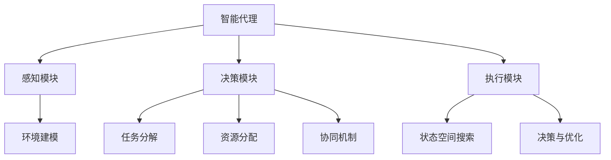

# AI人工智能代理工作流 AI Agent WorkFlow：智能体的设计与实现

## 1. 背景介绍
### 1.1 人工智能的发展历程
#### 1.1.1 早期人工智能的探索
#### 1.1.2 专家系统的兴起
#### 1.1.3 机器学习的崛起

### 1.2 智能代理的概念
#### 1.2.1 智能代理的定义
#### 1.2.2 智能代理的特点
#### 1.2.3 智能代理的应用领域

### 1.3 智能代理工作流的意义
#### 1.3.1 提高智能代理的效率
#### 1.3.2 增强智能代理的适应性
#### 1.3.3 促进智能代理的协作

## 2. 核心概念与联系
### 2.1 智能代理的组成
#### 2.1.1 感知模块
#### 2.1.2 决策模块  
#### 2.1.3 执行模块

### 2.2 智能代理工作流的要素
#### 2.2.1 任务分解
#### 2.2.2 资源分配
#### 2.2.3 协同机制

### 2.3 智能代理与环境的交互
#### 2.3.1 环境建模
#### 2.3.2 状态空间搜索
#### 2.3.3 决策与优化



## 3. 核心算法原理具体操作步骤
### 3.1 强化学习算法
#### 3.1.1 Q-learning
1. 初始化Q表
2. 选择动作
3. 执行动作并观察奖励和下一状态
4. 更新Q表
5. 重复步骤2-4直到达到终止状态

#### 3.1.2 SARSA 
1. 初始化Q表
2. 选择动作
3. 执行动作并观察奖励和下一状态
4. 选择下一动作
5. 更新Q表
6. 重复步骤3-5直到达到终止状态

#### 3.1.3 DQN
1. 初始化经验回放缓存D
2. 初始化动作价值函数Q和目标网络Q'
3. 重复N次：
   1) 根据ε-greedy策略选择动作at
   2) 执行动作at，观察奖励rt和下一状态st+1
   3) 将转移(st,at,rt,st+1)存储到D中
   4) 从D中随机采样一批转移样本
   5) 计算目标值，更新Q网络参数
   6) 每C步将Q'网络参数复制给Q网络

### 3.2 多智能体协同算法
#### 3.2.1 博弈论方法
1. 定义智能体的策略空间
2. 计算Nash均衡点
3. 各智能体采取Nash均衡策略
4. 重复步骤2-3直到收敛

#### 3.2.2 拍卖机制
1. 将任务分解为子任务
2. 智能体对感兴趣的子任务进行投标
3. 根据投标结果确定子任务的执行者
4. 执行子任务，更新信用度
5. 重复步骤2-4直到任务完成

#### 3.2.3 社会法则
1. 定义社会法则
2. 智能体在法则约束下选择动作
3. 执行动作，更新环境状态
4. 重复步骤2-3直到任务完成

## 4. 数学模型和公式详细讲解举例说明
### 4.1 马尔可夫决策过程(MDP)
一个MDP由一个四元组 $<S,A,P,R>$ 定义：
- $S$ 是状态空间
- $A$ 是动作空间  
- $P$ 是状态转移概率矩阵，$P(s'|s,a)$表示在状态$s$下执行动作$a$后转移到状态$s'$的概率
- $R$ 是奖励函数，$R(s,a)$表示在状态$s$下执行动作$a$获得的即时奖励

求解MDP的目标是找到一个最优策略$\pi^*$，使得期望累积奖励最大化：

$$\pi^* = \arg\max_\pi E[\sum_{t=0}^{\infty} \gamma^t R(s_t,a_t)]$$

其中$\gamma \in [0,1]$为折扣因子。

### 4.2 博弈论
#### 4.2.1 纳什均衡
在一个$n$人博弈$G=<N,S,u>$中，给定其他玩家的策略$s_{-i}$，如果玩家$i$的策略$s_i^*$满足：

$$u_i(s_i^*,s_{-i}) \geq u_i(s_i,s_{-i}), \forall s_i \in S_i$$

则称$(s_1^*,\cdots,s_n^*)$为一个纳什均衡。

#### 4.2.2 最优反应
在博弈$G=<N,S,u>$中，给定其他玩家的策略$s_{-i}$，玩家$i$的最优反应$BR_i(s_{-i})$定义为：

$$BR_i(s_{-i}) = \arg\max_{s_i \in S_i} u_i(s_i,s_{-i})$$

### 4.3 拍卖理论
#### 4.3.1 VCG机制
假设有$n$个玩家竞价$m$个物品，每个玩家$i$对获得物品集合$S$的估值为$v_i(S)$。VCG机制按照以下规则分配物品和支付：
1. 找到总估值最大的分配$S^*=(S_1^*,\cdots,S_n^*)$：
$$S^* = \arg\max_{S} \sum_{i=1}^n v_i(S_i)$$
2. 玩家$i$获得物品集合$S_i^*$，支付费用：
$$p_i = \max_{S'} \sum_{j \neq i} v_j(S'_j) - \sum_{j \neq i} v_j(S_j^*)$$

VCG机制是激励相容的，即对玩家而言，如实报告估值是最优策略。

## 5. 项目实践：代码实例和详细解释说明
下面我们以一个简单的强化学习智能体为例，展示如何用Python实现Q-learning算法。

```python
import numpy as np

class QLearningAgent:
    def __init__(self, state_size, action_size, learning_rate=0.1, discount_factor=0.9, epsilon=0.1):
        self.state_size = state_size
        self.action_size = action_size
        self.learning_rate = learning_rate
        self.discount_factor = discount_factor
        self.epsilon = epsilon
        self.q_table = np.zeros((state_size, action_size))

    def select_action(self, state):
        if np.random.uniform() < self.epsilon:
            return np.random.choice(self.action_size)
        else:
            return np.argmax(self.q_table[state])

    def update_q_table(self, state, action, reward, next_state):
        old_value = self.q_table[state, action]
        next_max = np.max(self.q_table[next_state])
        new_value = (1 - self.learning_rate) * old_value + self.learning_rate * (reward + self.discount_factor * next_max)
        self.q_table[state, action] = new_value

    def train(self, env, num_episodes):
        for episode in range(num_episodes):
            state = env.reset()
            done = False
            while not done:
                action = self.select_action(state)
                next_state, reward, done, _ = env.step(action)
                self.update_q_table(state, action, reward, next_state)
                state = next_state
```

这个智能体类包含以下主要函数：
- `__init__`：初始化智能体，包括状态空间大小、动作空间大小、学习率、折扣因子、探索概率以及Q表。
- `select_action`：根据当前状态和ε-greedy策略选择动作。
- `update_q_table`：根据观察到的转移样本更新Q表。
- `train`：在给定的环境中训练智能体，执行Q-learning算法。

在实际使用时，我们可以创建一个智能体实例，然后调用`train`函数在特定环境中对其进行训练：

```python
agent = QLearningAgent(env.observation_space.n, env.action_space.n)
agent.train(env, num_episodes=1000)
```

经过训练后，智能体的Q表将收敛到最优值，此时智能体能够根据当前状态做出最优决策。我们可以让智能体与环境交互并观察其表现：

```python
state = env.reset()
done = False
while not done:
    action = agent.select_action(state)
    next_state, reward, done, _ = env.step(action)
    state = next_state
    env.render()
```

以上就是一个简单的Q-learning智能体的Python实现。在实践中，我们还可以使用更高级的算法，如DQN、A3C等，来构建更加智能和高效的代理。

## 6. 实际应用场景
智能代理工作流可以应用于许多领域，包括但不限于：
- 智能制造：通过多个智能体协同完成产品设计、生产调度、质量检测等任务，提高生产效率和产品质量。
- 自动驾驶：让多个车辆智能体在道路环境中协同行驶，减少拥堵和事故发生。
- 智慧城市：利用智能代理技术优化城市交通、能源、安防等系统，提升城市管理和服务水平。
- 金融投资：开发智能投资代理，根据市场环境自动调整投资策略，控制风险并最大化收益。
- 智能客服：构建多个客服智能体，协同解答用户咨询，提供个性化服务。

以智能制造为例，我们可以设计一个车间生产调度系统。该系统中有多个智能体，分别负责不同的生产任务（如原料准备、加工、装配、检测等）。各智能体通过博弈论和拍卖机制协商任务分配和资源使用，并根据强化学习算法不断优化自身的策略。同时，智能体之间遵循一定的社会法则，以避免冲突和资源浪费。通过智能代理工作流的引入，车间生产效率和产品质量将大幅提升，人工干预也将显著减少。

## 7. 工具和资源推荐
- 开源框架：
  - OpenAI Gym：强化学习环境库
  - TensorFlow：端到端的机器学习平台
  - PyTorch：基于Python的深度学习框架
  - RLlib：可扩展的强化学习库
  - JADE：多智能体系统开发框架
- 在线课程：
  - CS234: Reinforcement Learning (Stanford)
  - CS285: Deep Reinforcement Learning (UC Berkeley)
  - Multi-Agent Machine Learning (University of Michigan)
- 书籍：
  - Reinforcement Learning: An Introduction (Sutton & Barto, 2018)
  - Multi-Agent Systems: Algorithmic, Game-Theoretic, and Logical Foundations (Shoham & Leyton-Brown, 2008)
  - Artificial Intelligence: A Modern Approach (Russell & Norvig, 2020)
- 学术会议：
  - AAAI Conference on Artificial Intelligence (AAAI)
  - International Conference on Autonomous Agents and Multiagent Systems (AAMAS)  
  - Conference on Robot Learning (CoRL)
  - International Joint Conference on Artificial Intelligence (IJCAI)

## 8. 总结：未来发展趋势与挑战
智能代理工作流是人工智能领域的一个重要研究方向，其发展趋势主要体现在以下几个方面：
- 算法的不断创新：强化学习、多智能体学习等算法将持续改进，以应对更加复杂的任务和环境。
- 领域知识的深度融合：智能代理将与具体应用领域的专业知识相结合，形成更加专业和高效的解决方案。
- 人机协作的深入探索：如何让智能代理与人类专家无缝协作，发挥各自所长，将是一个重要课题。
- 安全与伦理的关注提升：在智能代理获得更大自主权的同时，如何确保其行为的安全性和伦理性也将受到更多关注。

同时，智能代理工作流的发展也面临着诸多挑战：
- 环境的不确定性：现实世界的环境往往是动态、复杂和不完全可知的，这对智能代理的感知、决策和适应能力提出了很高要求。
- 任务的多样性：不同领域的任务具有不同的特点和要求，通用智能代理框架的设计仍然具有挑战性。
- 算法的可解释性：许多智能代理采用的是深度学习等"黑盒"模