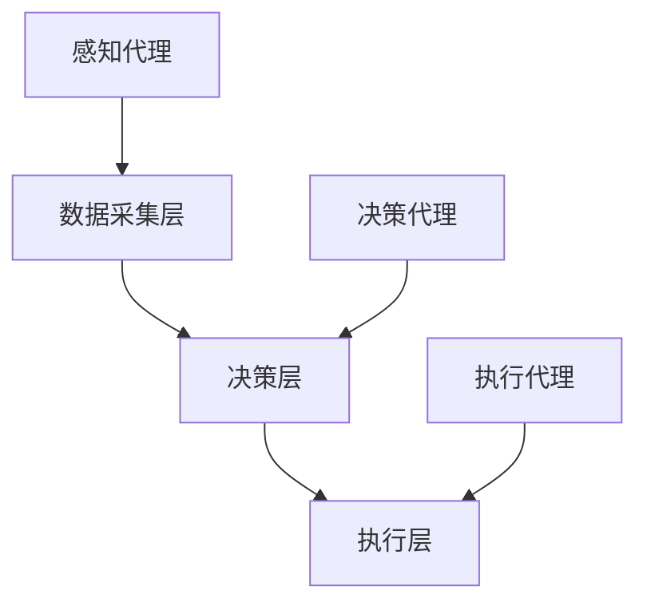

# AI人工智能代理工作流AI Agent WorkFlow：AI代理工作流在智能农业领域的应用

## 1.背景介绍

### 1.1 智能农业的兴起

随着全球人口的不断增长和气候变化的加剧，传统农业面临着前所未有的挑战。智能农业（Smart Agriculture）作为一种新兴的农业模式，通过引入先进的技术手段，如物联网（IoT）、大数据分析、无人机和人工智能（AI），旨在提高农业生产效率、减少资源浪费和降低环境影响。

### 1.2 人工智能在农业中的应用

人工智能在农业中的应用已经取得了显著的进展。通过机器学习和深度学习算法，AI可以帮助农民预测天气、监测作物健康、优化灌溉系统和自动化农田管理。然而，单一的AI模型往往难以应对复杂多变的农业环境，这就需要引入AI代理工作流（AI Agent WorkFlow）来实现更高效的农业管理。

### 1.3 AI代理工作流的概念

AI代理工作流是一种基于多智能体系统（Multi-Agent System, MAS）的技术框架，通过多个AI代理（Agent）协同工作，完成复杂任务。每个AI代理具有特定的功能和目标，能够自主决策和相互协作，从而实现整体系统的最优性能。在智能农业领域，AI代理工作流可以用于作物监测、病虫害防治、资源管理等多个方面。

## 2.核心概念与联系

### 2.1 多智能体系统（MAS）

多智能体系统是由多个相互独立但相互协作的智能体组成的系统。每个智能体具有自主性、社会性和反应性，能够根据环境变化和其他智能体的行为进行决策和行动。

### 2.2 AI代理的定义与分类

AI代理是多智能体系统中的基本单元，具有感知、决策和执行能力。根据功能和目标的不同，AI代理可以分为以下几类：

- **感知代理**：负责环境数据的采集和处理，如传感器数据、图像数据等。
- **决策代理**：基于感知数据进行分析和决策，如病虫害预测、灌溉优化等。
- **执行代理**：执行决策代理的指令，如控制灌溉系统、施肥系统等。

### 2.3 AI代理工作流的架构

AI代理工作流的架构通常包括以下几个部分：

- **数据采集层**：由感知代理组成，负责采集和预处理环境数据。
- **决策层**：由决策代理组成，负责数据分析和决策制定。
- **执行层**：由执行代理组成，负责执行决策指令。

以下是一个简单的AI代理工作流架构图：



## 3.核心算法原理具体操作步骤

### 3.1 数据采集与预处理

数据采集是AI代理工作流的第一步，主要包括以下几个步骤：

1. **传感器部署**：在农田中部署各种传感器，如温湿度传感器、土壤湿度传感器、光照传感器等。
2. **数据采集**：感知代理通过传感器实时采集环境数据。
3. **数据预处理**：对采集到的数据进行清洗、归一化和特征提取，以便后续分析。

### 3.2 数据分析与决策

数据分析与决策是AI代理工作流的核心部分，主要包括以下几个步骤：

1. **数据分析**：决策代理使用机器学习和深度学习算法对预处理后的数据进行分析，如病虫害预测、作物生长状态评估等。
2. **决策制定**：基于分析结果，决策代理制定相应的管理策略，如灌溉计划、施肥计划等。
3. **决策优化**：通过强化学习等算法对决策进行优化，以实现资源的最优配置。

### 3.3 决策执行与反馈

决策执行与反馈是AI代理工作流的最后一步，主要包括以下几个步骤：

1. **指令下达**：决策代理将制定的管理策略传递给执行代理。
2. **执行操作**：执行代理根据指令控制相应的农业设备，如灌溉系统、施肥系统等。
3. **反馈机制**：执行代理将执行结果反馈给决策代理，以便进行后续调整和优化。

## 4.数学模型和公式详细讲解举例说明

### 4.1 数据预处理中的归一化

在数据预处理阶段，归一化是常用的一种方法，用于将不同量纲的数据转换到同一量纲。常见的归一化方法有Min-Max归一化和Z-score归一化。

- **Min-Max归一化**：
$$
x' = \frac{x - x_{min}}{x_{max} - x_{min}}
$$

- **Z-score归一化**：
$$
x' = \frac{x - \mu}{\sigma}
$$

### 4.2 机器学习算法中的线性回归

线性回归是一种常用的机器学习算法，用于预测连续变量。其数学模型如下：
$$
y = \beta_0 + \beta_1 x_1 + \beta_2 x_2 + \cdots + \beta_n x_n + \epsilon
$$
其中，$y$ 是预测值，$x_i$ 是特征变量，$\beta_i$ 是回归系数，$\epsilon$ 是误差项。

### 4.3 强化学习中的Q-Learning算法

Q-Learning是一种常用的强化学习算法，用于决策优化。其更新公式如下：
$$
Q(s, a) \leftarrow Q(s, a) + \alpha [r + \gamma \max_{a'} Q(s', a') - Q(s, a)]
$$
其中，$Q(s, a)$ 是状态-动作值函数，$\alpha$ 是学习率，$r$ 是即时奖励，$\gamma$ 是折扣因子，$s'$ 是下一状态，$a'$ 是下一动作。

## 5.项目实践：代码实例和详细解释说明

### 5.1 数据采集与预处理

以下是一个简单的Python代码示例，用于采集和预处理环境数据：

```python
import numpy as np
import pandas as pd

# 模拟传感器数据采集
data = {
    'temperature': np.random.normal(25, 5, 100),
    'humidity': np.random.normal(60, 10, 100),
    'soil_moisture': np.random.normal(30, 5, 100)
}

# 创建DataFrame
df = pd.DataFrame(data)

# 数据预处理：归一化
df['temperature'] = (df['temperature'] - df['temperature'].min()) / (df['temperature'].max() - df['temperature'].min())
df['humidity'] = (df['humidity'] - df['humidity'].min()) / (df['humidity'].max() - df['humidity'].min())
df['soil_moisture'] = (df['soil_moisture'] - df['soil_moisture'].min()) / (df['soil_moisture'].max() - df['soil_moisture'].min())

print(df.head())
```

### 5.2 数据分析与决策

以下是一个简单的Python代码示例，用于使用线性回归算法进行数据分析和决策：

```python
from sklearn.model_selection import train_test_split
from sklearn.linear_model import LinearRegression

# 数据集划分
X = df[['temperature', 'humidity']]
y = df['soil_moisture']
X_train, X_test, y_train, y_test = train_test_split(X, y, test_size=0.2, random_state=42)

# 线性回归模型训练
model = LinearRegression()
model.fit(X_train, y_train)

# 预测
y_pred = model.predict(X_test)

# 输出预测结果
print(y_pred)
```

### 5.3 决策执行与反馈

以下是一个简单的Python代码示例，用于执行决策并反馈结果：

```python
# 模拟执行操作
def execute_irrigation(amount):
    print(f"Executing irrigation with amount: {amount}")

# 模拟反馈机制
def feedback(predicted, actual):
    error = actual - predicted
    print(f"Feedback error: {error}")
    return error

# 执行决策
for pred in y_pred:
    execute_irrigation(pred)

# 模拟实际结果
actual_results = np.random.normal(30, 5, len(y_pred))

# 反馈结果
for pred, actual in zip(y_pred, actual_results):
    feedback(pred, actual)
```

## 6.实际应用场景

### 6.1 作物监测

通过部署感知代理，实时监测作物的生长状态和环境条件，如温度、湿度、光照等。决策代理基于监测数据进行分析，预测作物的生长趋势和可能的病虫害风险，并制定相应的管理策略。

### 6.2 病虫害防治

利用图像识别技术，感知代理可以实时监测作物的病虫害情况。决策代理基于图像数据进行分析，识别病虫害类型和严重程度，并制定相应的防治措施，如喷洒农药、调整灌溉等。

### 6.3 资源管理

通过多智能体系统，感知代理可以实时监测土壤湿度、养分含量等信息。决策代理基于监测数据进行分析，优化灌溉和施肥策略，实现资源的最优配置，减少浪费和环境污染。

## 7.工具和资源推荐

### 7.1 开源工具

- **TensorFlow**：一个开源的机器学习框架，适用于构建和训练各种机器学习模型。
- **PyTorch**：另一个流行的开源机器学习框架，具有灵活性和易用性。
- **OpenCV**：一个开源的计算机视觉库，适用于图像处理和分析。

### 7.2 数据集

- **Kaggle**：一个提供各种公开数据集的平台，适用于机器学习和数据分析。
- **UCI Machine Learning Repository**：一个提供各种机器学习数据集的在线资源库。

### 7.3 文档和教程

- **TensorFlow Documentation**：提供