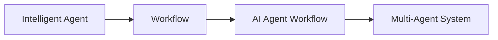
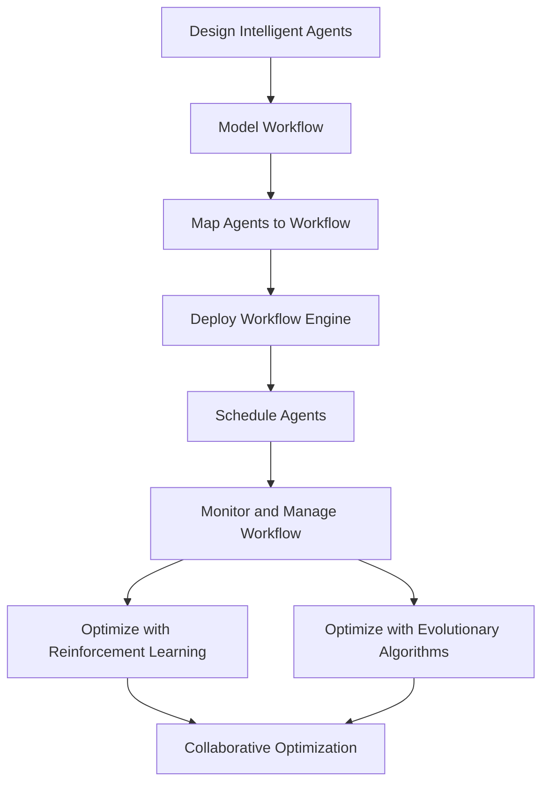

# AI人工智能代理工作流AI Agent WorkFlow：多代理系统的工作流整合方法

## 1. 背景介绍

随着人工智能技术的飞速发展,多代理系统(Multi-Agent System, MAS)在各个领域得到了广泛应用。多代理系统由多个自主智能体组成,通过智能体之间的交互与协作来完成复杂任务。然而,如何有效整合和协调多个AI代理的工作流,实现高效协同,是一个亟待解决的问题。本文将探讨一种创新的多代理系统工作流整合方法——AI Agent Workflow,为多代理系统的应用提供新的思路。

### 1.1 多代理系统概述
#### 1.1.1 多代理系统的定义
#### 1.1.2 多代理系统的特点
#### 1.1.3 多代理系统的应用领域

### 1.2 多代理系统面临的挑战  
#### 1.2.1 智能体之间的协调与交互
#### 1.2.2 工作流的整合与优化
#### 1.2.3 系统的鲁棒性与可扩展性

### 1.3 AI Agent Workflow的提出
#### 1.3.1 AI Agent Workflow的概念
#### 1.3.2 AI Agent Workflow的目标
#### 1.3.3 AI Agent Workflow的特点

## 2. 核心概念与联系

### 2.1 智能代理(Intelligent Agent)
#### 2.1.1 智能代理的定义
#### 2.1.2 智能代理的属性
#### 2.1.3 智能代理的分类

### 2.2 工作流(Workflow)  
#### 2.2.1 工作流的定义
#### 2.2.2 工作流的要素
#### 2.2.3 工作流建模方法

### 2.3 AI Agent与Workflow的结合
#### 2.3.1 AI Agent在工作流中的角色
#### 2.3.2 工作流对AI Agent的约束
#### 2.3.3 AI Agent Workflow的形式化定义



## 3. 核心算法原理具体操作步骤

### 3.1 AI Agent Workflow的构建
#### 3.1.1 智能代理的设计与实现
#### 3.1.2 工作流的建模与描述
#### 3.1.3 AI Agent与Workflow的映射

### 3.2 AI Agent Workflow的执行
#### 3.2.1 工作流引擎的选择
#### 3.2.2 智能代理的部署与调度
#### 3.2.3 工作流的监控与管理

### 3.3 AI Agent Workflow的优化  
#### 3.3.1 基于强化学习的工作流优化
#### 3.3.2 基于进化算法的智能代理优化
#### 3.3.3 工作流与智能代理的协同优化



## 4. 数学模型和公式详细讲解举例说明

### 4.1 智能代理的数学模型
#### 4.1.1 BDI模型
Agent的信念(Beliefs)、欲望(Desires)和意图(Intentions)可以用一个三元组来表示:
$$Agent := \langle B, D, I \rangle$$
其中,$B$表示Agent的信念集合,$D$表示Agent的欲望集合,$I$表示Agent的意图集合。

#### 4.1.2 马尔可夫决策过程
智能代理的决策可以用马尔可夫决策过程(Markov Decision Process, MDP)来建模。一个MDP可以表示为一个五元组:
$$MDP := \langle S, A, P, R, \gamma \rangle$$
其中,$S$表示状态集合,$A$表示行动集合,$P$表示状态转移概率矩阵,$R$表示奖励函数,$\gamma$表示折扣因子。

### 4.2 工作流的数学模型
#### 4.2.1 Petri网
Petri网是一种常用的工作流建模方法。一个Petri网可以定义为一个五元组:  
$$PN := \langle P, T, F, W, M_0 \rangle$$
其中,$P$表示库所集合,$T$表示变迁集合,$F$表示流关系,$W$表示权函数,$M_0$表示初始标识。

#### 4.2.2 π-calculus
π-calculus是一种用于描述并发系统的形式化方法,也可用于工作流建模。π-calculus的语法可以定义为:
$$P ::= \overline{x}y.P | x(y).P | P|Q | !P | (\nu x)P$$
其中,$\overline{x}y.P$表示在通道$x$上发送名字$y$,$x(y).P$表示从通道$x$接收名字$y$,$P|Q$表示进程$P$和$Q$并行执行,$!P$表示进程$P$的无限复制,$(\nu x)P$表示在$P$中创建一个新的通道名$x$。

### 4.3 AI Agent Workflow的数学模型
#### 4.3.1 基于Petri网的AI Agent Workflow模型
可以将AI Agent Workflow建模为一个扩展的Petri网:
$$AAWF := \langle PN, Ag, Ac, f \rangle$$
其中,$PN$表示工作流的Petri网模型,$Ag$表示智能代理集合,$Ac$表示代理行为集合,$f$是一个映射函数,将库所映射到代理,将变迁映射到行为。

#### 4.3.2 基于π-calculus的AI Agent Workflow模型
也可以用π-calculus来描述AI Agent Workflow:
$$AAWF ::= (\nu x_1)...(\nu x_n)(Agent_1 | ... | Agent_m)$$
$$Agent_i ::= !Behavior_i$$
其中,$x_1,...,x_n$表示代理之间通信的通道,$Agent_1,...,Agent_m$表示$m$个智能代理,每个代理执行特定的行为$Behavior_i$。

## 5. 项目实践：代码实例和详细解释说明

下面给出一个简单的AI Agent Workflow的Python实现示例:

```python
import numpy as np

class Agent:
    def __init__(self, id):
        self.id = id
        
    def perform(self, task):
        # 执行任务的代码
        print(f"Agent {self.id} performs task {task}")
        
class Workflow:
    def __init__(self, tasks, agents):
        self.tasks = tasks
        self.agents = agents
        
    def run(self):
        for task in self.tasks:
            agent = np.random.choice(self.agents) 
            agent.perform(task)

if __name__ == "__main__":
    tasks = ["Task1", "Task2", "Task3"]
    agents = [Agent(1), Agent(2), Agent(3)]
    workflow = Workflow(tasks, agents)
    workflow.run()
```

在这个示例中:
- `Agent`类表示一个智能代理,有一个`id`属性和一个`perform`方法,用于执行任务。
- `Workflow`类表示一个工作流,包含一组任务`tasks`和一组智能代理`agents`。`run`方法用于执行工作流,随机选择代理执行每个任务。
- 在`main`函数中,创建了3个任务和3个代理,构建了一个工作流对象,并执行该工作流。

输出结果如下:
```
Agent 2 performs task Task1
Agent 1 performs task Task2  
Agent 3 performs task Task3
```

可以看到,每个任务都被随机分配给一个代理执行。这只是一个简单示例,实际应用中的AI Agent Workflow要复杂得多,需要考虑任务的依赖关系、代理的能力与负载等因素,并引入更高级的调度优化算法。

## 6. 实际应用场景

AI Agent Workflow可以应用于多个领域,包括:

### 6.1 智能制造
在工业4.0时代,智能制造是一个重要趋势。将AI Agent Workflow应用于生产线调度、设备维护、质量管理等方面,可以显著提高生产效率和产品质量。

### 6.2 智慧城市 
在智慧城市中,多个AI代理可以协同工作,优化交通调度、能源管理、环境监测等任务,提升城市运行效率和居民生活品质。

### 6.3 金融科技
AI Agent Workflow可用于构建智能化的金融系统,如智能投顾、风险管理、反欺诈等,帮助金融机构提供更好的服务并控制风险。

### 6.4 医疗健康
将AI Agent Workflow用于医疗诊断、药物研发、健康管理等领域,有助于提高医疗质量,加速新药开发,促进全民健康。

## 7. 工具和资源推荐

### 7.1 多代理系统开发平台
- JADE (Java Agent Development Framework)
- MASON (Multi-Agent Simulator Of Neighborhoods)
- NetLogo
- Mesa (Agent-based modeling in Python)

### 7.2 工作流管理系统
- Apache Airflow
- Kubeflow
- Argo Workflows 
- Prefect

### 7.3 相关学习资源
- 《多智能体系统原理与设计》
- 《工作流管理:模型、方法与系统》
- Coursera课程《Fundamentals of Agent-based Modeling》
- 《Artificial Intelligence: A Modern Approach》

## 8. 总结：未来发展趋势与挑战

AI Agent Workflow作为一种新颖的多代理系统工作流整合方法,为智能系统的构建提供了新的思路。未来,AI Agent Workflow有望在更多领域得到应用,极大地提升系统的智能化水平。同时,AI Agent Workflow的发展也面临一些挑战:

### 8.1 智能代理的自主学习与进化
如何让智能代理具备自主学习和进化的能力,根据环境变化动态调整行为,是一个亟待解决的问题。

### 8.2 工作流的动态适应与重构
如何让工作流能够根据任务需求和系统状态的变化动态适应和重构,提高系统的灵活性和鲁棒性,是另一个挑战。

### 8.3 多代理系统的安全与隐私
在多代理系统中,如何确保智能代理之间通信的安全性,保护用户隐私,防止恶意代理的攻击,也是一个重要问题。

### 8.4 人机协作与共生
随着AI Agent Workflow的发展,如何让智能代理与人更好地协作,实现人机共生,将是一个长期的研究方向。

展望未来,AI Agent Workflow必将在人工智能的发展历程中扮演重要角色,推动智能系统走向更高的自主性、协同性和适应性,为人类社会的进步贡献力量。

## 9. 附录：常见问题与解答

### Q1: AI Agent Workflow与传统工作流有什么区别?
A1: 传统工作流侧重于任务的流程建模和执行,而AI Agent Workflow引入了智能代理的概念,强调代理的自主性和协同性,使工作流更加智能化和灵活。

### Q2: 如何设计一个高效的AI Agent Workflow?
A2: 设计AI Agent Workflow需要考虑任务的特点、代理的能力、工作流的结构等因素,合理划分任务,选择适当的代理,优化工作流的执行效率。可以借鉴现有的多代理系统设计方法和工作流建模技术。

### Q3: AI Agent Workflow如何处理任务之间的依赖关系?
A3: 可以在工作流建模时显式地表示任务之间的依赖关系,如使用有向无环图(DAG)等方式。在工作流执行时,根据任务依赖关系合理调度代理,确保任务按照正确的顺序执行。

### Q4: AI Agent Workflow能否支持大规模的分布式计算?
A4: 是的,AI Agent Workflow本身就是一种分布式的计算模式。可以将智能代理部署在不同的节点上,通过网络通信协议实现代理之间的交互。借助现有的分布式计算框架和工作流管理系统,可以支持大规模的AI Agent Workflow应用。

### Q5: 如何评估AI Agent Workflow的性能?
A5: 可以从任务完成时间、资源利用率、系统吞吐量等方面来评估AI Agent Workflow的性能。也可以与传统工作流或其他多代理系统进行比较。选择合适的评估指标,设计科学的实验,全面评估AI Agent Workflow的优缺点。

作者：禅与计算机程序设计艺术 / Zen and the Art of Computer Programming