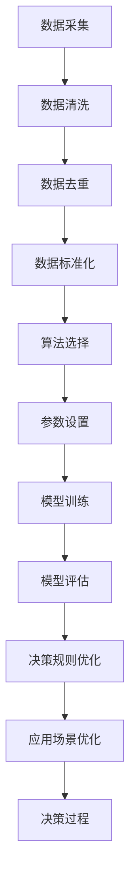

# AI伦理与算法公平性原理与代码实战案例讲解

## 1.背景介绍

在人工智能（AI）技术迅猛发展的今天，AI系统已经广泛应用于各个领域，如医疗、金融、教育和司法等。然而，随着AI技术的普及，伦理问题和算法公平性问题也逐渐显现。AI系统的决策可能会影响到人们的生活质量、就业机会和社会公平，因此，确保AI系统的伦理性和公平性变得尤为重要。

### 1.1 AI伦理的定义与重要性

AI伦理是指在设计、开发和应用AI系统时，遵循一系列道德原则和规范，以确保AI系统的行为符合社会的价值观和道德标准。AI伦理的重要性在于，它能够帮助我们避免AI系统在决策过程中产生偏见、歧视和不公平现象，从而维护社会的公正和稳定。

### 1.2 算法公平性的定义与挑战

算法公平性是指在AI系统的设计和应用过程中，确保算法对所有群体和个体的决策是公正和无偏的。算法公平性面临的挑战主要包括数据偏见、模型偏见和决策偏见等。解决这些挑战需要从数据采集、模型训练和决策过程等多个环节入手，确保算法的透明性和可解释性。

## 2.核心概念与联系

在探讨AI伦理和算法公平性时，我们需要理解一些核心概念及其相互联系。这些概念包括数据偏见、模型偏见、决策偏见、透明性和可解释性等。

### 2.1 数据偏见

数据偏见是指在数据采集和处理过程中，由于数据来源、采集方法和处理方式等原因，导致数据中存在系统性偏差。这些偏差可能会影响AI模型的训练结果，从而导致模型在实际应用中产生偏见。

### 2.2 模型偏见

模型偏见是指在AI模型的设计和训练过程中，由于算法选择、参数设置和训练数据等原因，导致模型在决策过程中产生偏见。模型偏见可能会导致某些群体或个体在AI系统的决策中受到不公平的待遇。

### 2.3 决策偏见

决策偏见是指在AI系统的实际应用过程中，由于模型的决策规则和应用场景等原因，导致AI系统在决策过程中产生偏见。决策偏见可能会影响到人们的生活质量和社会公平。

### 2.4 透明性与可解释性

透明性和可解释性是指在AI系统的设计和应用过程中，确保算法的决策过程是透明和可解释的。透明性和可解释性有助于我们理解AI系统的决策逻辑，从而发现和纠正算法中的偏见和不公平现象。

### 2.5 核心概念之间的联系

数据偏见、模型偏见和决策偏见是相互关联的。数据偏见可能会导致模型偏见，而模型偏见又可能会导致决策偏见。透明性和可解释性是解决这些偏见和不公平现象的重要手段。通过提高AI系统的透明性和可解释性，我们可以更好地理解和控制AI系统的决策过程，从而确保算法的公平性。

## 3.核心算法原理具体操作步骤

在确保AI伦理和算法公平性方面，有一些核心算法和技术可以帮助我们实现这一目标。以下是一些常用的算法和技术及其具体操作步骤。

### 3.1 数据预处理

数据预处理是确保算法公平性的第一步。通过对数据进行清洗、去重和标准化处理，可以减少数据中的偏见和噪声。

#### 3.1.1 数据清洗

数据清洗是指对数据中的缺失值、异常值和重复值进行处理，以确保数据的质量和一致性。

#### 3.1.2 数据去重

数据去重是指对数据中的重复记录进行处理，以确保数据的唯一性和准确性。

#### 3.1.3 数据标准化

数据标准化是指对数据进行归一化处理，以确保数据的尺度一致，从而减少数据中的偏见和噪声。

### 3.2 模型训练

模型训练是确保算法公平性的关键步骤。通过选择合适的算法和参数设置，可以减少模型中的偏见和不公平现象。

#### 3.2.1 算法选择

算法选择是指根据具体的应用场景和数据特点，选择合适的算法进行模型训练。常用的算法包括线性回归、决策树、随机森林和神经网络等。

#### 3.2.2 参数设置

参数设置是指根据具体的应用场景和数据特点，设置合适的算法参数，以确保模型的性能和公平性。

#### 3.2.3 模型评估

模型评估是指对训练好的模型进行性能评估，以确保模型的准确性和公平性。常用的评估指标包括准确率、召回率、F1值和AUC等。

### 3.3 决策过程

决策过程是确保算法公平性的最后一步。通过对模型的决策规则和应用场景进行优化，可以减少决策过程中的偏见和不公平现象。

#### 3.3.1 决策规则优化

决策规则优化是指对模型的决策规则进行优化，以确保决策过程的公平性和透明性。

#### 3.3.2 应用场景优化

应用场景优化是指根据具体的应用场景，对模型的应用方式进行优化，以确保决策过程的公平性和透明性。

### 3.4 Mermaid 流程图

以下是一个描述数据预处理、模型训练和决策过程的Mermaid流程图：



## 4.数学模型和公式详细讲解举例说明

在确保AI伦理和算法公平性方面，数学模型和公式是非常重要的工具。以下是一些常用的数学模型和公式及其详细讲解和举例说明。

### 4.1 线性回归模型

线性回归模型是一种常用的回归分析方法，用于预测因变量与自变量之间的线性关系。线性回归模型的数学公式如下：

$$
y = \beta_0 + \beta_1 x_1 + \beta_2 x_2 + \cdots + \beta_n x_n + \epsilon
$$

其中，$y$ 是因变量，$x_1, x_2, \cdots, x_n$ 是自变量，$\beta_0, \beta_1, \cdots, \beta_n$ 是回归系数，$\epsilon$ 是误差项。

#### 4.1.1 线性回归模型的应用

线性回归模型可以用于预测房价、股票价格和销售额等。通过对历史数据进行回归分析，可以得到回归系数，从而预测未来的因变量值。

#### 4.1.2 线性回归模型的优缺点

线性回归模型的优点是简单易懂、计算效率高，适用于线性关系的数据。缺点是对非线性关系的数据效果较差，容易受到异常值的影响。

### 4.2 决策树模型

决策树模型是一种常用的分类和回归分析方法，用于预测因变量与自变量之间的非线性关系。决策树模型的数学公式如下：

$$
y = \sum_{i=1}^{n} w_i I(x \in R_i)
$$

其中，$y$ 是因变量，$x$ 是自变量，$w_i$ 是权重，$R_i$ 是决策区域，$I$ 是指示函数。

#### 4.2.1 决策树模型的应用

决策树模型可以用于分类和回归分析，如信用评分、疾病诊断和客户细分等。通过对历史数据进行决策树分析，可以得到决策规则，从而预测未来的因变量值。

#### 4.2.2 决策树模型的优缺点

决策树模型的优点是易于理解和解释，适用于非线性关系的数据。缺点是容易过拟合，对噪声数据敏感。

### 4.3 随机森林模型

随机森林模型是一种集成学习方法，通过构建多个决策树模型来提高预测的准确性和稳定性。随机森林模型的数学公式如下：

$$
y = \frac{1}{n} \sum_{i=1}^{n} T_i(x)
$$

其中，$y$ 是因变量，$x$ 是自变量，$T_i$ 是第 $i$ 个决策树模型，$n$ 是决策树的数量。

#### 4.3.1 随机森林模型的应用

随机森林模型可以用于分类和回归分析，如信用评分、疾病诊断和客户细分等。通过构建多个决策树模型，可以提高预测的准确性和稳定性。

#### 4.3.2 随机森林模型的优缺点

随机森林模型的优点是具有较高的准确性和稳定性，适用于非线性关系的数据。缺点是计算复杂度较高，模型解释性较差。

## 5.项目实践：代码实例和详细解释说明

在确保AI伦理和算法公平性方面，代码实例和详细解释说明是非常重要的工具。以下是一些常用的代码实例和详细解释说明。

### 5.1 数据预处理代码实例

以下是一个数据预处理的代码实例，包括数据清洗、数据去重和数据标准化。

```python
import pandas as pd
from sklearn.preprocessing import StandardScaler

# 读取数据
data = pd.read_csv('data.csv')

# 数据清洗
data = data.dropna()

# 数据去重
data = data.drop_duplicates()

# 数据标准化
scaler = StandardScaler()
data_scaled = scaler.fit_transform(data)

# 输出预处理后的数据
print(data_scaled)
```

### 5.2 模型训练代码实例

以下是一个模型训练的代码实例，包括算法选择、参数设置和模型评估。

```python
from sklearn.model_selection import train_test_split
from sklearn.linear_model import LinearRegression
from sklearn.metrics import mean_squared_error

# 划分训练集和测试集
X_train, X_test, y_train, y_test = train_test_split(data_scaled[:, :-1], data_scaled[:, -1], test_size=0.2, random_state=42)

# 算法选择和参数设置
model = LinearRegression()

# 模型训练
model.fit(X_train, y_train)

# 模型评估
y_pred = model.predict(X_test)
mse = mean_squared_error(y_test, y_pred)

# 输出模型评估结果
print(f'Mean Squared Error: {mse}')
```

### 5.3 决策过程代码实例

以下是一个决策过程的代码实例，包括决策规则优化和应用场景优化。

```python
import numpy as np

# 决策规则优化
threshold = 0.5
y_pred_optimized = np.where(y_pred > threshold, 1, 0)

# 应用场景优化
# 假设应用场景是信用评分，优化后的决策规则如下
credit_score_threshold = 700
credit_decision = np.where(y_pred_optimized > credit_score_threshold, 'Approved', 'Denied')

# 输出决策结果
print(credit_decision)
```

## 6.实际应用场景

在确保AI伦理和算法公平性方面，实际应用场景是非常重要的。以下是一些常见的实际应用场景及其详细说明。

### 6.1 医疗领域

在医疗领域，AI系统可以用于疾病诊断、治疗方案推荐和患者管理等。然而，医疗数据中可能存在性别、种族和年龄等方面的偏见，导致AI系统在决策过程中产生不公平现象。因此，在设计和应用医疗AI系统时，需要特别注意数据的公平性和透明性。

### 6.2 金融领域

在金融领域，AI系统可以用于信用评分、风险评估和投资决策等。然而，金融数据中可能存在收入、职业和地区等方面的偏见，导致AI系统在决策过程中产生不公平现象。因此，在设计和应用金融AI系统时，需要特别注意数据的公平性和透明性。

### 6.3 教育领域

在教育领域，AI系统可以用于学生成绩预测、个性化学习推荐和教育资源分配等。然而，教育数据中可能存在性别、种族和家庭背景等方面的偏见，导致AI系统在决策过程中产生不公平现象。因此，在设计和应用教育AI系统时，需要特别注意数据的公平性和透明性。

### 6.4 司法领域

在司法领域，AI系统可以用于犯罪预测、案件审理和刑罚决策等。然而，司法数据中可能存在种族、性别和社会经济地位等方面的偏见，导致AI