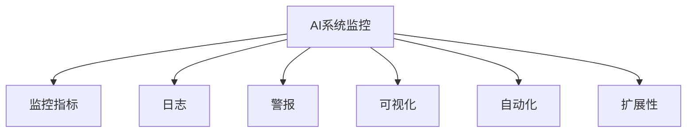
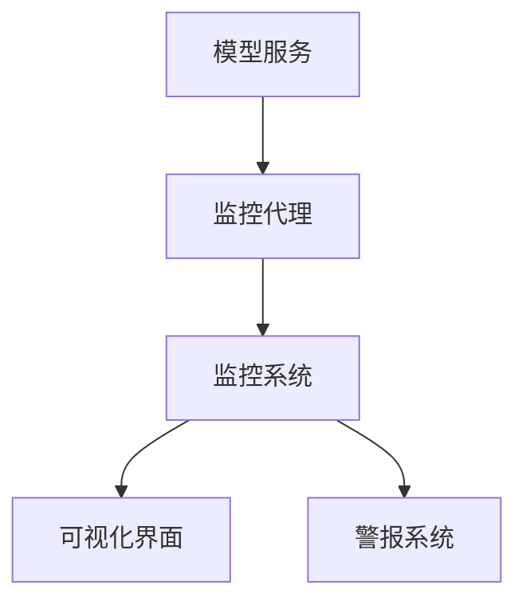

# AI系统监控原理与代码实战案例讲解

## 1.背景介绍

在当今快速发展的数字时代，人工智能(AI)系统已经广泛应用于各个领域,包括金融、医疗、制造业等。随着这些系统的复杂性不断增加,确保它们的可靠性、安全性和高效运行变得至关重要。因此,AI系统监控已成为一个热门话题,吸引了众多研究人员和从业人员的关注。

AI系统监控旨在实时跟踪和监视AI系统的性能、健康状况和行为,以便及时发现和解决任何潜在问题。它涉及收集和分析各种指标和日志数据,包括系统资源利用率、模型精度、延迟、异常检测等。通过有效的监控,我们可以确保AI系统按预期运行,提高系统的可靠性和用户体验。

## 2.核心概念与联系

AI系统监控涉及以下几个核心概念:

1. **监控指标(Monitoring Metrics)**: 这些是用于衡量AI系统性能和健康状况的关键指标,例如CPU利用率、内存使用情况、模型精度、延迟等。

2. **日志(Logs)**: AI系统会生成大量的日志数据,记录系统的运行状态、错误信息和警告。这些日志对于故障排查和问题诊断至关重要。

3. **警报(Alerts)**: 当监控指标超出预设阈值或发生异常情况时,系统会触发警报,通知相关人员采取必要的措施。

4. **可视化(Visualization)**: 将监控数据以图表、仪表盘等形式直观展示,有助于快速识别问题和趋势。

5. **自动化(Automation)**: 通过自动化工具和脚本,可以实现自动化监控、警报和故障恢复,提高效率和响应速度。

6. **扩展性(Scalability)**: 随着AI系统规模的扩大,监控系统需要具备良好的扩展性,以处理大量的监控数据和并发请求。

这些概念相互关联,共同构建了一个完整的AI系统监控解决方案。



## 3.核心算法原理具体操作步骤

AI系统监控涉及多种算法和技术,以下是一些核心算法原理和具体操作步骤:

### 3.1 异常检测算法

异常检测算法用于识别AI系统中的异常行为或异常数据,是监控的重要组成部分。常见的异常检测算法包括:

1. **统计异常检测算法**:
   - 基于统计模型(如高斯分布)建立正常数据的分布
   - 计算新数据与正常分布的偏差,超过阈值则标记为异常
   - 操作步骤:
     1) 收集历史数据,拟合统计模型
     2) 设置异常阈值
     3) 对新数据进行评分,超过阈值则标记为异常

2. **基于聚类的异常检测算法**:
   - 将数据划分为多个聚类
   - 离群点或小聚类被视为异常
   - 操作步骤:
     1) 选择合适的聚类算法(如K-Means)
     2) 对数据进行聚类
     3) 标记离群点或小聚类为异常

3. **基于深度学习的异常检测算法**:
   - 使用自编码器等深度学习模型学习正常数据的特征
   - 对新数据进行重构,重构误差大则标记为异常
   - 操作步骤:
     1) 收集正常数据,训练自编码器模型
     2) 对新数据进行重构,计算重构误差
     3) 设置异常阈值,超过阈值则标记为异常

### 3.2 时序数据分析算法

时序数据分析算法用于从AI系统的监控数据中发现趋势和模式,例如:

1. **异常值检测**:
   - 基于统计模型(如三sigma原则)检测异常值
   - 操作步骤:
     1) 计算时序数据的均值和标准差
     2) 设置异常阈值(如均值±3倍标准差)
     3) 标记超出阈值的数据点为异常值

2. **时序模式挖掘**:
   - 使用频繁模式挖掘算法(如PrefixSpan)发现时序模式
   - 操作步骤:
     1) 将时序数据转换为符号序列
     2) 应用PrefixSpan算法发现频繁模式
     3) 分析频繁模式,发现潜在的异常或趋势

3. **时序预测**:
   - 使用时序预测模型(如ARIMA、LSTM)对未来值进行预测
   - 操作步骤:
     1) 收集历史时序数据
     2) 训练时序预测模型
     3) 对未来值进行预测,与实际值进行比较

这些算法有助于从海量监控数据中提取有价值的信息,支持更好的决策和故障排查。

## 4.数学模型和公式详细讲解举例说明

在AI系统监控中,数学模型和公式扮演着重要角色,用于量化和描述系统的行为。以下是一些常见的数学模型和公式:

### 4.1 统计模型

统计模型通常用于异常检测和时序数据分析。常见的统计模型包括:

1. **高斯分布(正态分布)**:

$$
f(x) = \frac{1}{\sqrt{2\pi\sigma^2}}e^{-\frac{(x-\mu)^2}{2\sigma^2}}
$$

其中$\mu$是均值,$\sigma$是标准差。高斯分布常用于建模连续数据的分布,如CPU利用率、延迟等。

2. **指数分布**:

$$
f(x) = \lambda e^{-\lambda x}, x \geq 0
$$

指数分布常用于建模事件到达时间的分布,如请求到达间隔。

3. **三sigma原则**:

$$
P(|\mu - \sigma| \leq X \leq \mu + \sigma) \approx 0.6827
$$
$$
P(|\mu - 2\sigma| \leq X \leq \mu + 2\sigma) \approx 0.9545
$$
$$
P(|\mu - 3\sigma| \leq X \leq \mu + 3\sigma) \approx 0.9973
$$

三sigma原则常用于异常值检测,将落在$\mu \pm 3\sigma$范围外的数据点视为异常值。

### 4.2 时序模型

时序模型用于描述和预测时序数据的演化过程,如:

1. **自回归移动平均模型(ARMA)**:

$$
X_t = c + \sum_{i=1}^p \phi_i X_{t-i} + \sum_{j=1}^q \theta_j \epsilon_{t-j} + \epsilon_t
$$

其中$X_t$是时间$t$的观测值,$\phi_i$和$\theta_j$分别是自回归和移动平均系数,$\epsilon_t$是白噪声项。ARMA模型适用于平稳时序数据。

2. **自回归综合移动平均模型(ARIMA)**:

$$
\nabla^d X_t = c + \sum_{i=1}^p \phi_i \nabla^d X_{t-i} + \sum_{j=1}^q \theta_j \epsilon_{t-j} + \epsilon_t
$$

其中$\nabla^d$是差分运算符,用于消除非平稳性。ARIMA模型适用于非平稳时序数据。

3. **长短期记忆网络(LSTM)**:

LSTM是一种常用的递归神经网络,适用于时序数据建模和预测。它通过门控机制解决了传统递归神经网络的梯度消失问题,能够有效捕捉长期依赖关系。

这些数学模型和公式为AI系统监控提供了强大的分析工具,帮助我们更好地理解和管理系统的行为。

## 5.项目实践:代码实例和详细解释说明

为了更好地理解AI系统监控的实现,我们将通过一个基于Python的实例项目进行说明。该项目旨在监控一个简单的机器学习模型服务,包括模型精度、延迟和资源利用率等指标。

### 5.1 项目架构



1. **模型服务**: 一个基于Flask的Web服务,提供机器学习模型的预测功能。
2. **监控代理**: 一个Python脚本,用于收集模型服务的监控数据,并发送到监控系统。
3. **监控系统**: 使用开源监控系统Prometheus,用于存储和查询监控数据。
4. **可视化界面**: 使用Grafana可视化监控数据,创建仪表盘和图表。
5. **警报系统**: 使用Alertmanager发送警报,当监控指标超过阈值时通知相关人员。

### 5.2 代码实现

#### 5.2.1 模型服务

```python
import time
import random
from flask import Flask

app = Flask(__name__)

# 模拟模型预测函数
def predict(data):
    time.sleep(random.uniform(0.1, 0.5))  # 模拟延迟
    return random.randint(0, 1)  # 模拟预测结果

@app.route('/predict', methods=['POST'])
def predict_endpoint():
    data = request.get_json()
    result = predict(data)
    return jsonify({'result': result})

if __name__ == '__main__':
    app.run(host='0.0.0.0', port=5000)
```

这是一个简单的Flask Web服务,提供了一个`/predict`端点,接收POST请求的数据,并返回模拟的预测结果。`predict`函数模拟了模型的延迟和预测过程。

#### 5.2.2 监控代理

```python
import time
import requests
import random
from prometheus_client import start_http_server, Counter, Histogram

# 创建监控指标
REQUEST_COUNT = Counter('request_count', 'Total number of requests')
REQUEST_LATENCY = Histogram('request_latency_seconds', 'Request latency in seconds')

# 启动HTTP服务器,用于暴露监控指标
start_http_server(8000)

while True:
    # 模拟发送请求
    start_time = time.time()
    response = requests.post('http://localhost:5000/predict', json={'data': random.randint(0, 100)})
    latency = time.time() - start_time

    # 更新监控指标
    REQUEST_COUNT.inc()
    REQUEST_LATENCY.observe(latency)

    time.sleep(1)
```

这个Python脚本模拟了一个监控代理,它定期向模型服务发送请求,并记录请求计数和延迟等监控指标。代理使用了Prometheus Client库,通过HTTP服务器暴露监控指标,供Prometheus系统抓取。

#### 5.2.3 Prometheus配置

```yaml
global:
  scrape_interval: 15s

scrape_configs:
  - job_name: 'model-service'
    static_configs:
      - targets: ['localhost:8000']
```

这是Prometheus的配置文件,指定了每15秒抓取一次监控代理暴露的指标。

#### 5.2.4 Grafana仪表盘

在Grafana中,我们可以创建一个仪表盘,可视化模型服务的监控数据。例如,我们可以创建一个图表显示请求计数的变化趋势,另一个图表显示请求延迟的分布情况。

```
# 请求计数
rate(request_count[1m])

# 请求延迟分布
histogram_quantile(0.95, rate(request_latency_seconds_bucket[5m]))
```

通过这些可视化工具,我们可以实时监控模型服务的性能,快速发现和诊断潜在问题。

#### 5.2.5 Alertmanager配置

```yaml
route:
  receiver: 'slack'

receivers:
  - name: 'slack'
    slack_configs:
      - send_resolved: true
        text: '{{ .CommonAnnotations.summary }}'
        username: 'Alertmanager'
        channel: '#alerts'

```

这是Alertmanager的配置文件,指定了当触发警报时,将通过Slack通知相关人员。我们可以根据需要配置不同的通知渠道,如电子邮件、短信等。

通过这个实例项目,我们展示了如何使用开源工具构建一个基本的AI系统监控解决方案。在实际场景中,监控系统会更加复杂和全面,但核心思路和原理是相似的。

## 6.实际应用场景

AI系统监控在各个领域都有广泛的应用,以下是一些典型的场景:

1. **金融服务**: 监控用于信用