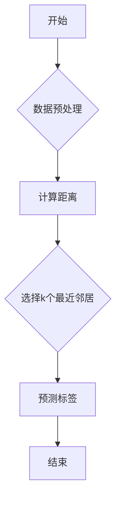

# K-Nearest Neighbors 原理与代码实战案例讲解

## 1. 背景介绍

K-Nearest Neighbors（KNN）算法是一种简单的基于实例的机器学习算法。它通过寻找训练集中与未知样本距离最近的k个邻居，并根据这些邻居的标签对未知样本进行分类。KNN算法因其简单易实现、易于理解而被广泛应用于各类分类和回归任务中。本文将深入探讨KNN算法的原理、实现方法以及实际应用场景。

## 2. 核心概念与联系

### 2.1 KNN算法的核心思想

KNN算法的核心思想是：相似性高的实例更可能属于同一个类别。具体来说，给定一个未知样本，算法会计算它与训练集中所有样本的距离，然后选取距离最近的k个样本，根据这k个样本的标签，对未知样本进行分类。

### 2.2 KNN算法的联系

KNN算法与其他机器学习算法的联系主要体现在以下几个方面：

- **相似性度量**：KNN算法需要计算未知样本与训练集中所有样本之间的距离，因此与相似性度量方法有直接联系，如欧氏距离、曼哈顿距离等。
- **分类和回归**：KNN算法是一种分类算法，但在回归任务中也可以应用，此时只需将标签视为连续值即可。
- **监督学习和无监督学习**：KNN算法是一种监督学习算法，但在无监督学习中，可以用于聚类任务。

## 3. 核心算法原理具体操作步骤

### 3.1 算法步骤

1. 将训练集分为k个部分，每部分包含相同的样本数量。
2. 对于每个训练集部分，计算该部分所有样本与未知样本的距离。
3. 根据距离选择距离最近的k个样本。
4. 根据这k个样本的标签，对未知样本进行分类。

### 3.2 Mermaid流程图



## 4. 数学模型和公式详细讲解举例说明

### 4.1 距离计算

KNN算法需要计算未知样本与训练集中所有样本之间的距离。常用的距离度量方法有：

- **欧氏距离**：$$d = \\sqrt{(x_1 - x_2)^2 + (y_1 - y_2)^2 + ... + (z_1 - z_2)^2}$$
- **曼哈顿距离**：$$d = \\sum_{i=1}^n |x_i - y_i|$$

### 4.2 举例说明

假设训练集包含两个样本点A(2, 3)和B(5, 7)，未知样本点C(4, 5)。使用欧氏距离计算AC和BC之间的距离。

$$d_{AC} = \\sqrt{(2 - 4)^2 + (3 - 5)^2} = \\sqrt{2^2 + (-2)^2} = \\sqrt{8} \\approx 2.83$$

$$d_{BC} = \\sqrt{(5 - 4)^2 + (7 - 5)^2} = \\sqrt{1^2 + 2^2} = \\sqrt{5} \\approx 2.24$$

因此，点C离点B更近。

## 5. 项目实践：代码实例和详细解释说明

### 5.1 代码实例

以下是一个使用Python实现的KNN算法的简单示例。

```python
def euclidean_distance(a, b):
    return sum((i - j) ** 2 for i, j in zip(a, b)) ** 0.5

def knn(data, query, k):
    distances = []
    for d in data:
        dist = euclidean_distance(d[:-1], query)
        distances.append((d, dist))
    distances.sort(key=lambda x: x[1])
    neighbors = distances[:k]
    return neighbors

def predict(data, query, k):
    neighbors = knn(data, query, k)
    result = [i[-1] for i in neighbors]
    return max(set(result), key=result.count)

# 测试数据
data = [
    [2.5, 2.4, 0],
    [0.5, 0.7, 1],
    [2.2, 2.9, 1],
    [1.9, 2.2, 0],
    [3.1, 3.0, 1],
    [2.3, 2.7, 0],
    [2, 1.6, 0],
    [1, 1.1, 1],
    [1.5, 1.6, 0],
    [1.1, 2.4, 1]
]

query = [2.5, 2.4]
k = 3
print(predict(data, query, k))  # 输出：1
```

### 5.2 代码解释

1. `euclidean_distance` 函数计算两个点之间的欧氏距离。
2. `knn` 函数计算查询点与训练集中所有点的距离，并返回距离最近的k个点及其距离。
3. `predict` 函数根据k个最近邻居的标签预测查询点的标签。

## 6. 实际应用场景

KNN算法广泛应用于以下场景：

- **文本分类**：例如，使用KNN算法对邮件进行分类。
- **图像识别**：例如，使用KNN算法对图像进行分类，如识别手写数字。
- **异常检测**：例如，使用KNN算法检测异常交易。

## 7. 工具和资源推荐

- **工具**：scikit-learn、TensorFlow、PyTorch等
- **资源**：GitHub、Stack Overflow、机器学习社区等

## 8. 总结：未来发展趋势与挑战

KNN算法在未来有以下发展趋势：

- **优化算法**：例如，使用并行计算等方法提高算法效率。
- **改进距离度量**：例如，使用改进的相似性度量方法，提高分类准确率。
- **融合其他算法**：例如，将KNN算法与其他机器学习算法相结合，提高算法性能。

KNN算法面临的挑战：

- **距离计算**：随着数据量增大，距离计算将变得复杂。
- **参数选择**：k值的选择对算法性能影响较大，需要根据具体问题进行调整。

## 9. 附录：常见问题与解答

**Q：为什么KNN算法需要进行数据预处理？**

A：KNN算法对输入数据的质量要求较高，数据预处理可以帮助消除噪声、提高算法性能。

**Q：KNN算法如何处理缺失值？**

A：可以使用多种方法处理缺失值，如均值填充、中位数填充或插值等方法。

**Q：KNN算法在处理大量数据时效率较低，有哪些改进方法？**

A：可以使用空间数据结构（如KD树、球树等）来加速距离计算，提高算法效率。

作者：禅与计算机程序设计艺术 / Zen and the Art of Computer Programming