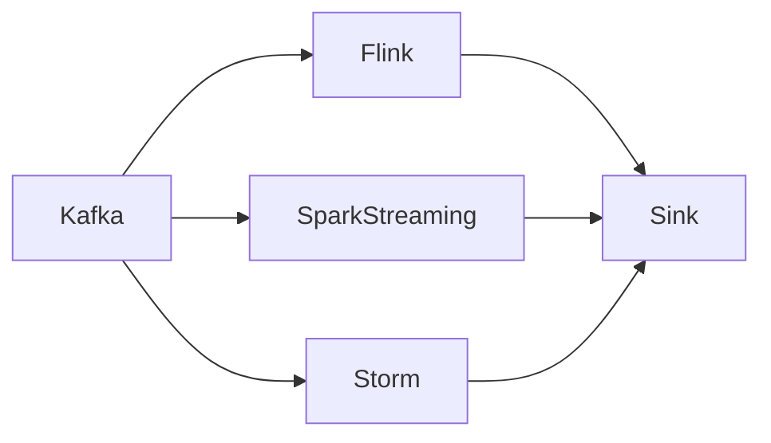

# Kafka与其他流处理框架的比较

## 1. 背景介绍
### 1.1 流处理的重要性
在当今大数据时代,数据的实时处理变得越来越重要。企业需要及时洞察业务情况,快速响应市场变化。传统的批处理模式已经无法满足实时性的要求,流处理应运而生。
### 1.2 常见的流处理框架
目前业界有多种流处理框架,如Kafka、Flink、Spark Streaming、Storm等。它们各有特点,在不同场景下发挥着重要作用。本文将重点介绍Kafka,并与其他几种主流框架进行比较。

## 2. 核心概念与联系
### 2.1 Kafka的核心概念
#### 2.1.1 Producer与Consumer
Kafka遵循生产者-消费者模式。生产者(Producer)发布消息到Kafka中的主题(Topic),消费者(Consumer)订阅感兴趣的主题并消费其中的消息。
#### 2.1.2 Topic与Partition
主题(Topic)是Kafka中消息的逻辑分类。每个主题可以划分为多个分区(Partition),以实现横向扩展和容错。分区内消息是有序的,但分区间消息无序。
#### 2.1.3 Broker与集群
一个Kafka集群由多个Broker组成。Broker是Kafka实例,负责消息的存储和转发。每个Broker可以存储多个分区,不同分区可分布在不同Broker上,实现负载均衡。
### 2.2 其他框架的核心概念
- Flink: 基于事件驱动的流处理,支持有状态计算,提供了丰富的时间语义(Event Time、Processing Time等)。
- Spark Streaming: 基于Spark的准实时流处理框架,将流数据划分为一系列微批次进行处理。
- Storm: Twitter开源的分布式流处理系统,使用Spout和Bolt组成Topology,实现数据流的处理。

### 2.3 框架间的联系

上图展示了几种框架的联系。Kafka常作为上游数据源,为下游的Flink、Spark Streaming、Storm等提供数据输入。处理后的结果可写入外部存储系统。

## 3. 核心算法原理与具体操作步骤
### 3.1 Kafka的核心算法
#### 3.1.1 日志结构存储
Kafka使用日志结构(Log-structured)存储消息。每个分区对应一个日志文件,新消息不断追加到日志末尾。这种顺序写入方式性能很高。
#### 3.1.2 分区与消费者组
Kafka引入了消费者组(Consumer Group)的概念。同组的消费者协调消费分区,每个分区只能被一个消费者消费,以实现消息的有序处理。不同组的消费者可独立消费同一主题。
### 3.2 Kafka的使用步骤
1. 启动Zookeeper和Kafka集群
2. 创建主题,指定分区数
3. 生产者发布消息到主题
4. 消费者订阅主题,消费消息
5. 根据需要创建不同的消费者组

### 3.3 其他框架的核心算法
- Flink: 基于Chandy-Lamport分布式快照算法实现exactly-once语义。使用定时器和状态管理实现复杂事件处理。
- Spark Streaming: 将流数据划分为DStream(Discretized Stream),对每个微批次使用Spark引擎进行处理。
- Storm: 数据以Tuple形式在Spout和Bolt间流动。使用Acker机制实现at-least-once语义。

## 4. 数学模型和公式详解
### 4.1 Kafka的数学模型
Kafka的数学模型可简化为生产者-消费者模型。假设有$m$个生产者和$n$个消费者,令$P_i$表示第$i$个生产者,$C_j$表示第$j$个消费者。$T_k$代表第$k$个主题,共有$t$个主题。定义如下符号:
- $rate(P_i)$:生产者$P_i$的生产速率
- $rate(C_j)$:消费者$C_j$的消费速率
- $par(T_k)$:主题$T_k$的分区数

则整个系统的平均生产速率$R_p$和平均消费速率$R_c$分别为:

$$
R_p=\frac{\sum_{i=1}^{m} rate(P_i)}{t}, \quad R_c=\frac{\sum_{j=1}^{n} rate(C_j)}{\sum_{k=1}^{t} par(T_k)}
$$

为保证系统稳定,需要满足:$R_p \leq R_c$。即生产速率不超过消费速率,否则会造成消息堆积。

### 4.2 其他框架的数学模型
- Flink: 使用DataFlow模型,将算子(Operator)作为顶点,数据流作为边,构建有向无环图(DAG)。
- Spark Streaming: 将流数据划分为一系列RDD(弹性分布式数据集),使用Spark的转换算子进行操作。
- Storm: 使用Topology作为数据流图,Spout为数据源,Bolt为处理单元。Tuple在节点间传递。

## 5. 项目实践
### 5.1 Kafka项目实例
下面是一个简单的Kafka生产者-消费者示例(使用Java):

```java
// 生产者
Properties props = new Properties();
props.put("bootstrap.servers", "localhost:9092");
props.put("key.serializer", "org.apache.kafka.common.serialization.StringSerializer");
props.put("value.serializer", "org.apache.kafka.common.serialization.StringSerializer");

Producer<String, String> producer = new KafkaProducer<>(props);
for (int i = 0; i < 10; i++) {
    producer.send(new ProducerRecord<>("my-topic", "key-" + i, "value-" + i));
}

producer.close();

// 消费者
Properties props = new Properties();
props.put("bootstrap.servers", "localhost:9092");
props.put("group.id", "my-group");
props.put("key.deserializer", "org.apache.kafka.common.serialization.StringDeserializer");
props.put("value.deserializer", "org.apache.kafka.common.serialization.StringDeserializer");

KafkaConsumer<String, String> consumer = new KafkaConsumer<>(props);
consumer.subscribe(Collections.singletonList("my-topic"));

while (true) {
    ConsumerRecords<String, String> records = consumer.poll(Duration.ofMillis(100));
    for (ConsumerRecord<String, String> record : records) {
        System.out.printf("offset = %d, key = %s, value = %s\n", record.offset(), record.key(), record.value());
    }
}
```

以上代码首先创建一个生产者,向名为"my-topic"的主题发送10条消息。然后创建一个消费者,订阅该主题并持续消费其中的消息。

### 5.2 Flink项目实例
下面是一个简单的Flink流处理示例(使用Scala):

```scala
val env = StreamExecutionEnvironment.getExecutionEnvironment

val stream = env.fromElements(1, 2, 3, 4, 5)
  .map(x => x * 2)
  .filter(x => x > 5)

stream.print()

env.execute("My Flink Job")
```

该示例从集合创建数据流,然后使用map算子将每个元素乘以2,再使用filter算子过滤大于5的元素,最后打印结果。

## 6. 实际应用场景
### 6.1 Kafka的应用场景
- 日志聚合:Kafka可用于收集分布式系统的日志,供后续分析使用。
- 消息队列:Kafka可充当分布式消息队列,实现系统解耦和异步通信。
- 流式处理:Kafka常作为流处理系统的数据源,提供实时数据流。

### 6.2 其他框架的应用场景
- Flink: 适合需要低延迟、高吞吐的流处理场景,如实时大数据分析、欺诈检测等。
- Spark Streaming: 适合基于微批次的准实时处理,如网络监控、广告点击分析等。
- Storm: 适合对延迟要求高、数据量不太大的场景,如实时金融交易分析等。

## 7. 工具和资源推荐
- Kafka官网: http://kafka.apache.org
- Flink官网: http://flink.apache.org
- Spark Streaming官网: http://spark.apache.org/streaming
- Storm官网: http://storm.apache.org
- Confluent: 提供Kafka相关的企业级服务和工具
- Kafka Manager: Yahoo开源的Kafka集群管理工具

## 8. 总结
### 8.1 Kafka的优势
- 高吞吐、低延迟:Kafka通过分区、日志结构存储等设计实现了很高的吞吐量和很低的延迟。
- 可扩展性:Kafka可通过增加分区和Broker来横向扩展,满足增长的数据量和并发需求。
- 持久化存储:Kafka将消息持久化到磁盘,保证数据的可靠性。
- 灵活的消费模型:Kafka支持点对点和发布-订阅两种消费模型,可根据需要选择。

### 8.2 Kafka的局限性
- 无状态计算:Kafka本身不支持有状态计算,需要借助外部流处理引擎。
- 消息有序性:Kafka只保证分区内消息有序,而不保证全局有序。
- 消息删除:Kafka会定期删除过期消息,不适合长期存储。

### 8.3 与其他框架的比较
- 与Flink相比,Kafka更侧重数据管道,而Flink更侧重计算。
- 与Spark Streaming相比,Kafka的延迟更低,但Spark Streaming支持micro-batch模型。
- 与Storm相比,Kafka的吞吐量更高,但Storm的延迟更低。

### 8.4 未来趋势与挑战
- 流批一体化:流处理与批处理的界限正在模糊,未来会出现更多统一的处理框架。
- 云原生化:随着云计算的发展,流处理框架需要更好地适应云环境,提供弹性伸缩等能力。
- 智能化:人工智能技术与流处理的结合将产生更多智能应用,如异常检测、预测性维护等。

## 9. 附录
### 9.1 Kafka常见问题
- 如何选择分区数?
  - 分区数影响并行度,需要权衡吞吐量、可用性和消息有序性。一般设置为Broker数的整数倍。
- 如何设置消息保留时间?
  - 保留时间取决于消息量和可用磁盘空间。需要在数据时效性和存储成本间平衡。
- 如何监控Kafka集群?
  - 可使用Kafka Manager、Prometheus等工具监控集群的生产消费情况、资源使用情况等。

### 9.2 名词解释
- ISR(In-Sync Replica): 与Leader保持同步的Follower副本集合。用于Leader失效时新Leader的选举。
- HW(High Watermark): 高水位,代表消费者可见的最大偏移量。只有ISR中所有副本都同步了该消息,HW才会推进。
- LEO(Log End Offset): 日志末端偏移量,代表下一条待写入消息的偏移量。

作者：禅与计算机程序设计艺术 / Zen and the Art of Computer Programming