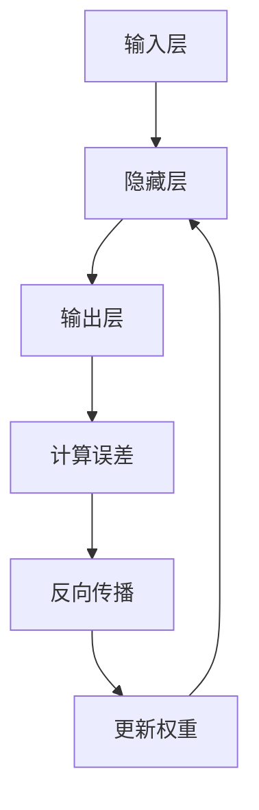

# Neural Networks原理与代码实例讲解

## 1.背景介绍

神经网络（Neural Networks）作为人工智能和机器学习领域的核心技术，已经在图像识别、自然语言处理、自动驾驶等多个领域取得了显著的成果。神经网络的灵感来源于生物神经系统，通过模拟人脑的神经元连接和信息传递方式，来实现复杂的计算和模式识别任务。

在这篇文章中，我们将深入探讨神经网络的核心概念、算法原理、数学模型，并通过具体的代码实例来帮助读者更好地理解和应用这一强大的技术。

## 2.核心概念与联系

### 2.1 神经元与激活函数

神经网络的基本构建单元是神经元（Neuron），每个神经元接收输入信号，通过激活函数（Activation Function）处理后输出结果。常见的激活函数包括Sigmoid、ReLU、Tanh等。

### 2.2 层与网络结构

神经网络由多个层（Layer）组成，通常包括输入层、隐藏层和输出层。每一层包含若干个神经元，层与层之间通过权重（Weights）连接。

### 2.3 前向传播与反向传播

前向传播（Forward Propagation）是指输入数据通过网络层层传递，最终输出结果。反向传播（Backpropagation）则是通过计算误差并调整权重，使网络逐步优化。

### 2.4 损失函数与优化算法

损失函数（Loss Function）用于衡量网络输出与真实值之间的差距，常见的损失函数有均方误差（MSE）、交叉熵（Cross-Entropy）等。优化算法（Optimizer）如梯度下降（Gradient Descent）用于最小化损失函数。

## 3.核心算法原理具体操作步骤

### 3.1 前向传播

前向传播的过程可以用以下步骤描述：

1. 输入数据通过输入层传递到隐藏层。
2. 隐藏层的每个神经元计算加权和，并通过激活函数输出。
3. 输出层的神经元接收隐藏层的输出，计算最终结果。

### 3.2 反向传播

反向传播的过程包括以下步骤：

1. 计算输出层的误差。
2. 将误差反向传递到隐藏层，计算每个神经元的误差。
3. 根据误差调整权重，更新网络参数。

### 3.3 梯度下降

梯度下降算法用于最小化损失函数，具体步骤如下：

1. 计算损失函数的梯度。
2. 根据梯度更新权重。
3. 重复上述步骤，直到损失函数收敛。

以下是一个简单的Mermaid流程图，展示了前向传播和反向传播的基本流程：



## 4.数学模型和公式详细讲解举例说明

### 4.1 前向传播公式

假设我们有一个简单的三层神经网络，输入层有 $n$ 个神经元，隐藏层有 $m$ 个神经元，输出层有 $k$ 个神经元。前向传播的公式如下：

$$
z^{(1)} = W^{(1)} x + b^{(1)}
$$

$$
a^{(1)} = \sigma(z^{(1)})
$$

$$
z^{(2)} = W^{(2)} a^{(1)} + b^{(2)}
$$

$$
a^{(2)} = \sigma(z^{(2)})
$$

其中，$W^{(1)}$ 和 $W^{(2)}$ 分别是输入层到隐藏层、隐藏层到输出层的权重矩阵，$b^{(1)}$ 和 $b^{(2)}$ 是偏置向量，$\sigma$ 是激活函数。

### 4.2 反向传播公式

反向传播的公式如下：

$$
\delta^{(2)} = a^{(2)} - y
$$

$$
\Delta W^{(2)} = \delta^{(2)} (a^{(1)})^T
$$

$$
\delta^{(1)} = (W^{(2)})^T \delta^{(2)} \odot \sigma'(z^{(1)})
$$

$$
\Delta W^{(1)} = \delta^{(1)} x^T
$$

其中，$\delta^{(2)}$ 和 $\delta^{(1)}$ 分别是输出层和隐藏层的误差，$\odot$ 表示元素逐个相乘，$\sigma'$ 是激活函数的导数。

### 4.3 梯度下降公式

梯度下降的公式如下：

$$
W^{(l)} = W^{(l)} - \eta \Delta W^{(l)}
$$

其中，$\eta$ 是学习率，$l$ 表示层数。

## 5.项目实践：代码实例和详细解释说明

### 5.1 数据准备

我们将使用Python和TensorFlow库来实现一个简单的神经网络。首先，准备数据集：

```python
import tensorflow as tf
from tensorflow.keras.datasets import mnist

# 加载MNIST数据集
(x_train, y_train), (x_test, y_test) = mnist.load_data()
x_train, x_test = x_train / 255.0, x_test / 255.0
```

### 5.2 构建模型

接下来，构建一个简单的神经网络模型：

```python
model = tf.keras.models.Sequential([
    tf.keras.layers.Flatten(input_shape=(28, 28)),
    tf.keras.layers.Dense(128, activation='relu'),
    tf.keras.layers.Dropout(0.2),
    tf.keras.layers.Dense(10, activation='softmax')
])
```

### 5.3 编译模型

编译模型，指定损失函数和优化器：

```python
model.compile(optimizer='adam',
              loss='sparse_categorical_crossentropy',
              metrics=['accuracy'])
```

### 5.4 训练模型

训练模型：

```python
model.fit(x_train, y_train, epochs=5)
```

### 5.5 评估模型

评估模型性能：

```python
model.evaluate(x_test, y_test, verbose=2)
```

## 6.实际应用场景

神经网络在多个实际应用场景中表现出色，以下是一些典型的应用：

### 6.1 图像识别

神经网络在图像识别领域取得了显著成果，广泛应用于人脸识别、物体检测、图像分类等任务。

### 6.2 自然语言处理

在自然语言处理领域，神经网络用于机器翻译、情感分析、文本生成等任务，提升了语言理解和生成的能力。

### 6.3 自动驾驶

神经网络在自动驾驶中用于环境感知、路径规划和决策控制，帮助车辆实现自主驾驶。

## 7.工具和资源推荐

### 7.1 开发工具

- TensorFlow：一个开源的机器学习框架，支持神经网络的构建和训练。
- Keras：一个高级神经网络API，简化了神经网络的构建和训练过程。
- PyTorch：另一个流行的开源机器学习框架，支持动态计算图。

### 7.2 学习资源

- 《深度学习》：Ian Goodfellow等人编写的经典教材，系统介绍了深度学习的理论和实践。
- Coursera和Udacity上的深度学习课程：提供了丰富的在线学习资源和实践项目。

## 8.总结：未来发展趋势与挑战

神经网络作为人工智能的重要组成部分，未来的发展趋势包括：

### 8.1 更深层次的网络

随着计算能力的提升，研究人员将构建更深层次的神经网络，以解决更复杂的问题。

### 8.2 自监督学习

自监督学习是一种新的学习范式，通过利用未标注的数据来训练模型，减少对标注数据的依赖。

### 8.3 可解释性

提高神经网络的可解释性，使其决策过程更加透明和可理解，是未来的重要研究方向。

