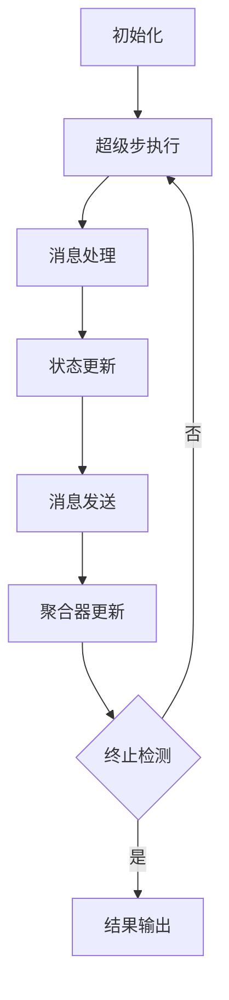

# Pregel原理与代码实例讲解

## 1.背景介绍

在大数据时代，图计算成为了处理复杂关系和结构化数据的重要工具。图计算广泛应用于社交网络分析、推荐系统、网络安全等领域。然而，随着数据规模的不断增长，传统的图计算方法在处理大规模图数据时面临着性能和可扩展性的问题。为了解决这些问题，Google提出了Pregel，一个专门用于大规模图计算的分布式框架。

Pregel的设计灵感来源于BSP（Bulk Synchronous Parallel）模型，通过将图计算任务分解为多个超级步（Superstep），并在每个超级步中并行处理图的顶点，从而实现高效的图计算。本文将深入探讨Pregel的核心概念、算法原理、数学模型，并通过代码实例展示其实际应用。

## 2.核心概念与联系

### 2.1 顶点和边

在Pregel中，图由顶点（Vertex）和边（Edge）组成。每个顶点具有唯一的标识符、属性和一组出边。边则连接两个顶点，并且可以携带权重或其他属性。

### 2.2 消息传递

Pregel的核心思想是通过消息传递来实现顶点之间的通信。在每个超级步中，顶点可以向其邻居发送消息，并在下一个超级步中接收来自其他顶点的消息。

### 2.3 超级步

超级步是Pregel的基本计算单元。在每个超级步中，所有顶点并行执行用户定义的计算逻辑，包括处理接收到的消息、更新自身状态、发送消息给邻居等操作。

### 2.4 聚合器

聚合器用于在超级步之间汇总全局信息，例如计算全局最小值、最大值或求和。聚合器的结果可以在下一个超级步中被所有顶点访问。

### 2.5 终止条件

Pregel的计算过程由多个超级步组成，直到满足终止条件为止。终止条件可以是所有顶点都处于不活跃状态，或者达到预定的超级步数。

## 3.核心算法原理具体操作步骤

### 3.1 初始化

在初始化阶段，Pregel将图数据分布到多个计算节点上，并为每个顶点分配初始状态和出边信息。

### 3.2 超级步执行

每个超级步包括以下操作：

1. **消息处理**：顶点接收并处理来自上一个超级步的消息。
2. **状态更新**：根据消息内容和自身状态，顶点更新其状态。
3. **消息发送**：顶点向其邻居发送消息。
4. **聚合器更新**：顶点更新聚合器的值。

### 3.3 终止检测

在每个超级步结束时，Pregel检查所有顶点的状态。如果所有顶点都处于不活跃状态，或者达到预定的超级步数，则计算终止。

### 3.4 结果输出

计算结束后，Pregel将顶点的最终状态输出，作为图计算的结果。

以下是Pregel算法的Mermaid流程图：



## 4.数学模型和公式详细讲解举例说明

### 4.1 图的表示

在Pregel中，图 $G$ 表示为 $G = (V, E)$，其中 $V$ 是顶点集合，$E$ 是边集合。每个顶点 $v \in V$ 具有属性 $a_v$，每条边 $e \in E$ 连接两个顶点，并具有属性 $a_e$。

### 4.2 消息传递模型

在超级步 $s$ 中，顶点 $v$ 接收来自其邻居的消息集合 $M_v^{(s)}$。顶点 $v$ 的状态更新函数 $f$ 定义为：

$$
a_v^{(s+1)} = f(a_v^{(s)}, M_v^{(s)})
$$

其中，$a_v^{(s)}$ 是顶点 $v$ 在超级步 $s$ 的状态，$M_v^{(s)}$ 是顶点 $v$ 在超级步 $s$ 接收到的消息集合。

### 4.3 聚合器模型

聚合器用于汇总全局信息，其更新函数 $g$ 定义为：

$$
A^{(s+1)} = g(A^{(s)}, a_v^{(s)})
$$

其中，$A^{(s)}$ 是超级步 $s$ 的聚合器值，$a_v^{(s)}$ 是顶点 $v$ 在超级步 $s$ 的状态。

### 4.4 示例：单源最短路径

单源最短路径问题是Pregel的经典应用之一。假设图 $G$ 中的边具有非负权重，目标是找到源顶点 $s$ 到其他所有顶点的最短路径。

1. **初始化**：将源顶点 $s$ 的距离设为0，其他顶点的距离设为无穷大。
2. **消息处理**：顶点 $v$ 接收来自邻居的距离消息，更新自身的最短距离。
3. **状态更新**：如果顶点 $v$ 的最短距离发生变化，则向其邻居发送新的距离消息。
4. **终止条件**：所有顶点的最短距离不再变化。

数学公式如下：

$$
d_v^{(s+1)} = \min(d_v^{(s)}, \min_{u \in N(v)} (d_u^{(s)} + w_{uv}))
$$

其中，$d_v^{(s)}$ 是顶点 $v$ 在超级步 $s$ 的最短距离，$N(v)$ 是顶点 $v$ 的邻居集合，$w_{uv}$ 是边 $uv$ 的权重。

## 5.项目实践：代码实例和详细解释说明

### 5.1 环境准备

首先，确保你已经安装了一个支持Pregel的图计算框架，例如Apache Giraph或Google Pregel。

### 5.2 代码实例

以下是使用Apache Giraph实现单源最短路径的代码示例：

```java
import org.apache.giraph.graph.BasicComputation;
import org.apache.giraph.graph.Vertex;
import org.apache.giraph.edge.Edge;
import org.apache.hadoop.io.DoubleWritable;
import org.apache.hadoop.io.LongWritable;
import org.apache.hadoop.io.NullWritable;

public class ShortestPathComputation extends BasicComputation<
    LongWritable, DoubleWritable, NullWritable, DoubleWritable> {

  @Override
  public void compute(Vertex<LongWritable, DoubleWritable, NullWritable> vertex,
                      Iterable<DoubleWritable> messages) {
    if (getSuperstep() == 0) {
      vertex.setValue(new DoubleWritable(Double.MAX_VALUE));
    }

    double minDist = vertex.getValue().get();
    for (DoubleWritable message : messages) {
      minDist = Math.min(minDist, message.get());
    }

    if (minDist < vertex.getValue().get()) {
      vertex.setValue(new DoubleWritable(minDist));
      for (Edge<LongWritable, NullWritable> edge : vertex.getEdges()) {
        double distance = minDist + 1; // Assuming edge weight is 1
        sendMessage(edge.getTargetVertexId(), new DoubleWritable(distance));
      }
    }

    vertex.voteToHalt();
  }
}
```

### 5.3 详细解释

1. **初始化**：在超级步0中，将所有顶点的初始距离设为无穷大。
2. **消息处理**：在每个超级步中，顶点接收来自邻居的距离消息，并更新自身的最短距离。
3. **状态更新**：如果顶点的最短距离发生变化，则向其邻居发送新的距离消息。
4. **终止条件**：顶点调用 `voteToHalt` 方法表示其计算完成。

## 6.实际应用场景

### 6.1 社交网络分析

Pregel可以用于分析社交网络中的关系，例如计算用户之间的最短路径、发现社区结构、推荐好友等。

### 6.2 推荐系统

在推荐系统中，Pregel可以用于构建用户-物品图，通过图计算算法实现个性化推荐。

### 6.3 网络安全

Pregel可以用于检测网络中的异常行为，例如发现网络攻击路径、识别恶意节点等。

### 6.4 生物信息学

在生物信息学中，Pregel可以用于分析基因网络、蛋白质相互作用网络等复杂生物网络。

## 7.工具和资源推荐

### 7.1 图计算框架

- **Apache Giraph**：一个基于Pregel模型的开源图计算框架，适用于大规模图计算。
- **Google Pregel**：Google内部使用的图计算框架，具有高性能和可扩展性。

### 7.2 开发工具

- **IntelliJ IDEA**：一款功能强大的Java开发工具，适用于开发Pregel应用。
- **Eclipse**：另一款流行的Java开发工具，支持丰富的插件和扩展。

### 7.3 学习资源

- **《Graph Algorithms in the Language of Pregel》**：一本详细介绍Pregel算法和实现的书籍。
- **Google Scholar**：查找与Pregel相关的学术论文和研究成果。

## 8.总结：未来发展趋势与挑战

### 8.1 发展趋势

随着大数据和人工智能技术的不断发展，图计算在各个领域的应用将越来越广泛。未来，Pregel及其衍生框架将继续优化性能和可扩展性，以满足大规模图数据处理的需求。

### 8.2 挑战

- **数据规模**：随着数据规模的不断增长，如何高效地处理海量图数据是一个重要挑战。
- **算法优化**：在不同应用场景中，如何设计高效的图计算算法是一个关键问题。
- **硬件支持**：图计算对硬件资源的需求较高，如何充分利用硬件资源以提高计算性能是一个重要研究方向。

## 9.附录：常见问题与解答

### 9.1 Pregel与MapReduce的区别是什么？

Pregel和MapReduce都是分布式计算框架，但它们的设计目标和应用场景不同。Pregel专注于图计算，通过消息传递实现顶点之间的通信，而MapReduce则适用于更广泛的数据处理任务，通过Map和Reduce操作实现数据的分布式处理。

### 9.2 Pregel如何处理图的动态变化？

Pregel主要用于静态图计算，对于动态变化的图数据，可以通过增量计算的方法，只对变化部分进行重新计算，从而提高计算效率。

### 9.3 Pregel的性能如何优化？

Pregel的性能优化可以从以下几个方面入手：
- **算法优化**：设计高效的图计算算法，减少消息传递和计算量。
- **硬件优化**：利用高性能计算资源，如GPU、FPGA等，加速图计算。
- **数据分区**：合理划分图数据，减少跨节点通信，提高计算效率。

### 9.4 Pregel是否支持多种编程语言？

目前，Pregel主要支持Java编程语言，但也有一些衍生框架支持其他编程语言，如Apache Giraph支持Java，GraphX支持Scala和Python。

### 9.5 Pregel的应用场景有哪些？

Pregel广泛应用于社交网络分析、推荐系统、网络安全、生物信息学等领域，适用于处理大规模图数据和复杂关系。

---

作者：禅与计算机程序设计艺术 / Zen and the Art of Computer Programming