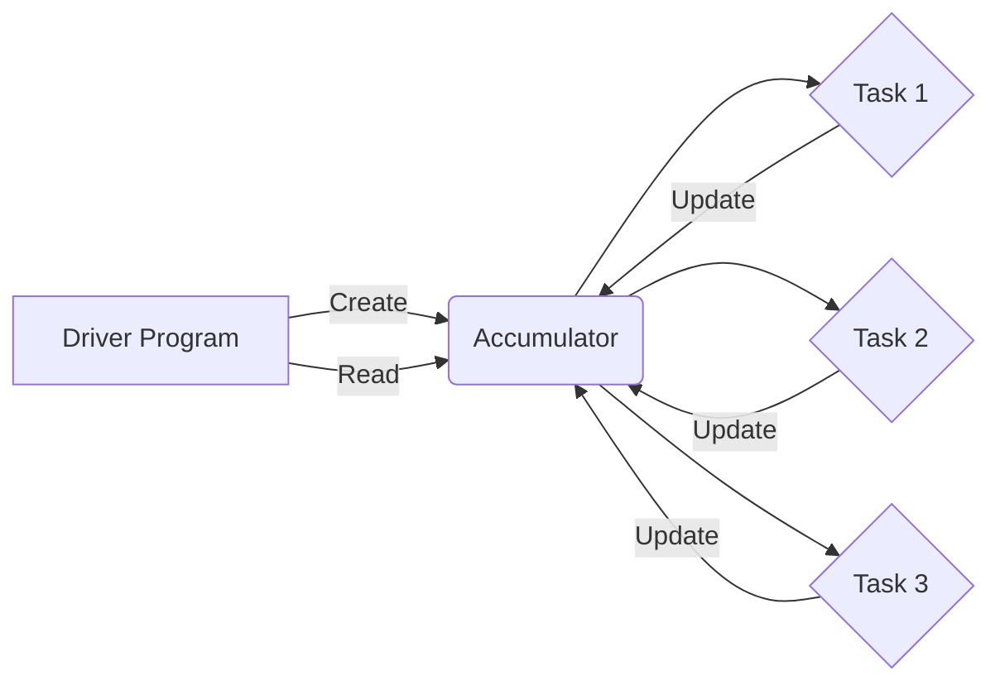

# Spark Accumulator原理与代码实例讲解

## 1. 背景介绍
### 1.1 Spark简介
### 1.2 共享变量的必要性
### 1.3 Accumulator在Spark中的作用

## 2. 核心概念与联系
### 2.1 Accumulator的定义
### 2.2 Accumulator与广播变量的区别
### 2.3 Accumulator与RDD的关系
### 2.4 Accumulator的工作原理

## 3. 核心算法原理具体操作步骤
### 3.1 创建Accumulator
#### 3.1.1 使用SparkContext创建
#### 3.1.2 使用自定义类型创建
### 3.2 使用Accumulator
#### 3.2.1 在转化操作中使用
#### 3.2.2 在行动操作中使用
### 3.3 读取Accumulator的值
### 3.4 Accumulator的内部实现原理

## 4. 数学模型和公式详细讲解举例说明
### 4.1 Accumulator的数学模型
### 4.2 Accumulator的更新公式
### 4.3 Accumulator的合并公式
### 4.4 Accumulator在WordCount中的应用

## 5. 项目实践：代码实例和详细解释说明
### 5.1 使用Accumulator进行WordCount
#### 5.1.1 创建Accumulator
#### 5.1.2 在map操作中使用Accumulator
#### 5.1.3 在reduce操作中使用Accumulator
#### 5.1.4 读取Accumulator的结果
### 5.2 自定义Accumulator类型
#### 5.2.1 定义自定义Accumulator类
#### 5.2.2 注册自定义Accumulator
#### 5.2.3 使用自定义Accumulator
### 5.3 在Spark SQL中使用Accumulator
#### 5.3.1 创建Accumulator
#### 5.3.2 在UDF中使用Accumulator
#### 5.3.3 读取Accumulator的结果

## 6. 实际应用场景
### 6.1 计数统计
### 6.2 求和计算
### 6.3 自定义聚合操作
### 6.4 调试和监控

## 7. 工具和资源推荐
### 7.1 Spark官方文档
### 7.2 Spark源码分析工具
### 7.3 Spark性能调优工具
### 7.4 Spark社区和论坛

## 8. 总结：未来发展趋势与挑战
### 8.1 Accumulator的局限性
### 8.2 Accumulator的优化方向
### 8.3 Accumulator在Spark生态系统中的发展

## 9. 附录：常见问题与解答
### 9.1 Accumulator能否用于shuffle操作？
### 9.2 Accumulator是否会影响RDD的容错性？
### 9.3 如何避免Accumulator的不当使用？
### 9.4 Accumulator的性能开销如何？

---

Apache Spark是一个快速、通用的大规模数据处理引擎，在大数据处理领域得到了广泛的应用。Spark提供了多种编程语言的API，包括Scala、Java、Python和R，使得开发者能够方便地使用Spark进行数据处理和分析。

在Spark中，共享变量是一种在多个任务之间共享数据的机制。Spark提供了两种类型的共享变量：广播变量（Broadcast Variable）和累加器（Accumulator）。广播变量用于在所有节点之间高效地分发大对象，而累加器则用于在并行计算过程中对数据进行聚合操作。

Accumulator是Spark中一种特殊的共享变量，它允许多个任务对一个共享变量进行"添加"操作，但只有驱动程序能够读取累加器的值。Accumulator主要用于在并行计算过程中对全局变量进行累加操作，例如计数、求和等。

下面是一个Accumulator的工作原理图：



在上图中，驱动程序创建了一个Accumulator，并将其传递给多个任务。每个任务都可以对Accumulator进行更新操作，但只有驱动程序能够读取Accumulator的最终值。

Accumulator的创建可以通过SparkContext来完成，例如：

```scala
val accum = sc.longAccumulator("MyAccumulator")
```

上述代码创建了一个名为"MyAccumulator"的Long类型累加器。除了使用内置的数据类型外，Spark还允许用户自定义Accumulator类型。

在转化操作（如map、flatMap等）中，可以使用Accumulator来累加计数或求和。例如：

```scala
val rdd = sc.parallelize(Array(1, 2, 3, 4))
rdd.foreach(x => accum.add(x))
```

上述代码对RDD中的每个元素进行累加操作。注意，在转化操作中对Accumulator的更新是在每个任务内部进行的，因此多个任务对Accumulator的更新是独立的。

在行动操作（如reduce、collect等）中，Accumulator的值会被发送回驱动程序，并进行合并。例如：

```scala
val sum = sc.longAccumulator("sum")
rdd.map(x => { sum.add(x); x }).reduce(_ + _)
println(sum.value)
```

上述代码在map操作中对Accumulator进行更新，并在reduce操作中触发Accumulator的合并。最后，通过`sum.value`获取Accumulator的最终值。

Accumulator的内部实现原理如下：每个任务在本地维护一个Accumulator的副本，并对其进行更新。当任务完成后，本地的Accumulator副本会被发送回驱动程序，并与其他任务的Accumulator副本进行合并。合并的结果保存在驱动程序中的Accumulator中，可以通过`value`属性来访问。

下面是一个使用Accumulator进行WordCount的示例：

```scala
val sc = new SparkContext(...)
val rdd = sc.textFile("input.txt")

// 创建Accumulator
val accumulator = sc.longAccumulator("WordCount")

val counts = rdd.flatMap(line => line.split(" "))
                .map(word => {
                  accumulator.add(1); // 在map操作中累加计数
                  (word, 1)
                })
                .reduceByKey(_ + _)

val totalCount = accumulator.value // 获取累加器的值
println("Total count: " + totalCount)
```

在上述代码中，我们创建了一个名为"WordCount"的Accumulator，用于统计单词的总数。在map操作中，每遇到一个单词就将Accumulator的值加1。最后，通过`accumulator.value`获取单词的总数。

除了使用内置的Accumulator类型外，Spark还允许用户自定义Accumulator类型。下面是一个自定义Accumulator的示例：

```scala
// 定义自定义Accumulator类
class MyAccumulator extends AccumulatorV2[Int, Int] {
  private var sum = 0
  
  override def isZero: Boolean = sum == 0
  override def copy(): AccumulatorV2[Int, Int] = {
    val newAcc = new MyAccumulator()
    newAcc.sum = this.sum
    newAcc
  }
  override def reset(): Unit = sum = 0
  override def add(v: Int): Unit = sum += v
  override def merge(other: AccumulatorV2[Int, Int]): Unit = {
    other match {
      case o: MyAccumulator => sum += o.sum
      case _ => throw new UnsupportedOperationException(
        s"Cannot merge ${this.getClass.getName} with ${other.getClass.getName}")
    }
  }
  override def value: Int = sum
}

// 注册自定义Accumulator
val myAccum = new MyAccumulator()
sc.register(myAccum, "MyAccumulator")

// 使用自定义Accumulator
rdd.foreach(x => myAccum.add(x))
println(myAccum.value)
```

在上述代码中，我们定义了一个`MyAccumulator`类，继承自`AccumulatorV2`，并实现了必要的方法。然后，通过`sc.register`方法将自定义Accumulator注册到SparkContext中，并指定了一个名称。最后，在RDD的操作中使用自定义Accumulator进行累加操作。

Accumulator在Spark SQL中也有广泛的应用。下面是一个在Spark SQL中使用Accumulator的示例：

```scala
val spark = SparkSession.builder()
  .appName("AccumulatorExample")
  .getOrCreate()

// 创建Accumulator
val accum = spark.sparkContext.longAccumulator("MyAccumulator")

// 注册UDF并在其中使用Accumulator
spark.udf.register("myUDF", (value: Int) => {
  accum.add(value)
  value * 2
})

// 使用UDF和Accumulator
val df = spark.range(1, 10)
df.selectExpr("myUDF(id) as result").collect()

// 读取Accumulator的值
println(accum.value)
```

在上述代码中，我们创建了一个Accumulator，并在自定义的UDF中对其进行累加操作。通过在DataFrame的操作中使用该UDF，可以在Spark SQL的执行过程中对Accumulator进行更新。最后，通过`accum.value`获取Accumulator的最终值。

Accumulator在实际应用中有多种用途，例如：

1. 计数统计：使用Accumulator对数据集中的元素进行计数，例如统计单词出现的次数、用户访问的次数等。

2. 求和计算：使用Accumulator对数值型数据进行求和，例如计算销售额、平均值等。

3. 自定义聚合操作：通过自定义Accumulator类型，可以实现复杂的聚合操作，例如计算平均值、标准差等。

4. 调试和监控：使用Accumulator可以在Spark作业执行过程中收集一些调试信息，例如记录异常次数、监控任务执行进度等。

需要注意的是，Accumulator也有一些局限性：

1. Accumulator只支持"添加"操作，不支持"读取"操作。只有驱动程序可以读取Accumulator的值，而任务只能对其进行更新。

2. Accumulator不会参与RDD的容错机制。如果某个任务失败，Accumulator的更新可能会丢失。

3. 频繁使用Accumulator可能会导致性能开销，因为每次更新都需要将Accumulator的值发送回驱动程序。

为了优化Accumulator的性能，可以考虑以下几点：

1. 尽量减少Accumulator的使用频率，可以将多个Accumulator合并为一个。

2. 对于大数据量的场景，可以使用`treeAggregate`等高效的聚合算子来替代Accumulator。

3. 对于自定义Accumulator类型，可以优化`merge`方法的实现，减少不必要的对象创建和内存拷贝。

总之，Accumulator是Spark中一种非常有用的共享变量，它允许在并行计算过程中对全局变量进行累加操作。通过恰当地使用Accumulator，可以方便地实现计数、求和等常见的聚合操作。同时，也需要注意Accumulator的局限性和性能开销，并根据实际需求进行优化和改进。

随着Spark的不断发展，Accumulator也在不断完善和优化。未来，Spark可能会引入更多类型的Accumulator，支持更加复杂和高效的聚合操作。同时，Spark社区也在积极探索Accumulator的优化方案，例如引入高效的合并算法、减少网络传输等。

总的来说，Accumulator作为Spark生态系统中的重要组成部分，将继续在大数据处理领域发挥重要作用，帮助开发者更加高效、便捷地进行数据聚合和分析。

作者：禅与计算机程序设计艺术 / Zen and the Art of Computer Programming