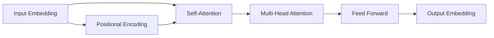

# Transformer架构(Transformer Architecture)原理与代码实战案例讲解

## 1. 背景介绍

### 1.1 Transformer的起源与发展

Transformer是一种基于注意力机制(Attention Mechanism)的深度学习模型,最早由Google在2017年的论文《Attention Is All You Need》中提出。与传统的循环神经网络(RNN)和卷积神经网络(CNN)不同,Transformer完全依赖于注意力机制来学习输入和输出之间的关系,避免了RNN中的循环结构,从而能够更高效地处理长序列数据。

### 1.2 Transformer在自然语言处理领域的应用

Transformer最初是为机器翻译任务设计的,但很快就在各种自然语言处理(NLP)任务中取得了显著的成果,如文本分类、命名实体识别、问答系统等。特别是在预训练语言模型方面,如BERT、GPT等都是基于Transformer架构,极大地推动了NLP技术的发展。

### 1.3 Transformer在其他领域的拓展应用

除了NLP领域,Transformer也被广泛应用于计算机视觉、语音识别、推荐系统等领域。如Vision Transformer(ViT)将图像分割成块,然后应用Transformer处理;Speech-Transformer用于端到端语音识别;BERT4Rec将BERT应用于序列推荐任务。这些都表明了Transformer强大的特征提取和建模能力。

## 2. 核心概念与联系

### 2.1 注意力机制(Attention Mechanism) 

注意力机制是Transformer的核心,它允许模型对输入序列中的每个位置分配不同的权重,从而能够选择性地关注重要的信息。具体来说,注意力函数将查询(Query)、键(Key)、值(Value)作为输入,通过计算Query和Key的相似度得到权重,然后用权重对Value进行加权求和,得到注意力输出。

### 2.2 自注意力(Self-Attention)

自注意力是Transformer中的一种特殊注意力,Query、Key、Value都来自同一个输入序列。这使得模型能够学习输入序列内部的依赖关系,捕捉长距离的语义信息。具体实现时,使用三个线性变换将输入序列映射为Q、K、V矩阵,然后计算注意力输出。

### 2.3 多头注意力(Multi-Head Attention)

为了让模型能够关注输入的不同方面,Transformer使用多头注意力,即将Q、K、V通过不同的线性变换得到多组表示,分别计算注意力,最后将结果拼接起来。这增强了模型的表达能力,能够捕捉更丰富的语义信息。

### 2.4 位置编码(Positional Encoding)

由于Transformer不包含循环结构,为了引入序列的位置信息,它在输入嵌入中加入了位置编码。位置编码可以是固定的正弦曲线函数,也可以设置为可学习的参数。这使得模型能够区分不同位置的词,学习到词序信息。

下面是Transformer核心概念的示意图:



## 3. 核心算法原理具体操作步骤

### 3.1 输入表示

1. 将输入序列中的每个词(或字符)映射为一个固定维度的嵌入向量。
2. 将位置编码与嵌入向量相加,得到最终的输入表示。

### 3.2 Encoder

1. 将输入表示传入自注意力层,计算自注意力输出:
   - 将输入表示通过三个线性变换得到Q、K、V矩阵
   - 计算QK^T得到注意力权重矩阵
   - 将注意力权重矩阵与V相乘得到自注意力输出
2. 将自注意力输出传入前馈神经网络(Feed Forward),得到Encoder的输出。
3. 使用残差连接(Residual Connection)和层归一化(Layer Normalization)来加快训练并提高模型稳定性。

### 3.3 Decoder

1. 将目标序列的嵌入与位置编码相加得到Decoder的输入表示。
2. 将输入表示传入Masked自注意力层,计算自注意力输出:
   - Masked自注意力与普通自注意力类似,但在计算注意力权重矩阵时,将后续位置的权重设为负无穷,保证当前位置只能关注前面的词。
3. 将Encoder的输出和Masked自注意力的输出传入注意力层,计算Decoder的注意力输出:
   - 将Masked自注意力输出作为Q,Encoder输出作为K和V,计算注意力。
4. 将注意力输出传入前馈神经网络,得到Decoder的输出表示。
5. 使用残差连接和层归一化来加快训练并提高模型稳定性。
6. 重复以上步骤直到生成完整的目标序列。

### 3.4 输出层

1. 将Decoder的输出表示传入线性层和Softmax层,得到每个位置的词的概率分布。
2. 选择概率最大的词作为预测结果。

## 4. 数学模型和公式详细讲解举例说明

### 4.1 注意力函数

注意力函数可以表示为:

$$
Attention(Q,K,V) = softmax(\frac{QK^T}{\sqrt{d_k}})V
$$

其中,$Q$是查询矩阵,$K$是键矩阵,$V$是值矩阵,$d_k$是$K$的维度。$QK^T$计算查询和键的相似度,除以$\sqrt{d_k}$是为了缓解点积结果过大的问题。Softmax函数将相似度转化为注意力权重,最后与$V$相乘得到注意力输出。

举例说明:假设有一个句子"The animal didn't cross the street because it was too tired",我们要计算"it"的注意力表示。首先将句子中的每个词映射为嵌入向量,然后通过线性变换得到Q、K、V矩阵。以"it"为Query,计算它与每个词(Key)的相似度,得到注意力权重。可以看出"it"与"animal"的相似度最高,因此"it"的注意力表示主要来自于"animal"对应的值(Value)。这说明Transformer能够很好地解决代词消歧问题。

### 4.2 多头注意力

多头注意力可以表示为:

$$
MultiHead(Q,K,V) = Concat(head_1,...,head_h)W^O \\
head_i = Attention(QW_i^Q,KW_i^K,VW_i^V)
$$

其中,$W_i^Q$,$W_i^K$,$W_i^V$是第$i$个头的线性变换矩阵,$W^O$是输出线性变换矩阵。多头注意力相当于同时计算多个不同的注意力函数,然后将结果拼接起来。

举例说明:对于同一个句子"The animal didn't cross the street because it was too tired",使用多头注意力可以关注句子的不同方面。比如第一个头可能更关注代词"it"和名词"animal"的关系,第二个头可能更关注状语"because"和形容词"tired"的关系,第三个头可能更关注动词"cross"和名词"street"的关系。最终将不同头的结果拼接起来,就得到了一个综合的注意力表示。

### 4.3 前馈神经网络

前馈神经网络可以表示为:

$$
FFN(x) = max(0,xW_1+b_1)W_2+b_2
$$

其中,$W_1$,$b_1$,$W_2$,$b_2$是可学习的参数。前馈神经网络相当于两个线性变换中间加了一个ReLU激活函数,用于增加模型的非线性表达能力。

举例说明:假设Encoder的自注意力输出是一个向量$[0.1,-0.2,0.3,...]$,通过前馈神经网络可以将其转化为另一个向量$[0.5,0.1,-0.3,...]$。这相当于对自注意力输出进行了非线性变换,提取了更高层次的特征表示。

## 5. 项目实践:代码实例和详细解释说明

下面是一个使用PyTorch实现Transformer的示例代码,以英语到法语的机器翻译任务为例:

```python
import torch
import torch.nn as nn

class PositionalEncoding(nn.Module):
    def __init__(self, d_model, max_len=5000):
        super(PositionalEncoding, self).__init__()
        pe = torch.zeros(max_len, d_model)
        position = torch.arange(0, max_len, dtype=torch.float).unsqueeze(1)
        div_term = torch.exp(torch.arange(0, d_model, 2).float() * (-math.log(10000.0) / d_model))
        pe[:, 0::2] = torch.sin(position * div_term)
        pe[:, 1::2] = torch.cos(position * div_term)
        pe = pe.unsqueeze(0).transpose(0, 1)
        self.register_buffer('pe', pe)
        
    def forward(self, x):
        x = x + self.pe[:x.size(0), :]
        return x

class TransformerModel(nn.Module):
    def __init__(self, src_vocab_size, tgt_vocab_size, d_model, nhead, num_layers):
        super(TransformerModel, self).__init__()
        self.encoder = nn.Embedding(src_vocab_size, d_model)
        self.pos_encoder = PositionalEncoding(d_model)
        self.transformer = nn.Transformer(d_model=d_model, nhead=nhead, num_encoder_layers=num_layers, 
                                          num_decoder_layers=num_layers, dim_feedforward=d_model*4)
        self.decoder = nn.Linear(d_model, tgt_vocab_size)
        
    def forward(self, src, tgt, src_mask, tgt_mask):
        src = self.encoder(src) * math.sqrt(d_model)
        src = self.pos_encoder(src)
        tgt = self.encoder(tgt) * math.sqrt(d_model)
        tgt = self.pos_encoder(tgt)
        output = self.transformer(src, tgt, src_mask, tgt_mask)
        output = self.decoder(output)
        return output

# 超参数设置
src_vocab_size = 10000
tgt_vocab_size = 10000
d_model = 512
nhead = 8
num_layers = 6

# 实例化模型
model = TransformerModel(src_vocab_size, tgt_vocab_size, d_model, nhead, num_layers)

# 定义损失函数和优化器
criterion = nn.CrossEntropyLoss()
optimizer = torch.optim.Adam(model.parameters(), lr=0.0001, betas=(0.9, 0.98), eps=1e-9)

# 训练循环
for epoch in range(num_epochs):
    for i, batch in enumerate(train_iter):
        src, tgt = batch.src, batch.trg
        src_mask, tgt_mask = model.generate_mask(src, tgt)
        outputs = model(src, tgt, src_mask, tgt_mask)
        loss = criterion(outputs.view(-1, tgt_vocab_size), tgt.view(-1))
        optimizer.zero_grad()
        loss.backward()
        optimizer.step()
```

代码解释:

1. PositionalEncoding类实现了位置编码,根据论文中的公式生成一个固定的位置编码矩阵,与词嵌入相加。
2. TransformerModel类定义了Transformer模型,包括词嵌入层、位置编码层、Transformer层和输出层。forward方法定义了前向传播过程。
3. 超参数设置部分定义了词表大小、嵌入维度、注意力头数和编码器/解码器层数等超参数。
4. 实例化模型,定义损失函数(交叉熵)和优化器(Adam)。
5. 训练循环部分遍历每个epoch和batch,生成源/目标序列的掩码矩阵,前向传播计算输出和损失,反向传播更新参数。

以上就是Transformer的PyTorch实现示例。需要注意的是,这只是一个简化版本,实际应用中还需要考虑更多细节,如Beam Search、正则化、学习率调度等。

## 6. 实际应用场景

Transformer已经成为自然语言处理领域的主流模型,在各种任务中都取得了很好的效果。下面列举几个典型的应用场景:

1. 机器翻译:Transformer最初就是为机器翻译任务设计的,它能够很好地建模源语言和目标语言之间的对应关系,生成流畅、准确的翻译结果。谷歌、微软等公司的翻译系统都是基于Transformer架构。

2. 文本摘要:Transformer可以用于从长文本中提取关键信息,生成简洁、连贯的摘要。比如论文摘要、新闻摘要等。

3. 问答系统:Transformer可以用于构建端到端的问答系统,直接从文本中找到问题的答