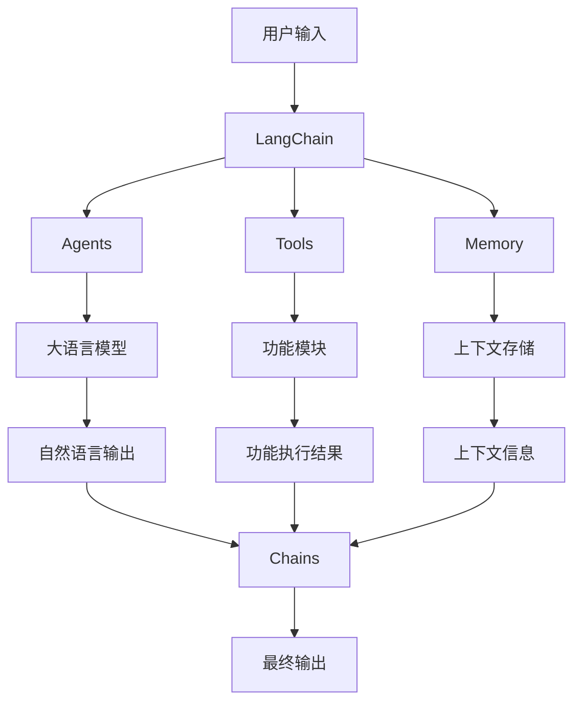
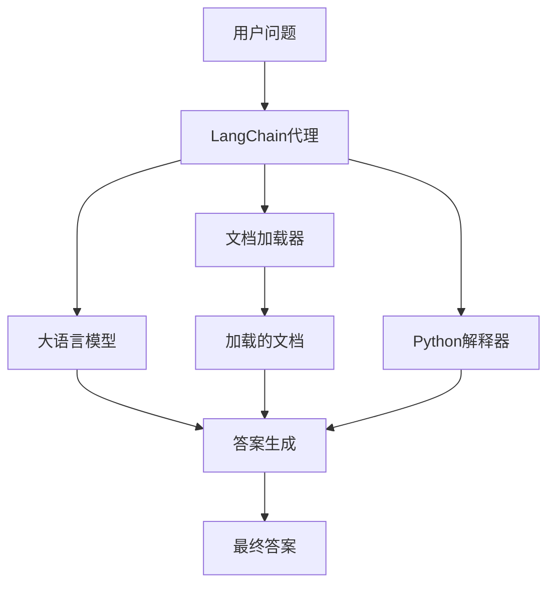

# 【LangChain编程：从入门到实践】大模型技术浪潮

## 1. 背景介绍

### 1.1 大模型时代的到来

近年来,大型语言模型(Large Language Models,LLMs)在自然语言处理领域掀起了一场革命。这些模型通过在海量文本数据上进行预训练,展现出令人惊叹的语言理解和生成能力。从GPT-3到ChatGPT,再到谷歌的PaLM和OpenAI的GPT-4,大模型的性能不断突破,在各种自然语言任务中表现出色。

### 1.2 LangChain:大模型编程的利器

在这股大模型浪潮中,LangChain应运而生。作为一个强大的Python库,LangChain旨在简化大模型的应用开发过程,提供了一套统一的接口和工具链,使开发者能够更高效地利用大模型的强大能力。无论是问答系统、文本总结、代码生成还是任务自动化,LangChain都为您提供了完整的解决方案。

## 2. 核心概念与联系

### 2.1 LangChain的核心概念

LangChain的核心概念包括:

- **Agents(智能体)**: 代表具有某种能力的实体,如大语言模型或其他AI服务。
- **Tools(工具)**: 封装了各种功能的Python函数,如Web搜索、数据库查询等。
- **Memory(记忆)**: 用于存储智能体与用户的交互历史和上下文信息。
- **Chains(链)**: 将Agents、Tools和Memory组合在一起,构建复杂的工作流程。

### 2.2 LangChain的工作流程

LangChain的工作流程如下所示:



用户输入被传递给LangChain,LangChain根据输入调用相应的Agents(如大语言模型)、Tools(如Web搜索)和Memory(如上下文信息存储)。这些组件的输出被组合在一起,通过Chains进行协调和处理,最终生成最终输出。

## 3. 核心算法原理具体操作步骤

### 3.1 LangChain的核心算法

LangChain的核心算法是**构成性搜索(Constitutive Search)**,它是一种将大语言模型与外部工具和数据源相结合的方法。构成性搜索的基本思想是:

1. 将问题分解为多个子任务
2. 利用大语言模型生成每个子任务的解决方案
3. 执行这些解决方案,获取相关信息和结果
4. 将子任务的结果组合,形成最终的问题解决方案

### 3.2 构成性搜索的具体步骤

1. **问题分解**: 将原始问题分解为一系列子任务,每个子任务都可以由大语言模型或外部工具处理。
2. **子任务生成**: 对于每个子任务,大语言模型会生成一个或多个可能的解决方案。
3. **解决方案评估**: 评估每个解决方案的质量和相关性,选择最佳的解决方案。
4. **解决方案执行**: 执行选定的解决方案,获取相关信息和结果。
5. **结果组合**: 将所有子任务的结果组合在一起,形成原始问题的最终解决方案。
6. **反馈与迭代**: 根据最终解决方案的质量,决定是否需要进行反馈和迭代,以改进后续的问题解决过程。

## 4. 数学模型和公式详细讲解举例说明

在构成性搜索过程中,LangChain使用了一些数学模型和公式来评估和优化解决方案。下面我们将详细介绍其中的一些关键模型和公式。

### 4.1 语义相似度计算

语义相似度是衡量两个文本之间语义关联程度的指标。在构成性搜索中,语义相似度被用于评估子任务解决方案与原始问题的相关性。LangChain使用了基于余弦相似度的语义相似度计算方法。

给定两个文本向量$\vec{a}$和$\vec{b}$,它们的余弦相似度定义为:

$$\text{sim}(\vec{a}, \vec{b}) = \frac{\vec{a} \cdot \vec{b}}{||\vec{a}|| \cdot ||\vec{b}||}$$

其中$\vec{a} \cdot \vec{b}$表示两个向量的点积,而$||\vec{a}||$和$||\vec{b}||$分别表示向量$\vec{a}$和$\vec{b}$的L2范数。

余弦相似度的取值范围为$[-1, 1]$,值越接近1,表示两个文本的语义越相似。在LangChain中,我们可以设置一个阈值,只保留相似度超过该阈值的解决方案。

### 4.2 序列到序列模型

LangChain中的许多任务都可以被视为序列到序列(Sequence-to-Sequence)的问题,例如问答、文本摘要和代码生成等。在这些任务中,LangChain使用了基于Transformer的序列到序列模型,如GPT、BART和T5等。

序列到序列模型的核心思想是将输入序列$X$映射到输出序列$Y$,即$Y = f(X)$。这个映射函数$f$由一个编码器(Encoder)和一个解码器(Decoder)组成。

编码器将输入序列$X$编码为一系列向量表示$\vec{h}_1, \vec{h}_2, \ldots, \vec{h}_n$,解码器则根据这些向量表示生成输出序列$Y$。编码器和解码器都是基于自注意力机制(Self-Attention)的Transformer模型。

在训练过程中,序列到序列模型会最小化输入序列$X$和目标序列$Y$之间的损失函数,例如交叉熵损失:

$$\mathcal{L}(X, Y) = -\sum_{t=1}^{|Y|} \log P(y_t | y_{<t}, X)$$

其中$P(y_t | y_{<t}, X)$表示在给定输入$X$和之前的输出$y_{<t}$的情况下,模型预测正确输出$y_t$的概率。

通过在大量数据上进行预训练,序列到序列模型可以学习到丰富的语言知识,从而在各种自然语言任务中表现出色。

## 5. 项目实践:代码实例和详细解释说明

接下来,我们将通过一个实际的项目示例,展示如何使用LangChain构建一个问答系统。

### 5.1 问题描述

我们的目标是构建一个基于LangChain的问答系统,能够回答有关Python编程的各种问题。该系统应该具备以下功能:

- 从本地文件或网络资源中加载相关的Python文档和教程
- 根据用户的自然语言问题,从加载的文档中检索相关信息
- 利用大语言模型生成问题的答案
- 根据需要,系统可以自动执行Python代码并将结果纳入答案

### 5.2 系统架构

我们的问答系统采用了LangChain的代理模式(Agent Pattern),其架构如下所示:



在这个架构中,LangChain代理作为系统的核心,它协调大语言模型、文档加载器和Python解释器等组件的工作。用户的问题被传递给代理,代理根据需要调用不同的组件,最终生成答案。

### 5.3 代码实现

下面是该问答系统的核心代码实现:

```python
from langchain.agents import initialize_agent, Tool
from langchain.llms import OpenAI
from langchain.utilities import PythonREPL
from langchain.document_loaders import UnstructuredFileLoader, WebBaseLoader

# 加载本地文档
loader = UnstructuredFileLoader("path/to/python_docs.txt")
docs = loader.load()

# 加载网络资源
web_loader = WebBaseLoader("https://docs.python.org/3/tutorial/")
web_docs = web_loader.load()

# 创建Python REPL工具
python_repl = PythonREPL()
tools = [
    Tool(
        name="Python REPL",
        func=python_repl.run,
        description="A Python REPL to execute code. Input should be a valid Python script"
    )
]

# 初始化LangChain代理
llm = OpenAI(temperature=0)
agent = initialize_agent(tools, llm, agent="conversational-react-description", verbose=True)

# 问答循环
while True:
    query = input("请输入您的Python相关问题: ")
    response = agent.run(query)
    print(response)
```

在这段代码中,我们首先加载本地文档和网络资源,创建Python REPL工具。然后,我们使用OpenAI的大语言模型和定义的工具初始化LangChain代理。

在问答循环中,用户输入一个Python相关的问题,代理会根据需要调用大语言模型、文档和Python REPL工具,最终生成答案并输出。

### 5.4 示例输出

下面是该问答系统的一个示例输出:

```
请输入您的Python相关问题: 如何在Python中实现快速排序算法?

根据您的问题,我将尝试解释如何在Python中实现快速排序算法。

快速排序(Quicksort)是一种高效的排序算法,其平均时间复杂度为O(n log n)。它的基本思想是通过一个基准元素(pivot)将数组分成两个子数组,其中一个子数组中的元素都小于基准元素,另一个子数组中的元素都大于基准元素。然后,对这两个子数组递归地应用相同的分区操作,直到整个数组有序。

以下是快速排序算法在Python中的实现:

```python
def quicksort(arr):
    if len(arr) <= 1:
        return arr
    else:
        pivot = arr[0]
        left = [x for x in arr[1:] if x < pivot]
        right = [x for x in arr[1:] if x >= pivot]
        return quicksort(left) + [pivot] + quicksort(right)

# 示例用法
unsorted_list = [64, 34, 25, 12, 22, 11, 90]
sorted_list = quicksort(unsorted_list)
print(sorted_list)
```

在这个实现中,我们定义了一个quicksort函数,它接受一个列表作为输入。如果列表长度小于等于1,则直接返回该列表。否则,我们选择第一个元素作为基准元素pivot,然后使用列表comprehension创建两个新列表left和right,分别存储小于pivot和大于等于pivot的元素。最后,我们递归地对left和right列表应用quicksort,并将结果与pivot合并。

执行示例代码后,输出为:

[11, 12, 22, 25, 34, 64, 90]

这就是快速排序算法在Python中的实现和工作原理。如果您有任何其他问题,欢迎继续提问。

请输入您的Python相关问题: (按Ctrl+C退出)
```

在这个示例中,系统首先解释了快速排序算法的基本原理,然后提供了Python代码实现,并对代码进行了详细的注释说明。最后,它执行了示例代码,展示了算法的输出结果。

通过这个实例,我们可以看到LangChain问答系统如何利用大语言模型、文档资源和代码执行能力,为用户提供全面和实用的答复。

## 6. 实际应用场景

LangChain的应用场景非常广泛,包括但不限于:

### 6.1 智能问答系统

利用LangChain,我们可以构建涵盖各个领域的智能问答系统,如客户服务、法律咨询、医疗诊断等。这些系统不仅可以回答用户的自然语言问题,还可以根据需要执行各种任务,如数据查询、计算和推理等。

### 6.2 自动化工作流

LangChain可以用于自动化各种复杂的工作流程,如数据处理、文档生成、代码开发等。通过将多个Agents和Tools组合在一起,我们可以构建出高度智能化的自动化系统,大幅提高工作效率。

### 6.3 个性化推