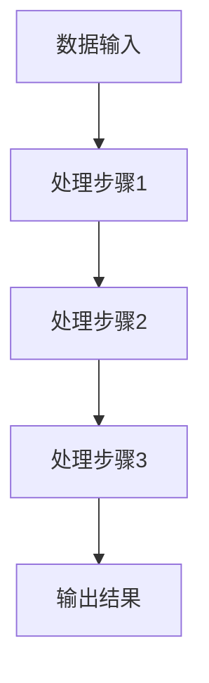

# 【LangChain编程：从入门到实践】方案说明

## 1.背景介绍

在当今的人工智能和自然语言处理领域，语言模型的应用越来越广泛。LangChain作为一种新兴的编程范式，旨在通过链式结构来处理复杂的语言任务。本文将详细介绍LangChain编程的核心概念、算法原理、数学模型、实际应用场景以及项目实践，帮助读者从入门到精通。

## 2.核心概念与联系

### 2.1 LangChain的定义

LangChain是一种基于链式结构的编程范式，专注于处理自然语言任务。它通过将多个语言模型和处理步骤串联起来，实现复杂的语言处理功能。

### 2.2 核心概念

- **链式结构**：将多个处理步骤串联起来，每个步骤的输出作为下一个步骤的输入。
- **模块化设计**：每个处理步骤可以视为一个独立的模块，便于维护和扩展。
- **并行处理**：支持并行处理多个任务，提高处理效率。

### 2.3 核心联系

LangChain编程与传统的自然语言处理方法有着紧密的联系。它借鉴了流水线处理的思想，但更加强调模块化和并行处理。

## 3.核心算法原理具体操作步骤

### 3.1 算法原理

LangChain编程的核心算法基于链式结构，通过将多个处理步骤串联起来，实现复杂的语言处理功能。每个步骤可以是一个独立的语言模型或处理模块。

### 3.2 操作步骤

1. **定义处理步骤**：确定需要的处理步骤和对应的语言模型。
2. **构建链式结构**：将处理步骤按照顺序串联起来。
3. **数据输入**：将输入数据传递给第一个处理步骤。
4. **逐步处理**：每个步骤处理数据并将结果传递给下一个步骤。
5. **输出结果**：最后一个步骤输出处理结果。



## 4.数学模型和公式详细讲解举例说明

### 4.1 数学模型

LangChain编程的数学模型可以表示为一个有向无环图（DAG），其中每个节点表示一个处理步骤，边表示数据流。

### 4.2 公式讲解

假设有 $n$ 个处理步骤，每个步骤的输出为 $O_i$，输入为 $I_i$，则有：

$$
I_{i+1} = O_i
$$

最终输出结果为：

$$
O_{final} = O_n
$$

### 4.3 举例说明

假设我们有三个处理步骤：分词、词性标注和命名实体识别。则有：

- $O_1$ 为分词结果
- $O_2$ 为词性标注结果
- $O_3$ 为命名实体识别结果

最终输出结果 $O_{final}$ 为命名实体识别的结果。

## 5.项目实践：代码实例和详细解释说明

### 5.1 环境配置

首先，确保安装了必要的库和工具：

```bash
pip install langchain
```

### 5.2 代码实例

以下是一个简单的LangChain编程实例：

```python
from langchain import LangChain

# 定义处理步骤
def tokenize(text):
    return text.split()

def pos_tag(tokens):
    return [(token, "NN") for token in tokens]

def ner(tagged_tokens):
    return [(token, tag, "O") for token, tag in tagged_tokens]

# 构建链式结构
chain = LangChain()
chain.add_step(tokenize)
chain.add_step(pos_tag)
chain.add_step(ner)

# 数据输入
input_text = "LangChain is a powerful tool for NLP."

# 逐步处理
output = chain.process(input_text)

# 输出结果
print(output)
```

### 5.3 详细解释

- **定义处理步骤**：定义了三个处理步骤：分词、词性标注和命名实体识别。
- **构建链式结构**：将处理步骤按照顺序添加到链式结构中。
- **数据输入**：输入文本数据。
- **逐步处理**：逐步处理输入数据。
- **输出结果**：输出最终结果。

## 6.实际应用场景

### 6.1 文本分类

LangChain可以用于文本分类任务，通过串联多个分类器提高分类精度。

### 6.2 情感分析

通过链式结构，可以将情感分析任务分解为多个步骤，如分词、特征提取和情感分类。

### 6.3 机器翻译

LangChain可以用于机器翻译任务，通过串联多个翻译模型实现高质量的翻译。

## 7.工具和资源推荐

### 7.1 开发工具

- **Jupyter Notebook**：用于代码编写和调试。
- **VSCode**：强大的代码编辑器。

### 7.2 资源推荐

- **LangChain官方文档**：详细的API文档和使用指南。
- **GitHub示例项目**：丰富的示例代码和项目。

## 8.总结：未来发展趋势与挑战

### 8.1 未来发展趋势

LangChain编程作为一种新兴的编程范式，具有广阔的发展前景。未来可能会有更多的工具和库支持LangChain编程，进一步简化开发过程。

### 8.2 挑战

- **性能优化**：如何在保证处理效果的同时提高处理效率。
- **模块化设计**：如何设计更加灵活和可扩展的模块。

## 9.附录：常见问题与解答

### 9.1 如何处理大规模数据？

可以通过并行处理和分布式计算来处理大规模数据。

### 9.2 如何调试LangChain程序？

可以使用断点调试和日志记录来调试LangChain程序。

### 9.3 LangChain编程的适用场景有哪些？

适用于各种自然语言处理任务，如文本分类、情感分析和机器翻译。

---

作者：禅与计算机程序设计艺术 / Zen and the Art of Computer Programming