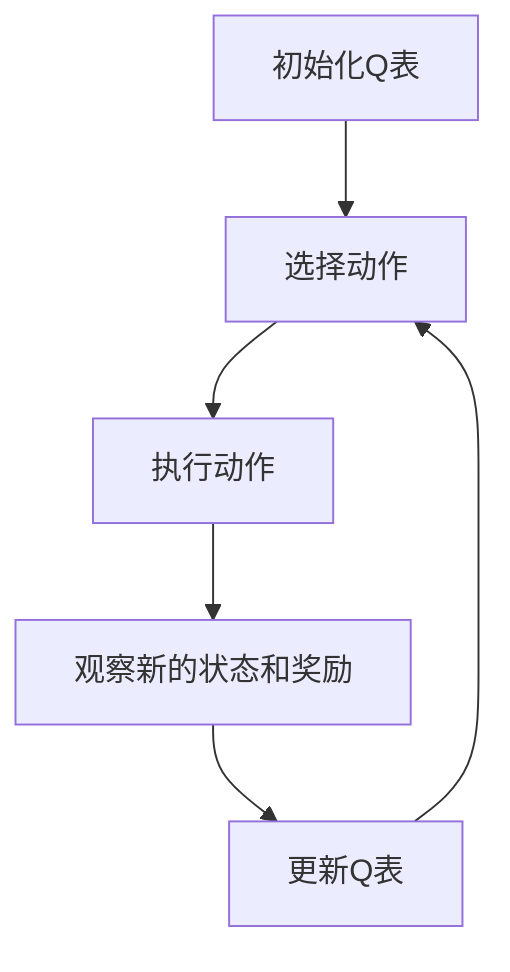

# 一切皆是映射：AI Q-learning在语音识别的探索

## 1.背景介绍

在人工智能领域，语音识别技术已经成为了一个重要的研究方向。语音识别的应用范围广泛，从智能助手到自动翻译，再到语音控制的智能家居设备，几乎无处不在。传统的语音识别方法主要依赖于统计模型和特征工程，但随着深度学习和强化学习的兴起，新的方法不断涌现。本文将探讨如何利用Q-learning这一强化学习算法来改进语音识别系统。

## 2.核心概念与联系

### 2.1 Q-learning简介

Q-learning是一种无模型的强化学习算法，通过学习动作-状态值函数（Q函数）来指导智能体的行为。Q函数表示在给定状态下采取某一动作所能获得的期望回报。公式如下：

$$
Q(s, a) = Q(s, a) + \alpha [r + \gamma \max_{a'} Q(s', a') - Q(s, a)]
$$

其中，$s$ 表示当前状态，$a$ 表示当前动作，$r$ 表示即时奖励，$\alpha$ 是学习率，$\gamma$ 是折扣因子。

### 2.2 语音识别概述

语音识别的目标是将语音信号转换为文本。传统的语音识别系统通常包括以下几个步骤：

1. **预处理**：对语音信号进行降噪、归一化等处理。
2. **特征提取**：提取MFCC（梅尔频率倒谱系数）等特征。
3. **声学模型**：使用HMM（隐马尔可夫模型）或DNN（深度神经网络）进行建模。
4. **语言模型**：使用N-gram模型或RNN（循环神经网络）进行建模。
5. **解码**：使用Viterbi算法或Beam Search进行解码。

### 2.3 Q-learning与语音识别的联系

Q-learning可以用于优化语音识别系统中的各个环节。例如，可以通过Q-learning来优化特征提取过程中的参数选择，或者通过Q-learning来优化解码过程中的搜索策略。

## 3.核心算法原理具体操作步骤

### 3.1 状态空间与动作空间的定义

在语音识别中，状态空间可以定义为语音信号的特征向量，动作空间可以定义为可能的文本输出。具体步骤如下：

1. **初始化Q表**：将Q表初始化为零。
2. **选择动作**：根据当前状态选择一个动作，通常使用$\epsilon$-贪婪策略。
3. **执行动作**：执行选择的动作，并观察新的状态和奖励。
4. **更新Q表**：使用Q-learning更新公式更新Q表。
5. **重复**：重复上述步骤，直到收敛。

### 3.2 奖励函数的设计

奖励函数的设计是Q-learning的关键。在语音识别中，可以将识别结果的准确率作为奖励。例如，如果识别结果与实际文本匹配，则给予正奖励；否则，给予负奖励。

### 3.3 算法流程图



## 4.数学模型和公式详细讲解举例说明

### 4.1 Q-learning更新公式

Q-learning的更新公式如下：

$$
Q(s, a) = Q(s, a) + \alpha [r + \gamma \max_{a'} Q(s', a') - Q(s, a)]
$$

其中，$s$ 表示当前状态，$a$ 表示当前动作，$r$ 表示即时奖励，$\alpha$ 是学习率，$\gamma$ 是折扣因子。

### 4.2 奖励函数示例

假设我们有一个简单的语音识别任务，目标是识别单个单词。我们可以设计如下的奖励函数：

$$
r = 
\begin{cases} 
1 & \text{如果识别结果正确} \\
-1 & \text{如果识别结果错误}
\end{cases}
$$

### 4.3 实例讲解

假设我们有一个语音信号，其特征向量为$s_1$，当前Q表如下：

$$
Q(s_1, a_1) = 0.5, \quad Q(s_1, a_2) = 0.2
$$

我们选择动作$a_1$，观察到新的状态$s_2$和奖励$r = 1$。更新Q表：

$$
Q(s_1, a_1) = 0.5 + 0.1 [1 + 0.9 \max_{a'} Q(s_2, a') - 0.5]
$$

假设$\max_{a'} Q(s_2, a') = 0.8$，则：

$$
Q(s_1, a_1) = 0.5 + 0.1 [1 + 0.9 \cdot 0.8 - 0.5] = 0.57
$$

## 5.项目实践：代码实例和详细解释说明

### 5.1 环境设置

首先，我们需要安装必要的Python库：

```bash
pip install numpy scipy scikit-learn
```

### 5.2 数据预处理

```python
import numpy as np
from scipy.io import wavfile

def preprocess_audio(file_path):
    sample_rate, signal = wavfile.read(file_path)
    # 归一化
    signal = signal / np.max(np.abs(signal))
    return signal, sample_rate
```

### 5.3 特征提取

```python
from python_speech_features import mfcc

def extract_features(signal, sample_rate):
    mfcc_features = mfcc(signal, sample_rate)
    return mfcc_features
```

### 5.4 Q-learning实现

```python
class QLearningAgent:
    def __init__(self, state_size, action_size, alpha=0.1, gamma=0.9, epsilon=0.1):
        self.state_size = state_size
        self.action_size = action_size
        self.alpha = alpha
        self.gamma = gamma
        self.epsilon = epsilon
        self.q_table = np.zeros((state_size, action_size))

    def choose_action(self, state):
        if np.random.rand() < self.epsilon:
            return np.random.choice(self.action_size)
        else:
            return np.argmax(self.q_table[state])

    def update_q_table(self, state, action, reward, next_state):
        best_next_action = np.argmax(self.q_table[next_state])
        td_target = reward + self.gamma * self.q_table[next_state, best_next_action]
        td_error = td_target - self.q_table[state, action]
        self.q_table[state, action] += self.alpha * td_error
```

### 5.5 训练过程

```python
def train_agent(agent, episodes, data):
    for episode in range(episodes):
        state = data[0]
        for t in range(1, len(data)):
            action = agent.choose_action(state)
            next_state = data[t]
            reward = 1 if action == next_state else -1
            agent.update_q_table(state, action, reward, next_state)
            state = next_state
```

### 5.6 测试过程

```python
def test_agent(agent, data):
    state = data[0]
    total_reward = 0
    for t in range(1, len(data)):
        action = agent.choose_action(state)
        next_state = data[t]
        reward = 1 if action == next_state else -1
        total_reward += reward
        state = next_state
    return total_reward
```

## 6.实际应用场景

### 6.1 智能助手

智能助手如Siri和Alexa依赖于高效的语音识别系统。通过Q-learning优化语音识别，可以提高智能助手的响应速度和准确率。

### 6.2 自动翻译

自动翻译系统需要将语音信号转换为文本，再进行翻译。Q-learning可以优化语音到文本的转换过程，提高翻译的准确性。

### 6.3 语音控制的智能家居

智能家居设备如智能音箱和智能灯泡需要通过语音进行控制。Q-learning可以优化语音识别系统，提高设备的响应速度和准确率。

## 7.工具和资源推荐

### 7.1 开源库

- **TensorFlow**：一个开源的机器学习框架，支持深度学习和强化学习。
- **PyTorch**：另一个流行的深度学习框架，支持动态计算图。
- **OpenAI Gym**：一个用于开发和比较强化学习算法的工具包。

### 7.2 数据集

- **LibriSpeech**：一个大型的英语语音识别数据集。
- **TED-LIUM**：一个基于TED演讲的语音识别数据集。
- **VoxCeleb**：一个包含名人语音的识别数据集。

### 7.3 在线资源

- **Coursera**：提供多种机器学习和强化学习的在线课程。
- **Kaggle**：一个数据科学竞赛平台，提供丰富的数据集和竞赛。

## 8.总结：未来发展趋势与挑战

### 8.1 未来发展趋势

随着计算能力的提升和算法的改进，语音识别技术将会变得更加准确和高效。Q-learning作为一种强化学习算法，有望在语音识别领域发挥更大的作用。未来，结合深度学习和强化学习的混合模型可能会成为主流。

### 8.2 挑战

尽管Q-learning在语音识别中有很大的潜力，但也面临一些挑战。首先，Q-learning的训练过程需要大量的数据和计算资源。其次，如何设计有效的奖励