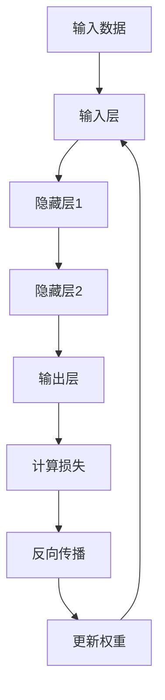

# 一切皆是映射：构建你自己的神经网络：入门指南

## 1.背景介绍

神经网络作为人工智能领域的核心技术之一，已经在图像识别、自然语言处理、自动驾驶等多个领域取得了显著的成果。神经网络的基本思想源于对人脑神经元结构和功能的模拟，通过大量的训练数据和复杂的计算模型，神经网络能够自动学习和提取数据中的特征，从而实现对未知数据的预测和分类。

## 2.核心概念与联系

### 2.1 神经元与激活函数

神经元是神经网络的基本单元，每个神经元接收多个输入信号，并通过激活函数生成输出信号。常见的激活函数包括Sigmoid、ReLU和Tanh等。

### 2.2 层与网络结构

神经网络由多个层组成，包括输入层、隐藏层和输出层。每一层由若干个神经元组成，层与层之间通过权重连接。网络结构的设计直接影响模型的性能和复杂度。

### 2.3 前向传播与反向传播

前向传播是指输入数据通过网络层层传递，最终生成输出结果的过程。反向传播则是通过计算输出误差，逐层更新权重，以最小化误差的过程。

### 2.4 损失函数与优化算法

损失函数用于衡量模型预测值与真实值之间的差异，常见的损失函数有均方误差（MSE）和交叉熵（Cross-Entropy）。优化算法如梯度下降（Gradient Descent）用于调整网络权重，以最小化损失函数。

## 3.核心算法原理具体操作步骤

### 3.1 数据预处理

数据预处理是神经网络训练的第一步，包括数据清洗、归一化和分割训练集与测试集等步骤。

### 3.2 初始化权重

权重的初始化对模型的训练效果有重要影响，常见的初始化方法有随机初始化和Xavier初始化等。

### 3.3 前向传播

前向传播的具体步骤如下：

1. 输入数据通过输入层传递到隐藏层。
2. 隐藏层的每个神经元计算加权和，并通过激活函数生成输出。
3. 隐藏层的输出作为下一层的输入，直到输出层生成最终结果。

### 3.4 计算损失

使用损失函数计算模型预测值与真实值之间的误差。

### 3.5 反向传播

反向传播的具体步骤如下：

1. 计算输出层的误差。
2. 逐层向前计算隐藏层的误差。
3. 根据误差更新每层的权重。

### 3.6 更新权重

使用优化算法如梯度下降，根据反向传播计算的梯度更新权重。

### 3.7 迭代训练

重复前向传播、计算损失、反向传播和更新权重的过程，直到损失函数收敛或达到预设的训练轮数。



## 4.数学模型和公式详细讲解举例说明

### 4.1 神经元计算公式

每个神经元的输出可以表示为：

$$
y = f\left(\sum_{i=1}^{n} w_i x_i + b\right)
$$

其中，$w_i$ 是权重，$x_i$ 是输入，$b$ 是偏置，$f$ 是激活函数。

### 4.2 损失函数

以均方误差（MSE）为例，损失函数可以表示为：

$$
L = \frac{1}{2m} \sum_{i=1}^{m} (y_i - \hat{y}_i)^2
$$

其中，$m$ 是样本数量，$y_i$ 是真实值，$\hat{y}_i$ 是预测值。

### 4.3 梯度下降

权重更新公式为：

$$
w_i = w_i - \eta \frac{\partial L}{\partial w_i}
$$

其中，$\eta$ 是学习率，$\frac{\partial L}{\partial w_i}$ 是损失函数对权重的偏导数。

## 5.项目实践：代码实例和详细解释说明

### 5.1 数据准备

```python
import numpy as np
from sklearn.datasets import load_iris
from sklearn.model_selection import train_test_split
from sklearn.preprocessing import StandardScaler

# 加载数据集
data = load_iris()
X = data.data
y = data.target

# 数据归一化
scaler = StandardScaler()
X = scaler.fit_transform(X)

# 分割训练集和测试集
X_train, X_test, y_train, y_test = train_test_split(X, y, test_size=0.2, random_state=42)
```

### 5.2 构建神经网络

```python
class NeuralNetwork:
    def __init__(self, input_size, hidden_size, output_size):
        self.weights1 = np.random.randn(input_size, hidden_size)
        self.weights2 = np.random.randn(hidden_size, output_size)
        self.bias1 = np.zeros((1, hidden_size))
        self.bias2 = np.zeros((1, output_size))

    def sigmoid(self, x):
        return 1 / (1 + np.exp(-x))

    def sigmoid_derivative(self, x):
        return x * (1 - x)

    def forward(self, X):
        self.z1 = np.dot(X, self.weights1) + self.bias1
        self.a1 = self.sigmoid(self.z1)
        self.z2 = np.dot(self.a1, self.weights2) + self.bias2
        self.output = self.sigmoid(self.z2)
        return self.output

    def backward(self, X, y, output):
        self.error = y - output
        self.d_output = self.error * self.sigmoid_derivative(output)
        self.error_hidden = self.d_output.dot(self.weights2.T)
        self.d_hidden = self.error_hidden * self.sigmoid_derivative(self.a1)

        self.weights2 += self.a1.T.dot(self.d_output)
        self.weights1 += X.T.dot(self.d_hidden)
        self.bias2 += np.sum(self.d_output, axis=0, keepdims=True)
        self.bias1 += np.sum(self.d_hidden, axis=0, keepdims=True)

    def train(self, X, y, epochs=1000):
        for _ in range(epochs):
            output = self.forward(X)
            self.backward(X, y, output)
```

### 5.3 训练与测试

```python
# 初始化神经网络
nn = NeuralNetwork(input_size=4, hidden_size=5, output_size=3)

# 训练神经网络
nn.train(X_train, y_train, epochs=1000)

# 测试神经网络
predictions = nn.forward(X_test)
accuracy = np.mean(np.argmax(predictions, axis=1) == y_test)
print(f'Accuracy: {accuracy * 100:.2f}%')
```

## 6.实际应用场景

### 6.1 图像识别

神经网络在图像识别领域表现出色，能够自动提取图像特征，实现对图像的分类和识别。

### 6.2 自然语言处理

在自然语言处理领域，神经网络被广泛应用于文本分类、情感分析、机器翻译等任务。

### 6.3 自动驾驶

神经网络在自动驾驶中用于环境感知、路径规划和决策控制，提升了自动驾驶系统的安全性和可靠性。

## 7.工具和资源推荐

### 7.1 开源框架

- TensorFlow：谷歌开发的开源深度学习框架，支持多种平台和语言。
- PyTorch：Facebook开发的开源深度学习框架，具有灵活的动态计算图和强大的社区支持。

### 7.2 在线课程

- Coursera：提供多门深度学习和神经网络相关的在线课程。
- edX：提供由顶尖大学和机构开设的深度学习课程。

### 7.3 书籍推荐

- 《深度学习》：Ian Goodfellow等人编写的经典教材，系统介绍了深度学习的理论和实践。
- 《神经网络与深度学习》：Michael Nielsen编写的入门书籍，适合初学者阅读。

## 8.总结：未来发展趋势与挑战

神经网络在多个领域取得了显著的成果，但仍面临一些挑战，如模型的可解释性、训练数据的质量和数量、计算资源的需求等。未来，随着算法的改进和硬件的发展，神经网络有望在更多领域实现突破，推动人工智能技术的进一步发展。

## 9.附录：常见问题与解答

### 9.1 神经网络为什么需要激活函数？

激活函数引入了非线性，使得神经网络能够拟合复杂的非线性关系，提高模型的表达能力。

### 9.2 如何选择合适的网络结构？

网络结构的选择需要根据具体任务和数据集进行调整，可以通过实验和交叉验证来确定最佳结构。

### 9.3 为什么神经网络容易过拟合？

神经网络具有强大的表达能力，容易在训练数据上表现出色，但在测试数据上表现不佳。可以通过正则化、数据增强和交叉验证等方法来缓解过拟合问题。

---

作者：禅与计算机程序设计艺术 / Zen and the Art of Computer Programming