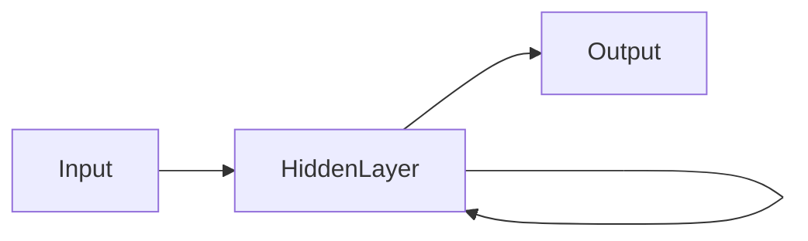

# 一切皆是映射：递归神经网络(RNN)和时间序列数据

## 1. 背景介绍

在当今信息技术飞速发展的时代，时间序列数据分析已成为众多领域的关键技术。从金融市场到天气预报，从工业监控到智能语音识别，时间序列数据无处不在。然而，传统的时间序列分析方法在处理高度非线性、复杂时间依赖关系时显得力不从心。递归神经网络（RNN）作为一种能够捕捉序列数据内部动态和复杂模式的人工神经网络，为时间序列数据的分析提供了全新的视角和方法。

## 2. 核心概念与联系

### 2.1 时间序列数据

时间序列数据是指按时间顺序排列的一组数据，通常用于描述某一变量随时间的变化情况。这些数据通常具有以下特点：

* **自相关性**：时间序列数据具有时间依赖性，即当前数据与过去或未来的数据存在关联。
* **非平稳性**：时间序列数据可能随时间变化而变化，呈现出非线性、非平稳的特点。
* **复杂性**：时间序列数据可能包含多种复杂模式，如趋势、周期性、季节性等。

### 2.2 递归神经网络（RNN）

递归神经网络（RNN）是一种能够处理序列数据的神经网络，其核心思想是利用隐藏层的权重共享来捕捉序列数据中的时间依赖关系。RNN的基本结构如图1所示：




图1：RNN结构图

RNN通过以下方式捕捉时间依赖关系：

* **权重共享**：RNN中，同一隐藏层在不同时间步长上的权重相同，这使得模型能够捕捉时间序列数据中的长期依赖关系。
* **递归连接**：RNN的输出会反馈到下一时间步长的输入，从而实现信息的传递和累积。

## 3. 核心算法原理具体操作步骤

### 3.1 数据预处理

在进行RNN模型训练之前，需要对时间序列数据进行预处理，主要包括以下步骤：

* **标准化**：将时间序列数据转换为均值为0，标准差为1的分布，以便于模型训练。
* **划分训练集和测试集**：将数据集划分为训练集和测试集，用于模型训练和评估。
* **填充缺失值**：对于缺失的数据，可以使用插值等方法进行填充。

### 3.2 模型搭建

搭建RNN模型主要包括以下步骤：

* **选择激活函数**：选择合适的激活函数，如ReLU、Tanh等。
* **设计网络结构**：根据实际问题选择合适的网络结构，包括输入层、隐藏层和输出层。
* **设置超参数**：设置学习率、批处理大小等超参数。

### 3.3 模型训练

模型训练过程主要包括以下步骤：

* **前向传播**：根据当前输入数据计算输出值。
* **计算损失函数**：根据输出值和真实标签计算损失函数。
* **反向传播**：根据损失函数计算梯度，并更新网络参数。

### 3.4 模型评估

模型评估过程主要包括以下步骤：

* **计算预测值**：根据训练好的模型计算预测值。
* **计算评价指标**：根据预测值和真实标签计算评价指标，如均方误差（MSE）、均方根误差（RMSE）等。

## 4. 数学模型和公式详细讲解举例说明

### 4.1 RNN的数学模型

RNN的数学模型如下：

$$
h_t = \\sigma(W_{ih}x_t + W_{hh}h_{t-1} + b_h)
$$

$$
y_t = W_{oh}h_t + b_o
$$

其中：

* $h_t$ 表示第t个时间步长的隐藏层输出。
* $x_t$ 表示第t个时间步长的输入。
* $W_{ih}$、$W_{hh}$、$W_{oh}$ 分别表示输入层到隐藏层、隐藏层到隐藏层、隐藏层到输出层的权重。
* $b_h$、$b_o$ 分别表示隐藏层和输出层的偏置。
* $\\sigma$ 表示激活函数，如ReLU、Tanh等。

### 4.2 例子

假设我们要预测一个时间序列数据集的下一个值。首先，我们对数据进行预处理，然后搭建一个RNN模型，并设置相关参数。具体步骤如下：

1. **数据预处理**：将数据标准化，划分为训练集和测试集。
2. **模型搭建**：搭建一个包含一个隐藏层的RNN模型，隐藏层神经元个数为10，激活函数为Tanh。
3. **模型训练**：设置学习率为0.01，批处理大小为64，训练100个epoch。
4. **模型评估**：计算模型在测试集上的均方误差。

## 5. 项目实践：代码实例和详细解释说明

### 5.1 代码实例

以下是一个使用Python和TensorFlow框架实现的RNN模型代码示例：

```python
import tensorflow as tf

# 定义RNN模型
def build_rnn(input_shape, output_shape):
    model = tf.keras.Sequential([
        tf.keras.layers.LSTM(10, activation='tanh', input_shape=input_shape),
        tf.keras.layers.Dense(output_shape, activation='linear')
    ])
    return model

# 训练RNN模型
def train_rnn(model, x_train, y_train, x_test, y_test, epochs=100, batch_size=64):
    model.compile(optimizer='adam', loss='mse')
    model.fit(x_train, y_train, epochs=epochs, batch_size=batch_size, validation_data=(x_test, y_test))

# 评估RNN模型
def evaluate_rnn(model, x_test, y_test):
    y_pred = model.predict(x_test)
    mse = np.mean((y_pred - y_test) ** 2)
    return mse

# 导入数据
x_train = np.array([[1, 2, 3], [4, 5, 6], [7, 8, 9], ...])  # 训练数据
y_train = np.array([1, 2, 3, ...])  # 训练标签
x_test = np.array([[1, 2, 3], [4, 5, 6], [7, 8, 9], ...])  # 测试数据
y_test = np.array([1, 2, 3, ...])  # 测试标签

# 搭建RNN模型
model = build_rnn(x_train.shape[1], y_train.shape[1])

# 训练RNN模型
train_rnn(model, x_train, y_train, x_test, y_test)

# 评估RNN模型
mse = evaluate_rnn(model, x_test, y_test)
print(\"MSE:\", mse)
```

### 5.2 代码解释说明

1. **导入数据**：首先，导入所需库和训练/测试数据。
2. **定义RNN模型**：使用TensorFlow框架的`Sequential`模型，添加一个LSTM层和一个线性层，实现RNN模型。
3. **训练RNN模型**：使用`compile`方法设置优化器和损失函数，使用`fit`方法进行模型训练。
4. **评估RNN模型**：使用`predict`方法进行预测，计算均方误差并输出。

## 6. 实际应用场景

RNN在许多实际应用场景中具有广泛的应用，以下列举几个典型应用：

* **股票价格预测**：利用RNN分析历史股票价格，预测未来股票走势。
* **金融市场预测**：利用RNN分析金融市场中的各种指标，预测市场趋势。
* **文本生成**：利用RNN生成文章、诗歌等文本内容。
* **语音识别**：利用RNN将语音信号转换为文本。
* **自然语言处理**：利用RNN进行情感分析、机器翻译等任务。

## 7. 工具和资源推荐

* **编程语言和框架**：Python、TensorFlow、Keras等。
* **数据集**：UCI机器学习库、Kaggle等。
* **论文和书籍**：《递归神经网络：理论与实践》、《深度学习》等。

## 8. 总结：未来发展趋势与挑战

随着深度学习技术的不断发展，RNN在时间序列数据分析领域的应用将越来越广泛。未来发展趋势主要包括：

* **模型结构创新**：设计更加高效的RNN模型，如长短时记忆网络（LSTM）、门控循环单元（GRU）等。
* **多模态融合**：将RNN与其他深度学习模型（如卷积神经网络）相结合，实现多模态融合。
* **在线学习与自适应**：实现RNN的在线学习和自适应能力，提高模型在实际应用中的实用性。

然而，RNN在应用过程中仍面临以下挑战：

* **梯度消失/梯度爆炸**：RNN容易受到梯度消失/梯度爆炸的影响，导致模型训练困难。
* **计算复杂度**：RNN的计算复杂度较高，在大规模数据集上训练较为耗时。
* **过拟合**：RNN容易过拟合，需要采取合适的正则化方法。

## 9. 附录：常见问题与解答

### 9.1 什么情况下使用RNN？

当数据具有时间依赖性，需要捕捉序列数据中的长期模式时，可以使用RNN。

### 9.2 RNN的优缺点是什么？

RNN的优点是可以捕捉序列数据中的时间依赖关系，但缺点是容易受到梯度消失/梯度爆炸的影响，计算复杂度较高。

### 9.3 如何解决RNN的梯度消失/梯度爆炸问题？

可以采用以下方法解决RNN的梯度消失/梯度爆炸问题：

* **LSTM**：LSTM是一种改进的RNN模型，可以有效缓解梯度消失/梯度爆炸问题。
* **GRU**：GRU是另一种改进的RNN模型，具有更简单的结构，也能有效缓解梯度消失/梯度爆炸问题。
* **截断梯度**：通过截断梯度来防止梯度爆炸。

作者：禅与计算机程序设计艺术 / Zen and the Art of Computer Programming