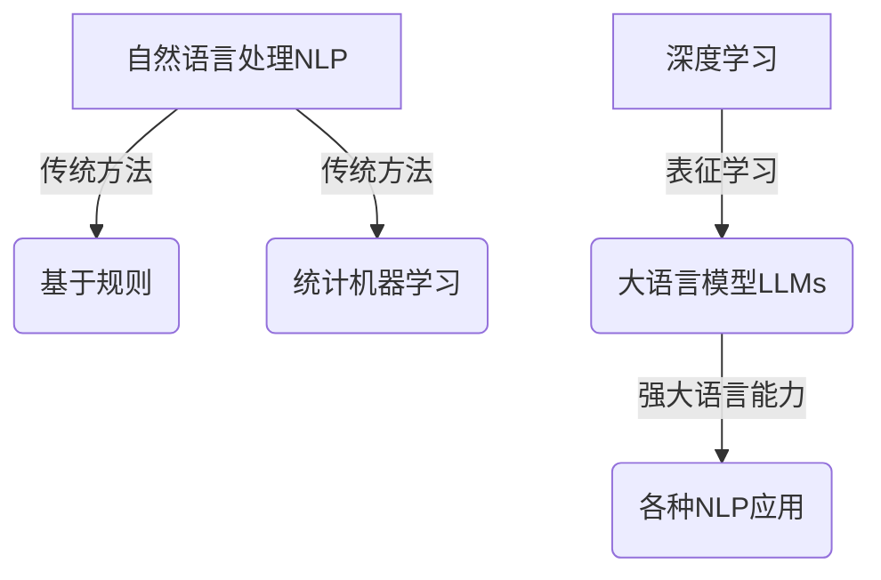

# 大语言模型原理与工程实践：大语言模型的涌现能力

## 1. 背景介绍

### 1.1 人工智能的新时代

在过去几年中，人工智能领域取得了令人瞩目的进展,尤其是在自然语言处理(NLP)方面。大型语言模型(Large Language Models, LLMs)的出现,彻底改变了人工智能系统与人类交互的方式,催生了一场新的人工智能革命。

### 1.2 大语言模型的兴起

大语言模型是一种基于深度学习的技术,能够从海量文本数据中学习语言模式和语义关系。它们可以生成看似人性化的文本输出,展现出惊人的语言理解和生成能力。代表性模型包括GPT-3、BERT、XLNet等,其中GPT-3因其庞大的参数量(1750亿个参数)而备受瞩目。

### 1.3 变革性影响

大语言模型的出现,为人工智能系统赋予了前所未有的语言理解和生成能力,极大拓展了其应用场景。它们可用于自动文本摘要、机器翻译、问答系统、内容生成等多个领域,为人类高效完成各种语言相关任务提供了强大支持。

## 2. 核心概念与联系

### 2.1 自然语言处理(NLP)

自然语言处理是人工智能的一个分支,旨在使计算机能够理解和生成人类语言。传统的NLP系统通常采用基于规则的方法或统计机器学习模型,但存在局限性。

### 2.2 深度学习与表征学习

深度学习是一种基于人工神经网络的机器学习技术,能够从原始数据中自动学习特征表示。表征学习使得模型可以捕捉数据中的复杂模式和层次结构,从而在NLP等任务中取得卓越表现。



### 2.3 大语言模型的工作原理

大语言模型通过预训练-微调的范式来工作。在预训练阶段,模型会在海量文本语料库上进行自监督学习,捕捉语言的一般模式。在微调阶段,预训练模型会在特定任务的标注数据上进行进一步训练,以适应具体的应用场景。

## 3. 核心算法原理具体操作步骤

### 3.1 transformer架构

大语言模型通常采用transformer架构,该架构由编码器(Encoder)和解码器(Decoder)组成。编码器将输入序列映射为上下文表示,解码器则根据上下文表示生成输出序列。


### 3.2 自注意力机制

自注意力机制是transformer架构的核心,它允许模型捕捉输入序列中任意两个位置之间的依赖关系,从而更好地建模长距离依赖。

$$\mathrm{Attention}(Q, K, V) = \mathrm{softmax}(\frac{QK^T}{\sqrt{d_k}})V$$

其中 $Q$ 为查询(Query)、$K$ 为键(Key)、$V$ 为值(Value),$d_k$ 为缩放因子。

### 3.3 预训练目标

常见的预训练目标包括:

1. **蒙版语言模型(Masked Language Modeling, MLM)**: 随机掩蔽部分输入词,模型需要预测被掩蔽的词。
2. **下一句预测(Next Sentence Prediction, NSP)**: 判断两个句子是否为连续句子。
3. **因果语言模型(Causal Language Modeling, CLM)**: 给定前缀,模型需要预测下一个词。

通过预训练,模型可以学习到丰富的语言知识,为下游任务做好准备。

## 4. 数学模型和公式详细讲解举例说明

### 4.1 transformer模型

transformer模型的核心是自注意力机制,它可以捕捉输入序列中任意两个位置之间的依赖关系。给定一个长度为 $n$ 的输入序列 $X = (x_1, x_2, \dots, x_n)$,自注意力机制的计算过程如下:

1. 将输入序列 $X$ 线性映射到查询(Query)、键(Key)和值(Value)矩阵:

$$\begin{aligned}
Q &= XW^Q\\
K &= XW^K\\
V &= XW^V
\end{aligned}$$

其中 $W^Q$、$W^K$、$W^V$ 为可学习的权重矩阵。

2. 计算注意力分数:

$$\mathrm{Attention}(Q, K, V) = \mathrm{softmax}(\frac{QK^T}{\sqrt{d_k}})V$$

其中 $d_k$ 为缩放因子,用于防止内积过大导致的梯度不稳定问题。

3. 将注意力分数与值矩阵 $V$ 相乘,得到加权和作为输出:

$$\mathrm{Output} = \mathrm{Attention}(Q, K, V)$$

自注意力机制允许模型在计算某个位置的表示时,关注整个输入序列的所有位置,从而更好地捕捉长距离依赖关系。

### 4.2 预训练目标的数学形式

以蒙版语言模型(MLM)为例,给定一个长度为 $n$ 的输入序列 $X = (x_1, x_2, \dots, x_n)$,我们随机掩蔽其中的 $m$ 个词,得到掩蔽后的序列 $\tilde{X} = (\tilde{x}_1, \tilde{x}_2, \dots, \tilde{x}_n)$。模型的目标是最大化被掩蔽词的条件概率:

$$\mathcal{L}_\mathrm{MLM} = \mathbb{E}_{X \sim D}\left[-\sum_{i=1}^m \log P(x_i|\tilde{X})\right]$$

其中 $D$ 为训练语料库的分布。通过最小化该损失函数,模型可以学习到语言的一般模式和语义知识。

## 5. 项目实践:代码实例和详细解释说明

以下是一个使用PyTorch实现的简单transformer模型示例,用于机器翻译任务。

```python
import torch
import torch.nn as nn

class TransformerEncoder(nn.Module):
    def __init__(self, input_dim, hid_dim, n_heads, dropout):
        super().__init__()
        self.layer_norm = nn.LayerNorm(input_dim)
        self.self_attn = nn.MultiheadAttention(input_dim, n_heads, dropout=dropout)
        self.ffn = nn.Sequential(
            nn.Linear(input_dim, hid_dim),
            nn.ReLU(),
            nn.Dropout(dropout),
            nn.Linear(hid_dim, input_dim),
            nn.Dropout(dropout)
        )
        
    def forward(self, src):
        # 输入归一化
        src = self.layer_norm(src)
        
        # 自注意力子层
        src2 = self.self_attn(src, src, src)[0]
        src = src + src2
        
        # 前馈网络子层
        src2 = self.ffn(src)
        src = src + src2
        
        return src

class TransformerDecoder(nn.Module):
    def __init__(self, output_dim, hid_dim, n_heads, dropout):
        super().__init__()
        self.layer_norm = nn.LayerNorm(output_dim)
        self.self_attn = nn.MultiheadAttention(output_dim, n_heads, dropout=dropout)
        self.enc_attn = nn.MultiheadAttention(output_dim, n_heads, dropout=dropout)
        self.ffn = nn.Sequential(
            nn.Linear(output_dim, hid_dim),
            nn.ReLU(),
            nn.Dropout(dropout),
            nn.Linear(hid_dim, output_dim),
            nn.Dropout(dropout)
        )
        
    def forward(self, tgt, memory):
        # 输入归一化
        tgt = self.layer_norm(tgt)
        
        # 自注意力子层
        tgt2 = self.self_attn(tgt, tgt, tgt)[0]
        tgt = tgt + tgt2
        
        # 编码器-解码器注意力子层
        tgt2 = self.enc_attn(tgt, memory, memory)[0]
        tgt = tgt + tgt2
        
        # 前馈网络子层
        tgt2 = self.ffn(tgt)
        tgt = tgt + tgt2
        
        return tgt

class Transformer(nn.Module):
    def __init__(self, src_vocab_size, tgt_vocab_size, d_model, n_heads, n_encoders, n_decoders, dropout):
        super().__init__()
        self.encoder = nn.ModuleList([TransformerEncoder(d_model, d_model*4, n_heads, dropout) for _ in range(n_encoders)])
        self.decoder = nn.ModuleList([TransformerDecoder(d_model, d_model*4, n_heads, dropout) for _ in range(n_decoders)])
        self.src_emb = nn.Embedding(src_vocab_size, d_model)
        self.tgt_emb = nn.Embedding(tgt_vocab_size, d_model)
        self.out = nn.Linear(d_model, tgt_vocab_size)
        
    def forward(self, src, tgt):
        src = self.src_emb(src)
        tgt = self.tgt_emb(tgt)
        
        # 编码器
        for layer in self.encoder:
            src = layer(src)
        
        # 解码器
        for layer in self.decoder:
            tgt = layer(tgt, src)
        
        output = self.out(tgt)
        return output
```

这个示例实现了一个基本的transformer模型,包括编码器和解码器。编码器由多个相同的编码器层组成,每个层包含一个自注意力子层和一个前馈网络子层。解码器由多个相同的解码器层组成,每个层包含一个自注意力子层、一个编码器-解码器注意力子层和一个前馈网络子层。

在前向传播过程中,源语言序列首先通过编码器,生成上下文表示。然后,目标语言序列与编码器的输出一起输入解码器,生成最终的翻译结果。

该示例仅为transformer模型的简化实现,实际应用中还需要考虑诸如位置编码、掩码机制等因素。但它展示了transformer模型的核心思想和实现方式。

## 6. 实际应用场景

大语言模型在多个领域展现出了广阔的应用前景,下面列举了一些典型场景:

### 6.1 自然语言生成(NLG)

大语言模型可以生成流畅、连贯的自然语言文本,如新闻报道、故事、诗歌等。这为内容创作、自动化写作等领域带来了新的机遇。

### 6.2 机器翻译

传统的机器翻译系统通常基于短语匹配或语法规则,而大语言模型可以更好地捕捉语义,提供更加准确和流畅的翻译结果。

### 6.3 问答系统

大语言模型可以从庞大的知识库中学习,从而具备回答各种问题的能力。这为构建智能问答系统、虚拟助理等应用奠定了基础。

### 6.4 代码生成

近年来,大语言模型在代码生成领域也取得了长足进展。它们可以根据自然语言描述生成对应的代码,为程序员提供智能辅助编码的能力。

### 6.5 其他应用

大语言模型还可以应用于文本摘要、情感分析、语音识别、对话系统等多个领域,展现出广阔的应用前景。

## 7. 工具和资源推荐

### 7.1 预训练模型

- **GPT-3**: OpenAI开发的大型语言模型,参数量高达1750亿。
- **BERT**: 谷歌开发的双向编码器表示,在多项NLP任务上表现卓越。
- **XLNet**: 由Carnegie Mellon University和谷歌合作开发,在许多基准测试中超过BERT。
- **T5**: 由谷歌开发的统一的文本到文本的转换框架。

### 7.2 开源框架

- **Hugging Face Transformers**: 提供了多种预训练模型和工具,支持PyTorch和TensorFlow。
- **AllenNLP**: 由Allen研究所开发的开源NLP研究库。
- **fairseq**: Facebook AI Research开发的序列到序列学习工具包。

### 7.3 数据集和基准测试

- **GLUE**: 通用语言理解评估基准,包含9项任务。
- **SQuAD**: 斯坦福