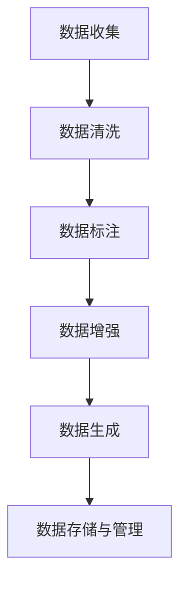

# 大语言模型原理与工程实践：预训练数据构建

## 1.背景介绍

大语言模型（Large Language Models, LLMs）近年来在自然语言处理（NLP）领域取得了显著的进展。诸如GPT-3、BERT等模型在各种任务中表现出色，从文本生成到情感分析，再到机器翻译，几乎无所不能。这些模型的成功很大程度上依赖于预训练数据的质量和规模。预训练数据的构建不仅影响模型的性能，还决定了模型的泛化能力和应用范围。

在本文中，我们将深入探讨大语言模型预训练数据的构建原理与工程实践。我们将从背景介绍开始，逐步深入到核心概念、算法原理、数学模型、项目实践、实际应用场景、工具和资源推荐，最后总结未来的发展趋势与挑战，并附上常见问题与解答。

## 2.核心概念与联系

### 2.1 预训练与微调

预训练（Pre-training）是指在大规模无监督数据上训练模型，使其学习到语言的基本结构和语义。微调（Fine-tuning）则是在特定任务的数据集上进一步训练模型，使其适应特定任务的需求。

### 2.2 数据质量与多样性

数据质量和多样性是预训练数据构建的两个关键因素。高质量的数据能够提高模型的准确性和鲁棒性，而多样化的数据则有助于模型的泛化能力。

### 2.3 数据清洗与标注

数据清洗（Data Cleaning）是指去除噪声和无关信息，使数据更加纯净。数据标注（Data Annotation）则是为数据添加标签，使其适用于有监督学习任务。

### 2.4 数据增强与生成

数据增强（Data Augmentation）是通过对现有数据进行变换来生成新的数据，从而增加数据集的规模和多样性。数据生成（Data Generation）则是通过生成模型来创建新的数据。

## 3.核心算法原理具体操作步骤

### 3.1 数据收集

数据收集是预训练数据构建的第一步。常见的数据来源包括互联网、公开数据集、企业内部数据等。收集的数据需要经过筛选和过滤，以确保其质量和相关性。

### 3.2 数据清洗

数据清洗包括去除重复数据、修正错误、填补缺失值等步骤。常用的技术包括正则表达式、自然语言处理工具包（如NLTK、spaCy）等。

### 3.3 数据标注

数据标注是为数据添加标签的过程。常见的标注方法包括人工标注、半自动标注和自动标注。人工标注虽然准确但成本高，半自动和自动标注则通过算法辅助完成。

### 3.4 数据增强

数据增强技术包括同义词替换、随机插入、随机删除、随机交换等。这些技术可以增加数据的多样性，提高模型的泛化能力。

### 3.5 数据生成

数据生成通常使用生成对抗网络（GANs）或变分自编码器（VAEs）等技术。生成的数据需要经过验证，以确保其质量和多样性。

### 3.6 数据存储与管理

数据存储与管理是确保数据安全和高效访问的关键。常用的存储方案包括关系型数据库、NoSQL数据库、分布式文件系统等。



## 4.数学模型和公式详细讲解举例说明

### 4.1 语言模型的数学基础

语言模型的核心是概率论和统计学。给定一个词序列 $w_1, w_2, ..., w_n$，语言模型的目标是计算该序列的概率 $P(w_1, w_2, ..., w_n)$。

### 4.2 马尔可夫假设

为了简化计算，常用的马尔可夫假设认为一个词的出现只依赖于前面若干个词。即：

$$
P(w_1, w_2, ..., w_n) \approx \prod_{i=1}^{n} P(w_i | w_{i-k}, ..., w_{i-1})
$$

其中，$k$ 是马尔可夫链的阶数。

### 4.3 朴素贝叶斯模型

朴素贝叶斯模型假设特征之间相互独立，其概率计算公式为：

$$
P(C|X) = \frac{P(C) \prod_{i=1}^{n} P(x_i|C)}{P(X)}
$$

其中，$C$ 是类别，$X$ 是特征向量。

### 4.4 变分自编码器（VAE）

变分自编码器是一种生成模型，其目标是最大化数据的对数似然。其损失函数为：

$$
L = -D_{KL}(q(z|x) || p(z)) + E_{q(z|x)}[log \, p(x|z)]
$$

其中，$D_{KL}$ 是Kullback-Leibler散度，$q(z|x)$ 是近似后验分布，$p(z)$ 是先验分布，$p(x|z)$ 是生成分布。

### 4.5 生成对抗网络（GAN）

生成对抗网络由生成器和判别器组成，其目标是通过对抗训练，使生成器生成的样本无法被判别器区分。其损失函数为：

$$
L = E_{x \sim p_{data}(x)}[log \, D(x)] + E_{z \sim p_z(z)}[log \, (1 - D(G(z)))]
$$

其中，$D$ 是判别器，$G$ 是生成器，$p_{data}(x)$ 是真实数据分布，$p_z(z)$ 是噪声分布。

## 5.项目实践：代码实例和详细解释说明

### 5.1 数据收集与清洗

以下是一个使用Python进行数据收集和清洗的示例：

```python
import requests
from bs4 import BeautifulSoup
import re

# 数据收集
url = 'https://example.com'
response = requests.get(url)
soup = BeautifulSoup(response.text, 'html.parser')
text = soup.get_text()

# 数据清洗
text = re.sub(r'\s+', ' ', text)  # 去除多余空白
text = re.sub(r'[^\w\s]', '', text)  # 去除标点符号

print(text)
```

### 5.2 数据标注

以下是一个使用Python进行数据标注的示例：

```python
import spacy

# 加载预训练模型
nlp = spacy.load('en_core_web_sm')

# 数据标注
doc = nlp(text)
for ent in doc.ents:
    print(ent.text, ent.label_)
```

### 5.3 数据增强

以下是一个使用Python进行数据增强的示例：

```python
import random

def synonym_replacement(text, n):
    words = text.split()
    new_words = words.copy()
    for _ in range(n):
        word = random.choice(words)
        synonyms = get_synonyms(word)
        if synonyms:
            new_word = random.choice(synonyms)
            new_words = [new_word if w == word else w for w in new_words]
    return ' '.join(new_words)

def get_synonyms(word):
    # 这里可以使用WordNet或其他词库获取同义词
    return ['example_synonym1', 'example_synonym2']

augmented_text = synonym_replacement(text, 2)
print(augmented_text)
```

### 5.4 数据生成

以下是一个使用Python和TensorFlow进行数据生成的示例：

```python
import tensorflow as tf
from tensorflow.keras.layers import Dense, Flatten, Reshape
from tensorflow.keras.models import Sequential

# 生成器模型
generator = Sequential([
    Dense(128, activation='relu', input_shape=(100,)),
    Dense(256, activation='relu'),
    Dense(512, activation='relu'),
    Dense(1024, activation='relu'),
    Dense(28*28, activation='sigmoid'),
    Reshape((28, 28))
])

# 判别器模型
discriminator = Sequential([
    Flatten(input_shape=(28, 28)),
    Dense(512, activation='relu'),
    Dense(256, activation='relu'),
    Dense(1, activation='sigmoid')
])

# 编译模型
discriminator.compile(optimizer='adam', loss='binary_crossentropy')
discriminator.trainable = False

gan = Sequential([generator, discriminator])
gan.compile(optimizer='adam', loss='binary_crossentropy')

# 训练模型
import numpy as np

def train_gan(gan, dataset, batch_size, epochs):
    generator, discriminator = gan.layers
    for epoch in range(epochs):
        for _ in range(batch_size):
            noise = np.random.normal(0, 1, (batch_size, 100))
            generated_images = generator.predict(noise)
            real_images = dataset[np.random.randint(0, dataset.shape[0], batch_size)]
            labels_real = np.ones((batch_size, 1))
            labels_fake = np.zeros((batch_size, 1))
            d_loss_real = discriminator.train_on_batch(real_images, labels_real)
            d_loss_fake = discriminator.train_on_batch(generated_images, labels_fake)
            noise = np.random.normal(0, 1, (batch_size, 100))
            labels_gan = np.ones((batch_size, 1))
            g_loss = gan.train_on_batch(noise, labels_gan)
        print(f'Epoch {epoch+1}/{epochs}, D Loss Real: {d_loss_real}, D Loss Fake: {d_loss_fake}, G Loss: {g_loss}')

# 加载数据集
from tensorflow.keras.datasets import mnist

(x_train, _), (_, _) = mnist.load_data()
x_train = x_train / 255.0

# 训练GAN
train_gan(gan, x_train, batch_size=32, epochs=10000)
```

## 6.实际应用场景

### 6.1 文本生成

大语言模型在文本生成方面表现出色，可以用于自动写作、新闻生成、对话系统等场景。例如，GPT-3可以生成高质量的文章、诗歌和代码。

### 6.2 情感分析

通过预训练和微调，大语言模型可以用于情感分析，帮助企业了解用户情感，改进产品和服务。例如，BERT在情感分类任务中表现优异。

### 6.3 机器翻译

大语言模型在机器翻译方面也有广泛应用。通过大规模的双语数据预训练，模型可以实现高质量的翻译效果。例如，Google Translate使用的Transformer模型在多语言翻译中表现出色。

### 6.4 信息检索

大语言模型可以用于信息检索，帮助用户快速找到所需信息。例如，BERT在搜索引擎中的应用显著提高了搜索结果的相关性和准确性。

###