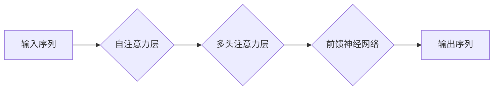
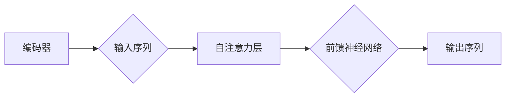
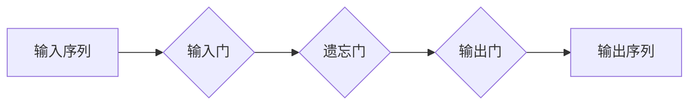

# 大语言模型应用指南：进阶

## 1. 背景介绍

近年来，随着深度学习技术的快速发展，大语言模型（LLMs，Large Language Models）在自然语言处理（NLP）领域取得了显著的突破。LLMs 以其强大的语言理解和生成能力，在文本生成、机器翻译、问答系统、文本摘要等领域展现出巨大的潜力。然而，LLMs 的设计和应用涉及到众多复杂的技术和概念，对普通开发者来说具有一定的挑战性。本文旨在为读者提供一份进阶指南，帮助读者深入了解大语言模型，并掌握其在实际应用中的关键技术和方法。

## 2. 核心概念与联系

### 2.1 自然语言处理（NLP）

自然语言处理是计算机科学和人工智能领域的一个重要分支，主要研究如何让计算机理解和处理人类语言。NLP 技术在语音识别、机器翻译、情感分析、文本分类等领域有着广泛的应用。

### 2.2 深度学习

深度学习是机器学习的一个分支，通过模仿人脑神经元结构，使用多层的神经网络进行特征提取和模式识别。深度学习在图像识别、语音识别、自然语言处理等领域取得了显著的成果。

### 2.3 大语言模型（LLMs）

大语言模型是指具有海量参数和训练数据，能够模拟人类语言表达和理解的深度学习模型。LLMs 通常采用循环神经网络（RNN）、长短期记忆网络（LSTM）或Transformer等架构。

## 3. 核心算法原理具体操作步骤

### 3.1 Transformer模型

Transformer模型是近年来在NLP领域取得突破性的成果，其核心思想是使用自注意力机制来捕捉序列之间的长距离依赖关系。

#### 3.1.1 自注意力机制

自注意力机制是一种将序列中的每个元素与其他所有元素进行相似度计算的机制，从而得到一个全局表示。



#### 3.1.2多头注意力

多头注意力将序列分成多个部分，分别学习对应的表示，并通过拼接和拼接后的线性变换得到最终的输出。

#### 3.1.3 编码器和解码器

编码器负责将输入序列转换为固定长度的向量，解码器则负责将编码器输出的向量转换为输出序列。



### 3.2 LSTM模型

LSTM（长短期记忆网络）是一种特殊的循环神经网络，用于解决RNN模型在处理长序列数据时易出现梯度消失或梯度爆炸的问题。

#### 3.2.1 单个LSTM单元

单个LSTM单元包含三个门：输入门、遗忘门和输出门，用于控制信息的流入、删除和输出。



#### 3.2.2 多个LSTM单元

通过将多个LSTM单元串联起来，可以构建一个具有更强大处理能力的LSTM网络。

## 4. 数学模型和公式详细讲解举例说明

### 4.1 随机梯度下降（SGD）

随机梯度下降是一种常见的优化算法，通过迭代更新模型参数，使损失函数最小化。

$$
\\theta_{t+1} = \\theta_{t} - \\alpha \\cdot \nabla_{\\theta}J(\\theta_{t})
$$

其中，$\\theta_{t}$ 表示当前模型参数，$\\alpha$ 表示学习率，$J(\\theta_{t})$ 表示损失函数。

### 4.2 语言模型（LM）

语言模型是一种概率模型，用于预测下一个单词的概率。常见的语言模型有基于N-gram、神经网络等。

$$
P(w_{t} \\mid w_{t-1}, w_{t-2}, \\ldots, w_{1}) = \\frac{P(w_{t} \\mid w_{t-1}) \\cdot P(w_{t-1} \\mid w_{t-2}) \\cdot \\ldots \\cdot P(w_{2} \\mid w_{1})}{P(w_{t-1}) \\cdot P(w_{t-2}) \\cdot \\ldots \\cdot P(w_{1})}
$$

## 5. 项目实践：代码实例和详细解释说明

### 5.1 使用PyTorch实现一个简单的LSTM模型

```python
import torch
import torch.nn as nn

# 定义LSTM模型
class LSTMModel(nn.Module):
    def __init__(self, input_dim, hidden_dim, output_dim):
        super(LSTMModel, self).__init__()
        self.lstm = nn.LSTM(input_dim, hidden_dim, batch_first=True)
        self.fc = nn.Linear(hidden_dim, output_dim)

    def forward(self, x):
        output, (hidden, cell) = self.lstm(x)
        output = self.fc(output[:, -1, :])
        return output
```

### 5.2 使用Transformer模型实现一个文本生成器

```python
import torch
import torch.nn as nn

# 定义Transformer模型
class TransformerModel(nn.Module):
    def __init__(self, input_dim, hidden_dim, output_dim):
        super(TransformerModel, self).__init__()
        self.transformer = nn.Transformer(input_dim, hidden_dim, output_dim)

    def forward(self, x):
        output = self.transformer(x)
        return output
```

## 6. 实际应用场景

LLMs 在实际应用中具有广泛的应用场景，以下列举一些常见的应用：

- 文本生成：如文章生成、对话生成、诗歌创作等。
- 机器翻译：将一种语言的文本翻译成另一种语言。
- 问答系统：根据用户输入的问题，从海量文本中检索并返回相关答案。
- 文本摘要：将长篇文章或段落简化为简洁的摘要。

## 7. 工具和资源推荐

- 深度学习框架：PyTorch、TensorFlow、Keras等。
- 自然语言处理库：NLTK、SpaCy、transformers等。
- 数据集：Wikitext-2、Common Crawl、AG News等。

## 8. 总结：未来发展趋势与挑战

随着深度学习技术的不断发展，LLMs 将在以下方面取得突破：

- 模型性能：LLMs 将在语言理解和生成能力上取得更高的性能。
- 应用领域：LLMs 将在更多领域得到应用，如智能客服、智能助手等。
- 模型可解释性：研究更可解释的LLMs，提高其在实际应用中的可信度。

然而，LLMs 也面临着以下挑战：

- 计算资源消耗：LLMs 需要大量的计算资源进行训练和推理。
- 数据安全：LLMs 的训练和推理过程中涉及到大量敏感数据，需要确保数据安全。
- 模型可解释性：LLMs 的决策过程复杂，需要提高模型可解释性。

## 9. 附录：常见问题与解答

### 9.1 什么是Transformer模型？

Transformer模型是一种基于自注意力机制的深度学习模型，在NLP领域取得了显著的成果。

### 9.2 如何评估LLMs的性能？

评估LLMs的性能可以从以下几个方面进行：

- 语言理解能力：通过自然语言理解（NLU）测试评估LLMs对自然语言的理解能力。
- 语言生成能力：通过自然语言生成（NLG）测试评估LLMs生成自然语言的能力。
- 损失函数：通过损失函数评估LLMs在训练过程中的性能。

### 9.3 如何优化LLMs的性能？

优化LLMs的性能可以从以下几个方面入手：

- 数据增强：通过数据增强技术提高训练数据的多样性。
- 模型结构：优化模型结构，提高模型的性能和泛化能力。
- 训练技巧：使用更先进的训练技巧，如迁移学习、知识蒸馏等。

作者：禅与计算机程序设计艺术 / Zen and the Art of Computer Programming