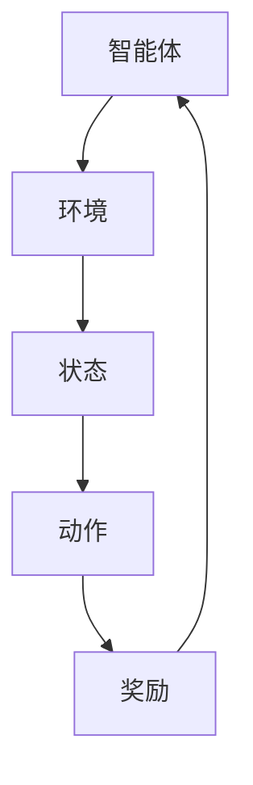

# 强化学习 (Reinforcement Learning) 原理与代码实例讲解

## 1.背景介绍

强化学习（Reinforcement Learning, RL）是机器学习的一个重要分支，近年来在人工智能领域取得了显著的进展。与监督学习和无监督学习不同，强化学习通过与环境的交互来学习策略，以最大化累积奖励。RL在游戏、机器人控制、自动驾驶等领域有着广泛的应用。

## 2.核心概念与联系

### 2.1 强化学习的基本要素

强化学习的基本要素包括：

- **智能体（Agent）**：执行动作的主体。
- **环境（Environment）**：智能体所处的外部世界。
- **状态（State, s）**：环境在某一时刻的具体情况。
- **动作（Action, a）**：智能体在某一状态下可以执行的操作。
- **奖励（Reward, r）**：智能体执行动作后环境反馈的信号。
- **策略（Policy, π）**：智能体在各状态下选择动作的规则。
- **价值函数（Value Function, V）**：评估状态或状态-动作对的好坏。
- **Q函数（Q-Function, Q）**：评估在某一状态下执行某一动作的价值。

### 2.2 强化学习的工作流程



## 3.核心算法原理具体操作步骤

### 3.1 Q-Learning

Q-Learning 是一种无模型的强化学习算法，通过学习状态-动作对的价值来找到最优策略。

#### 3.1.1 算法步骤

1. 初始化 Q 表格，所有 Q 值设为零。
2. 重复以下步骤直到收敛：
   - 在状态 s 选择动作 a（根据 ε-贪婪策略）。
   - 执行动作 a，观察奖励 r 和下一个状态 s'。
   - 更新 Q 值：
     $$
     Q(s, a) \leftarrow Q(s, a) + \alpha [r + \gamma \max_{a'} Q(s', a') - Q(s, a)]
     $$
   - 将状态 s 更新为 s'。

### 3.2 深度Q网络（DQN）

DQN 结合了 Q-Learning 和深度神经网络，能够处理高维状态空间。

#### 3.2.1 算法步骤

1. 初始化经验回放池和 Q 网络。
2. 重复以下步骤直到收敛：
   - 在状态 s 选择动作 a（根据 ε-贪婪策略）。
   - 执行动作 a，观察奖励 r 和下一个状态 s'。
   - 将经验 (s, a, r, s') 存入回放池。
   - 从回放池中随机抽取小批量样本 (s, a, r, s')。
   - 计算目标 Q 值：
     $$
     y = r + \gamma \max_{a'} Q(s', a')
     $$
   - 最小化损失函数：
     $$
     L = (y - Q(s, a))^2
     $$

## 4.数学模型和公式详细讲解举例说明

### 4.1 马尔可夫决策过程（MDP）

强化学习通常建模为马尔可夫决策过程（MDP），其定义为五元组 (S, A, P, R, γ)：

- **S**：状态空间。
- **A**：动作空间。
- **P**：状态转移概率，$P(s'|s, a)$ 表示在状态 s 执行动作 a 后转移到状态 s' 的概率。
- **R**：奖励函数，$R(s, a)$ 表示在状态 s 执行动作 a 后获得的奖励。
- **γ**：折扣因子，$0 \leq \gamma \leq 1$，用于权衡未来奖励的重要性。

### 4.2 贝尔曼方程

贝尔曼方程是强化学习的核心，用于描述价值函数的递归关系。

#### 4.2.1 状态价值函数

状态价值函数 V(s) 表示在状态 s 下的期望累积奖励：

$$
V(s) = \mathbb{E}[R_t + \gamma V(s_{t+1}) | s_t = s]
$$

#### 4.2.2 状态-动作价值函数

状态-动作价值函数 Q(s, a) 表示在状态 s 执行动作 a 后的期望累积奖励：

$$
Q(s, a) = \mathbb{E}[R_t + \gamma \max_{a'} Q(s_{t+1}, a') | s_t = s, a_t = a]
$$

## 5.项目实践：代码实例和详细解释说明

### 5.1 Q-Learning 实现

以下是一个简单的 Q-Learning 实现示例，使用 Python 和 NumPy：

```python
import numpy as np
import gym

env = gym.make('FrozenLake-v0')
Q = np.zeros((env.observation_space.n, env.action_space.n))
alpha = 0.1
gamma = 0.99
epsilon = 0.1
num_episodes = 1000

for episode in range(num_episodes):
    state = env.reset()
    done = False
    while not done:
        if np.random.rand() < epsilon:
            action = env.action_space.sample()
        else:
            action = np.argmax(Q[state])
        next_state, reward, done, _ = env.step(action)
        Q[state, action] = Q[state, action] + alpha * (reward + gamma * np.max(Q[next_state]) - Q[state, action])
        state = next_state

print("Q-Table:")
print(Q)
```

### 5.2 DQN 实现

以下是一个简单的 DQN 实现示例，使用 Python 和 TensorFlow：

```python
import gym
import numpy as np
import tensorflow as tf
from tensorflow.keras import layers

env = gym.make('CartPole-v1')
num_actions = env.action_space.n
state_shape = env.observation_space.shape

model = tf.keras.Sequential([
    layers.Dense(24, activation='relu', input_shape=state_shape),
    layers.Dense(24, activation='relu'),
    layers.Dense(num_actions, activation='linear')
])

optimizer = tf.keras.optimizers.Adam(learning_rate=0.001)
loss_function = tf.keras.losses.MeanSquaredError()

def train_step(state, action, reward, next_state, done):
    with tf.GradientTape() as tape:
        q_values = model(state)
        q_value = tf.reduce_sum(q_values * tf.one_hot(action, num_actions), axis=1)
        next_q_values = model(next_state)
        next_q_value = tf.reduce_max(next_q_values, axis=1)
        target = reward + (1.0 - done) * gamma * next_q_value
        loss = loss_function(target, q_value)
    grads = tape.gradient(loss, model.trainable_variables)
    optimizer.apply_gradients(zip(grads, model.trainable_variables))

num_episodes = 1000
gamma = 0.99
epsilon = 0.1
batch_size = 32
memory = []

for episode in range(num_episodes):
    state = env.reset()
    state = np.reshape(state, [1, state_shape[0]])
    done = False
    while not done:
        if np.random.rand() < epsilon:
            action = env.action_space.sample()
        else:
            q_values = model(state)
            action = np.argmax(q_values[0])
        next_state, reward, done, _ = env.step(action)
        next_state = np.reshape(next_state, [1, state_shape[0]])
        memory.append((state, action, reward, next_state, done))
        state = next_state
        if len(memory) > batch_size:
            minibatch = np.random.choice(memory, batch_size)
            for state, action, reward, next_state, done in minibatch:
                train_step(state, action, reward, next_state, done)

print("Training completed.")
```

## 6.实际应用场景

### 6.1 游戏

强化学习在游戏中的应用非常广泛，最著名的例子是 AlphaGo，它通过强化学习击败了人类围棋冠军。

### 6.2 机器人控制

强化学习可以用于机器人控制，例如机械臂的抓取和移动，通过不断试错来优化控制策略。

### 6.3 自动驾驶

自动驾驶汽车需要在复杂的环境中做出决策，强化学习可以帮助优化驾驶策略，提高安全性和效率。

## 7.工具和资源推荐

### 7.1 开源库

- **OpenAI Gym**：一个用于开发和比较强化学习算法的工具包。
- **TensorFlow**：一个广泛使用的深度学习框架，支持强化学习。
- **PyTorch**：另一个流行的深度学习框架，适合研究和开发强化学习算法。

### 7.2 书籍

- **《强化学习：原理与实践》**：一本全面介绍强化学习理论和实践的书籍。
- **《深度强化学习》**：深入探讨深度强化学习的原理和应用。

## 8.总结：未来发展趋势与挑战

强化学习在许多领域展