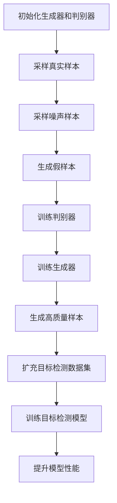

# 生成对抗网络(GAN)与目标检测的融合

## 1.背景介绍

在过去的十年中，深度学习在计算机视觉领域取得了显著的进展。生成对抗网络（GAN）和目标检测是其中两个重要的研究方向。GAN由Ian Goodfellow等人在2014年提出，迅速成为生成模型领域的热点。目标检测则是计算机视觉中的一个经典问题，旨在识别图像中的目标并确定其位置。随着技术的不断发展，研究人员开始探索如何将GAN与目标检测相结合，以提升目标检测的性能和应用范围。

## 2.核心概念与联系

### 2.1 生成对抗网络（GAN）

GAN由生成器（Generator）和判别器（Discriminator）组成。生成器试图生成逼真的数据样本，而判别器则试图区分真实数据和生成数据。两者通过对抗训练，最终生成器能够生成与真实数据难以区分的样本。

### 2.2 目标检测

目标检测的任务是识别图像中的目标并确定其边界框。常见的目标检测算法包括R-CNN、YOLO和SSD等。这些算法通常基于卷积神经网络（CNN），通过特征提取和分类来实现目标检测。

### 2.3 GAN与目标检测的联系

将GAN与目标检测相结合，可以利用GAN生成的高质量样本来增强目标检测模型的训练数据，从而提升模型的泛化能力。此外，GAN还可以用于生成特定场景下的目标样本，帮助解决数据稀缺问题。

## 3.核心算法原理具体操作步骤

### 3.1 GAN的训练过程

1. 初始化生成器和判别器的参数。
2. 从真实数据集中采样一批真实样本。
3. 从噪声分布中采样一批噪声样本，并通过生成器生成假样本。
4. 使用真实样本和假样本训练判别器，更新判别器参数。
5. 使用假样本训练生成器，更新生成器参数。
6. 重复步骤2-5，直到生成器生成的样本足够逼真。

### 3.2 目标检测的训练过程

1. 准备标注好的训练数据集，包括图像和对应的目标边界框。
2. 初始化目标检测模型的参数。
3. 将图像输入模型，提取特征并预测目标边界框和类别。
4. 计算预测结果与真实标注之间的损失。
5. 通过反向传播更新模型参数。
6. 重复步骤3-5，直到模型收敛。

### 3.3 GAN与目标检测的融合

1. 使用GAN生成高质量的目标样本，扩充目标检测模型的训练数据集。
2. 将生成的样本与真实样本混合，训练目标检测模型。
3. 通过对抗训练，提升目标检测模型的鲁棒性和泛化能力。



## 4.数学模型和公式详细讲解举例说明

### 4.1 GAN的数学模型

GAN的目标是通过生成器 $G$ 和判别器 $D$ 的对抗训练，使生成器生成的样本分布 $p_g$ 接近真实数据分布 $p_{data}$。其损失函数定义为：

$$
\min_G \max_D V(D, G) = \mathbb{E}_{x \sim p_{data}(x)}[\log D(x)] + \mathbb{E}_{z \sim p_z(z)}[\log(1 - D(G(z)))]
$$

其中，$x$ 是真实数据样本，$z$ 是噪声样本，$G(z)$ 是生成的假样本，$D(x)$ 是判别器对真实样本的判别结果，$D(G(z))$ 是判别器对假样本的判别结果。

### 4.2 目标检测的数学模型

目标检测模型通常包括两个部分：边界框回归和目标分类。其损失函数可以表示为：

$$
L = L_{cls} + \lambda L_{reg}
$$

其中，$L_{cls}$ 是分类损失，$L_{reg}$ 是边界框回归损失，$\lambda$ 是权重系数。

### 4.3 GAN与目标检测的融合

通过将GAN生成的样本加入目标检测模型的训练数据集，可以提升模型的泛化能力。其损失函数可以表示为：

$$
L_{total} = L_{real} + \alpha L_{fake}
$$

其中，$L_{real}$ 是真实样本的损失，$L_{fake}$ 是生成样本的损失，$\alpha$ 是权重系数。

## 5.项目实践：代码实例和详细解释说明

### 5.1 GAN的实现

以下是一个简单的GAN实现示例，使用PyTorch框架：

```python
import torch
import torch.nn as nn
import torch.optim as optim

class Generator(nn.Module):
    def __init__(self):
        super(Generator, self).__init__()
        self.main = nn.Sequential(
            nn.Linear(100, 256),
            nn.ReLU(True),
            nn.Linear(256, 512),
            nn.ReLU(True),
            nn.Linear(512, 1024),
            nn.ReLU(True),
            nn.Linear(1024, 784),
            nn.Tanh()
        )

    def forward(self, x):
        return self.main(x)

class Discriminator(nn.Module):
    def __init__(self):
        super(Discriminator, self).__init__()
        self.main = nn.Sequential(
            nn.Linear(784, 1024),
            nn.LeakyReLU(0.2, inplace=True),
            nn.Linear(1024, 512),
            nn.LeakyReLU(0.2, inplace=True),
            nn.Linear(512, 256),
            nn.LeakyReLU(0.2, inplace=True),
            nn.Linear(256, 1),
            nn.Sigmoid()
        )

    def forward(self, x):
        return self.main(x)

# 初始化生成器和判别器
G = Generator()
D = Discriminator()

# 定义损失函数和优化器
criterion = nn.BCELoss()
optimizerG = optim.Adam(G.parameters(), lr=0.0002)
optimizerD = optim.Adam(D.parameters(), lr=0.0002)

# 训练GAN
for epoch in range(10000):
    # 训练判别器
    real_data = torch.randn(64, 784)
    fake_data = G(torch.randn(64, 100)).detach()
    real_label = torch.ones(64, 1)
    fake_label = torch.zeros(64, 1)

    optimizerD.zero_grad()
    output_real = D(real_data)
    loss_real = criterion(output_real, real_label)
    output_fake = D(fake_data)
    loss_fake = criterion(output_fake, fake_label)
    lossD = loss_real + loss_fake
    lossD.backward()
    optimizerD.step()

    # 训练生成器
    fake_data = G(torch.randn(64, 100))
    output = D(fake_data)
    lossG = criterion(output, real_label)

    optimizerG.zero_grad()
    lossG.backward()
    optimizerG.step()

    if epoch % 1000 == 0:
        print(f'Epoch [{epoch}/10000], Loss D: {lossD.item()}, Loss G: {lossG.item()}')
```

### 5.2 目标检测的实现

以下是一个简单的目标检测实现示例，使用YOLOv3模型：

```python
import torch
import torch.nn as nn
import torch.optim as optim
from torchvision import datasets, transforms
from yolo_model import YOLOv3

# 加载数据集
transform = transforms.Compose([
    transforms.Resize((416, 416)),
    transforms.ToTensor()
])
train_dataset = datasets.VOCDetection(root='data/VOC', year='2012', image_set='train', download=True, transform=transform)
train_loader = torch.utils.data.DataLoader(train_dataset, batch_size=16, shuffle=True)

# 初始化YOLOv3模型
model = YOLOv3(num_classes=20)

# 定义损失函数和优化器
criterion = nn.CrossEntropyLoss()
optimizer = optim.Adam(model.parameters(), lr=0.001)

# 训练YOLOv3
for epoch in range(50):
    for images, targets in train_loader:
        optimizer.zero_grad()
        outputs = model(images)
        loss = criterion(outputs, targets)
        loss.backward()
        optimizer.step()

    print(f'Epoch [{epoch}/50], Loss: {loss.item()}')
```

### 5.3 GAN与目标检测的融合

以下是将GAN生成的样本用于目标检测模型训练的示例：

```python
# 生成高质量样本
fake_data = G(torch.randn(1000, 100))

# 扩充目标检测数据集
extended_dataset = torch.cat((train_dataset, fake_data), dim=0)
extended_loader = torch.utils.data.DataLoader(extended_dataset, batch_size=16, shuffle=True)

# 训练目标检测模型
for epoch in range(50):
    for images, targets in extended_loader:
        optimizer.zero_grad()
        outputs = model(images)
        loss = criterion(outputs, targets)
        loss.backward()
        optimizer.step()

    print(f'Epoch [{epoch}/50], Loss: {loss.item()}')
```

## 6.实际应用场景

### 6.1 数据增强

GAN可以用于生成多样化的目标样本，扩充训练数据集，提升目标检测模型的泛化能力。例如，在自动驾驶领域，GAN可以生成不同天气、光照条件下的行人、车辆等目标样本，增强模型的鲁棒性。

### 6.2 小样本学习

在某些特定场景下，获取大量标注数据可能非常困难。GAN可以生成高质量的目标样本，帮助解决数据稀缺问题。例如，在医疗影像分析中，GAN可以生成不同病变类型的样本，提升目标检测模型的性能。

### 6.3 数据隐私保护

在某些敏感领域，直接使用真实数据进行训练可能会涉及隐私问题。GAN可以生成与真实数据分布相似的假样本，用于目标检测模型的训练，保护数据隐私。例如，在