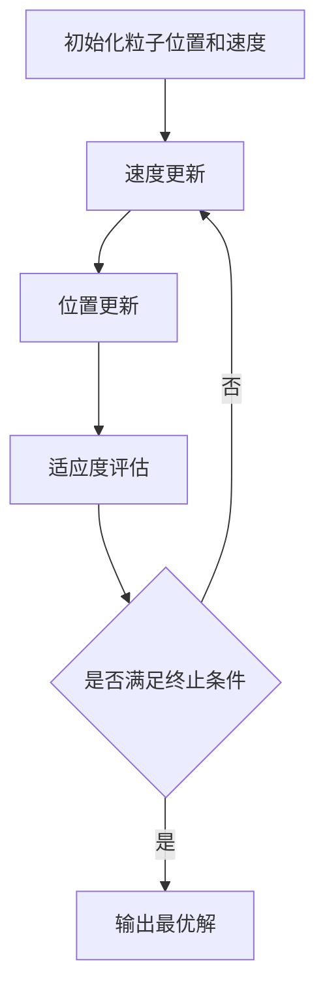

# 粒子群算法(Particle Swarm Optimization) - 原理与代码实例讲解

## 1.背景介绍

粒子群算法（Particle Swarm Optimization，简称PSO）是一种基于群体智能的优化算法，由Kennedy和Eberhart于1995年提出。PSO受鸟群觅食行为的启发，通过模拟个体（粒子）之间的信息共享和协作来寻找问题的最优解。由于其简单易实现、收敛速度快等优点，PSO在函数优化、神经网络训练、图像处理等多个领域得到了广泛应用。

## 2.核心概念与联系

### 2.1 粒子

在PSO中，每个粒子代表一个潜在的解。粒子在搜索空间中移动，通过不断更新自身的位置和速度来寻找最优解。

### 2.2 速度和位置

粒子的速度决定了其在搜索空间中的移动方向和距离。位置则表示粒子当前的解。速度和位置的更新是PSO的核心操作。

### 2.3 适应度函数

适应度函数用于评估粒子当前解的优劣。PSO通过适应度函数来指导粒子的搜索方向。

### 2.4 全局最优和局部最优

全局最优是指所有粒子中适应度值最优的解。局部最优是指某个粒子自身及其邻居粒子中适应度值最优的解。

## 3.核心算法原理具体操作步骤

### 3.1 初始化

初始化粒子的位置和速度，通常是随机生成的。设定适应度函数和算法参数，如粒子数量、最大迭代次数等。

### 3.2 速度更新

根据粒子自身的历史最优位置和全局最优位置来更新粒子的速度。速度更新公式如下：

$$
v_{i}(t+1) = w \cdot v_{i}(t) + c_{1} \cdot r_{1} \cdot (p_{i} - x_{i}(t)) + c_{2} \cdot r_{2} \cdot (g - x_{i}(t))
$$

其中，$v_{i}(t)$ 是粒子 $i$ 在时间 $t$ 的速度，$w$ 是惯性权重，$c_{1}$ 和 $c_{2}$ 是加速常数，$r_{1}$ 和 $r_{2}$ 是随机数，$p_{i}$ 是粒子 $i$ 的历史最优位置，$g$ 是全局最优位置，$x_{i}(t)$ 是粒子 $i$ 在时间 $t$ 的位置。

### 3.3 位置更新

根据更新后的速度来更新粒子的位置。位置更新公式如下：

$$
x_{i}(t+1) = x_{i}(t) + v_{i}(t+1)
$$

### 3.4 适应度评估

计算每个粒子的新位置的适应度值，并更新粒子的历史最优位置和全局最优位置。

### 3.5 迭代

重复速度更新、位置更新和适应度评估步骤，直到达到最大迭代次数或满足收敛条件。



## 4.数学模型和公式详细讲解举例说明

### 4.1 速度更新公式

速度更新公式是PSO的核心，通过结合粒子自身的历史最优位置和全局最优位置来调整粒子的速度。公式如下：

$$
v_{i}(t+1) = w \cdot v_{i}(t) + c_{1} \cdot r_{1} \cdot (p_{i} - x_{i}(t)) + c_{2} \cdot r_{2} \cdot (g - x_{i}(t))
$$

- $w$：惯性权重，控制粒子当前速度的影响。
- $c_{1}$：自我认知系数，控制粒子向自身历史最优位置靠近的速度。
- $c_{2}$：社会认知系数，控制粒子向全局最优位置靠近的速度。
- $r_{1}$ 和 $r_{2}$：在 [0, 1] 之间的随机数，增加搜索的随机性。

### 4.2 位置更新公式

位置更新公式通过将速度加到当前位置上来更新粒子的位置。公式如下：

$$
x_{i}(t+1) = x_{i}(t) + v_{i}(t+1)
$$

### 4.3 适应度函数

适应度函数用于评估粒子当前解的优劣。不同的问题有不同的适应度函数。例如，对于一个简单的二次函数优化问题：

$$
f(x) = x^2
$$

适应度函数可以直接使用 $f(x)$ 的值。

### 4.4 举例说明

假设我们要优化一个简单的二次函数 $f(x) = x^2$，目标是找到使 $f(x)$ 最小的 $x$ 值。我们可以使用PSO来解决这个问题。

1. 初始化粒子的位置和速度，假设有3个粒子，初始位置分别为 $x_1 = 2$，$x_2 = -1$，$x_3 = 0.5$，初始速度为 $v_1 = 0.1$，$v_2 = -0.1$，$v_3 = 0.05$。
2. 计算初始适应度值，分别为 $f(x_1) = 4$，$f(x_2) = 1$，$f(x_3) = 0.25$。
3. 更新速度和位置，假设 $w = 0.5$，$c_1 = 1.5$，$c_2 = 1.5$，$r_1 = 0.8$，$r_2 = 0.9$。
4. 迭代更新，直到找到最优解。

## 5.项目实践：代码实例和详细解释说明

### 5.1 Python代码实例

以下是一个使用Python实现的PSO代码示例，用于优化一个简单的二次函数 $f(x) = x^2$。

```python
import numpy as np

# 定义适应度函数
def fitness_function(x):
    return x**2

# 粒子类
class Particle:
    def __init__(self, position, velocity):
        self.position = position
        self.velocity = velocity
        self.best_position = position
        self.best_fitness = fitness_function(position)

# PSO算法
def pso(num_particles, num_iterations, w, c1, c2):
    particles = [Particle(np.random.uniform(-10, 10), np.random.uniform(-1, 1)) for _ in range(num_particles)]
    global_best_position = particles[0].position
    global_best_fitness = fitness_function(global_best_position)

    for _ in range(num_iterations):
        for particle in particles:
            # 更新速度
            r1, r2 = np.random.rand(), np.random.rand()
            particle.velocity = (w * particle.velocity +
                                 c1 * r1 * (particle.best_position - particle.position) +
                                 c2 * r2 * (global_best_position - particle.position))
            # 更新位置
            particle.position += particle.velocity
            # 计算适应度
            fitness = fitness_function(particle.position)
            # 更新粒子历史最优位置
            if fitness < particle.best_fitness:
                particle.best_position = particle.position
                particle.best_fitness = fitness
            # 更新全局最优位置
            if fitness < global_best_fitness:
                global_best_position = particle.position
                global_best_fitness = fitness

    return global_best_position, global_best_fitness

# 参数设置
num_particles = 30
num_iterations = 100
w = 0.5
c1 = 1.5
c2 = 1.5

# 运行PSO算法
best_position, best_fitness = pso(num_particles, num_iterations, w, c1, c2)
print(f"最优位置: {best_position}, 最优适应度: {best_fitness}")
```

### 5.2 代码解释

1. **适应度函数**：定义了一个简单的二次函数 $f(x) = x^2$。
2. **粒子类**：定义了粒子的属性，包括位置、速度、历史最优位置和历史最优适应度。
3. **PSO算法**：实现了PSO的核心步骤，包括速度更新、位置更新和适应度评估。
4. **参数设置**：设置了粒子数量、迭代次数、惯性权重和加速常数。
5. **运行PSO算法**：调用PSO算法并输出最优位置和最优适应度。

## 6.实际应用场景

### 6.1 函数优化

PSO可以用于求解各种复杂的函数优化问题，如多峰函数、非线性函数等。

### 6.2 神经网络训练

PSO可以用于优化神经网络的权重和结构，提高神经网络的训练效果和泛化能力。

### 6.3 图像处理

PSO可以用于图像分割、图像配准等图像处理任务，提高图像处理的精度和效率。

### 6.4 工程优化

PSO可以用于工程设计中的参数优化，如结构优化、控制系统优化等，提高工程设计的性能和可靠性。

## 7.工具和资源推荐

### 7.1 工具

- **Python**：Python是实现PSO的理想编程语言，具有丰富的科学计算库，如NumPy、SciPy等。
- **MATLAB**：MATLAB提供了强大的数值计算和可视化功能，适合用于PSO的研究和应用。
- **R**：R语言在统计分析和数据挖掘方面具有优势，可以用于PSO的实现和应用。

### 7.2 资源

- **书籍**：《粒子群优化算法原理与应用》：详细介绍了PSO的原理、算法和应用。
- **论文**：Kennedy和Eberhart的原始论文《Particle Swarm Optimization》：PSO的奠基性文献。
- **在线课程**：Coursera、edX等平台上的优化算法课程，提供了PSO的系统学习资源。

## 8.总结：未来发展趋势与挑战

### 8.1 未来发展趋势

- **混合算法**：将PSO与其他优化算法结合，如遗传算法、蚁群算法等，形成混合优化算法，提高优化效果。
- **多目标优化**：研究多目标PSO算法，解决多目标优化问题，提高算法的实用性。
- **分布式计算**：利用分布式计算技术，提高PSO的计算效率，解决大规模优化问题。

### 8.2 挑战

- **参数选择**：PSO的性能对参数选择敏感，如何选择合适的参数是一个挑战。
- **收敛性**：PSO在某些复杂问题上可能存在收敛性问题，如何提高算法的收敛性是一个研究热点。
- **应用推广**：如何将PSO应用于更多实际问题，特别是复杂的工程和科学问题，是一个重要的研究方向。

## 9.附录：常见问题与解答

### 9.1 PSO适用于哪些类型的问题？

PSO适用于连续优化问题，特别是高维、多峰、非线性等复杂优化问题。

### 9.2 如何选择PSO的参数？

PSO的参数选择可以通过实验调整，或者使用参数优化技术，如网格搜索、贝叶斯优化等。

### 9.3 PSO的收敛性如何保证？

PSO的收敛性可以通过调整惯性权重、加速常数等参数，以及引入收敛判据来保证。

### 9.4 PSO与遗传算法相比有哪些优缺点？

PSO的优点是实现简单、收敛速度快，缺点是容易陷入局部最优。遗传算法的优点