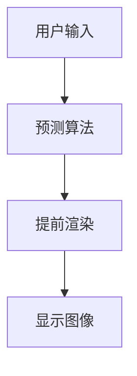
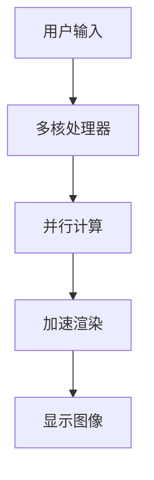
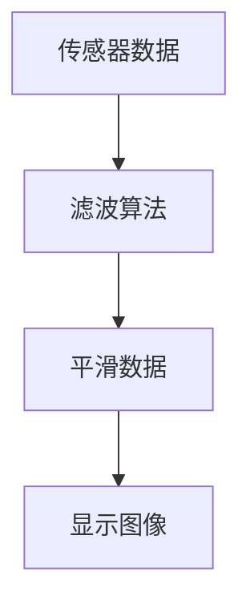
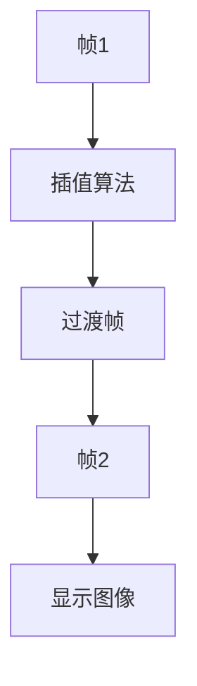
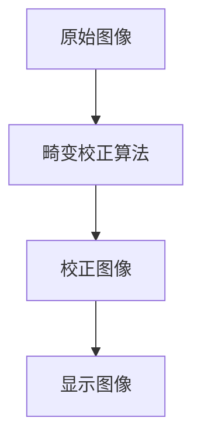
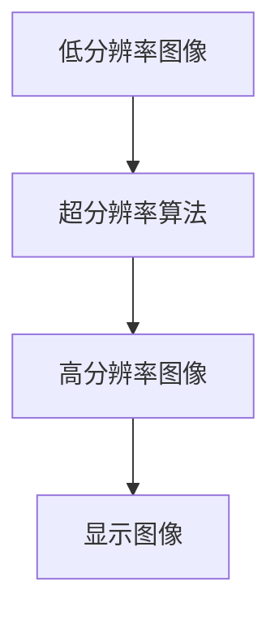

# 《虚拟现实与鲁棒性：提高体验的稳定性》

## 1.背景介绍

虚拟现实（Virtual Reality，VR）技术近年来取得了显著的进展，广泛应用于游戏、教育、医疗、建筑等多个领域。然而，尽管VR技术在视觉和交互体验上取得了巨大突破，用户在使用过程中仍然会遇到一些问题，如延迟、抖动、图像失真等。这些问题不仅影响用户体验，还可能导致晕动症等不适反应。因此，提高VR系统的鲁棒性，确保其在各种环境和条件下的稳定性和可靠性，成为了一个重要的研究课题。

## 2.核心概念与联系

### 2.1 虚拟现实的基本概念

虚拟现实是一种通过计算机生成的三维环境，用户可以通过头戴式显示器（HMD）和其他输入设备（如手柄、手套等）与之进行交互。VR系统的核心组件包括显示设备、传感器、计算机和软件。

### 2.2 鲁棒性的定义

鲁棒性（Robustness）是指系统在面对不确定性、干扰和变化时，仍能保持其功能和性能的能力。在VR系统中，鲁棒性主要体现在以下几个方面：
- **延迟**：系统响应时间的稳定性。
- **抖动**：图像和交互的平滑性。
- **图像失真**：图像质量的稳定性。

### 2.3 虚拟现实与鲁棒性的联系

在VR系统中，鲁棒性直接影响用户体验。高鲁棒性的VR系统能够在各种环境和条件下提供一致的高质量体验，减少用户的不适感，提高用户的沉浸感和满意度。

## 3.核心算法原理具体操作步骤

### 3.1 延迟优化算法

延迟是指从用户发出指令到系统响应的时间间隔。为了优化延迟，可以采用以下算法：

#### 3.1.1 预测算法

通过预测用户的下一步动作，提前渲染相应的图像，减少延迟。



#### 3.1.2 并行处理

利用多核处理器和GPU的并行计算能力，加速图像渲染和数据处理。



### 3.2 抖动抑制算法

抖动是指图像和交互的不平滑现象。为了抑制抖动，可以采用以下算法：

#### 3.2.1 滤波算法

通过对传感器数据进行滤波，去除高频噪声，平滑图像和交互。



#### 3.2.2 插值算法

在帧与帧之间插入过渡帧，平滑图像和交互。



### 3.3 图像失真校正算法

图像失真是指图像质量的下降。为了校正图像失真，可以采用以下算法：

#### 3.3.1 畸变校正算法

通过对图像进行几何变换，校正畸变。



#### 3.3.2 超分辨率算法

通过对低分辨率图像进行超分辨率处理，提高图像质量。



## 4.数学模型和公式详细讲解举例说明

### 4.1 延迟优化的数学模型

延迟优化的核心在于预测用户的下一步动作。假设用户的动作可以用一个时间序列 $X(t)$ 表示，预测算法的目标是找到一个函数 $f$，使得 $f(X(t)) \approx X(t+1)$。

$$
X(t+1) = f(X(t)) + \epsilon
$$

其中，$\epsilon$ 是预测误差。常用的预测算法包括线性回归、卡尔曼滤波和神经网络。

### 4.2 抖动抑制的数学模型

抖动抑制的核心在于对传感器数据进行滤波。假设传感器数据可以用一个时间序列 $Y(t)$ 表示，滤波算法的目标是找到一个函数 $g$，使得 $g(Y(t))$ 是平滑的。

$$
Y_{smooth}(t) = g(Y(t))
$$

常用的滤波算法包括低通滤波、卡尔曼滤波和移动平均滤波。

### 4.3 图像失真校正的数学模型

图像失真校正的核心在于对图像进行几何变换。假设图像的像素坐标为 $(x, y)$，畸变校正算法的目标是找到一个变换函数 $h$，使得校正后的像素坐标为 $(x', y')$。

$$
(x', y') = h(x, y)
$$

常用的畸变校正算法包括双线性插值、双三次插值和径向畸变校正。

## 5.项目实践：代码实例和详细解释说明

### 5.1 延迟优化代码实例

以下是一个简单的延迟优化代码实例，使用Python和NumPy实现线性回归预测用户动作。

```python
import numpy as np

# 生成模拟用户动作数据
np.random.seed(0)
X = np.linspace(0, 10, 100)
Y = 2 * X + 1 + np.random.normal(0, 1, 100)

# 线性回归预测
def linear_regression(X, Y):
    A = np.vstack([X, np.ones(len(X))]).T
    m, c = np.linalg.lstsq(A, Y, rcond=None)[0]
    return m, c

m, c = linear_regression(X, Y)
print(f"预测模型: Y = {m:.2f}X + {c:.2f}")

# 预测下一步动作
X_next = 10.5
Y_next = m * X_next + c
print(f"预测下一步动作: Y({X_next}) = {Y_next:.2f}")
```

### 5.2 抖动抑制代码实例

以下是一个简单的抖动抑制代码实例，使用Python和SciPy实现低通滤波。

```python
import numpy as np
from scipy.signal import butter, filtfilt

# 生成模拟传感器数据
np.random.seed(0)
t = np.linspace(0, 1, 100, endpoint=False)
y = np.sin(2 * np.pi * 5 * t) + np.random.normal(0, 0.5, 100)

# 低通滤波
def lowpass_filter(data, cutoff, fs, order=5):
    nyquist = 0.5 * fs
    normal_cutoff = cutoff / nyquist
    b, a = butter(order, normal_cutoff, btype='low', analog=False)
    y = filtfilt(b, a, data)
    return y

y_filtered = lowpass_filter(y, cutoff=2, fs=100)
print("滤波后的数据:", y_filtered)
```

### 5.3 图像失真校正代码实例

以下是一个简单的图像失真校正代码实例，使用Python和OpenCV实现径向畸变校正。

```python
import cv2
import numpy as np

# 读取图像
image = cv2.imread('distorted_image.jpg')

# 畸变校正参数
K = np.array([[800, 0, 320], [0, 800, 240], [0, 0, 1]])
D = np.array([-0.3, 0.1, 0, 0])

# 畸变校正
h, w = image.shape[:2]
new_K, _ = cv2.getOptimalNewCameraMatrix(K, D, (w, h), 1, (w, h))
map1, map2 = cv2.initUndistortRectifyMap(K, D, None, new_K, (w, h), 5)
undistorted_image = cv2.remap(image, map1, map2, cv2.INTER_LINEAR)

# 显示校正后的图像
cv2.imshow('Undistorted Image', undistorted_image)
cv2.waitKey(0)
cv2.destroyAllWindows()
```

## 6.实际应用场景

### 6.1 游戏

在游戏中，延迟和抖动会严重影响玩家的体验。通过优化延迟和抑制抖动，可以提高游戏的流畅性和沉浸感。

### 6.2 教育

在教育中，VR技术可以用于虚拟实验、历史重现等场景。提高VR系统的鲁棒性，可以确保学生在各种环境下都能获得一致的学习体验。

### 6.3 医疗

在医疗中，VR技术可以用于手术模拟、康复训练等场景。提高VR系统的鲁棒性，可以确保医生和患者在使用过程中获得稳定的体验，减少不适感。

### 6.4 建筑

在建筑中，VR技术可以用于虚拟设计、施工模拟等场景。提高VR系统的鲁棒性，可以确保设计师和工程师在各种环境下都能获得一致的设计和施工体验。

## 7.工具和资源推荐

### 7.1 开发工具

- **Unity**：一款强大的游戏引擎，支持VR开发。
- **Unreal Engine**：另一款强大的游戏引擎，支持高质量的VR开发。
- **OpenCV**：一个