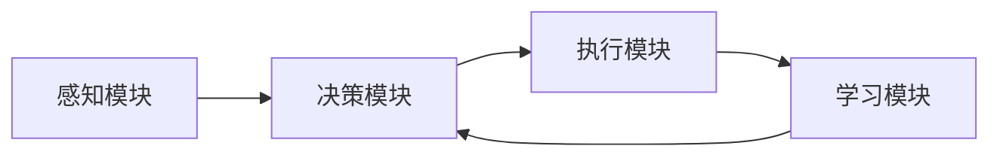

# AI Agent: AI的下一个风口 自主决策与人类的伦理界限

## 1. 背景介绍
### 1.1 人工智能的发展历程
#### 1.1.1 早期人工智能
#### 1.1.2 机器学习时代  
#### 1.1.3 深度学习革命

### 1.2 AI Agent的兴起
#### 1.2.1 AI Agent的定义
#### 1.2.2 AI Agent的特点
#### 1.2.3 AI Agent的应用前景

### 1.3 AI Agent带来的机遇与挑战
#### 1.3.1 AI Agent为产业带来的机遇  
#### 1.3.2 AI Agent在应用中面临的挑战
#### 1.3.3 AI Agent引发的伦理问题

## 2. 核心概念与联系
### 2.1 AI Agent的核心概念
#### 2.1.1 自主性
#### 2.1.2 交互性
#### 2.1.3 适应性

### 2.2 AI Agent与传统AI系统的区别
#### 2.2.1 自主决策能力
#### 2.2.2 持续学习能力
#### 2.2.3 社会交互能力

### 2.3 AI Agent的关键技术
#### 2.3.1 强化学习
#### 2.3.2 多智能体系统
#### 2.3.3 因果推理

### 2.4 AI Agent技术架构


## 3. 核心算法原理具体操作步骤
### 3.1 强化学习算法
#### 3.1.1 Q-Learning
#### 3.1.2 Deep Q Network DQN
#### 3.1.3 策略梯度 Policy Gradient

### 3.2 多智能体算法
#### 3.2.1 博弈论
#### 3.2.2 多智能体强化学习 MARL 
#### 3.2.3 群体智能算法

### 3.3 因果推理算法
#### 3.3.1 贝叶斯网络
#### 3.3.2 因果发现算法
#### 3.3.3 反事实推理

## 4. 数学模型和公式详细讲解举例说明
### 4.1 马尔可夫决策过程 MDP
#### 4.1.1 MDP的定义
$MDP = (S, A, P, R, \gamma)$
其中，$S$是状态空间，$A$是动作空间，$P$是状态转移概率，$R$是奖励函数，$\gamma$是折扣因子。

#### 4.1.2 MDP的贝尔曼方程
$$V(s) = \max_a \left\{ R(s,a) + \gamma \sum_{s'} P(s'|s,a) V(s') \right\}$$

#### 4.1.3 MDP在强化学习中的应用

### 4.2 博弈论模型
#### 4.2.1 纳什均衡
#### 4.2.2 最优反应
#### 4.2.3 重复博弈

### 4.3 因果图模型
#### 4.3.1 有向无环图DAG
#### 4.3.2 do算子
#### 4.3.3 因果效应估计

## 5. 项目实践：代码实例和详细解释说明
### 5.1 DQN算法实现
```python
class DQN(nn.Module):
    def __init__(self, state_dim, action_dim):
        super(DQN, self).__init__()
        self.fc1 = nn.Linear(state_dim, 64)
        self.fc2 = nn.Linear(64, 64)  
        self.fc3 = nn.Linear(64, action_dim)

    def forward(self, x):
        x = F.relu(self.fc1(x))
        x = F.relu(self.fc2(x))
        x = self.fc3(x)
        return x
```
DQN使用神经网络来逼近Q值函数，输入状态，输出每个动作的Q值。通过不断与环境交互，利用TD误差来更新神经网络参数。

### 5.2 多智能体强化学习实例
```python
for agent in agents:
    agent.actor.train()
    agent.critic.train()

for step in range(max_steps):
    actions = []
    for agent in agents:
        state = states[agent.id]
        action = agent.select_action(state)
        actions.append(action) 
        
    next_states, rewards = env.step(actions)
    
    for agent in agents:
        agent.memory.push(states[agent.id], actions[agent.id], 
                          rewards[agent.id], next_states[agent.id])
        
    states = next_states
    
    for agent in agents:
        agent.update()
```
多个智能体在同一个环境中交互，每个智能体根据自己的观察独立做出决策，但是奖励与其他智能体的行为有关。智能体需要学会合作与竞争，优化全局奖励。

### 5.3 因果推理项目案例
利用因果推理技术，分析用户行为数据，发现影响用户留存、付费的关键因素，指导产品优化。
- 数据收集：收集用户属性、行为、反馈等多维度数据
- 因果图构建：利用专家知识和因果发现算法，构建用户行为因果图
- 因果效应估计：利用因果推理算法，评估不同因素的因果效应
- 对比实验：进行A/B测试，验证因果推理结果，优化产品策略

## 6. 实际应用场景
### 6.1 智能客服
AI Agent可以利用自然语言处理和知识图谱技术，实现智能客服系统。通过与用户的多轮对话，理解用户意图，提供个性化服务。

### 6.2 自动驾驶
AI Agent是自动驾驶系统的核心，通过感知、决策、控制等模块，实现车辆的自主驾驶。AI Agent需要在复杂的交通场景中，兼顾安全性、舒适性、合规性等多个目标。

### 6.3 智能推荐  
AI Agent可以利用强化学习技术，根据用户的历史行为，实时优化推荐策略，提高用户的点击率和转化率。同时考虑新闻的多样性、用户的长期利益等因素。

## 7. 工具和资源推荐
### 7.1 开源框架
- OpenAI Gym：强化学习环境库
- TensorFlow，PyTorch：深度学习框架
- PettingZoo：多智能体强化学习环境库
- CausalNex：因果推理工具包

### 7.2 竞赛平台
- Kaggle：数据科学竞赛平台
- biendata：AI竞赛平台
- 天池：阿里巴巴大数据竞赛平台

### 7.3 学习资源
- 吴恩达《Machine Learning》课程
- 李宏毅《Deep Reinforcement Learning》课程
- 朱松纯《因果推理》课程
- 《Reinforcement Learning: An Introduction》书籍

## 8. 总结：未来发展趋势与挑战
### 8.1 AI Agent的发展趋势
- 更强的自主学习能力
- 更高的环境适应能力
- 更好的人机协作能力

### 8.2 AI Agent面临的挑战
- 样本效率
- 泛化能力
- 安全性
- 可解释性

### 8.3 AI Agent的伦理问题
- 隐私保护
- 公平性
- 可控性
- 法律责任

AI Agent技术的快速发展，给人工智能带来了新的活力，同时也带来了新的挑战。我们要积极拥抱AI Agent技术，应用其解决实际问题，但也要重视其潜在的风险，加强对AI Agent的管控。只有在发展与管控并重的前提下，AI Agent技术才能真正造福人类。

## 9. 附录：常见问题与解答
### 9.1 AI Agent与AGI（通用人工智能）的关系？
AI Agent更侧重于智能体在特定环境中的自主决策能力，而AGI追求在任意环境中的通用智能。AI Agent是实现AGI的一个重要路径，但距离真正的AGI还有很长的路要走。

### 9.2 AI Agent会取代人类吗？
AI Agent在很多领域可以辅助甚至超越人类，但不太可能完全取代人类。AI Agent与人类应该是互补的关系，人类擅长抽象思维、创造力，AI擅长具体任务、海量计算。人机协作将成为主流。

### 9.3 如何解决AI Agent的数据偏差问题？
数据偏差是AI面临的普遍挑战。针对AI Agent场景，需要注意以下几点：
- 数据来源多样化，覆盖不同人群
- 加强数据预处理，识别和纠正偏差
- 引入因果推理，追溯偏差的根源
- 后处理校正，平衡不同群体的利益

AI Agent的伦理问题是一个复杂的议题，需要技术专家、伦理学家、立法者等多方通力合作。让AI Agent技术在造福人类的同时，不会侵犯人类的权益，是我们共同的责任。

作者：禅与计算机程序设计艺术 / Zen and the Art of Computer Programming