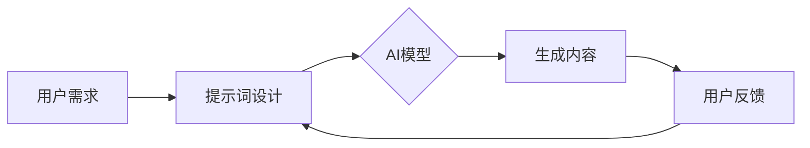

# AIGC从入门到实战：ChatGPT 需要懂得写提示词的人

## 1. 背景介绍
### 1.1 人工智能生成内容(AIGC)的兴起
近年来,人工智能生成内容(AIGC, AI-Generated Content)技术迅猛发展,尤其是以 GPT-3、DALL-E、Stable Diffusion 等为代表的大语言模型和扩散模型,在文本、图像、音频、视频等领域展现出了令人惊叹的生成能力。这些 AI 模型能够根据用户输入的文本提示(prompt),生成相关的文本、图像等内容,极大地提升了内容创作的效率和创意。

### 1.2 ChatGPT 的问世与影响
2022年11月,OpenAI 发布了 ChatGPT,一个基于 GPT-3.5 架构的大型语言模型,它在自然语言对话、问答、写作等方面表现出色,引发了全球范围内的关注和讨论。ChatGPT 的问世标志着 AIGC 技术正在走向成熟和大规模应用,为各行各业带来了新的机遇和挑战。

### 1.3 提示词工程(Prompt Engineering)的重要性
然而,要充分发挥 ChatGPT 等 AIGC 工具的潜力,关键在于如何设计出高质量的提示词(prompt)。提示词工程(Prompt Engineering)是一门专门研究如何优化提示词以引导 AI 模型生成期望内容的新兴学科。精心设计的提示词可以显著提升 AI 生成内容的质量、相关性和可控性,成为 AIGC 实践中不可或缺的环节。

## 2. 核心概念与联系
### 2.1 提示词的定义与作用
提示词是指输入给 AI 模型的文本序列,用于指导模型生成特定的内容。它通常包含任务描述、关键词、格式要求等信息,起到引导和约束 AI 模型输出的作用。优质的提示词可以帮助 AI 模型更准确地理解用户意图,生成更高质量、更符合需求的内容。

### 2.2 提示词与 AI 模型的关系
提示词是连接用户和 AI 模型的桥梁。用户通过提示词向 AI 模型表达需求,AI 模型根据提示词中提供的信息,利用其训练数据和算法生成相应的内容。提示词的质量直接影响了 AI 模型的表现,因此设计优质的提示词是 AIGC 实践中的关键环节。

### 2.3 提示词工程的核心要素
提示词工程旨在研究如何设计出高质量的提示词,其核心要素包括:
1. 明确任务目标:提示词要清晰表达期望 AI 模型完成的具体任务。
2. 提供必要的上下文信息:为 AI 模型提供足够的背景知识和约束条件。 
3. 优化提示词的表述方式:使用简洁、准确、无歧义的语言描述任务。
4. 引入示例和格式要求:通过示例和特定格式帮助 AI 模型理解和生成所需内容。



## 3. 核心算法原理具体操作步骤
ChatGPT 等大语言模型的核心算法主要基于 Transformer 架构和自回归语言建模。其基本原理和操作步骤如下:

### 3.1 文本预处理
1. 将输入的提示词进行标记化(tokenization),将文本划分为一系列离散的标记(token)。
2. 对标记进行编码,将其转换为模型可以处理的数值向量表示。

### 3.2 输入编码
1. 将编码后的提示词标记序列输入到 Transformer 编码器中。
2. 编码器通过自注意力机制(self-attention)和前馈神经网络(feed-forward neural network)对输入序列进行特征提取和编码。

### 3.3 解码生成
1. 将编码器的输出作为解码器的输入,同时将生成的标记作为解码器的另一个输入。
2. 解码器通过自注意力机制和编码-解码注意力机制(encoder-decoder attention)生成下一个标记的概率分布。
3. 根据概率分布采样或选择最可能的标记作为生成的内容。
4. 重复步骤2-3,直到生成指定长度的文本或遇到终止条件。

### 3.4 后处理
1. 将生成的标记序列解码为人类可读的文本格式。
2. 对生成的文本进行必要的格式化、过滤和校正,以满足任务要求。

## 4. 数学模型和公式详细讲解举例说明
ChatGPT 的核心数学模型基于 Transformer 架构,主要涉及以下几个关键的数学概念和公式:

### 4.1 自注意力机制(Self-Attention)
自注意力机制允许模型在处理当前标记时参考输入序列中的所有其他标记,捕捉标记之间的长距离依赖关系。其数学表达如下:

$Attention(Q, K, V) = softmax(\frac{QK^T}{\sqrt{d_k}})V$

其中,$Q$,$K$,$V$ 分别表示查询(query)、键(key)和值(value)矩阵,$d_k$ 为键向量的维度。

举例:假设输入序列为"The cat sat on the mat",自注意力机制可以帮助模型在生成"mat"时参考与之相关的"cat"和"sat",从而更好地理解句子的语义。

### 4.2 位置编码(Positional Encoding)
为了引入序列中标记的位置信息,Transformer 使用位置编码将位置信息嵌入到输入表示中。位置编码通过以下公式计算:

$PE_{(pos,2i)} = sin(pos/10000^{2i/d_{model}})$
$PE_{(pos,2i+1)} = cos(pos/10000^{2i/d_{model}})$

其中,$pos$ 表示标记在序列中的位置索引,$i$ 表示维度索引,$d_{model}$ 为模型的维度。

举例:对于位置索引为3的标记,其位置编码将捕捉该标记在序列中的相对位置信息,帮助模型理解标记的顺序关系。

### 4.3 残差连接(Residual Connection)和层归一化(Layer Normalization) 
为了缓解深层网络的梯度消失问题并加速训练收敛,Transformer 在每个子层之后引入残差连接和层归一化。其数学表达如下:

$x + Sublayer(LayerNorm(x))$

其中,$x$ 表示子层的输入,$Sublayer$ 表示子层的函数(如自注意力层或前馈层)。

举例:残差连接可以帮助梯度直接传递到前面的层,缓解梯度消失问题;层归一化可以加速模型收敛并提高训练稳定性。

## 5. 项目实践:代码实例和详细解释说明
下面通过一个简单的 Python 代码实例,演示如何使用 ChatGPT 的 API 接口生成文本内容:

```python
import openai

# 设置 OpenAI API 密钥
openai.api_key = "YOUR_API_KEY"

# 定义提示词
prompt = "请写一个关于春天的诗歌,要求:1.写4句;2.每句不超过10个字;3.押韵。"

# 调用 ChatGPT API 生成文本
response = openai.Completion.create(
    engine="text-davinci-002",
    prompt=prompt,
    max_tokens=100,
    n=1,
    stop=None,
    temperature=0.7,
)

# 输出生成的文本
print(response.choices[0].text.strip())
```

代码解释:
1. 首先,导入 `openai` 库,并设置 OpenAI API 密钥。
2. 定义提示词 `prompt`,其中包含了任务描述和具体要求。
3. 调用 `openai.Completion.create()` 方法,传入提示词和其他参数,如模型引擎、最大标记数、生成结果数量、温度等。
4. 获取生成的文本结果,并使用 `print()` 函数输出。

运行该代码,可能会得到如下输出:

```
春风拂面暖心田,
花开满地色艳然。
鸟语欢歌迎朝阳,
绿草如茵沐春泉。
```

通过调整提示词和模型参数,可以控制生成文本的内容和风格,实现各种创意写作任务。

## 6. 实际应用场景
ChatGPT 等 AIGC 技术在各行各业都有广泛的应用前景,下面列举几个典型的应用场景:

### 6.1 内容创作
- 文案写作:自动生成营销文案、产品描述、新闻稿等。
- 创意写作:辅助创作小说、诗歌、剧本等文学作品。
- 内容总结:自动生成文章摘要、会议纪要、报告总结等。

### 6.2 客户服务
- 智能客服:提供 24/7 全天候的客户咨询和问题解答。
- 个性化推荐:根据客户的喜好和历史数据提供个性化的产品或服务推荐。

### 6.3 教育培训
- 智能导师:为学生提供个性化的学习指导和反馈。
- 课程生成:自动生成教学大纲、课程内容、练习题等。

### 6.4 金融分析
- 市场洞察:自动生成市场研究报告、行业分析等。
- 风险评估:根据历史数据和市场趋势预测金融风险。

### 6.5 医疗健康
- 医疗诊断:辅助医生进行疾病诊断和治疗方案制定。
- 药物研发:加速新药物的设计和筛选过程。

## 7. 工具和资源推荐
### 7.1 AIGC 平台与 API
- OpenAI API:提供 GPT-3、DALL-E 等强大的 AIGC 模型接口。
- Hugging Face:开源的 AIGC 模型库和工具集。
- Midjourney:提供基于文本生成图像的 AI 工具。

### 7.2 提示词工程工具
- ChatGPT Prompt Engineering:提供各种场景下的 ChatGPT 提示词模板和优化技巧。
- Prompt Base:分享和发现优质的 AIGC 提示词。
- DUDE:一个用于优化和调试 AIGC 提示词的开源工具。

### 7.3 AIGC 社区与教程
- OpenAI Community:OpenAI 官方社区,分享 AIGC 相关的知识和经验。
- LessWrong AI Alignment Forum:讨论 AI 安全与对齐的社区。
- Prompt Engineering Guide:一份全面的提示词工程入门指南。

## 8. 总结:未来发展趋势与挑战
AIGC 技术正在快速发展,未来有望在更多领域得到应用,极大地提升生产力和创新能力。但同时也面临着一些挑战和风险:

### 8.1 发展趋势
- 模型性能不断提升:AIGC 模型的性能将持续改进,生成更高质量、更符合人类偏好的内容。
- 多模态融合:未来的 AIGC 系统将实现文本、图像、音频、视频等多种模态的无缝融合,提供更自然、更丰富的交互体验。  
- 个性化与定制化:AIGC 将根据用户的特定需求和偏好,提供高度个性化和定制化的内容生成服务。

### 8.2 面临的挑战
- 数据偏见与歧视:AIGC 模型可能继承训练数据中的偏见,产生有失公允的内容。需要开发更加公平、无偏见的算法。
- 内容真实性与版权:AIGC 生成的内容可能存在虚假、误导或侵权的风险,需要建立相应的内容审核和版权保护机制。
- 伦理与安全:AIGC 技术的滥用可能带来伦理和安全隐患,如生成虚假信息、侵犯隐私等。需要制定 AIGC 伦理规范和安全准则。

## 9. 附录:常见问题与解答
### 9.1 提示词工程需要什么先决条件?
提示词工程需要对 AIGC 模型的工作原理有基本的了解,同时需要掌握一定的任务分解和需求提炼技巧。熟悉目标领域的知识和行业术语也有助于设计出更有针对性、更专业的提示