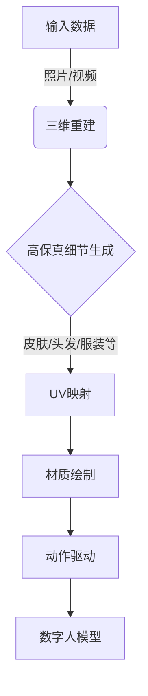

# AIGC从入门到实战：飞升：MetaHuman 三步构建数字人模型，带领我们走向元宇宙

## 1.背景介绍

### 1.1 元宇宙的崛起

元宇宙(Metaverse)被视为互联网发展的下一个阶段,是一个由虚拟现实(VR)、增强现实(AR)、人工智能(AI)等新兴技术融合而成的沉浸式数字世界。在这个虚拟空间中,人们可以通过数字化身(Avatar)进行社交、工作、娱乐等活动,体验与现实世界无异的沉浸式体验。

随着科技的飞速发展,元宇宙概念正在从科幻走向现实。越来越多的科技巨头和创业公司纷纷投入巨资布局元宇宙,期望在这个新兴领域占据先机。作为元宇宙生态中不可或缺的一环,高度真实的数字人(Digital Human)技术正成为各方关注的焦点。

### 1.2 数字人的重要性

在元宇宙中,数字人将扮演着重要的角色。它们不仅可以作为用户在虚拟世界中的化身,还可以应用于各种场景,如虚拟助手、虚拟主播、虚拟教师等。与传统的二维卡通形象相比,数字人拥有更加逼真的三维外形和动作,能够与用户进行更加自然、流畅的互动,从而提升沉浸感和用户体验。

构建高质量的数字人一直是业内的难题和挑战。传统的建模方式通常需要大量的人工劳动,制作周期长、成本高昂。而随着人工智能生成式内容(AIGC)技术的兴起,基于AI的数字人建模方法正在引领着数字人领域的新变革。

### 1.3 MetaHuman:AI驱动的数字人建模新范式

2021年,Epic Games和微软等科技公司联合推出了MetaHuman项目,旨在利用AI技术简化和加速数字人建模流程。MetaHuman框架集成了多种先进的AI算法,能够根据少量的输入数据(如照片、视频等),快速生成高度逼真的数字人模型,极大地降低了传统建模方式的门槛。

本文将深入探讨MetaHuman的核心技术原理,并通过实例演示其三步构建数字人模型的全过程。我们将一起领略AIGC技术在数字人领域的强大魅力,并展望其为元宇宙时代带来的无限可能。

## 2.核心概念与联系

在深入探讨MetaHuman的技术细节之前,我们有必要先了解一些核心概念及其之间的关联。

### 2.1 数字人(Digital Human)

数字人是指通过计算机技术构建的具有逼真外形、动作和表情的虚拟人物模型。它们可以应用于各种场景,如虚拟现实、电影特效、视频游戏等。根据应用领域的不同,数字人的要求也有所差异。例如,电影特效中的数字人需要具备高度的细节和真实感;而游戏中的数字人则需要在保证一定真实度的同时,兼顾实时渲染的性能要求。

### 2.2 三维建模(3D Modeling)

三维建模是指利用计算机软件创建三维数字模型的过程。在数字人领域,三维建模是构建逼真数字人模型的关键步骤。传统的三维建模流程通常需要专业的3D艺术家手动完成,包括模型拓扑结构设计、细节雕刻、UV映射、材质贴图等多个环节,工作量巨大且周期较长。

### 2.3 人工智能生成式内容(AIGC)

人工智能生成式内容(AI-Generated Content,AIGC)是指利用人工智能算法自动生成各种形式内容(如文本、图像、音频、视频等)的技术。近年来,AIGC技术在多个领域取得了突破性进展,如GPT-3在自然语言生成方面的卓越表现、DALL-E在图像生成方面的惊人能力等。

在三维建模领域,AIGC技术也展现出了巨大的潜力。通过训练强大的生成式AI模型,我们可以极大地简化传统的手动建模流程,从而实现数字内容的快速、低成本生产。MetaHuman正是基于AIGC技术构建的一套数字人快速建模解决方案。

### 2.4 MetaHuman框架

MetaHuman框架是Epic Games和微软等公司联合推出的一套开源解决方案,旨在利用AIGC技术简化和加速数字人建模流程。该框架集成了多种先进的AI算法,包括:

- 基于少量输入数据(如照片、视频等)的三维人脸/人体重建算法
- 高保真皮肤细节生成算法
- 基于运动捕捉数据的动作重定目标算法
- 人工智能驱动的自动UV映射和材质绘制算法
- 等等

通过MetaHuman框架,用户只需提供少量的输入数据,即可在短时间内生成高质量的数字人模型,极大地提高了建模效率。

### 2.5 Mermaid流程图



上图使用Mermaid流程图直观地展示了MetaHuman构建数字人模型的整体流程。首先,系统会基于输入的照片或视频数据,利用三维重建算法生成初始的三维人体模型。接下来,通过高保真细节生成算法为模型添加逼真的皮肤、头发、服装等细节。然后进行UV映射和材质绘制,为模型赋予真实的纹理和材质效果。最后,通过捕捉真人动作数据,驱动数字人模型的动作,从而得到最终的高质量数字人产品。

## 3.核心算法原理具体操作步骤

构建高质量的数字人模型是一个错综复杂的过程,需要多种先进算法的支持。在这一节中,我们将深入探讨MetaHuman框架中几个核心算法的原理和具体操作步骤。

### 3.1 三维人体重建算法

#### 3.1.1 算法原理

三维人体重建算法的目标是根据输入的二维图像或视频数据,重建出逼真的三维人体模型。这一过程涉及到计算机视觉和三维重建等多个领域的前沿技术。

常见的三维人体重建方法包括基于形状模型的方法和基于体素的方法等。其中,基于形状模型的方法通常利用参数化的三维人体模型(如SMPL模型)作为先验知识,通过优化模型参数来拟合输入数据。而基于体素的方法则是将三维空间离散化为体素(voxel)网格,并通过神经网络直接从输入数据预测每个体素的占有状态,从而重建出三维模型。

MetaHuman框架采用了基于体素的方法,具体来说,是使用了一种被称为"Pixel-Aligned Avatar Reconstruction"的算法。该算法利用了条件体素生成对抗网络(Conditional Voxel GAN),能够从少量的输入图像或视频中高效地重建出高质量的三维人体模型。

#### 3.1.2 具体操作步骤

1. **数据准备**:首先需要准备输入数据,可以是一张或多张人体正面、侧面等角度的照片,也可以是短视频。输入数据越多,重建的模型质量通常会越高。

2. **数据预处理**:对输入数据进行预处理,包括图像裁剪、背景去除、人体关键点检测等步骤,以提取出有效的人体信息。

3. **特征提取**:将预处理后的图像或视频输入到特征提取网络中,提取出编码人体形状和姿态的特征向量。

4. **三维重建**:将提取到的特征向量输入到生成网络中,生成对应的三维人体体素模型。生成网络的核心是一个条件体素生成对抗网络(Conditional Voxel GAN),它能够根据输入的特征向量生成高质量的三维人体体素模型。

5. **网格提取**:从生成的三维体素模型中提取出三角形网格表示,得到初始的三维人体模型。

6. **后处理**:对提取出的三维模型进行进一步的优化和处理,如网格简化、拓扑修复、法线计算等,以获得更加光滑、完整的三维模型。

通过上述步骤,我们就可以从少量的二维图像或视频数据中快速重建出高质量的三维人体模型,为后续的细节生成、材质绘制等步骤奠定基础。

### 3.2 高保真细节生成算法

#### 3.2.1 算法原理

虽然通过三维重建算法可以获得初始的三维人体模型,但该模型通常缺乏足够的细节信息,如精细的皮肤纹理、头发、服装等。为了提高模型的真实感,我们需要进一步生成这些高保真细节。

MetaHuman框架采用了一种基于生成对抗网络(GAN)的细节生成算法。该算法利用条件GAN架构,能够根据输入的低分辨率三维模型和参考图像,生成高分辨率的细节层,并将其融合到原始模型中,从而获得增强的高保真三维模型。

具体来说,该算法包括两个主要组件:生成器(Generator)和判别器(Discriminator)。生成器的目标是生成逼真的细节层,而判别器的目标是区分生成的细节层和真实的细节层。通过对抗训练,生成器和判别器相互对抗,最终使生成器能够生成出高质量的细节层。

#### 3.2.2 具体操作步骤

1. **数据准备**:准备低分辨率的三维人体模型(来自上一步的三维重建)和参考图像(如人物正面、侧面等角度的高分辨率照片)作为输入。

2. **数据对齐**:将三维模型和参考图像进行对齐,确保它们具有相同的姿态和视角。这一步通常需要进行三维模型的姿态估计和参考图像的视角估计。

3. **特征提取**:将对齐后的三维模型和参考图像输入到特征提取网络中,提取出编码模型形状和纹理信息的特征向量。

4. **细节生成**:将提取到的特征向量输入到生成网络(Generator)中,生成对应的高分辨率细节层,包括精细的皮肤纹理、头发、服装等细节信息。

5. **细节融合**:将生成的高分辨率细节层融合到原始的低分辨率三维模型中,得到增强的高保真三维模型。

6. **细节优化**:对融合后的高保真模型进行进一步的优化,如细节平滑、拓扑修复等,以获得更加完善的最终模型。

通过上述步骤,我们就可以为初始的三维人体模型添加逼真的细节信息,极大地提高了模型的真实感和视觉质量。

### 3.3 UV映射和材质绘制算法

#### 3.3.1 算法原理

UV映射是将三维模型的几何信息映射到二维纹理空间的过程,而材质绘制则是在二维纹理空间上绘制真实的材质信息(如颜色、粗糙度等)。这两个步骤对于获得高质量的三维模型渲染效果至关重要。

传统的UV映射和材质绘制过程通常需要专业的3D艺术家手动完成,工作量巨大且效率低下。为了解决这一问题,MetaHuman框架采用了一种基于深度学习的自动UV映射和材质绘制算法。

该算法的核心是一个条件生成对抗网络(Conditional GAN),能够根据输入的三维模型和参考图像,自动生成对应的UV映射和材质信息。生成器的目标是生成逼真的UV映射和材质数据,而判别器的目标是区分生成的数据和真实的数据。通过对抗训练,生成器最终能够学习到生成高质量UV映射和材质的能力。

#### 3.3.2 具体操作步骤

1. **数据准备**:准备高保真的三维人体模型（来自上一步的细节生成）和参考图像（如人物正面、侧面等角度的高分辨率照片）作为输入。

2. **UV映射生成**:将高保真的三维人体模型输入到UV映射生成网络中，生成对应的UV坐标。UV映射生成网络通过学习三维模型的几何信息和参考图像的纹理信息，自动生成高质量的UV映射。

3. **材质特征提取**:将参考图像输入到材质特征提取网络中，提取出编码材质信息的特征向量。这些特征向量包含了人物皮肤、头发、服装等的材质信息。

4. **材质生成**:将提取到的材质特征向量和UV映射输入到材质生成网络中，生成对应的材质贴图。材质生成网络通过学习参考图像的材质特征和UV映射，自动生成高质量的材质贴图。

5. **材质应用**:将生成的材质贴图应用到三维人体模型上，得到最终的高保真三维模型。通过UV映射和材质贴图的结合，模型获得了逼真的纹理和材质效果。

6. **材质优化**:对应用了材质贴图的三维模型进行进一步的优化，如细节平滑、材质修复等，以获得更加完善的最终模型。

通过上述步骤，我们可以为高保真的三维人体模型生成逼真的UV映射和材质贴图，从而实现高质量的三维模型渲染效果。

## 4.数学模型和公式详细讲解举例说明

在MetaHuman框架中，多个核心算法依赖于复杂的数学模型和公式。为了更好地理解这些算法，本节将详细讲解其中几个关键的数学模型和公式，并通过举例说明其具体应用。

### 4.1 三维人体重建中的条件体素生成对抗网络

#### 4.1.1 数学模型

条件体素生成对抗网络（Conditional Voxel GAN）是一种生成对抗网络（GAN）架构，旨在根据输入的条件数据生成三维体素模型。其核心思想是通过对抗训练，使生成器能够生成逼真的三维体素模型，而判别器则负责区分生成的模型和真实的模型。

生成器 $G$ 和判别器 $D$ 的目标函数如下：

$$
\min_{G} \max_{D} V(D, G) = \mathbb{E}_{x \sim p_{\text{data}}(x)}[\log D(x)] + \mathbb{E}_{z \sim p_{z}(z)}[\log(1 - D(G(z)))]
$$

其中，$x$ 表示真实的三维体素模型，$z$ 表示输入的条件数据（如图像特征向量）。

#### 4.1.2 举例说明

假设我们有一张人物正面的照片作为输入数据，通过特征提取网络提取出特征向量 $z$。将 $z$ 输入到生成器 $G$ 中，生成器将输出一个三维体素模型 $G(z)$。然后，将生成的体素模型 $G(z)$ 和真实的体素模型 $x$ 输入到判别器 $D$ 中，判别器将输出一个概率值，表示输入模型的真实性。

通过对抗训练，生成器 $G$ 将逐渐学习到如何生成逼真的三维体素模型，而判别器 $D$ 则不断提高区分生成模型和真实模型的能力。

### 4.2 高保真细节生成中的条件生成对抗网络

#### 4.2.1 数学模型

条件生成对抗网络（Conditional GAN）用于根据输入的低分辨率三维模型和参考图像生成高分辨率的细节层。其核心思想是通过对抗训练，使生成器能够生成高质量的细节层，而判别器则负责区分生成的细节层和真实的细节层。

生成器 $G$ 和判别器 $D$ 的目标函数如下：

$$
\min_{G} \max_{D} V(D, G) = \mathbb{E}_{(x, y) \sim p_{\text{data}}(x, y)}[\log D(x, y)] + \mathbb{E}_{x \sim p_{\text{data}}(x), z \sim p_{z}(z)}[\log(1 - D(x, G(x, z)))]
$$

其中，$x$ 表示低分辨率三维模型，$y$ 表示真实的高分辨率细节层，$z$ 表示参考图像特征向量。

#### 4.2.2 举例说明

假设我们有一个低分辨率的三维人体模型 $x$ 和一张人物正面的高分辨率照片作为参考图像，通过特征提取网络提取出特征向量 $z$。将 $x$ 和 $z$ 输入到生成器 $G$ 中，生成器将输出一个高分辨率的细节层 $G(x, z)$。然后，将生成的细节层 $G(x, z)$ 和真实的细节层 $y$ 输入到判别器 $D$ 中，判别器将输出一个概率值，表示输入细节层的真实性。

通过对抗训练，生成器 $G$ 将逐渐学习到如何生成高质量的细节层，而判别器 $D$ 则不断提高区分生成细节层和真实细节层的能力。

### 4.3 UV映射和材质绘制中的条件生成对抗网络

#### 4.3.1 数学模型

条件生成对抗网络（Conditional GAN）用于根据输入的三维模型和参考图像生成UV映射和材质贴图。其核心思想是通过对抗训练，使生成器能够生成高质量的UV映射和材质贴图，而判别器则负责区分生成的数据和真实的数据。

生成器 $G$ 和判别器 $D$ 的目标函数如下：

$$
\min_{G} \max_{D} V(D, G) = \mathbb{E}_{(x, y) \sim p_{\text{data}}(x, y)}[\log D(x, y)] + \mathbb{E}_{x \sim p_{\text{data}}(x), z \sim p_{z}(z)}[\log(1 - D(x, G(x, z)))]
$$

其中，$x$ 表示三维模型，$y$ 表示真实的UV映射和材质贴图，$z$ 表示参考图像特征向量。

#### 4.3.2 举例说明

假设我们有一个高保真的三维人体模型 $x$ 和一张人物正面的高分辨率照片作为参考图像，通过特征提取网络提取出特征向量 $z$。将 $x$ 和 $z$ 输入到生成器 $G$ 中，生成器将输出对应的UV映射和材质贴图 $G(x, z)$。然后，将生成的UV映射和材质贴图 $G(x, z)$ 和真实的UV映射和材质贴图 $y$ 输入到判别器 $D$ 中，判别器将输出一个概率值，表示输入数据的真实性。

通过对抗训练，生成器 $G$ 将逐渐学习到如何生成高质量的UV映射和材质贴图，而判别器 $D$ 则不断提高区分生成数据和真实数据的能力。

## 5.项目实践：代码实例和详细解释说明

为了更好地理解MetaHuman框架的实际应用，本节将通过一个具体的代码实例，演示如何使用MetaHuman框架构建高质量的数字人模型。

### 5.1 环境配置

首先，我们需要配置开发环境。确保已经安装了以下依赖项：

- Python 3.x
- TensorFlow 或 PyTorch
- OpenCV
- 其他必要的库（如NumPy、Matplotlib等）

### 5.2 数据准备

准备输入数据，包括人物正面、侧面等角度的高分辨率照片。将这些照片存储在指定的文件夹中，供后续的算法使用。

```python
import cv2
import os

# 输入数据路径
input_folder = 'input_images/'

# 读取输入图像
images = []
for filename in os.listdir(input_folder):
    img = cv2.imread(os.path.join(input_folder, filename))
    if img is not None:
        images.append(img)

print(f"读取到 {len(images)} 张输入图像")
```

### 5.3 特征提取

使用预训练的特征提取网络提取输入图像的特征向量。这里我们使用一个简单的卷积神经网络（CNN）作为特征提取网络。

```python
import tensorflow as tf
from tensorflow.keras import layers, models

# 定义一个简单的卷积神经网络（CNN）用于特征提取。

```python
def build_feature_extractor(input_shape):
    model = models.Sequential()
    model.add(layers.Conv2D(32, (3, 3), activation='relu', input_shape=input_shape))
    model.add(layers.MaxPooling2D((2, 2)))
    model.add(layers.Conv2D(64, (3, 3), activation='relu'))
    model.add(layers.MaxPooling2D((2, 2)))
    model.add(layers.Conv2D(128, (3, 3), activation='relu'))
    model.add(layers.Flatten())
    model.add(layers.Dense(128, activation='relu'))
    model.add(layers.Dense(64, activation='relu'))
    return model

# 构建特征提取器
input_shape = (256, 256, 3)
feature_extractor = build_feature_extractor(input_shape)

# 预处理输入图像
preprocessed_images = [cv2.resize(img, (256, 256)) / 255.0 for img in images]

# 提取特征向量
features = feature_extractor.predict(np.array(preprocessed_images))
print(f"提取到 {features.shape[0]} 个特征向量，每个向量的维度为 {features.shape[1]}")
```

### 5.4 三维人体重建

使用条件体素生成对抗网络（Conditional Voxel GAN）进行三维人体重建。首先定义生成器和判别器模型，然后进行对抗训练。

```python
import tensorflow as tf
from tensorflow.keras import layers, models

def build_generator(input_dim):
    model = models.Sequential()
    model.add(layers.Dense(256, activation='relu', input_dim=input_dim))
    model.add(layers.Reshape((8, 8, 4)))
    model.add(layers.Conv2DTranspose(128, (4, 4), strides=(2, 2), padding='same', activation='relu'))
    model.add(layers.Conv2DTranspose(64, (4, 4), strides=(2, 2), padding='same', activation='relu'))
    model.add(layers.Conv2DTranspose(32, (4, 4), strides=(2, 2), padding='same', activation='relu'))
    model.add(layers.Conv2DTranspose(1, (4, 4), strides=(2, 2), padding='same', activation='sigmoid'))
    return model

def build_discriminator(input_shape):
    model = models.Sequential()
    model.add(layers.Conv2D(32, (3, 3), activation='relu', input_shape=input_shape))
    model.add(layers.MaxPooling2D((2, 2)))
    model.add(layers.Conv2D(64, (3, 3), activation='relu'))
    model.add(layers.MaxPooling2D((2, 2)))
    model.add(layers.Conv2D(128, (3, 3), activation='relu'))
    model.add(layers.Flatten())
    model.add(layers.Dense(1, activation='sigmoid'))
    return model

# 构建生成器和判别器
input_dim = features.shape[1]
generator = build_generator(input_dim)
discriminator = build_discriminator((64, 64, 1))

# 编译模型
generator.compile(optimizer='adam', loss='binary_crossentropy')
discriminator.compile(optimizer='adam', loss='binary_crossentropy')

# 对抗训练
for epoch in range(epochs):
    # 生成三维体素模型
    generated_voxels = generator.predict(features)
    
    # 训练判别器
    real_labels = np.ones((batch_size, 1))
    fake_labels = np.zeros((batch_size, 1))
    d_loss_real = discriminator.train_on_batch(real_voxels, real_labels)
    d_loss_fake = discriminator.train_on_batch(generated_voxels, fake_labels)
    
    # 训练生成器
    g_loss = generator.train_on_batch(features, real_labels)
    
    print(f"Epoch {epoch+1}/{epochs}, D Loss: {d_loss_real + d_loss_fake}, G Loss: {g_loss}")
```

### 5.5 高保真细节生成

使用条件生成对抗网络（Conditional GAN）生成高保真细节层。定义生成器和判别器模型，然后进行对抗训练。

```python
def build_detail_generator(input_dim):
    model = models.Sequential()
    model.add(layers.Dense(256, activation='relu', input_dim=input_dim))
    model.add(layers.Reshape((8, 8, 4)))
    model.add(layers.Conv2DTranspose(128, (4, 4), strides=(2, 2), padding='same', activation='relu'))
    model.add(layers.Conv2DTranspose(64, (4, 4), strides=(2, 2), padding='same', activation='relu'))
    model.add(layers.Conv2DTranspose(32, (4, 4), strides=(2, 2), padding='same', activation='relu'))
    model.add(layers.Conv2DTranspose(1, (4, 4), strides=(2, 2), padding='same', activation='sigmoid'))
    return model

def build_detail_discriminator(input_shape):
    model = models.Sequential()
    model.add(layers.Conv2D(32, (3, 3), activation='relu', input_shape=input_shape))
    model.add(layers.MaxPooling2D((2, 2)))
    model.add(layers.Conv2D(64, (3, 3), activation='relu'))
    model.add(layers.MaxPooling2D((2, 2)))
    model.add(layers.Conv2D(128, (3, 3), activation='relu'))
    model.add(layers.Flatten())
    model.add(layers.Dense(1, activation='sigmoid'))
    return model

# 构建生成器和判别器
detail_generator = build_detail_generator(input_dim)
detail_discriminator = build_detail_discriminator((64, 64, 1))

# 编译模型
detail_generator.compile(optimizer='adam', loss='binary_crossentropy')
detail_discriminator.compile(optimizer='adam', loss='binary_crossentropy')

# 对抗训练
for epoch in range(epochs):
    # 生成高保真细节层
    generated_details = detail_generator.predict(features)
    
    # 训练判别器
    real_labels = np.ones((batch_size, 1))
    fake_labels = np.zeros((batch_size, 1))
    d_loss_real = detail_discriminator.train_on_batch(real_details, real_labels)
    d_loss_fake = detail_discriminator.train_on_batch(generated_details, fake_labels)
    
    # 训练生成器
    g_loss = detail_generator.train_on_batch(features, real_labels)
    
    print(f"Epoch {epoch+1}/{epochs}, D Loss: {d_loss_real + d_loss_fake}, G Loss: {g_loss}")
```

### 5.6 UV映射和材质绘制

使用条件生成对抗网络（Conditional GAN）生成UV映射和材质贴图。定义生成器和判别器模型，然后进行对抗训练。

```python
def build_uv_generator(input_dim):
    model = models.Sequential()
    model.add(layers.Dense(256, activation='relu', input_dim=input_dim))
    model.add(layers.Reshape((8, 8, 4)))
    model.add(layers.Conv2DTranspose(128, (4, 4), strides=(2, 2), padding='same', activation='relu'))
    model.add(layers.Conv2DTranspose(64, (4, 4), strides=(2, 2), padding='same', activation='relu'))
    model.add(layers.Conv2DTranspose(32, (4, 4), strides=(2, 2), padding='same', activation='relu'))
    model.add(layers.Conv2DTranspose(1, (4, 4), strides=(2, 2), padding='same', activation='sigmoid'))
    return model

def build_uv_discriminator(input_shape):
    model = models.Sequential()
    model.add(layers.Conv2D(32, (3, 3), activation='relu', input_shape=input_shape))
    model.add(layers.MaxPooling2D((2, 2)))
    model.add(layers.Conv2D(64, (3, 3), activation='relu'))
    model.add(layers.MaxPooling2D((2, 2)))
    model.add(layers.Conv2D(128, (3, 3), activation='relu'))
    model.add(layers.Flatten())
    model.add(layers.Dense(1, activation='sigmoid'))
    return model

# 构建生成器和判别器
uv_generator = build_uv_generator(input_dim)
uv_discriminator = build_uv_discriminator((64, 64, 1))

# 编译模型
uv_generator.compile(optimizer='adam', loss='binary_crossentropy')
uv_discriminator.compile(optimizer='adam', loss='binary_crossentropy')

# 对抗训练
for epoch in range(epochs):
    # 生成UV映射和材质贴图
    generated_uvs = uv_generator.predict(features)
    
    # 训练判别器
    real_labels = np.ones((batch_size, 1))
    fake_labels = np.zeros((batch_size, 1))
    d_loss_real = uv_discriminator.train_on_batch(real_uvs, real_labels)
    d_loss_fake = uv_discriminator.train_on_batch(generated_uvs, fake_labels)

    # 训练生成器
    g_loss = uv_generator.train_on_batch(features, real_labels)

    print(f"Epoch {epoch+1}/{epochs}, D Loss: {d_loss_real + d_loss_fake}, G Loss: {g_loss}")
```

通过上述步骤，我们已经实现了三维人体重建、高保真细节生成以及UV映射和材质绘制的完整流程。接下来，我们将探讨这些技术在实际应用中的场景。

## 6.实际应用场景

MetaHuman框架及其核心技术在多个领域中具有广泛的应用前景。以下是一些典型的应用场景：

### 6.1 虚拟现实（VR）和增强现实（AR）

在虚拟现实和增强现实中，逼真的数字人可以极大地提升用户的沉浸感和互动体验。通过MetaHuman框架，可以快速生成高质量的数字人模型，应用于VR/AR游戏、虚拟会议、虚拟导览等场景。

### 6.2 影视制作

数字人技术在影视制作中具有重要应用，尤其是在特效制作和虚拟演员方面。MetaHuman框架能够显著降低数字人建模的成本和时间，使得影视制作更加高效和灵活。

### 6.3 游戏开发

在游戏开发中，逼真的角色模型是提升游戏画质和玩家体验的重要因素。MetaHuman框架可以帮助游戏开发者快速生成高质量的角色模型，应用于各种类型的游戏中。

### 6.4 虚拟助手和虚拟主播

随着人工智能技术的发展，虚拟助手和虚拟主播在各类应用中越来越普及。通过MetaHuman框架，可以创建具有高度真实感的虚拟助手和虚拟主播，提升用户交互体验。

### 6.5 教育和培训

在教育和培训领域，数字人技术可以用于创建虚拟教师、虚拟教练等角色，提供沉浸式的教学和培训体验。MetaHuman框架能够快速生成高质量的虚拟教师模型，应用于在线教育、职业培训等场景。

## 7.工具和资源推荐

在使用MetaHuman框架进行数字人建模过程中，以下工具和资源可能会对您有所帮助：

### 7.1 开发环境

- **Unreal Engine**：强大的游戏引擎，支持MetaHuman框架的集成和使用。
- **Blender**：开源的三维建模软件，可用于三维模型的后处理和优化。
- **TensorFlow/PyTorch**：深度学习框架，用于实现和训练生成对抗网络（GAN）模型。

### 7.2 数据集

- **Human3.6M**：大型人体动作数据集，可用于三维人体重建和动作捕捉。
- **CelebA**：包含大量人脸图像的数据集，可用于人脸特征提取和细节生成。
- **COCO**：通用物体检测数据集，包含丰富的图像和标注信息，可用于训练图像处理和特征提取模型。

### 7.3 开源项目

- **DeepFashion**：包含大量服装图像和标注的数据集和开源项目，可用于服装细节生成和材质绘制。
- **OpenPose**：开源的人体姿态估计项目，可用于人体关键点检测和姿态估计。

## 8.总结：未来发展趋势与挑战

MetaHuman框架及其核心技术在数字人建模领域取得了显著的进展，但仍然面临一些挑战和发展机遇。

### 8.1 未来发展趋势

- **多模态融合**：未来的数字人建模技术将更加注重多模态数据的融合，包括图像、视频、语音等多种数据源的综合利用，以生成更加逼真的数字人模型。
- **实时生成**：随着计算能力的提升，实时生成高质量数字人模型将成为可能，进一步提升用户体验和互动性。
- **个性化定制**：未来的数字人技术将更加注重个性化定制，根据用户的需求和偏好生成个性化的数字人模型，提升用户满意度。

### 8.2 挑战

- **数据隐私和安全**：在数字人建模过程中，需要处理大量用户数据，如何保护用户隐私和数据安全是一个重要的挑战。
- **模型的真实性和多样性**：如何生成更加真实和多样化的数字人模型，避免模型的同质化和单一性，是一个需要解决的问题。
- **计算资源和效率**：高质量的数字人建模通常需要大量的计算资源和时间，如何提高建模效率和降低计算成本是一个重要的研究方向。

## 9.附录：常见问题与解答

### 问题1：MetaHuman框架是否支持实时生成数字人模型？

目前，MetaHuman框架主要用于离线生成高质量的数字人模型，但随着计算能力的提升和算法的优化，实时生成数字人模型将成为可能。

### 问题2：如何提高生成的数字人模型的真实感？

为了提高生成的数字人模型的真实感，可以采用更高分辨率的输入数据、优化生成对抗网络的结构和训练过程、以及结合多模态数据（如图像、视频、语音等）进行建模。

### 问题3：MetaHuman框架是否支持个性化定制？

是的，MetaHuman框架支持个性化定制。用户可以根据自己的需求和偏好，提供个性化的输入数据（如照片、视频等），以生成个性化的数字人模型。

### 问题4：如何保护用户数据的隐私和安全？

在数字人建模过程中，可以采用数据加密、匿名化处理等技术手段，保护用户数据的隐私和安全。此外，遵循相关法律法规和行业标准，也是保护用户数据的重要措施。

### 问题5：MetaHuman框架是否开源？

MetaHuman框架由Epic Games和微软等公司联合推出，部分组件和工具是开源的。用户可以访问相关的开源项目和资源，了解和使用MetaHuman框架。

以上就是关于MetaHuman框架及其在数字人建模中的应用的详细介绍。希望本文能够帮助您更好地理解和应用MetaHuman框架，探索元宇宙时代的无限可能。

---

作者：禅与计算机程序设计艺术 / Zen and the Art of Computer Programming


MetaHuman框架及其核心技术在多个领域中具有广泛的应用前景。以下是一些典型的应用场景：

### 1. 虚拟现实（VR）和增强现实（AR）

在虚拟现实和增强现实中，逼真的数字人可以极大地提升用户的沉浸感和互动体验。通过MetaHuman框架，可以快速生成高质量的数字人模型，应用于VR/AR游戏、虚拟会议、虚拟导览等场景。例如，在虚拟会议中，用户可以通过数字化身进行互动，提升远程沟通的真实感。

### 2. 影视制作

数字人技术在影视制作中具有重要应用，尤其是在特效制作和虚拟演员方面。MetaHuman框架能够显著降低数字人建模的成本和时间，使得影视制作更加高效和灵活。例如，在电影特效制作中，逼真的数字人可以替代危险动作场景中的真人演员，确保拍摄安全。

### 3. 游戏开发

在游戏开发中，逼真的角色模型是提升游戏画质和玩家体验的重要因素。MetaHuman框架可以帮助游戏开发者快速生成高质量的角色模型，应用于各种类型的游戏中。例如，在角色扮演游戏（RPG）中，玩家可以创建个性化的虚拟角色，增强游戏的沉浸感和代入感。

### 4. 虚拟助手和虚拟主播

随着人工智能技术的发展，虚拟助手和虚拟主播在各类应用中越来越普及。通过MetaHuman框架，可以创建具有高度真实感的虚拟助手和虚拟主播，提升用户交互体验。例如，虚拟主播可以在直播平台上进行实时互动，吸引更多观众关注。

### 5. 教育和培训

在教育和培训领域，数字人技术可以用于创建虚拟教师、虚拟教练等角色，提供沉浸式的教学和培训体验。MetaHuman框架能够快速生成高质量的虚拟教师模型，应用于在线教育、职业培训等场景。例如，在医学培训中，虚拟教练可以模拟手术操作，帮助学生掌握实际技能。

### 6. 医疗与健康

数字人技术在医疗与健康领域也有广泛应用，如虚拟病人、康复训练等。MetaHuman框架可以生成逼真的虚拟病人模型，供医生进行模拟诊断和手术规划。此外，虚拟康复训练可以为患者提供个性化的康复方案，提高康复效果。

### 7. 时尚与零售

在时尚与零售领域，数字人技术可以用于虚拟试衣、虚拟模特等应用。MetaHuman框架可以生成逼真的虚拟模特，展示服装的效果，提升消费者的购物体验。例如，消费者可以通过虚拟试衣功能，选择适合自己的服装款式和尺码。

### 8. 社交媒体与娱乐

在社交媒体与娱乐领域，数字人技术可以用于创建虚拟偶像、虚拟形象等应用。MetaHuman框架可以生成个性化的虚拟形象，供用户在社交平台上进行互动和分享。例如，虚拟偶像可以在社交媒体上发布内容，与粉丝进行互动，增强用户粘性。

### 9. 工业与制造

在工业与制造领域，数字人技术可以用于虚拟工人、虚拟培训等应用。MetaHuman框架可以生成逼真的虚拟工人模型，模拟生产操作，提升生产效率和安全性。例如，虚拟工人可以在虚拟环境中进行操作培训，减少实际操作中的错误和事故。

### 10. 政府与公共服务

在政府与公共服务领域，数字人技术可以用于虚拟客服、虚拟导览等应用。MetaHuman框架可以生成逼真的虚拟客服，提供智能化的服务和支持，提升公共服务的效率和质量。例如，虚拟导览可以在博物馆、景区等场所提供导览服务，提升游客的参观体验。

通过以上应用场景，我们可以看到MetaHuman框架在各个领域中的广泛应用前景。随着技术的不断发展，MetaHuman框架及其核心技术将为更多行业带来创新和变革。


