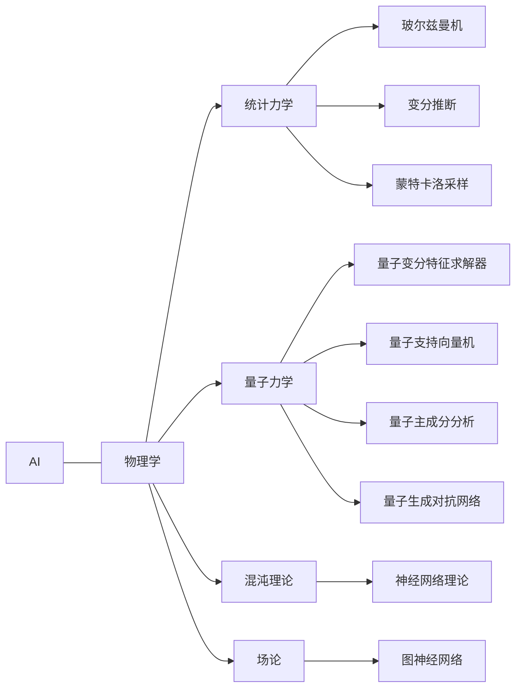

# AI与物理学交叉原理与代码实战案例讲解

## 1. 背景介绍
### 1.1 AI与物理学的关系
人工智能(Artificial Intelligence, AI)和物理学看似是两个不相关的领域,但实际上它们之间存在着紧密的联系。物理学是研究自然界最基本规律的科学,它为人工智能的发展提供了理论基础和灵感来源。同时,人工智能技术也为物理学研究提供了新的工具和思路。

### 1.2 AI在物理学中的应用
人工智能在物理学研究中已经得到了广泛应用,主要体现在以下几个方面:

1. 数据分析与处理:物理实验通常会产生海量的数据,传统的人工分析方法难以应对。机器学习算法可以快速、准确地分析处理实验数据,从中发现规律和特征。

2. 理论模型构建:物理学家需要构建数学模型来描述物理现象。人工智能可以通过机器学习等方法,从实验数据中自动学习得到模型结构和参数,大大提高了建模效率。 

3. 仿真模拟:对于一些难以通过实验研究的物理现象,可以利用人工智能技术进行仿真模拟。例如分子动力学模拟、量子系统模拟等。

4. 智能实验:利用强化学习等人工智能方法,可以实现实验设备的自动优化控制,提高实验效率和精度。

### 1.3 物理学对AI的启发
物理学的一些理论和方法也为人工智能的发展提供了重要启发,例如:

1. 统计力学启发了玻尔兹曼机等生成式模型

2. 量子力学启发了量子机器学习算法

3. 混沌理论为神经网络提供了理论基础

4. 场论为图神经网络等提供了数学工具

因此,深入探讨AI与物理学的交叉融合,对于两个领域的发展都具有重要意义。

## 2. 核心概念与联系
### 2.1 统计力学与机器学习
统计力学是物理学的一个分支,主要研究由大量微观粒子组成的宏观系统的性质。它为理解机器学习中的一些模型和算法提供了物理学基础。

一些典型的联系包括:

1. 玻尔兹曼机与Ising模型:玻尔兹曼机是一种基于能量的生成式模型,它的数学形式与统计力学中的Ising模型非常相似。

2. 变分推断与自由能:在机器学习中,变分推断通过最小化一个目标函数来近似后验分布。这个过程与统计力学中求解自由能极小化问题有相通之处。

3. 蒙特卡洛采样与系综:统计力学中使用蒙特卡洛方法对系综进行采样,类似的思想也被用于机器学习中的采样算法,如MCMC等。

### 2.2 量子力学与量子机器学习  
量子力学是描述微观世界的物理学理论,它为发展量子计算和量子机器学习提供了理论基础。量子比特可以同时处于多个状态的叠加,具有"并行计算"的特点。利用量子比特构建的量子电路模型,为实现高效的机器学习算法提供了新的思路。

一些代表性的量子机器学习算法包括:

1. 量子变分特征求解器(QVFE):利用量子电路对数据进行特征提取。

2. 量子支持向量机(QSVM):利用量子内积加速经典SVM的训练。

3. 量子主成分分析(QPCA):在量子态空间进行主成分分析。

4. 量子生成对抗网络(QGAN):利用量子电路实现生成对抗学习。

### 2.3 Mermaid图总结

下面用一个Mermaid图来总结AI与物理学的一些核心联系:



## 3. 核心算法原理具体操作步骤
下面我们以量子变分特征求解器(QVFE)为例,介绍其核心算法原理和操作步骤。

### 3.1 QVFE算法原理
QVFE的基本思想是利用参数化量子电路(PQC)对经典数据进行特征映射,将其映射到高维的希尔伯特空间,然后在量子态空间进行机器学习任务。其优势在于量子态空间维度呈指数增长,有望实现经典算法难以达到的特征表示能力。

### 3.2 QVFE算法流程
QVFE算法主要分为以下几个步骤:

1. 构建特征映射电路:根据数据的特点,设计合适的量子电路结构,用于将经典数据映射到量子态空间。常见的映射电路包括 $U_{\phi}(x)$ 和 $U_{\theta}(x)$ 等。

2. 构建变分电路:在特征映射电路之后,再接一个参数化的变分电路 $U(\theta)$,用于在量子态空间进行特征提取和变换。

3. 测量量子态:对变分电路输出的量子态进行测量,得到测量结果。可以使用Pauli算符的期望值等作为提取的特征。

4. 优化电路参数:将提取的量子特征输入到经典的机器学习模型中,并定义一个损失函数。通过经典的优化算法(如梯度下降)来优化变分电路的参数 $\theta$,使得损失函数最小化。

5. inference:利用训练好的QVFE模型对新的数据进行预测或分类等任务。

## 4. 数学模型和公式详细讲解举例说明
下面我们详细介绍QVFE中用到的一些数学模型和公式。

### 4.1 特征映射电路
将N维经典数据 $x=(x_1,\cdots,x_N)$ 映射到量子态空间的特征映射电路可以表示为:

$$
U_{\phi}(x)=\otimes_{i=1}^N U_{\phi}^i(x_i)
$$

其中 $U_{\phi}^i(x_i)$ 表示对第i个量子比特的旋转门,常见的形式有:

$$
U_{\phi}^i(x_i)=R_z(x_i)R_y(\phi_i)
$$

这里 $\phi=(\phi_1,\cdots,\phi_N)$ 为旋转门的参数。

### 4.2 变分电路
变分电路 $U(\theta)$ 通常由多个参数化的基本量子门组成,例如:

$$
U(\theta)=U_L(\theta_L)\cdots U_2(\theta_2)U_1(\theta_1)
$$

其中 $U_l(\theta_l)$ 表示第l层的参数化量子门,可以是任意的酉矩阵。一种常见的参数化量子门是通用的旋转门:

$$
U_l(\theta_l)=\exp(-i\theta_l \sigma_l)
$$

其中 $\sigma_l$ 为泡利矩阵。

### 4.3 损失函数
QVFE的训练目标是优化变分电路的参数 $\theta$,使得提取的量子特征在下游任务中达到最优性能。以二分类任务为例,可以定义如下的损失函数:

$$
L(\theta)=\frac{1}{M}\sum_{i=1}^M(y_i-\hat{y}_i)^2
$$

其中M为训练样本数量,$y_i$ 为第i个样本的真实标签,$\hat{y}_i$ 为QVFE模型的预测值,可以表示为:

$$
\hat{y}_i=f(\langle0|U^{\dagger}(\theta)U_{\phi}(x_i)ZU_{\phi}^{\dagger}(x_i)U(\theta)|0\rangle)
$$

这里 $f$ 为经典的线性函数,Z为泡利Z矩阵。

## 5. 项目实践：代码实例和详细解释说明
下面我们使用Qiskit和PyTorch库来实现一个简单的QVFE二分类模型。

### 5.1 导入需要的库

```python
import numpy as np
import qiskit
from qiskit import Aer, QuantumCircuit
import torch
import torch.nn as nn
import torch.optim as optim
```

### 5.2 构建特征映射电路

```python
def U_phi(x):
    qc = QuantumCircuit(1)
    qc.rz(x,0)
    qc.ry(np.pi/2,0)
    return qc
```

这里我们使用一个量子比特的旋转门作为特征映射电路。

### 5.3 构建变分电路

```python
def U_theta(theta):
    qc = QuantumCircuit(1)  
    qc.rz(theta[0],0)
    qc.rx(theta[1],0)
    return qc
```

变分电路包含两个参数化的旋转门 $R_z$ 和 $R_x$。

### 5.4 定义QVFE模型

```python
class QVFE(nn.Module):
    def __init__(self):
        super().__init__()
        self.theta = nn.Parameter(torch.randn(2))
        
    def forward(self, x):
        qc = QuantumCircuit(1,1) 
        qc.compose(U_phi(x), inplace=True)
        qc.compose(U_theta(self.theta), inplace=True)
        qc.measure(0,0)
        
        backend = Aer.get_backend('qasm_simulator')
        result = qiskit.execute(qc, backend, shots=1).result()
        counts = result.get_counts(qc)
        
        if '1' in counts:
            return torch.tensor([counts['1']])
        else:
            return torch.tensor([0])
```

QVFE模型继承自PyTorch的nn.Module类,其中theta为变分电路的参数。前向传播时,将特征映射电路和变分电路组合,并在量子模拟器上运行测量。测量结果为1的概率作为QVFE的输出。

### 5.5 生成训练数据

```python
X_train = torch.tensor([[0.2], [0.4], [0.6], [0.8]])
y_train = torch.tensor([[0], [0], [1], [1]])
```

我们生成4个简单的训练数据点。

### 5.6 训练QVFE模型

```python
model = QVFE()
criterion = nn.MSELoss() 
optimizer = optim.Adam(model.parameters(), lr=0.1)

for epoch in range(100):
    y_pred = torch.cat([model(x) for x in X_train])
    loss = criterion(y_pred, y_train.float())
    
    optimizer.zero_grad()
    loss.backward()
    optimizer.step()
    
    if epoch % 10 == 0:
        print(f'Epoch {epoch}, Loss: {loss.item():.4f}')
```

我们使用均方误差作为损失函数,Adam优化器来训练QVFE模型。每个Epoch通过循环遍历训练数据,前向传播计算损失函数,然后反向传播更新变分电路参数。

### 5.7 测试QVFE模型

```python
X_test = torch.tensor([[0.3], [0.7]])
y_test = torch.tensor([[0], [1]])

y_pred = torch.cat([model(x) for x in X_test])
print(f'Predictions: {y_pred.detach().numpy()}')
print(f'Ground truth: {y_test.numpy()}')
```

最后我们在两个测试点上测试训练好的QVFE模型,可以看到它成功预测了测试点的分类标签。

## 6. 实际应用场景
QVFE模型可以应用于多种实际场景,例如:

1. 量子化学:将分子的特征映射到量子态空间,预测分子的性质,如能量、偶极矩等。

2. 量子图像处理:将图像数据编码到量子态,利用QVFE提取量子特征,进行图像分类、生成等任务。

3. 量子金融:将金融数据映射到量子态空间,利用QVFE构建量子金融模型,如量子波动率模型等。

4. 量子自然语言处理:将词向量映射到量子态,利用QVFE提取语义特征,进行情感分析、文本分类等任务。

总之,QVFE为利用量子计算优势解决经典机器学习问题提供了一种新的思路和方法。

## 7. 工具和资源推荐
对于