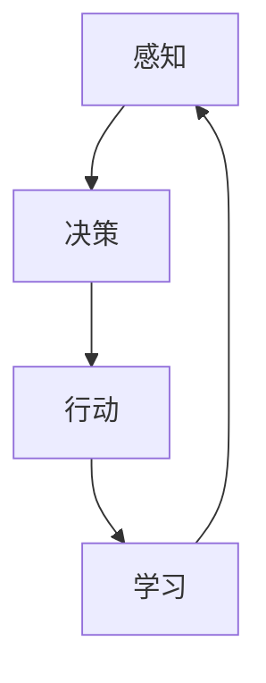

# AI人工智能代理工作流 AI Agent WorkFlow：介绍与基础理解

## 1.背景介绍

人工智能（AI）已经成为现代科技的核心驱动力之一，从自动驾驶汽车到智能家居，AI的应用无处不在。AI代理（Agent）作为AI系统中的关键组件，负责执行特定任务并与环境进行交互。AI代理工作流（AI Agent WorkFlow）是指AI代理在执行任务过程中所遵循的一系列步骤和流程。理解AI代理工作流对于开发高效、可靠的AI系统至关重要。

## 2.核心概念与联系

### 2.1 AI代理的定义

AI代理是一个能够感知环境并采取行动以实现特定目标的计算实体。它可以是软件程序、机器人或其他形式的智能系统。

### 2.2 工作流的定义

工作流是指一系列有序的步骤或任务，用于完成特定的工作。AI代理工作流则是指AI代理在执行任务时所遵循的步骤和流程。

### 2.3 核心概念之间的联系

AI代理工作流涉及多个核心概念，包括感知、决策、行动和学习。这些概念之间的联系可以通过以下Mermaid流程图来表示：



## 3.核心算法原理具体操作步骤

### 3.1 感知

感知是AI代理从环境中获取信息的过程。常见的感知技术包括传感器数据采集、图像识别和自然语言处理。

### 3.2 决策

决策是AI代理根据感知到的信息选择最佳行动的过程。常用的决策算法包括决策树、贝叶斯网络和强化学习。

### 3.3 行动

行动是AI代理执行所选决策的过程。这可能涉及物理动作（如机器人移动）或软件操作（如数据处理）。

### 3.4 学习

学习是AI代理通过经验改进其性能的过程。常见的学习算法包括监督学习、无监督学习和强化学习。

## 4.数学模型和公式详细讲解举例说明

### 4.1 强化学习中的马尔可夫决策过程（MDP）

强化学习是AI代理工作流中的关键算法之一。其核心是马尔可夫决策过程（MDP），定义如下：

$$
MDP = (S, A, P, R, \gamma)
$$

其中：
- $S$ 是状态空间
- $A$ 是动作空间
- $P$ 是状态转移概率
- $R$ 是奖励函数
- $\gamma$ 是折扣因子

### 4.2 Q-Learning算法

Q-Learning是一种常用的强化学习算法，其更新公式为：

$$
Q(s, a) \leftarrow Q(s, a) + \alpha [r + \gamma \max_{a'} Q(s', a') - Q(s, a)]
$$

其中：
- $Q(s, a)$ 是状态-动作值函数
- $\alpha$ 是学习率
- $r$ 是即时奖励
- $\gamma$ 是折扣因子
- $s'$ 是下一状态
- $a'$ 是下一动作

### 4.3 示例

假设一个简单的迷宫问题，AI代理需要找到从起点到终点的最短路径。使用Q-Learning算法，代理会通过多次尝试和错误逐步学习最佳路径。

## 5.项目实践：代码实例和详细解释说明

### 5.1 环境设置

首先，安装必要的Python库：

```bash
pip install numpy gym
```

### 5.2 代码实例

以下是一个使用Q-Learning算法解决迷宫问题的代码示例：

```python
import numpy as np
import gym

# 创建环境
env = gym.make('FrozenLake-v0')

# 初始化Q表
Q = np.zeros([env.observation_space.n, env.action_space.n])

# 设置参数
alpha = 0.8
gamma = 0.95
num_episodes = 2000

# 训练Q-Learning算法
for episode in range(num_episodes):
    state = env.reset()
    done = False
    while not done:
        action = np.argmax(Q[state, :] + np.random.randn(1, env.action_space.n) * (1. / (episode + 1)))
        next_state, reward, done, _ = env.step(action)
        Q[state, action] = Q[state, action] + alpha * (reward + gamma * np.max(Q[next_state, :]) - Q[state, action])
        state = next_state

print("训练完成后的Q表：")
print(Q)
```

### 5.3 解释说明

上述代码首先创建了一个迷宫环境，然后初始化了Q表。通过多次迭代，AI代理逐步学习最佳路径。最终输出的Q表包含了每个状态下的最佳动作。

## 6.实际应用场景

### 6.1 自动驾驶

AI代理工作流在自动驾驶中扮演着重要角色。感知模块负责获取道路信息，决策模块选择最佳驾驶策略，行动模块执行驾驶操作，学习模块通过经验改进驾驶性能。

### 6.2 智能家居

在智能家居中，AI代理可以通过感知家庭环境（如温度、湿度），决策最佳家电操作（如调节空调温度），并通过学习用户习惯提供个性化服务。

### 6.3 金融交易

AI代理在金融交易中可以通过感知市场数据，决策最佳交易策略，执行交易操作，并通过学习市场趋势优化交易模型。

## 7.工具和资源推荐

### 7.1 开发工具

- **TensorFlow**：一个开源的机器学习框架，适用于构建和训练AI模型。
- **PyTorch**：另一个流行的机器学习框架，具有动态计算图的特点。
- **OpenAI Gym**：一个用于开发和比较强化学习算法的工具包。

### 7.2 学习资源

- **《深度学习》**：由Ian Goodfellow等人编写的经典教材，适合深入学习AI理论。
- **Coursera上的机器学习课程**：由Andrew Ng教授讲授，适合初学者入门。

## 8.总结：未来发展趋势与挑战

### 8.1 未来发展趋势

- **多模态感知**：未来的AI代理将能够同时处理多种感知数据（如图像、声音、文本），实现更智能的决策。
- **自适应学习**：AI代理将能够根据环境变化自适应地调整其学习策略，提高任务执行效率。
- **人机协作**：AI代理将与人类协作，共同完成复杂任务，提升工作效率。

### 8.2 挑战

- **数据隐私**：在感知和学习过程中，如何保护用户数据隐私是一个重要挑战。
- **算法公平性**：确保AI代理的决策不受偏见影响，保持公平性和透明性。
- **系统可靠性**：在关键任务中，确保AI代理的可靠性和安全性至关重要。

## 9.附录：常见问题与解答

### 9.1 什么是AI代理？

AI代理是一个能够感知环境并采取行动以实现特定目标的计算实体。

### 9.2 什么是AI代理工作流？

AI代理工作流是指AI代理在执行任务过程中所遵循的一系列步骤和流程。

### 9.3 强化学习中的Q-Learning算法是什么？

Q-Learning是一种常用的强化学习算法，通过更新状态-动作值函数来选择最佳行动。

### 9.4 AI代理工作流的实际应用有哪些？

AI代理工作流在自动驾驶、智能家居和金融交易等领域有广泛应用。

### 9.5 如何保护AI代理中的数据隐私？

可以通过数据加密、访问控制和隐私保护算法等技术手段来保护数据隐私。

---

作者：禅与计算机程序设计艺术 / Zen and the Art of Computer Programming