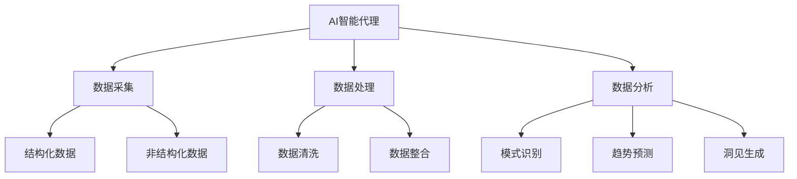

# AI人工智能代理工作流AI Agent Workflow：智能代理在行业研究系统中的应用

## 1.背景介绍

### 1.1 行业研究系统的重要性

在当今快节奏的商业环境中，及时获取准确的行业信息和洞见对于企业的战略决策至关重要。行业研究系统旨在通过系统地收集、整理和分析来自各种渠道的数据,为企业提供全面的行业概况、竞争格局、市场趋势等信息,从而支持企业制定有效的经营策略。

### 1.2 传统行业研究系统的挑战

传统的行业研究系统通常依赖于人工的数据采集、处理和分析,这种方式存在以下几个主要挑战:

1. **效率低下**: 人工处理海量异构数据的效率较低,难以满足实时性需求。
2. **主观性强**: 分析结果受到分析师个人经验和偏好的影响,缺乏客观性。
3. **覆盖面有限**: 由于人力有限,无法全面覆盖所有相关数据源。
4. **成本高昂**: 需要大量人力投入,导致运营成本较高。

### 1.3 AI智能代理的应用前景

近年来,人工智能(AI)技术的快速发展为行业研究系统带来了新的契机。AI智能代理可以高效地从海量异构数据源中采集数据,并利用自然语言处理(NLP)、知识图谱等技术对数据进行智能化处理和分析,从而克服传统系统的诸多挑战,为企业提供更加准确、全面和实时的行业洞见。

## 2.核心概念与联系

### 2.1 AI智能代理

AI智能代理是一种基于人工智能技术的虚拟助手,能够自主地执行各种任务,如数据采集、处理、分析等。在行业研究系统中,AI智能代理扮演着关键角色,负责从各种数据源采集相关数据,并对这些数据进行智能化处理和分析,最终形成行业洞见。



### 2.2 自然语言处理(NLP)

自然语言处理(NLP)是人工智能的一个重要分支,旨在使计算机能够理解和处理人类自然语言。在行业研究系统中,NLP技术可以用于从非结构化文本数据(如新闻报道、社交媒体等)中提取有价值的信息,并将其转化为结构化的知识表示。

### 2.3 知识图谱

知识图谱是一种以图的形式表示实体之间关系的知识库。在行业研究系统中,知识图谱可以用于整合来自不同数据源的信息,构建统一的知识模型,从而支持更加准确和全面的数据分析和洞见生成。

### 2.4 机器学习

机器学习是人工智能的另一个重要分支,旨在使计算机能够从数据中自动学习和建模。在行业研究系统中,机器学习技术可以用于从历史数据中发现隐藏的模式和趋势,并基于这些模式和趋势对未来进行预测和建模。

## 3.核心算法原理具体操作步骤

### 3.1 数据采集

AI智能代理的第一步是从各种数据源采集相关数据,这些数据源包括:

1. **结构化数据源**:如企业财务报表、政府统计数据等。
2. **非结构化数据源**:如新闻报道、社交媒体、行业报告等。

对于结构化数据源,AI智能代理可以直接调用API或者进行数据库查询来获取数据。对于非结构化数据源,AI智能代理需要利用网络爬虫技术从网页中提取相关数据。

### 3.2 数据处理

获取到原始数据后,AI智能代理需要对这些数据进行处理,以便后续的分析和建模。数据处理主要包括以下步骤:

1. **数据清洗**:去除噪声数据、处理缺失值、解决数据不一致性等。
2. **数据整合**:将来自不同数据源的数据进行整合,构建统一的数据视图。
3. **数据转换**:将数据转换为适合后续分析和建模的格式,如向量化、规范化等。

在数据处理过程中,NLP技术可以用于从非结构化文本数据中提取有价值的信息,并将其转化为结构化的表示形式。知识图谱则可以用于整合来自不同数据源的信息,构建统一的知识模型。

### 3.3 数据分析与建模

经过处理后的数据可以输入到各种机器学习算法中,进行模式识别、趋势预测等分析和建模,从而生成行业洞见。常用的机器学习算法包括:

1. **聚类算法**:用于发现数据中的自然分组和模式。
2. **回归算法**:用于预测连续型目标变量。
3. **分类算法**:用于预测离散型目标变量。
4. **时序分析算法**:用于分析时间序列数据中的趋势和周期性。
5. **关联规则挖掘算法**:用于发现数据中的频繁项集和关联规则。

在分析和建模过程中,知识图谱可以提供丰富的背景知识,帮助算法更好地理解数据的语义,从而提高分析和预测的准确性。

## 4.数学模型和公式详细讲解举例说明

在行业研究系统中,常用的数学模型和公式包括:

### 4.1 聚类算法

聚类算法旨在将数据划分为若干个簇,使得同一簇内的数据相似度较高,而不同簇之间的数据相似度较低。常用的聚类算法包括K-Means算法、层次聚类算法等。

以K-Means算法为例,其目标函数为:

$$J = \sum_{i=1}^{k}\sum_{x \in C_i}||x - \mu_i||^2$$

其中,k为簇的数量,$C_i$为第i个簇,$\mu_i$为第i个簇的质心。算法的目标是通过迭代优化,找到使目标函数J最小的簇划分。

### 4.2 回归算法

回归算法旨在从数据中学习出一个函数,能够较好地拟合数据,并用于对新的输入进行预测。常用的回归算法包括线性回归、逻辑回归等。

以线性回归为例,其模型为:

$$y = w_0 + w_1x_1 + w_2x_2 + ... + w_nx_n$$

其中,y为目标变量,x为自变量,$w_i$为模型参数。模型参数通常采用最小二乘法进行估计:

$$\min_w \sum_{i=1}^{m}(y_i - (w_0 + w_1x_{i1} + ... + w_nx_{in}))^2$$

### 4.3 时序分析算法

时序分析算法旨在从时间序列数据中发现趋势、周期性等模式,并对未来进行预测。常用的时序分析算法包括移动平均法、指数平滑法、ARIMA模型等。

以ARIMA(p,d,q)模型为例,其表达式为:

$$y_t = c + \phi_1y_{t-1} + ... + \phi_py_{t-p} + \theta_1e_{t-1} + ... + \theta_qe_{t-q} + e_t$$

其中,p为自回归项的阶数,d为差分阶数,q为移动平均项的阶数,$\phi_i$和$\theta_i$为模型参数,$e_t$为白噪声项。该模型可以较好地描述和预测具有趋势和季节性的时间序列数据。

## 5.项目实践:代码实例和详细解释说明

为了更好地理解AI智能代理在行业研究系统中的应用,我们以一个简单的案例进行说明。假设我们需要构建一个AI智能代理,从新闻网站采集与某个行业相关的新闻,并对这些新闻进行情感分析,最终生成行业情绪指数报告。

### 5.1 数据采集

我们首先使用Python的requests库和BeautifulSoup库从新闻网站采集相关新闻的HTML页面:

```python
import requests
from bs4 import BeautifulSoup

# 设置新闻网站URL
url = "https://www.example.com/news/industry"

# 发送HTTP请求获取HTML页面
response = requests.get(url)
html_content = response.content

# 使用BeautifulSoup解析HTML
soup = BeautifulSoup(html_content, "html.parser")

# 提取新闻标题和正文
news_items = soup.find_all("div", class_="news-item")
news_data = []
for item in news_items:
    title = item.find("h2").text
    content = item.find("div", class_="content").text
    news_data.append({"title": title, "content": content})
```

### 5.2 数据处理

接下来,我们使用NLTK库对新闻正文进行分词和词性标注,并利用TextBlob库进行情感分析:

```python
import nltk
from textblob import TextBlob

# 分词和词性标注
tokenized_news = []
for news in news_data:
    tokens = nltk.word_tokenize(news["content"])
    tagged = nltk.pos_tag(tokens)
    tokenized_news.append(tagged)

# 情感分析
sentiments = []
for tagged_news in tokenized_news:
    blob = TextBlob(" ".join([word for word, tag in tagged_news if tag.startswith("NN")]))
    polarity = blob.sentiment.polarity
    sentiments.append(polarity)
```

### 5.3 数据分析与建模

最后,我们计算情感极性的均值作为行业情绪指数,并生成报告:

```python
# 计算行业情绪指数
industry_sentiment = sum(sentiments) / len(sentiments)

# 生成报告
report = f"行业情绪指数报告:\n\n本期行业情绪指数为 {industry_sentiment:.2f}。\n\n"
if industry_sentiment > 0:
    report += "整体来说,行业情绪较为乐观。"
elif industry_sentiment < 0:
    report += "整体来说,行业情绪较为悲观。"
else:
    report += "整体来说,行业情绪较为中性。"

print(report)
```

通过这个简单的案例,我们可以看到AI智能代理是如何在行业研究系统中发挥作用的。它可以自动从各种数据源采集相关数据,并利用NLP和机器学习技术对这些数据进行智能化处理和分析,最终生成有价值的行业洞见。

## 6.实际应用场景

AI智能代理在行业研究系统中的应用前景广阔,可以为各个行业带来巨大的价值。以下是一些典型的应用场景:

### 6.1 金融行业

在金融行业,AI智能代理可以用于:

1. **投资组合管理**:通过分析宏观经济数据、行业数据、公司财务数据等,为投资决策提供支持。
2. **风险管理**:识别潜在的金融风险,并提供风险预警和缓解措施。
3. **反洗钱监控**:分析大量交易数据,发现可疑活动模式。

### 6.2 制造业

在制造业,AI智能代理可以用于:

1. **供应链优化**:分析供应商、物流、库存等数据,优化供应链流程。
2. **产品质量控制**:监测生产数据,发现质量问题的根源。
3. **预测性维护**:分析设备运行数据,预测故障发生,实现预防性维护。

### 6.3 零售业

在零售业,AI智能代理可以用于:

1. **客户行为分析**:分析顾客购买习惯和偏好,为个性化营销提供支持。
2. **库存管理**:预测商品需求,优化库存水平。
3. **促销策略优化**:评估促销活动的效果,持续优化促销策略。

### 6.4 医疗健康

在医疗健康领域,AI智能代理可以用于:

1. **疾病诊断辅助**:分析患者症状、检查报告等数据,辅助医生进行诊断。
2. **药物研发**:通过分析大量生物医学数据,发现新的药物靶点和候选分子。
3. **医疗保险审核**:自动审核医疗