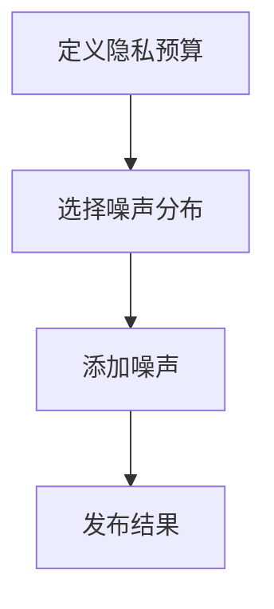
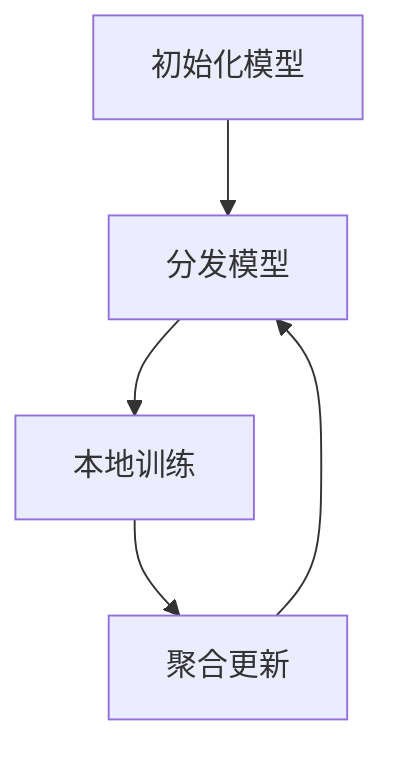
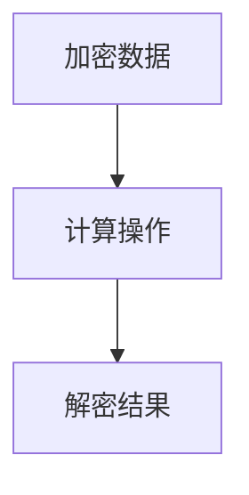
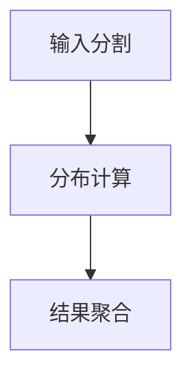

# AI人工智能核心算法原理与代码实例讲解：数据隐私

## 1.背景介绍

在当今数字化时代，数据隐私成为了一个至关重要的话题。随着人工智能（AI）技术的迅猛发展，数据隐私问题也变得愈发复杂和重要。AI系统需要大量的数据来进行训练和优化，而这些数据往往包含敏感的个人信息。如何在保证数据隐私的前提下，充分利用数据进行AI模型的训练和应用，成为了一个亟待解决的难题。

数据隐私不仅仅是一个技术问题，更是一个法律和伦理问题。各国政府和组织纷纷出台了相关的法律法规，如欧盟的《通用数据保护条例》（GDPR）和美国的《加州消费者隐私法案》（CCPA），以保护个人数据的隐私权。在这样的背景下，AI技术的开发者和研究者需要深入理解数据隐私的核心概念和技术手段，以确保其开发的系统符合相关法规，并且能够有效保护用户的隐私。

## 2.核心概念与联系

### 2.1 数据隐私

数据隐私是指保护个人数据不被未经授权的访问、使用、披露、篡改或销毁。数据隐私的核心在于确保个人数据的机密性、完整性和可用性。

### 2.2 差分隐私

差分隐私（Differential Privacy）是一种数学框架，用于量化数据隐私保护的程度。它通过在数据查询结果中添加噪声，确保单个数据点的存在或不存在不会显著影响查询结果，从而保护个体隐私。

### 2.3 联邦学习

联邦学习（Federated Learning）是一种分布式机器学习方法，它允许多个参与方在不共享原始数据的情况下，共同训练一个模型。联邦学习通过将模型训练过程分布到各个数据持有方，避免了数据集中存储和传输，从而保护数据隐私。

### 2.4 同态加密

同态加密（Homomorphic Encryption）是一种加密技术，它允许在加密数据上直接进行计算，而无需解密数据。同态加密可以用于保护数据在计算过程中的隐私，确保数据在传输和处理过程中不被泄露。

### 2.5 安全多方计算

安全多方计算（Secure Multi-Party Computation, SMPC）是一种密码学技术，它允许多个参与方在不泄露各自输入的情况下，共同计算一个函数的值。SMPC可以用于保护数据在多方协作计算过程中的隐私。

## 3.核心算法原理具体操作步骤

### 3.1 差分隐私算法

差分隐私的核心思想是通过在数据查询结果中添加噪声，保护个体数据的隐私。具体操作步骤如下：

1. **定义隐私预算**：设定隐私预算 $\epsilon$，它表示允许的隐私泄露程度。
2. **添加噪声**：根据隐私预算 $\epsilon$，选择合适的噪声分布（如拉普拉斯分布或高斯分布），在查询结果中添加噪声。
3. **发布结果**：将添加噪声后的查询结果发布给用户。



### 3.2 联邦学习算法

联邦学习的核心思想是将模型训练过程分布到各个数据持有方，避免数据集中存储和传输。具体操作步骤如下：

1. **初始化模型**：在中央服务器上初始化全局模型。
2. **分发模型**：将全局模型分发到各个参与方。
3. **本地训练**：各个参与方使用本地数据对模型进行训练，并将更新后的模型参数发送回中央服务器。
4. **聚合更新**：中央服务器对各个参与方的模型参数进行聚合，更新全局模型。
5. **重复步骤2-4**：重复分发模型、本地训练和聚合更新的过程，直到模型收敛。



### 3.3 同态加密算法

同态加密的核心思想是允许在加密数据上直接进行计算。具体操作步骤如下：

1. **加密数据**：使用同态加密算法对数据进行加密。
2. **计算操作**：在加密数据上进行所需的计算操作。
3. **解密结果**：将计算结果解密，得到最终结果。



### 3.4 安全多方计算算法

安全多方计算的核心思想是允许多个参与方在不泄露各自输入的情况下，共同计算一个函数的值。具体操作步骤如下：

1. **输入分割**：将每个参与方的输入数据进行分割，生成多个子数据。
2. **分布计算**：各个参与方在自己的子数据上进行计算。
3. **结果聚合**：将各个参与方的计算结果进行聚合，得到最终结果。



## 4.数学模型和公式详细讲解举例说明

### 4.1 差分隐私

差分隐私的数学定义如下：

$$
\text{Pr}[M(D) \in S] \leq e^\epsilon \cdot \text{Pr}[M(D') \in S]
$$

其中，$M$ 是一个随机化算法，$D$ 和 $D'$ 是两个相邻的数据集，$S$ 是一个结果集，$\epsilon$ 是隐私预算。

#### 例子

假设我们有一个包含1000名用户的数据库，我们希望查询数据库中某个特定属性的平均值。为了保护用户隐私，我们可以在查询结果中添加拉普拉斯噪声。

$$
\text{Lap}(b) = \frac{1}{2b} \exp\left(-\frac{|x|}{b}\right)
$$

其中，$b$ 是噪声的尺度参数，与隐私预算 $\epsilon$ 相关。

### 4.2 联邦学习

联邦学习的数学模型可以表示为：

$$
\min_{w} \sum_{k=1}^{K} p_k \mathcal{L}_k(w)
$$

其中，$w$ 是模型参数，$K$ 是参与方的数量，$p_k$ 是第 $k$ 个参与方的数据权重，$\mathcal{L}_k$ 是第 $k$ 个参与方的损失函数。

#### 例子

假设我们有两个参与方，各自拥有一个包含1000条数据的本地数据集。我们希望使用联邦学习训练一个线性回归模型。每个参与方的损失函数为：

$$
\mathcal{L}_k(w) = \frac{1}{2N_k} \sum_{i=1}^{N_k} (y_i - w^T x_i)^2
$$

其中，$N_k$ 是第 $k$ 个参与方的数据量，$x_i$ 和 $y_i$ 分别是第 $i$ 条数据的特征和标签。

### 4.3 同态加密

同态加密的数学模型可以表示为：

$$
E(m_1 + m_2) = E(m_1) \cdot E(m_2)
$$

其中，$E$ 是加密函数，$m_1$ 和 $m_2$ 是两个明文消息。

#### 例子

假设我们有两个明文消息 $m_1 = 5$ 和 $m_2 = 3$，使用同态加密算法对它们进行加密：

$$
E(m_1) = g^{m_1} \mod n
$$

$$
E(m_2) = g^{m_2} \mod n
$$

其中，$g$ 和 $n$ 是加密算法的参数。然后，我们可以在加密消息上进行加法操作：

$$
E(m_1 + m_2) = E(m_1) \cdot E(m_2) = g^{m_1} \cdot g^{m_2} \mod n = g^{m_1 + m_2} \mod n
$$

### 4.4 安全多方计算

安全多方计算的数学模型可以表示为：

$$
f(x_1, x_2, \ldots, x_n) = \sum_{i=1}^{n} f_i(x_i)
$$

其中，$f$ 是目标函数，$x_i$ 是第 $i$ 个参与方的输入数据，$f_i$ 是第 $i$ 个参与方的计算函数。

#### 例子

假设我们有三个参与方，各自拥有一个包含100条数据的本地数据集。我们希望计算所有数据的总和。每个参与方的计算函数为：

$$
f_i(x_i) = \sum_{j=1}^{100} x_{ij}
$$

其中，$x_{ij}$ 是第 $i$ 个参与方的第 $j$ 条数据。然后，我们可以将各个参与方的计算结果进行聚合，得到最终结果：

$$
f(x_1, x_2, \ldots, x_n) = \sum_{i=1}^{n} f_i(x_i)
$$

## 5.项目实践：代码实例和详细解释说明

### 5.1 差分隐私代码实例

以下是一个使用Python实现差分隐私的示例代码：

```python
import numpy as np

def laplace_mechanism(value, epsilon, sensitivity):
    scale = sensitivity / epsilon
    noise = np.random.laplace(0, scale, 1)
    return value + noise

# 示例数据
data = [1, 2, 3, 4, 5]
true_mean = np.mean(data)
epsilon = 1.0
sensitivity = 1.0

# 添加噪声后的结果
dp_mean = laplace_mechanism(true_mean, epsilon, sensitivity)
print(f"True Mean: {true_mean}, DP Mean: {dp_mean}")
```

### 5.2 联邦学习代码实例

以下是一个使用Python和TensorFlow实现联邦学习的示例代码：

```python
import tensorflow as tf
import numpy as np

# 模拟数据
def generate_data(num_samples):
    X = np.random.rand(num_samples, 1)
    y = 2 * X + 1 + np.random.normal(0, 0.1, (num_samples, 1))
    return X, y

# 本地训练函数
def local_train(X, y, model, epochs=1):
    model.compile(optimizer='sgd', loss='mse')
    model.fit(X, y, epochs=epochs, verbose=0)
    return model.get_weights()

# 初始化模型
global_model = tf.keras.Sequential([tf.keras.layers.Dense(1, input_shape=(1,))])

# 模拟两个参与方的数据
X1, y1 = generate_data(100)
X2, y2 = generate_data(100)

# 联邦学习过程
for round in range(10):
    weights1 = local_train(X1, y1, global_model)
    weights2 = local_train(X2, y2, global_model)
    
    # 聚合更新
    new_weights = [(w1 + w2) / 2 for w1, w2 in zip(weights1, weights2)]
    global_model.set_weights(new_weights)

print("Federated Learning Completed")
```

### 5.3 同态加密代码实例

以下是一个使用Python和PyCryptodome实现同态加密的示例代码：

```python
from Crypto.Util import number

# 生成密钥
def generate_key(bits=1024):
    p = number.getPrime(bits)
    q = number.getPrime(bits)
    n = p * q
    return p, q, n

# 加密函数
def encrypt(m, n):
    g = n + 1
    r = number.getRandomRange(1, n)
    c = pow(g, m, n * n) * pow(r, n, n * n) % (n * n)
    return c

# 解密函数
def decrypt(c, p, q, n):
    g = n + 1
    lambda_n = (p - 1) * (q - 1)
    mu = number.inverse(lambda_n, n)
    m = (pow(c, lambda_n, n * n) - 1) // n * mu % n
    return m

# 示例数据
p, q, n = generate_key()
m1 = 5
m2 = 3

# 加密
c1 = encrypt(m1, n)
c2 = encrypt(m2, n)

# 同态加法
c_sum = c1 * c2 % (n * n)

# 解密
m_sum = decrypt(c_sum, p, q, n)
print(f"Decrypted Sum: {m_sum}")
```

### 5.4 安全多方计算代码实例

以下是一个使用Python和PySyft实现安全多方计算的示例代码：

```python
import syft as sy
import torch

# 初始化参与方
hook = sy.TorchHook(torch)
alice = sy.VirtualWorker(hook, id="alice")
bob = sy.VirtualWorker(hook, id="bob")

# 示例数据
x_alice = torch.tensor([1, 2, 3, 4, 5]).send(alice)
x_bob = torch.tensor([6, 7, 8, 9, 10]).send(bob)

# 安全多方计算
y_alice = x_alice.sum()
y_bob = x_bob.sum()

# 聚合结果
y = y_alice.get() + y_bob.get()
print(f"Sum: {y}")
```

## 6.实际应用场景

### 6.1 医疗数据分析

在医疗数据分析中，患者的健康数据往往包含敏感的个人信息。通过使用差分隐私和联邦学习等技术，可以在保护患者隐私的前提下，进行大规模的医疗数据分析和模型训练，从而提高医疗服务的质量和效率。

### 6.2 金融数据分析

在金融数据分析中，客户的交易记录和财务信息同样需要严格保护。通过使用同态加密和安全多方计算等技术，可以在不泄露客户隐私的情况下，进行风险评估、欺诈检测等金融数据分析任务。

### 6.3 智能家居

在智能家居应用中，用户的行为数据和设备使用数据需要保护隐私。通过使用差分隐私和联邦学习等技术，可以在保护用户隐私的前提下，优化智能家居设备的性能和用户体验。

## 7.工具和资源推荐

### 7.1 工具

- **TensorFlow Federated**：一个用于联邦学习的开源框架，支持分布式模型训练和隐私保护。
- **PySyft**：一个用于安全多方计算和同态加密的开源库，支持分布式数据分析和隐私保护。
- **PyCryptodome**：一个用于加密和解密操作的Python库，支持同态加密和其他加密算法。

### 7.2 资源

- **《差分隐私：理论与实践》**：一本详细介绍差分隐私理论和应用的书籍，适合初学者和研究者。
- **《联邦学习：原理与应用》**：一本介绍联邦学习基本原理和实际应用的书籍，适合开发者和研究者。
- **《同态加密：从理论到实践》**：一本介绍同态加密技术及其应用的书籍，适合密码学爱好者和研究者。

## 8.总结：未来发展趋势与挑战

随着AI技术的不断发展，数据隐私保护将变得越来越重要。未来，差分隐私、联邦学习、同态加密和安全多方计算等技术将继续发展，并在更多的实际应用中得到广泛应用。然而，这些技术也面临着一些挑战，如计算复杂度高、通信开销大、隐私保护效果有限等。为了应对这些挑战，研究者和开发者需要不断探索新的算法和技术，提升数据隐私保护的效果和效率。

## 9.附录：常见问题与解答

### 9.1 什么是差分隐私？

差分隐私是一种数学框架，用于量化数据隐私保护的程度。它通过在数据查询结果中添加噪声，确保单个数据点的存在或不存在不会显著影响查询结果，从而保护个体隐私。

### 9.2 什么是联邦学习？

联邦学习是一种分布式机器学习方法，它允许多个参与方在不共享原始数据的情况下，共同训练一个模型。联邦学习通过将模型训练过程分布到各个数据持有方，避免了数据集中存储和传输，从而保护数据隐私。

### 9.3 什么是同态加密？

同态加密是一种加密技术，它允许在加密数据上直接进行计算，而无需解密数据。同态加密可以用于保护数据在计算过程中的隐私，确保数据在传输和处理过程中不被泄露。

### 9.4 什么是安全多方计算？

安全多方计算是一种密码学技术，它允许多个参与方在不泄露各自输入的情况下，共同计算一个函数的值。安全多方计算可以用于保护数据在多方协作计算过程中的隐私。

### 9.5 如何选择合适的数据隐私保护技术？

选择合适的数据隐私保护技术需要考虑多个因素，如