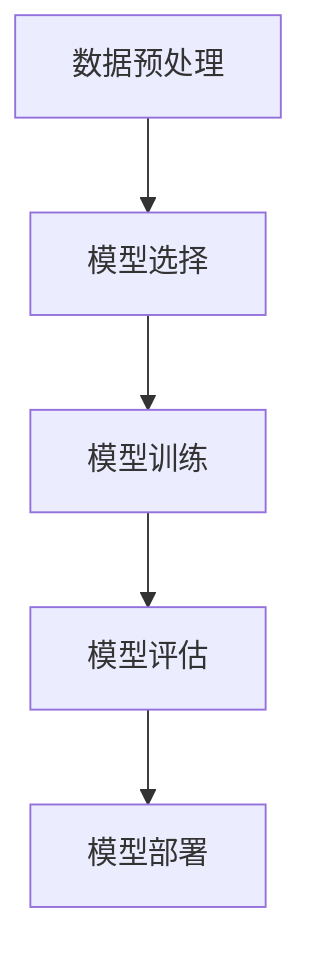

# AI可靠性：社会责任与伦理探讨

## 1.背景介绍

人工智能（AI）技术在过去几十年中取得了飞速发展，从简单的规则系统到复杂的深度学习模型，AI已经渗透到各个行业和领域。然而，随着AI技术的广泛应用，AI系统的可靠性和其带来的社会责任与伦理问题也逐渐成为人们关注的焦点。AI的可靠性不仅仅是技术问题，更是社会责任和伦理问题。本文将深入探讨AI可靠性的重要性、核心概念、算法原理、数学模型、项目实践、实际应用场景、工具和资源推荐，并展望未来的发展趋势与挑战。

## 2.核心概念与联系

### 2.1 AI可靠性

AI可靠性指的是AI系统在各种条件下持续、稳定地执行其预期功能的能力。可靠性包括准确性、鲁棒性、安全性和可解释性等多个方面。

### 2.2 社会责任

社会责任是指AI开发者和使用者在开发和应用AI技术时，必须考虑其对社会的影响，确保AI技术的应用不会对社会造成负面影响。

### 2.3 伦理问题

伦理问题涉及AI技术在应用过程中可能引发的道德和法律问题，如隐私保护、数据安全、公平性和透明性等。

### 2.4 核心概念联系

AI可靠性、社会责任和伦理问题是相互联系、相互影响的。可靠的AI系统能够减少伦理问题的发生，而考虑社会责任和伦理问题的AI开发过程能够提高AI系统的可靠性。

## 3.核心算法原理具体操作步骤

### 3.1 数据预处理

数据预处理是AI系统开发的第一步，主要包括数据清洗、数据归一化、特征选择等步骤。数据预处理的质量直接影响AI系统的可靠性。

### 3.2 模型选择

选择合适的模型是确保AI系统可靠性的关键。常见的AI模型包括线性回归、决策树、支持向量机、神经网络等。不同的模型适用于不同的应用场景。

### 3.3 模型训练

模型训练是指使用训练数据对AI模型进行参数调整，使其能够准确地预测或分类。训练过程中的超参数调整和交叉验证是提高模型可靠性的关键步骤。

### 3.4 模型评估

模型评估是指使用测试数据对训练好的模型进行性能评估。常用的评估指标包括准确率、精确率、召回率、F1值等。评估结果能够帮助开发者判断模型的可靠性。

### 3.5 模型部署

模型部署是指将训练好的模型应用到实际环境中。部署过程中的监控和维护是确保AI系统长期可靠运行的重要环节。



## 4.数学模型和公式详细讲解举例说明

### 4.1 线性回归

线性回归是一种简单而常用的回归模型，其数学公式为：

$$
y = \beta_0 + \beta_1 x_1 + \beta_2 x_2 + \cdots + \beta_n x_n + \epsilon
$$

其中，$y$ 是预测值，$x_i$ 是特征值，$\beta_i$ 是回归系数，$\epsilon$ 是误差项。

### 4.2 支持向量机

支持向量机（SVM）是一种常用的分类模型，其目标是找到一个最优的超平面将不同类别的数据分开。其数学公式为：

$$
f(x) = \text{sign}(w \cdot x + b)
$$

其中，$w$ 是权重向量，$x$ 是输入向量，$b$ 是偏置项。

### 4.3 神经网络

神经网络是一种复杂的非线性模型，其基本单元是神经元。一个简单的神经元的数学公式为：

$$
y = f\left(\sum_{i=1}^{n} w_i x_i + b\right)
$$

其中，$f$ 是激活函数，$w_i$ 是权重，$x_i$ 是输入，$b$ 是偏置。

### 4.4 举例说明

假设我们要预测房价，可以使用线性回归模型。首先，我们收集房屋的特征数据，如面积、房间数、位置等。然后，使用这些特征数据训练线性回归模型，得到回归系数。最后，使用训练好的模型对新房屋进行价格预测。

## 5.项目实践：代码实例和详细解释说明

### 5.1 数据预处理

```python
import pandas as pd
from sklearn.model_selection import train_test_split
from sklearn.preprocessing import StandardScaler

# 读取数据
data = pd.read_csv('housing.csv')

# 数据清洗
data = data.dropna()

# 特征选择
features = data[['area', 'rooms', 'location']]
target = data['price']

# 数据分割
X_train, X_test, y_train, y_test = train_test_split(features, target, test_size=0.2, random_state=42)

# 数据归一化
scaler = StandardScaler()
X_train = scaler.fit_transform(X_train)
X_test = scaler.transform(X_test)
```

### 5.2 模型选择和训练

```python
from sklearn.linear_model import LinearRegression

# 模型选择
model = LinearRegression()

# 模型训练
model.fit(X_train, y_train)
```

### 5.3 模型评估

```python
from sklearn.metrics import mean_squared_error

# 模型预测
y_pred = model.predict(X_test)

# 模型评估
mse = mean_squared_error(y_test, y_pred)
print(f'Mean Squared Error: {mse}')
```

### 5.4 模型部署

```python
import joblib

# 模型保存
joblib.dump(model, 'house_price_model.pkl')

# 模型加载
loaded_model = joblib.load('house_price_model.pkl')

# 新数据预测
new_data = [[1200, 3, 1]]  # 示例数据
new_data = scaler.transform(new_data)
predicted_price = loaded_model.predict(new_data)
print(f'Predicted Price: {predicted_price}')
```

## 6.实际应用场景

### 6.1 医疗诊断

AI技术在医疗诊断中的应用已经取得了显著成果。例如，AI可以通过分析医学影像数据，辅助医生进行疾病诊断，提高诊断的准确性和效率。

### 6.2 自动驾驶

自动驾驶汽车是AI技术的一个重要应用场景。通过使用传感器和AI算法，自动驾驶汽车能够感知周围环境，做出驾驶决策，提高交通安全性和效率。

### 6.3 金融风控

在金融领域，AI技术被广泛应用于风险控制。通过分析大量的金融数据，AI可以预测潜在的风险，帮助金融机构做出更明智的决策。

### 6.4 智能客服

智能客服系统利用自然语言处理技术，能够自动回答用户的问题，提高客户服务的效率和质量。

## 7.工具和资源推荐

### 7.1 开发工具

- **TensorFlow**：一个开源的机器学习框架，适用于各种AI应用。
- **PyTorch**：另一个流行的开源机器学习框架，具有灵活性和易用性。
- **Scikit-learn**：一个简单而强大的机器学习库，适用于数据预处理、模型选择和评估。

### 7.2 数据集

- **Kaggle**：一个提供各种公开数据集的平台，适合进行AI项目实践。
- **UCI Machine Learning Repository**：一个著名的机器学习数据集存储库，包含各种领域的数据集。

### 7.3 学习资源

- **Coursera**：提供各种AI和机器学习课程，适合初学者和进阶学习者。
- **edX**：另一个提供高质量AI课程的平台，涵盖基础和高级内容。

## 8.总结：未来发展趋势与挑战

### 8.1 发展趋势

随着AI技术的不断进步，AI系统的可靠性将进一步提高。未来，AI技术将在更多领域得到应用，如智能制造、智慧城市、个性化教育等。同时，AI技术的发展也将推动社会责任和伦理问题的深入探讨。

### 8.2 挑战

尽管AI技术前景广阔，但其发展也面临诸多挑战。首先，AI系统的可靠性仍需进一步提高，特别是在复杂和动态环境中的表现。其次，社会责任和伦理问题需要得到更多关注和解决，如隐私保护、公平性和透明性等。最后，AI技术的快速发展可能带来新的法律和监管问题，需要制定相应的政策和法规。

## 9.附录：常见问题与解答

### 9.1 什么是AI可靠性？

AI可靠性是指AI系统在各种条件下持续、稳定地执行其预期功能的能力，包括准确性、鲁棒性、安全性和可解释性等多个方面。

### 9.2 如何提高AI系统的可靠性？

提高AI系统可靠性的方法包括数据预处理、模型选择、模型训练、模型评估和模型部署等多个步骤。每个步骤都需要严格把控，确保AI系统的稳定性和准确性。

### 9.3 AI技术在实际应用中面临哪些伦理问题？

AI技术在实际应用中面临的伦理问题包括隐私保护、数据安全、公平性和透明性等。这些问题需要在AI开发和应用过程中得到充分考虑和解决。

### 9.4 如何选择合适的AI模型？

选择合适的AI模型需要根据具体的应用场景和数据特点进行选择。常见的AI模型包括线性回归、决策树、支持向量机、神经网络等。不同的模型适用于不同的应用场景。

### 9.5 AI技术的未来发展趋势是什么？

AI技术的未来发展趋势包括在更多领域的应用、技术的进一步成熟和可靠性提高、社会责任和伦理问题的深入探讨等。同时，AI技术的发展也将带来新的法律和监管问题，需要制定相应的政策和法规。

---

作者：禅与计算机程序设计艺术 / Zen and the Art of Computer Programming