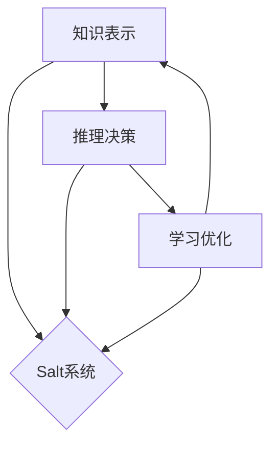

# AI系统Salt原理与代码实战案例讲解

## 1. 背景介绍
### 1.1 AI系统发展现状
### 1.2 Salt系统的提出
### 1.3 Salt系统的意义

## 2. 核心概念与联系
### 2.1 Salt系统的定义
### 2.2 Salt系统的核心组件
#### 2.2.1 知识表示模块 
#### 2.2.2 推理决策模块
#### 2.2.3 学习优化模块
### 2.3 Salt系统的关键特性
#### 2.3.1 可解释性
#### 2.3.2 鲁棒性
#### 2.3.3 可扩展性

## 3. 核心算法原理具体操作步骤
### 3.1 知识表示算法
#### 3.1.1 本体构建
#### 3.1.2 知识图谱嵌入
#### 3.1.3 知识蒸馏
### 3.2 推理决策算法  
#### 3.2.1 基于规则的推理
#### 3.2.2 基于案例的推理
#### 3.2.3 基于深度学习的推理
### 3.3 学习优化算法
#### 3.3.1 监督学习
#### 3.3.2 强化学习
#### 3.3.3 无监督学习

## 4. 数学模型和公式详细讲解举例说明
### 4.1 知识表示的数学建模
#### 4.1.1 本体的形式化定义
#### 4.1.2 TransE模型
#### 4.1.3 知识蒸馏的损失函数
### 4.2 推理决策的数学建模
#### 4.2.1 马尔可夫逻辑网络
#### 4.2.2 相似度计算
#### 4.2.3 图神经网络
### 4.3 学习优化的数学建模 
#### 4.3.1 经验风险最小化
#### 4.3.2 Q-Learning
#### 4.3.3 变分自编码器

## 5. 项目实践：代码实例和详细解释说明
### 5.1 构建知识库
#### 5.1.1 本体定义的Python实现
#### 5.1.2 知识图谱存储与查询
#### 5.1.3 知识表示学习
### 5.2 实现推理决策
#### 5.2.1 规则引擎的开发
#### 5.2.2 案例检索与匹配
#### 5.2.3 深度学习模型的应用
### 5.3 模型训练与优化
#### 5.3.1 有监督的预训练
#### 5.3.2 强化学习训练
#### 5.3.3 无监督微调

## 6. 实际应用场景
### 6.1 智能客服
### 6.2 金融风控
### 6.3 医疗辅助诊断

## 7. 工具和资源推荐
### 7.1 知识图谱构建工具
### 7.2 推理引擎框架
### 7.3 深度学习平台

## 8. 总结：未来发展趋势与挑战
### 8.1 Salt系统的优势 
### 8.2 面临的技术挑战
### 8.3 未来研究方向

## 9. 附录：常见问题与解答
### 9.1 如何平衡可解释性和性能？
### 9.2 Salt系统能否应对数据稀疏问题？
### 9.3 如何进行Salt系统的评测？



Salt（Scalable AI Learning and Reasoning Toolkit）是一个可扩展的人工智能学习和推理工具包，旨在构建可解释、鲁棒、高效的智能系统。它以知识为核心，通过知识表示、推理决策、学习优化等模块的协同，实现了从数据到知识再到智能应用的闭环。

Salt系统的知识表示模块负责将非结构化数据组织为结构化的知识库，常用的方法包括本体构建、知识图谱嵌入、知识蒸馏等。其中本体提供了知识的形式化定义，知识图谱嵌入将知识库映射到连续向量空间，知识蒸馏则从复杂模型中提取结构化的知识。以知识图谱嵌入为例，给定三元组$(h,r,t)$，TransE模型学习实体和关系的嵌入向量，使得$\mathbf{h}+\mathbf{r}\approx\mathbf{t}$当$(h,r,t)$在知识库中成立。

推理决策模块在知识库的基础上，运用逻辑推理、相似性计算等方法进行决策。常见的推理框架包括基于规则的推理、基于案例的推理和基于深度学习的推理。例如，马尔可夫逻辑网络将一阶逻辑与概率图模型相结合，定义了一组带权重的一阶逻辑公式：

$$
P(\mathbf{X}=\mathbf{x})=\frac{1}{Z}\exp\left(\sum_{i=1}^{N}w_i n_i(\mathbf{x})\right)
$$

其中$\mathbf{X}$为随机变量，$\mathbf{x}$为其取值，$w_i$为第$i$条公式的权重，$n_i(\mathbf{x})$为$\mathbf{x}$满足第$i$条公式的数量，$Z$为归一化因子。

学习优化模块通过机器学习算法，利用数据不断优化知识表示和推理决策模型。主要包括监督学习、强化学习、无监督学习等范式。以强化学习为例，Q-Learning算法通过值函数逼近的方式，学习在每个状态下采取动作的长期回报：

$$
Q(s,a)\leftarrow Q(s,a)+\alpha\left[r+\gamma \max_{a'}Q(s',a')-Q(s,a)\right]
$$

其中$s$为当前状态，$a$为当前动作，$r$为即时奖励，$s'$为下一状态，$\alpha$为学习率，$\gamma$为折扣因子。

下面以一个简单的例子来说明Salt系统的工作流程。假设我们要开发一个智能客服系统，首先需要收集整理领域知识，构建知识库。可以定义领域本体，例如：

```python
from owlready2 import *

onto = get_ontology("http://example.com/customer_service.owl")

with onto:
    class Product(Thing):
        pass
    class Service(Thing):
        pass
    class Question(Thing):
        pass
    class Answer(Thing):
        pass
    
    class has_question(ObjectProperty):
        domain = [Product, Service]
        range = [Question]
    class has_answer(ObjectProperty):
        domain = [Question]
        range = [Answer]
```

然后，我们可以将收集到的问答数据存入知识库，并训练知识表示模型。当用户提出问题时，系统首先匹配知识库中的相似问题，再根据问题的类别和属性进行推理，生成回答。整个过程中，系统会记录用户的反馈，并用于优化知识表示和推理模型，提升系统性能。

Salt系统的优势在于其可解释性和可扩展性。通过将知识显式地表示出来，Salt系统能够生成人类可读的解释，增强了系统的可信度。同时，Salt系统采用模块化的设计，知识库、推理引擎、学习算法可以灵活地替换和扩展，适应不同的任务需求。

然而，Salt系统的研发仍面临诸多挑战。首先，如何在提高性能的同时保证可解释性，是一个需要权衡的问题。其次，知识获取和表示的质量很大程度上决定了系统的上限，而现实世界的知识往往是不完整和噪声的。此外，Salt系统的评测也缺乏统一的标准和基准数据集。

未来，Salt系统的研究方向包括但不限于：融合深度学习和符号推理的神经符号方法、面向开放环境的可持续学习、多模态知识表示与推理、大规模分布式知识库构建等。随着技术的发展和应用的深入，Salt系统有望成为构建可解释、鲁棒、高效的智能系统的重要范式。

作者：禅与计算机程序设计艺术 / Zen and the Art of Computer Programming