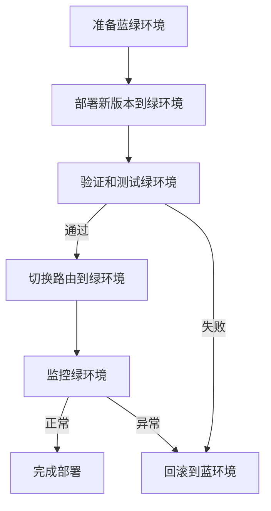

# AI系统蓝绿部署原理与代码实战案例讲解

## 1.背景介绍

### 1.1 软件部署的挑战

在现代软件开发过程中,频繁的新功能迭代和bug修复是不可避免的。然而,每次部署新版本都存在一定风险,可能会导致系统中断或者引入新的bug。因此,如何实现无缝升级,最大程度减少对现有系统的影响,是软件部署过程中需要重点考虑的问题。

### 1.2 蓝绿部署的概念

蓝绿部署(Blue/Green Deployment)是一种可靠的应用程序发布模式,通过运行相同的生产环境的两个实例(蓝绿两个环境),来实现无缝切换和回滚。在部署新版本时,只需要在闲置的绿色环境部署新版本,并进行充分测试。一旦新版本准备就绪,只需将流量从蓝色环境切换到绿色环境,即完成了新版本的部署。如果新版本出现问题,可以立即切换回蓝色环境,从而最大程度减小了风险。

### 1.3 蓝绿部署在AI系统中的应用

随着人工智能技术的快速发展,越来越多的企业开始将AI系统应用于生产环境。然而,AI系统的复杂性和不确定性,使得传统的部署方式面临更大挑战。蓝绿部署作为一种成熟可靠的部署模式,非常适合应用于AI系统的发布过程,确保AI系统的稳定性和可用性。

## 2.核心概念与联系

### 2.1 蓝绿部署的核心概念

1. **蓝绿环境**:指两套完全独立的生产环境,分别称为蓝环境和绿环境。
2. **路由切换**:通过修改负载均衡器或DNS服务的路由规则,将流量从一个环境切换到另一个环境。
3. **无缝切换**:在切换流量时,不会影响现有用户的访问和使用。
4. **回滚**:如果新版本出现问题,可以快速切换回旧版本,实现无缝回滚。

### 2.2 蓝绿部署与其他部署模式的关系

蓝绿部署是一种特殊的滚动部署(Rolling Deployment)方式。相比传统的滚动部署,蓝绿部署更加彻底,每次都是全量部署新版本,而不是逐步替换旧版本。这种方式虽然需要更多资源,但更加安全可靠。

蓝绿部署也可以与金丝雀发布(Canary Release)相结合。在蓝绿部署的基础上,先将一部分流量引入绿色环境,进行金丝雀测试。测试通过后,再切换全部流量。

## 3.核心算法原理具体操作步骤

蓝绿部署的核心算法原理可以概括为以下几个步骤:



1. **准备蓝绿环境**:确保蓝绿两个环境完全独立,并且至少有一个环境在正常运行中。
2. **部署新版本到绿环境**:在闲置的绿色环境中,部署新版本的应用程序和相关组件。
3. **验证和测试绿环境**:对新部署的绿环境进行全面的验证和测试,确保新版本的正确性和稳定性。
4. **切换路由到绿环境**:一旦绿环境准备就绪,通过修改负载均衡器或DNS服务的路由规则,将所有流量切换到绿环境。
5. **监控绿环境**:持续监控绿环境的运行状态,确保新版本的稳定性。
6. **回滚到蓝环境(如果需要)**:如果新版本出现严重问题,可以快速切换回蓝环境,实现无缝回滚。
7. **完成部署**:如果绿环境运行正常,则完成新版本的部署。此时,蓝绿环境的角色将发生交换。

需要注意的是,在整个过程中,确保蓝绿环境的配置、数据和其他资源保持一致性,避免出现数据不同步等问题。

## 4.数学模型和公式详细讲解举例说明

在蓝绿部署过程中,我们可以使用一些数学模型和公式来量化和优化部署策略。

### 4.1 流量切换模型

假设我们有两个环境A和B,分别承载着旧版本和新版本的应用程序。我们需要确定如何在两个环境之间切换流量,以实现平滑过渡。

设总流量为$T$,切换到环境B的流量比例为$x(0 \leq x \leq 1)$,则环境A和B分别承载的流量为:

$$
T_A = (1-x)T \\
T_B = xT
$$

我们可以根据系统的负载能力和版本的稳定性,选择合适的切换策略。例如,可以采用线性切换策略:

$$
x(t) = \frac{t}{t_0}
$$

其中$t_0$是切换的总时间。也可以采用对数切换策略,以实现更平滑的过渡:

$$
x(t) = \frac{1}{1+e^{-k(t-t_0/2)}}
$$

这里$k$是控制切换速率的参数。

### 4.2 回滚时间模型

在蓝绿部署过程中,如果新版本出现问题,我们需要尽快回滚到旧版本。假设回滚所需的时间为$t_r$,系统中断造成的损失率为$r(t)$,则总损失可表示为:

$$
L = \int_0^{t_r} r(t)dt
$$

我们的目标是最小化总损失$L$,因此需要尽可能缩短回滚时间$t_r$。同时,也可以通过优化系统架构和提高容错能力,降低损失率$r(t)$。

### 4.3 资源利用率模型

蓝绿部署需要维护两个独立的生产环境,因此资源利用率较低。我们可以建立资源利用率模型,优化资源分配。

设系统的总资源为$R$,环境A和B分别占用资源$R_A$和$R_B$,则有:

$$
R_A + R_B \leq R
$$

我们的目标是在满足系统需求的前提下,最小化资源占用,即:

$$
\min(R_A + R_B)
$$

通过优化资源分配策略,我们可以提高资源利用率,降低运维成本。

以上是一些常见的数学模型和公式,在实际应用中还可以根据具体情况进行调整和扩展。

## 5.项目实践:代码实例和详细解释说明

为了更好地理解蓝绿部署的实现,我们将使用Kubernetes作为示例,展示如何在Kubernetes集群中实现蓝绿部署。

### 5.1 准备工作

首先,我们需要一个Kubernetes集群,并安装好`kubectl`工具。本例中,我们将使用一个示例应用程序`nginx-app`。

1. 创建一个Namespace:

```bash
kubectl create namespace nginx-app
```

2. 部署旧版本(蓝色环境):

```bash
# 创建Deployment
kubectl create deployment nginx-app-blue --image=nginx:1.19 --namespace=nginx-app

# 创建Service
kubectl create service clusterip nginx-app-blue --tcp=80:80 --namespace=nginx-app
```

### 5.2 部署新版本(绿色环境)

1. 创建新版本的Deployment:

```bash
kubectl create deployment nginx-app-green --image=nginx:1.20 --namespace=nginx-app
```

2. 创建新版本的Service,并更新Ingress:

```bash
kubectl create service clusterip nginx-app-green --tcp=80:80 --namespace=nginx-app

# 更新Ingress,将流量切换到新版本
kubectl edit ingress nginx-app-ingress --namespace=nginx-app
```

在Ingress配置文件中,将`serviceName`从`nginx-app-blue`改为`nginx-app-green`。

### 5.3 验证和切换

1. 访问应用程序,验证新版本是否正常运行。

2. 如果新版本运行正常,则可以删除旧版本的资源:

```bash
kubectl delete deployment nginx-app-blue --namespace=nginx-app
kubectl delete service nginx-app-blue --namespace=nginx-app
```

### 5.4 回滚操作

如果新版本出现问题,可以快速回滚到旧版本:

1. 更新Ingress,将流量切换回旧版本:

```bash
kubectl edit ingress nginx-app-ingress --namespace=nginx-app
```

将`serviceName`从`nginx-app-green`改回`nginx-app-blue`。

2. 删除新版本的资源:

```bash
kubectl delete deployment nginx-app-green --namespace=nginx-app
kubectl delete service nginx-app-green --namespace=nginx-app
```

通过上述步骤,我们完成了蓝绿部署的实践。在实际项目中,还需要根据具体情况进行调整和优化,例如添加健康检查、自动化流程等。

## 6.实际应用场景

蓝绿部署作为一种成熟可靠的部署模式,已经被广泛应用于各种场景,特别是对于那些对系统可用性和稳定性要求较高的应用程序。

### 6.1 Web应用程序

对于大型Web应用程序,例如电子商务网站、在线银行等,系统的可用性和稳定性至关重要。蓝绿部署可以确保在升级或者修复bug时,不会影响现有用户的访问和使用。

### 6.2 移动应用程序

移动应用程序的用户群体庞大,任何系统中断都可能造成巨大损失。通过蓝绿部署,可以实现无缝升级,提高用户体验。

### 6.3 物联网系统

物联网系统通常由大量设备组成,分布在不同地理位置。蓝绿部署可以确保设备的软件升级过程平稳有序,避免大规模中断。

### 6.4 AI系统

如前所述,AI系统的复杂性和不确定性,使得传统的部署方式面临更大挑战。蓝绿部署非常适合应用于AI系统的发布过程,确保AI系统的稳定性和可用性。

### 6.5 云服务

云服务提供商通常需要为大量客户提供稳定可靠的服务。蓝绿部署可以帮助云服务提供商实现无缝升级,提高服务质量。

## 7.工具和资源推荐

为了更好地实现蓝绿部署,我们可以利用一些工具和资源:

1. **Kubernetes**:作为最流行的容器编排工具,Kubernetes提供了丰富的资源管理和部署功能,非常适合实现蓝绿部署。
2. **Istio**:Istio是一个开源的服务网格,可以帮助管理和控制微服务之间的流量,为蓝绿部署提供了强大的支持。
3. **AWS CodeDeploy**:AWS CodeDeploy是亚马逊云服务中的一项部署服务,支持蓝绿部署等多种部署模式。
4. **Spinnaker**:Spinnaker是一个开源的持续交付平台,支持多种云环境,并提供了蓝绿部署等高级功能。
5. **Argo CD**:Argo CD是一个声明式的GitOps持续交付工具,可以与Kubernetes无缝集成,实现自动化的蓝绿部署。
6. **蓝绿部署最佳实践**:许多公司和组织都分享了他们在蓝绿部署方面的最佳实践和经验,这些资源可以为我们提供宝贵的指导。

通过合理利用这些工具和资源,我们可以更加高效地实现蓝绿部署,提高部署的质量和效率。

## 8.总结:未来发展趋势与挑战

蓝绿部署作为一种成熟可靠的部署模式,已经被广泛应用于各种场景。然而,随着技术的不断发展,蓝绿部署也面临着一些新的挑战和发展趋势。

### 8.1 自动化和智能化

未来,蓝绿部署过程将会越来越自动化和智能化。通过机器学习和人工智能技术,我们可以优化流量切换策略、资源分配等,实现更加高效和智能的部署。