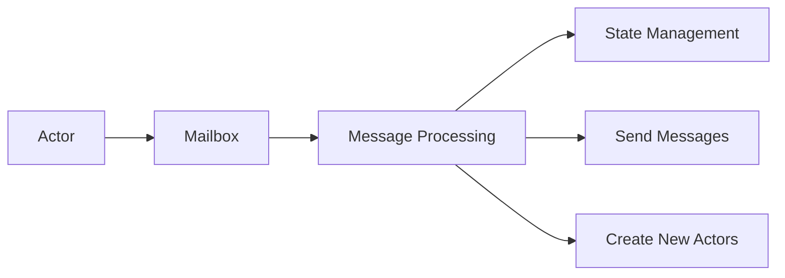
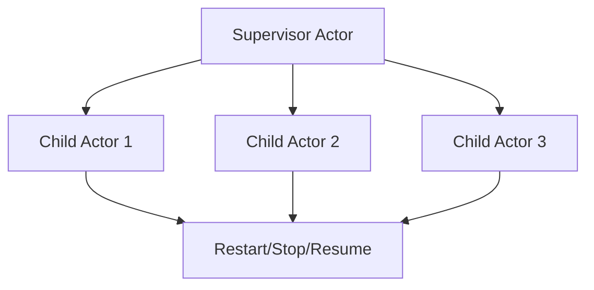
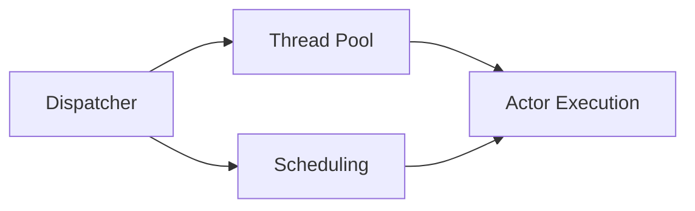
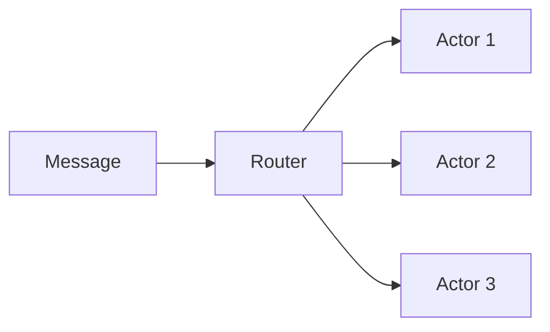
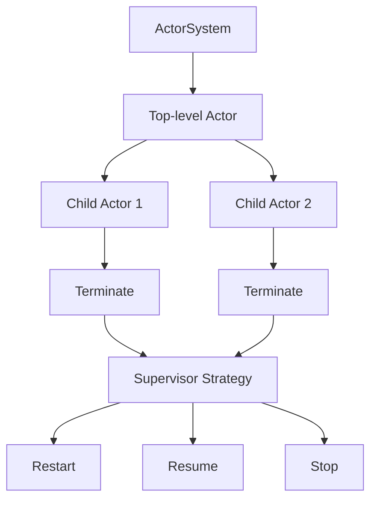
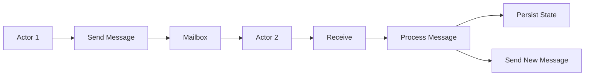
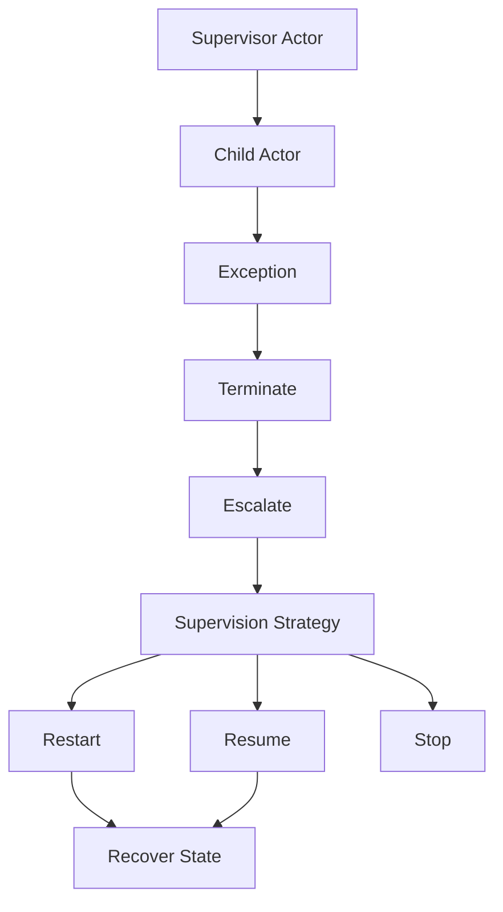
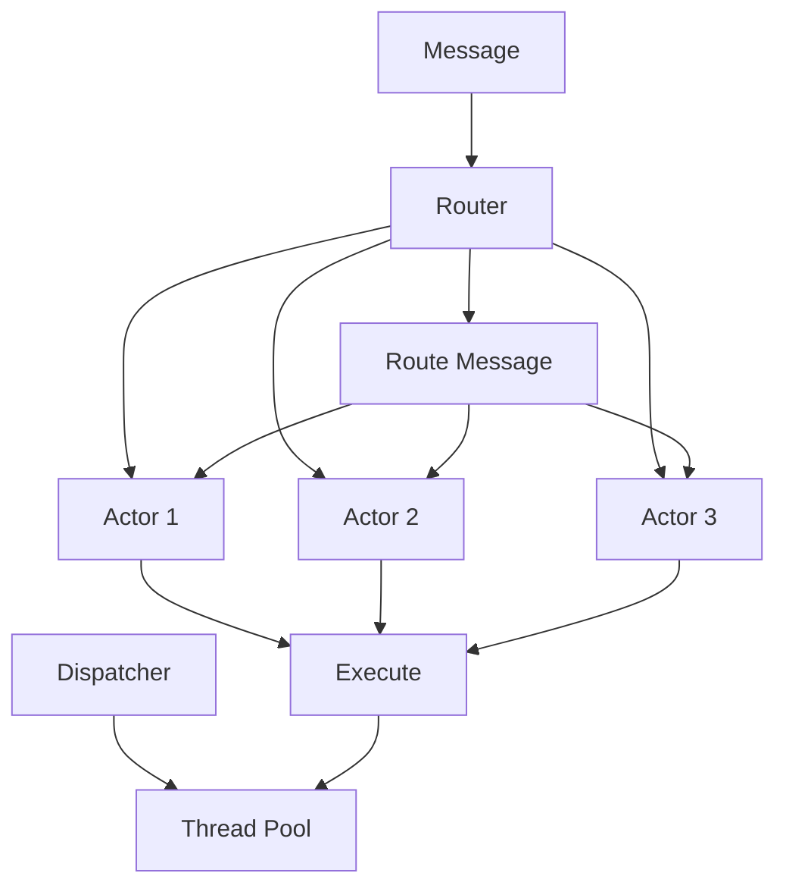

# Akka原理与代码实例讲解

## 1.背景介绍

在现代分布式系统中,并发和高可用性是两个关键的需求。传统的线程模型虽然可以实现并发,但存在诸多问题,如线程安全、死锁、资源争用等。Actor模型应运而生,它将程序划分为多个独立的单元,每个单元被称为Actor。Actor之间通过异步消息传递进行通信,而不是共享内存,从而避免了线程安全问题。

Akka是一个基于Actor模型的开源工具包,用于构建高并发、分布式、容错和事件驱动的应用程序。它最初是用Scala语言编写的,但也支持Java。Akka广泛应用于金融、游戏、物联网、大数据等领域。

### Actor模型优势

- 无共享状态:Actor之间没有共享内存,只通过消息传递进行通信,从根本上避免了线程安全问题。
- 高并发:Actor可以并发运行,充分利用多核CPU。
- 分布式:Actor可以在不同的节点上运行,实现分布式计算。
- 容错性:Actor之间是松耦合的,单个Actor失败不会影响整个系统。
- 事件驱动:Actor通过消息驱动执行任务,非常适合事件驱动架构。

## 2.核心概念与联系

### Actor

Actor是Akka中最核心的概念。每个Actor都有一个邮箱,用于接收其他Actor发送的消息。Actor通过处理邮箱中的消息来执行任务,处理完成后可以持久化状态、发送新消息给其他Actor、创建新的Actor等。



### Supervision

Akka采用"让它崩溃"(Let it crash)的理念,当Actor出现异常时,它会终止并将异常传播给监督者Actor。监督者可以选择重启、停止或恢复子Actor,从而实现容错。



### Dispatchers

Dispatcher决定了Actor的执行上下文,包括线程池配置、调度策略等。Akka提供了多种内置Dispatcher,也支持自定义Dispatcher。合理配置Dispatcher可以提高系统吞吐量和资源利用率。



### Routers

Router用于管理Actor的实例化和消息路由。Akka提供了多种内置Router,如RoundRobinRouter、RandomRouter等。Router可以实现负载均衡、故障转移等功能。



## 3.核心算法原理具体操作步骤

Akka的核心算法原理主要包括以下几个方面:

### 1. Actor创建和终止

Actor的创建和终止过程如下:

1. 调用`ActorSystem.actorOf()`方法创建顶级Actor
2. 顶级Actor可以创建子Actor,形成Actor树
3. 当Actor完成任务或出现异常时,它会自动终止
4. Actor终止时,会将终止信号传播给监督者Actor
5. 监督者Actor根据策略决定重启、恢复或终止子Actor



### 2. 消息发送和处理

消息在Actor之间是异步传递的,发送和处理消息的过程如下:

1. Actor通过`sender() ! message`发送消息
2. 消息被放入接收Actor的邮箱
3. Actor从邮箱中取出消息,并在`receive`方法中处理
4. 处理完成后,Actor可以持久化状态、发送新消息等



### 3. 监督和容错

Akka采用"让它崩溃"的理念,Actor出现异常时会终止并将异常传播给监督者Actor。监督者根据策略决定重启、恢复或终止子Actor,实现容错。

1. 子Actor出现异常并终止
2. 将异常信息传播给监督者Actor
3. 监督者Actor根据策略选择:
    - 重启(Restart)子Actor
    - 恢复(Resume)子Actor
    - 终止(Stop)子Actor
4. 重启或恢复后,子Actor可以从上次持久化的状态恢复



### 4. 调度和路由

Akka的Dispatcher控制Actor的执行上下文,包括线程池配置和调度策略。Router则负责管理Actor实例和消息路由。

1. 配置Dispatcher的线程池大小和调度策略
2. 创建Router,指定路由策略(如负载均衡)
3. Router根据策略将消息路由到不同的Actor实例
4. Actor实例在Dispatcher的线程池中执行



## 4.数学模型和公式详细讲解举例说明

在分布式系统中,Actor模型可以用数学模型来描述和分析。下面是一些常用的数学模型和公式:

### 1. Actor模型形式化描述

Actor模型可以用元组$\langle Q, \Sigma, \delta, q_0 \rangle$来形式化描述,其中:

- $Q$是Actor的状态集合
- $\Sigma$是消息集合
- $\delta: Q \times \Sigma \rightarrow Q$是状态转移函数
- $q_0 \in Q$是初始状态

当Actor接收到消息$m \in \Sigma$时,它的状态会从$q$转移到$\delta(q, m)$。

### 2. Actor通信模型

Actor之间通过异步消息传递进行通信。假设有$n$个Actor,记作$A_1, A_2, \dots, A_n$。Actor $A_i$发送消息$m$给Actor $A_j$可以表示为:

$$
A_i \xrightarrow{m} A_j
$$

消息发送是非阻塞的,发送方Actor不需要等待接收方处理完消息。

### 3. Actor容错模型

Akka采用监督树(Supervision Tree)来实现容错。每个Actor都有一个监督者Actor,监督者负责管理子Actor的生命周期。

假设Actor $A_i$是Actor $A_j$的监督者,当$A_j$出现异常时,可以用以下公式描述:

$$
A_j \xrightarrow{\text{exception}} A_i
$$

监督者$A_i$可以根据策略决定重启、恢复或终止子Actor $A_j$。

### 4. 负载均衡模型

Router可以实现负载均衡,将消息均匀分发给多个Actor实例。假设有$n$个Actor实例$A_1, A_2, \dots, A_n$,Router接收到消息$m$,则可以用以下公式描述负载均衡策略:

$$
\begin{align}
&\text{RoundRobin:} && m \xrightarrow{} A_{(i \bmod n) + 1} \\
&\text{Random:} && m \xrightarrow{} A_j, \quad j \in \{1, 2, \dots, n\} \\
&\text{...}
\end{align}
$$

其中$i$是消息序号,不同的策略会采用不同的分发方式。

## 5.项目实践:代码实例和详细解释说明

下面是一个使用Akka实现简单计数器的示例,展示了Actor的创建、消息处理和监督等核心概念。

### 1. 定义Actor

```scala
import akka.actor.{Actor, ActorLogging, ActorSystem, Props}

// 消息类型
case object Increment
case object Decrement
case object Print

// 计数器Actor
class CounterActor extends Actor with ActorLogging {
  var count = 0

  override def receive: Receive = {
    case Increment =>
      count += 1
    case Decrement =>
      count -= 1
    case Print =>
      log.info(s"Current count: $count")
  }
}
```

在这个示例中,我们定义了三种消息类型:`Increment`、`Decrement`和`Print`。`CounterActor`会根据收到的消息类型执行相应的操作:增加计数、减少计数或打印当前计数值。

### 2. 创建Actor系统和Actor实例

```scala
object CounterExample extends App {
  // 创建Actor系统
  val system = ActorSystem("CounterSystem")

  // 创建CounterActor实例
  val counter = system.actorOf(Props[CounterActor], "counter")

  // 发送消息
  counter ! Increment
  counter ! Increment
  counter ! Decrement
  counter ! Print // 输出: Current count: 1
}
```

在`CounterExample`对象中,我们首先创建了一个`ActorSystem`。然后使用`actorOf`方法创建了一个`CounterActor`实例,并给它发送了几条消息。最后一条`Print`消息会触发Actor打印当前计数值。

### 3. 添加监督

我们可以为`CounterActor`添加一个监督者Actor,在出现异常时重启它。

```scala
import akka.actor.{Actor, ActorLogging, OneForOneStrategy, Props, SupervisorStrategy}

// 监督者Actor
class SupervisorActor extends Actor with ActorLogging {
  // 创建子Actor
  val counter = context.actorOf(Props[CounterActor], "counter")

  // 定义监督策略
  override val supervisorStrategy: SupervisorStrategy =
    OneForOneStrategy() {
      case _: Exception =>
        log.warning("Restarting counter actor")
        SupervisorStrategy.Restart
    }

  override def receive: Receive = {
    case msg => counter.forward(msg)
  }
}
```

在`SupervisorActor`中,我们创建了一个`CounterActor`实例作为子Actor。然后定义了监督策略`supervisorStrategy`,当子Actor出现任何异常时,都会重启它。`SupervisorActor`会将收到的消息转发给子Actor。

现在,我们可以创建`SupervisorActor`实例并向它发送消息:

```scala
object CounterExample extends App {
  val system = ActorSystem("CounterSystem")
  val supervisor = system.actorOf(Props[SupervisorActor], "supervisor")

  supervisor ! Increment
  supervisor ! Decrement
  supervisor ! Print
}
```

如果`CounterActor`出现异常,`SupervisorActor`会自动重启它,从而实现容错。

## 6.实际应用场景

Akka广泛应用于各种需要高并发、分布式、容错和事件驱动的场景,例如:

1. **金融系统**: 银行、证券交易等金融系统需要处理大量并发请求,同时保证数据一致性和容错性。Akka可以构建高性能、可靠的金融应用。

2. **游戏服务器**: 在线游戏需要支持大量玩家同时在线,处理各种游戏事件。Akka的Actor模型非常适合构建可伸缩、容错的游戏服务器。

3. **物联网(IoT)**: 物联网系统需要处理来自大量设备的实时数据流,并进行分析和响应。Akka可以构建分布式、事件驱动的IoT应用程序。

4. **大数据处理**: Akka可以与Spark、Kafka等大数据工具集成,构建分布式数据处理管道,实现高吞吐量和容错性。

5. **微服务架构**: 在微服务架构中,每个微服务可以看作一个Actor,它们通过异步消息进行通信。Akka可以帮助构建松耦合、高可用的微服务系统。

6. **流处理系统**: Akka提供了Akka Streams模块,可以构建高性能、容错的流处理系统,用于实时数据处理和集成。

7. **DevOps工具**: Akka可以用于