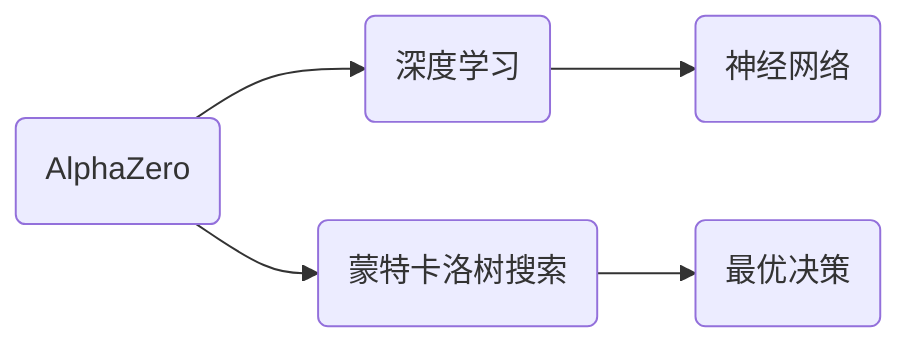
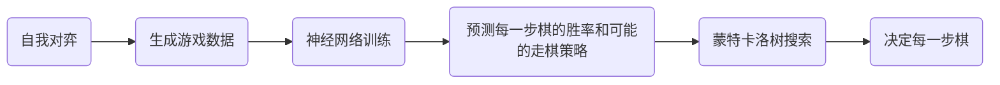

## 1.背景介绍

AlphaZero是DeepMind公司于2017年发布的一款人工智能程序，它在国际象棋、围棋和将棋等游戏上的表现，使全世界对人工智能的认知有了新的提升。AlphaZero的成功不仅仅在于它的强大游戏能力，更重要的是，它改变了我们对人工智能学习和决策的理解。本文将深入探讨AlphaZero的核心技术和应用，希望通过这个案例，让读者对人工智能有更深入的理解。

## 2.核心概念与联系

AlphaZero的核心技术基于深度学习和蒙特卡洛树搜索（MCTS）。深度学习是一种模拟人脑神经网络的机器学习方法，它可以从大量数据中学习和提取有用的特征。而蒙特卡洛树搜索是一种用于确定最优决策的算法，它通过模拟可能的走棋情况，预测每一步棋的胜率，从而做出最佳决策。



## 3.核心算法原理具体操作步骤

AlphaZero的工作流程可以分为以下几个步骤：

1. **自我对弈**：AlphaZero通过自我对弈生成大量的游戏数据，这些数据被用来训练神经网络。
2. **神经网络训练**：AlphaZero使用这些游戏数据训练神经网络，使其能够预测每一步棋的胜率和可能的走棋策略。
3. **蒙特卡洛树搜索**：在决定每一步棋时，AlphaZero使用蒙特卡洛树搜索算法，结合神经网络的预测，搜索最有可能赢得游戏的走棋策略。



## 4.数学模型和公式详细讲解举例说明

在AlphaZero的学习过程中，我们主要关注两个函数：策略函数$p(s, a)$和价值函数$v(s)$。策略函数表示在给定的游戏状态$s$下，采取行动$a$的概率；价值函数表示在给定的游戏状态$s$下，最终赢得游戏的概率。这两个函数都由神经网络来预测。

策略函数$p(s, a)$的定义如下：

$$
p(s, a) = \frac{e^{z_a}}{\sum_b e^{z_b}}
$$

其中，$z_a$是神经网络的输出，表示采取行动$a$的原始分数。$e^{z_a}$是将原始分数转换为概率的softmax函数。

价值函数$v(s)$的定义如下：

$$
v(s) = \tanh(z_v)
$$

其中，$z_v$是神经网络的输出，表示赢得游戏的原始分数。$\tanh(z_v)$是将原始分数转换为概率的tanh函数。

## 5.项目实践：代码实例和详细解释说明

下面是一个简化版本的AlphaZero训练过程的代码实例。这个例子使用Python语言编写，使用PyTorch作为深度学习框架。

```python
import torch
import torch.nn.functional as F
from torch.optim import Adam
from game import Game
from mcts import MCTS

class AlphaZero:
    def __init__(self):
        self.net = self.build_network()
        self.optimizer = Adam(self.net.parameters())

    def build_network(self):
        # 构建神经网络
        pass

    def train(self, games):
        for game in games:
            states, actions, rewards = game.generate_data()
            state_tensor = torch.tensor(states)
            action_tensor = torch.tensor(actions)
            reward_tensor = torch.tensor(rewards)

            # 前向传播
            action_logits, state_values = self.net(state_tensor)
            action_probs = F.softmax(action_logits, dim=1)
            state_values = state_values.squeeze()

            # 计算损失函数
            action_loss = F.cross_entropy(action_logits, action_tensor)
            value_loss = F.mse_loss(state_values, reward_tensor)
            loss = action_loss + value_loss

            # 反向传播和优化
            self.optimizer.zero_grad()
            loss.backward()
            self.optimizer.step()

    def play(self, state):
        mcts = MCTS(self.net, state)
        action = mcts.search()
        return action
```

## 6.实际应用场景

AlphaZero的技术不仅可以应用于棋类游戏，还可以应用于其他需要决策和策略的场景，例如自动驾驶、机器人导航、供应链优化等。在这些场景中，AlphaZero可以通过学习和模拟，找到最优的决策策略。

## 7.工具和资源推荐

如果你对AlphaZero的技术感兴趣，以下是一些有用的工具和资源：

- **PyTorch**：一个强大的深度学习框架，可以用来构建和训练神经网络。
- **DeepMind的论文**：DeepMind公司发布的关于AlphaZero的原始论文，详细介绍了AlphaZero的原理和技术。
- **AlphaZero开源项目**：在GitHub上有多个关于AlphaZero的开源项目，你可以通过阅读和修改这些项目的代码，深入理解AlphaZero的实现。

## 8.总结：未来发展趋势与挑战

AlphaZero的成功表明，通过深度学习和蒙特卡洛树搜索的结合，机器可以自我学习并做出强大的决策。这为人工智能的未来发展打开了新的可能性。然而，AlphaZero也面临着一些挑战，例如如何处理更复杂的游戏和现实世界的问题，如何提高学习的效率和速度等。这些都是我们在未来需要继续研究和解决的问题。

## 9.附录：常见问题与解答

**Q：AlphaZero如何处理大量的游戏状态？**

A：AlphaZero使用神经网络来处理游戏状态，它不需要显式地存储所有的游戏状态。通过训练，神经网络可以学习到游戏状态和走棋策略之间的关系。

**Q：AlphaZero的训练需要多长时间？**

A：这取决于许多因素，例如硬件配置、游戏的复杂性、训练参数等。在DeepMind的实验中，AlphaZero在国际象棋上的训练需要9小时，围棋需要13小时，将棋需要2小时。

**Q：AlphaZero能否应用于其他领域？**

A：是的，AlphaZero的技术不仅可以应用于棋类游戏，还可以应用于其他需要决策和策略的场景，例如自动驾驶、机器人导航、供应链优化等。

作者：禅与计算机程序设计艺术 / Zen and the Art of Computer Programming