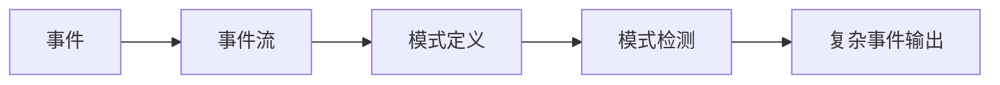

# Flink CEP原理与代码实例讲解

## 1.背景介绍
### 1.1 什么是复杂事件处理CEP
复杂事件处理(Complex Event Processing, CEP)是一种用于分析事件流的技术。它可以从多个事件源中实时检测复杂的事件模式,进而推断有意义的事件或做出及时响应。CEP在金融、物联网、安全等领域有广泛应用。

### 1.2 Flink CEP简介
Flink是一个开源的分布式流处理框架,具有低延迟、高吞吐、准确性和良好的容错性等特点。Flink提供了专门的CEP库Flink CEP,用于在Flink上进行复杂事件处理。它允许在事件流上定义复杂的事件模式,一旦检测到匹配的事件序列就进行预定义的处理。

### 1.3 Flink CEP的应用场景
Flink CEP可应用于多种场景,例如:
- 实时欺诈检测:通过分析用户交易行为事件流,实时识别异常交易模式,预防欺诈。
- 设备故障检测:通过分析物联网设备状态事件流,及时发现设备故障模式,预防事故发生。
- 用户行为分析:通过用户行为事件流,实时发现有商业价值的用户行为模式。

## 2.核心概念与联系
### 2.1 事件Event
事件是CEP的基本组成单元。每个事件通常包含时间戳、事件类型以及一些属性。事件之间存在时间先后关系。在Flink CEP中,事件用Java POJO表示。

### 2.2 事件流EventStream
事件流是一系列顺序发生的、不可变的事件记录。事件以持续的方式产生并进入到CEP引擎进行实时处理。在Flink CEP中,事件流通过Flink的DataStream API来表示。

### 2.3 模式Pattern
模式定义了我们感兴趣的一系列满足特定条件的事件序列。CEP的核心就是定义模式,然后在事件流上进行模式匹配。模式可以包含单个事件条件、多个事件条件以及它们之间的关系(如连续、非确定性宽松连续等)。

### 2.4 模式检测 Pattern Detection
模式检测就是根据预先定义的复杂事件模式,在实时的事件流中进行匹配,一旦发现匹配的事件序列,就选取出来进行处理。Flink CEP使用非确定性有限自动机(NFA)进行事件模式匹配。

### 2.5 关系图
下图展示了Flink CEP的几个核心概念之间的关系:



## 3.核心算法原理具体操作步骤
Flink CEP的核心是非确定性有限自动机(NFA)算法。具体步骤如下:

### 3.1 定义事件模式
首先需要定义感兴趣的复杂事件模式。模式可以由多个单事件条件通过特殊的关系运算符进行组合,形成事件序列。

### 3.2 创建NFA
根据定义的事件模式,构建非确定性有限自动机。将事件模式中的每个事件条件映射成NFA的一个状态,事件之间的关系映射成状态之间的转移。

### 3.3 在事件流上进行模式匹配
事件流中的事件不断驱动NFA进行状态转移。
- 若某个事件匹配了当前状态的转移条件,则从当前状态转移到下一个状态,同时缓存该事件。
- 若事件不满足任何转移条件,则停留在当前状态。
- 若到达NFA的终止状态,则找到一个匹配的事件序列,将其选择出来。
- 对于宽松连续条件,会有一个状态回退栈,可回退到之前的状态重新匹配。

### 3.4 清理不可能匹配的状态
NFA会记录每个状态下缓存的事件和时间戳。定期(如每个窗口结束)清理不可能再匹配的状态和事件,防止内存泄漏。

### 3.5 输出复杂事件
将匹配出的复杂事件序列按定义的方式进行处理,如选取某些事件的属性输出。

## 4.数学模型和公式详细讲解举例说明
Flink CEP中的NFA可以用一个六元组来表示:
$$NFA = (Q, \Sigma, \Delta, q_0, F, T)$$

其中:
- $Q$是有限状态集合,每个状态对应一个事件条件
- $\Sigma$是有限字母表,即所有可能的事件类型
- $\Delta$是状态转移函数,$\Delta: Q \times \Sigma \rightarrow P(Q)$,即从状态 $q \in Q$ 接收到事件 $e \in \Sigma$ 时,转移到 $\Delta(q, e)$对应的后续状态集合。
- $q_0 \in Q$是初始状态
- $F \subseteq Q$是最终状态集合
- $T$是时间约束,即在$T$时间内到达某个状态才是有效的

例如,定义一个模式"在1小时内连续出现两次以上异常"。可以表示为:
$$Q = \{q_0, q_1, q_2\}$$
$$\Sigma = \{Normal, Error\}$$
$$\Delta(q_0, Normal) = \{q_0\}, \Delta(q_0, Error) = \{q_0, q_1\}$$
$$\Delta(q_1, Normal) = \{q_0\}, \Delta(q_1, Error) = \{q_2\}$$
$$q_0$$为初始状态
$$F = \{q_2\}$$
$$T = 1 hour$$

当事件流$[Normal, Error, Normal, Error, Error]$输入时:
1. $Normal$事件到达,停留在$q_0$
2. 第1个$Error$事件到达,从$q_0$转移到$q_1$
3. $Normal$事件到达,从$q_1$回退到$q_0$
4. 第2个$Error$事件到达,从$q_0$转移到$q_1$
5. 第3个$Error$事件到达,从$q_1$转移到$q_2$,到达最终状态,匹配成功

## 5.项目实践：代码实例和详细解释说明
下面通过一个Flink CEP的代码实例,演示如何使用Flink CEP进行模式匹配。

### 5.1 定义事件模式
假设我们要检测恶意登录行为,定义三个登录事件:成功、失败和验证码。
模式为:在2分钟内,连续3次登录失败,然后再进行登录,则认为是恶意登录。

```java
// 定义登录事件POJO
public class LoginEvent {
    public String userId;
    public String ipAddr;
    public LoginType type;
    public LoginEvent(String userId, String ipAddr, LoginType type) {
        this.userId = userId;
        this.ipAddr = ipAddr;
        this.type = type;
    }
}
public enum LoginType {
    SUCCESS, FAIL, CAPTCHA;
}

// 定义模式
Pattern<LoginEvent, ?> loginFailPattern = Pattern.<LoginEvent>begin("fail")
    .where(new SimpleCondition<LoginEvent>() {
        @Override
        public boolean filter(LoginEvent event) {
            return event.type == LoginType.FAIL;
        }
    }).times(3).consecutive() 
    .next("login")
    .where(new SimpleCondition<LoginEvent>() {
        @Override
        public boolean filter(LoginEvent event) {
            return event.type == LoginType.SUCCESS || event.type == LoginType.CAPTCHA;
        }
    })
    .within(Time.seconds(120));
```

### 5.2 在事件流上匹配模式
```java
// 输入事件流
DataStream<LoginEvent> loginEventStream = ...

// 在事件流上匹配模式
PatternStream<LoginEvent> patternStream = CEP.pattern(
    loginEventStream.keyBy(event -> event.userId),
    loginFailPattern);

// 处理匹配到的复杂事件
DataStream<String> alertStream = patternStream.select(
    (Map<String, List<LoginEvent>> pattern) -> {
        LoginEvent first = pattern.get("fail").get(0);
        LoginEvent second = pattern.get("login").get(0);
        return first.userId + " 恶意登录 " + second.type;
    }
);
```

### 5.3 代码说明
1. 首先定义登录事件POJO类和登录类型枚举。
2. 使用`Pattern`API定义事件模式。`.where()`指定单事件条件,`.times()`指定事件出现次数,`.consecutive()`要求事件严格连续,`.next()`指定下一个事件,`.within()`指定时间约束。
3. 在事件流上使用`CEP.pattern()`应用模式,得到`PatternStream`。注意使用`keyBy()`按用户ID分区,将同一用户的登录事件分到同一个流分区。
4. 在`PatternStream`上使用`select()`方法,处理匹配到的复杂事件,这里简单输出警告信息。

## 6.实际应用场景
Flink CEP在实际生产中有广泛的应用,下面列举几个典型场景:

### 6.1 实时金融欺诈检测
在金融领域,欺诈交易检测是个重要问题。传统的事后离线分析已经无法适应要求。利用Flink CEP可以实时检测出欺诈交易模式,做出实时反应。如检测"短时间内多次小额转账后紧跟一次大额取现"的洗钱模式。

### 6.2 物联网设备故障检测
在工业物联网中,设备故障可能酿成严重后果。利用Flink CEP分析物联网设备的状态事件流,可以及时发现设备故障的模式,如"温度连续上升、异常震动、故障报警"的模式,提前预警,避免事故发生。

### 6.3 用户行为分析
在电商、社交等领域,分析用户行为模式可以洞察用户需求,指导运营策略。如"浏览商品页面、查看评价、收藏、下单"的购物模式,"登录、发帖、评论、点赞"的活跃用户模式,结合用户画像可以识别高价值用户。

## 7.工具和资源推荐
- [Flink官网](https://flink.apache.org/):权威的Flink资源,包含文档、教程、博客等。
- [Flink CEP文档](https://ci.apache.org/projects/flink/flink-docs-release-1.12/dev/libs/cep.html):Flink CEP的官方文档,系统讲解了CEP API的使用。
- [Flink Patterns](https://github.com/streaming-with-flink/flink-patterns):包含多个Flink CEP的实际案例模式,如信用卡欺诈、股票市场趋势等。
- [复杂事件处理CEP在阿里的实践](https://developer.aliyun.com/article/749964):介绍了CEP在阿里的应用实践,包括贷款反欺诈、设备物联网等。

## 8.总结：未来发展趋势与挑战
Flink CEP作为流处理领域的重要分支,具有广阔的应用前景,但同时也面临一些挑战:

### 8.1 CEP与AI结合
将CEP与机器学习、知识图谱等AI技术相结合,可以实现更加智能、自适应的复杂事件模式匹配。CEP负责实时处理事件流,AI负责动态调整匹配规则。如根据欺诈交易的反馈动态调整模式阈值。

### 8.2 CEP的分布式优化
Flink CEP目前还是中心化地在一个节点上处理同一个分区的事件。在超高吞吐场景下,单点处理可能成为瓶颈。需要探索CEP算法的分布式并行化,提升性能。

### 8.3 CEP的模式共享与复用
不同的CEP应用场景之间可能有一些共性的模式。建立CEP模式知识库,形成可复用的模式组件,能够加速开发。同时挖掘不同领域的最佳实践,将经验规则沉淀下来。

### 8.4 长时间窗口的内存优化
CEP中的模式匹配通常跨越较长的时间,需要缓存大量中间状态,可能造成内存压力。需要优化内存数据结构和序列化方式,节省内存。状态的持久化和备份也是需要攻克的难题。

## 9.附录：常见问题与解答

### Q1:Flink CEP支持哪些模式关系运算符?
Flink CEP支持以下模式关系运算符:
- `.next()`:严格连续
- `.followedBy()`:宽松连续,允许中间出现不匹配事件
- `.followedByAny()`:非确定性宽松连续,后