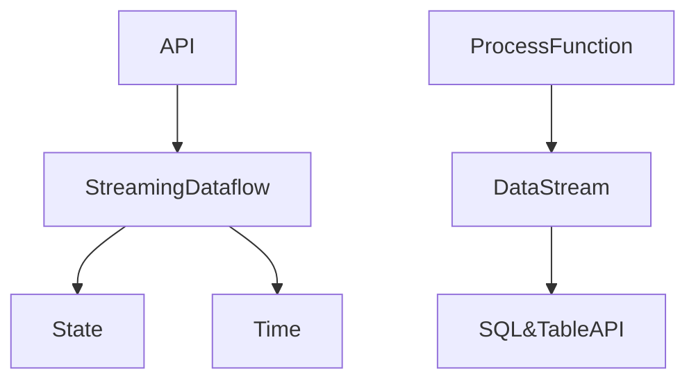

# Flink原理与代码实例讲解

## 1.背景介绍
### 1.1 什么是Flink
Apache Flink是一个开源的分布式流处理和批处理框架,由Apache软件基金会开发。Flink以数据并行和流水线方式执行任意流数据程序,Flink的流水线运行时系统可以执行批处理和流处理程序。此外,Flink的运行时本身也支持迭代算法的执行。

### 1.2 Flink的应用场景
Flink广泛应用于电商、物流、互联网、制造、电信等行业,典型的应用场景包括:

- 实时数据处理:如实时日志分析、实时欺诈检测、实时推荐等
- 数据分析:如离线数据分析、Ad-hoc查询、A/B测试等  
- 机器学习:如预测分析、异常检测等
- 事件驱动应用:如实时ETL、实时监控告警等

### 1.3 Flink的特点
- 事件驱动(Event-driven):事件驱动型应用是一类具有状态的应用,它从一个或多个事件流提取数据,并根据到来的事件触发计算、状态更新或其他外部动作。
- 基于流的世界观:在Flink的世界观中,一切都是由流组成的,离线数据是有界的流;实时数据是一个没有界限的流:这就是所谓的有界流和无界流。
- 分层API:Flink提供了不同级别的抽象,满足不同开发人员的需求。
- 支持事件时间(event-time)和处理时间(processing-time)语义。
- 精确一次(exactly-once)的状态一致性保证。
- 低延迟、每秒处理数百万个事件,毫秒级延迟。
- 与众多常用存储系统的连接。
- 高可用:动态扩展,实现7*24小时全天候运行。

## 2.核心概念与联系
### 2.1 Flink运行时的组件
Flink运行时架构主要包括四个不同的组件,它们会在运行流处理应用程序时协同工作:
- 作业管理器(JobManager):控制一个应用程序执行的主进程,也就是说,每个应用程序都会被一个不同的JobManager所控制执行。
- 资源管理器(ResourceManager):主要负责管理 task slots,它是一个中心服务组件。
- 任务管理器(TaskManager):实际负责执行计算的Worker,通常在Flink中会有多个TaskManager运行,每一个TaskManager都包含了一定数量的task slots。
- 分发器(Dispatcher):可以跨作业运行,它为应用提交提供了REST接口。当一个应用被提交执行时,分发器就会启动并将应用移交给一个JobManager。

### 2.2 Flink编程模型中的核心概念
- StreamingDataflow:是Flink编程模型的核心,它包含了流式计算的一系列基本构建模块,用于处理数据流。
- State:Flink在计算过程中访问和更新状态信息。
- Time:Flink支持事件时间(event-time)和处理时间(processing-time)语义。
- API:Flink提供了不同级别的API供开发人员使用。

### 2.3 Flink分层API
Flink提供了三层API,自底向上分别为:
- ProcessFunction(底层API):ProcessFunction提供了对于事件处理最细粒度的控制,允许开发者对于单个事件的处理进行操作。
- DataStream(中间层API):DataStream API是对底层API的高级抽象,它将底层的细粒度操作进行封装,并提供了方便的编程接口。
- SQL&TableAPI(高层API):Flink提供了高层的关系型API,可以类似数据库的方式来编写Flink程序。

### 2.4 核心概念之间的关系
下图展示了Flink核心概念之间的关系:



## 3.核心算法原理具体操作步骤
Flink的核心是其流式计算引擎,下面我们以DataStream API为例,介绍Flink流式计算的基本步骤:

### 3.1 创建执行环境
首先需要创建一个执行环境,批处理程序使用`ExecutionEnvironment`,流处理程序使用`StreamExecutionEnvironment`。
```java
StreamExecutionEnvironment env = StreamExecutionEnvironment.getExecutionEnvironment();
```

### 3.2 加载/创建初始数据
使用Source创建输入流,Flink提供了多种数据源连接器,如Kafka、文件、集合等。
```java
DataStream<String> text = env.readTextFile("file:///path/to/file");
```

### 3.3 指定转换操作
对DataStream数据流进行转换处理,如map、flatMap、filter等。
```java
DataStream<String> mapped = text.map(new MapFunction<String, String>() {
    @Override
    public String map(String value) {
        return value.toLowerCase();
    }
});
```

### 3.4 指定Sink
Sink消费DataStream中的数据,并将它们发送到文件、Socket、Kafka等。
```java
mapped.writeAsText("file:///path/to/result");
```

### 3.5 触发程序执行
调用StreamExecutionEnvironment的execute()方法触发程序执行。
```java
env.execute("Flink Streaming Demo");
```

## 4.数学模型和公式详细讲解举例说明
Flink提供了多种内置的数学函数,可以用于数据的转换计算。例如在DataStream API中,可以使用map、flatMap、reduce等算子进行函数计算。下面以map为例进行说明:

### map算子
map算子是最基本的数据转换算子之一,它可以将数据流中的每一个元素通过用户定义的函数进行转换,并返回一个新的数据流。其数学模型可以表示为:

$$
\textit{map}: X \rightarrow Y
$$

其中,$X$表示输入数据集,$Y$表示输出数据集。map算子将$X$中的每个元素$x_i$通过函数$f$映射为$Y$中的元素$y_i$:

$$
y_i = f(x_i)
$$

例如,对于一个包含了学生分数的DataStream,可以使用map算子将分数加上10分:

```java
DataStream<Integer> scores = ...
DataStream<Integer> mapScores = scores.map(new MapFunction<Integer, Integer>() {
    @Override
    public Integer map(Integer value) {
        return value + 10;
    }
});
```

## 5.项目实践:代码实例和详细解释说明
下面通过一个实际的代码示例,演示如何使用Flink DataStream API进行流式数据处理。该示例从Kafka中读取数据,并进行词频统计。

### 5.1 添加依赖
首先在项目中添加Flink和Kafka的依赖:
```xml
<dependency>
  <groupId>org.apache.flink</groupId>
  <artifactId>flink-streaming-java_2.12</artifactId>
  <version>1.12.0</version>
</dependency>
<dependency>
  <groupId>org.apache.flink</groupId>
  <artifactId>flink-connector-kafka_2.12</artifactId>
  <version>1.12.0</version>
</dependency>
```

### 5.2 Flink程序主体
```java
public class KafkaWordCount {
    public static void main(String[] args) throws Exception {
        // 创建流处理执行环境
        StreamExecutionEnvironment env = StreamExecutionEnvironment.getExecutionEnvironment();

        // 设置Kafka源
        Properties properties = new Properties();
        properties.setProperty("bootstrap.servers", "localhost:9092");
        properties.setProperty("group.id", "test");
        DataStream<String> stream = env
                .addSource(new FlinkKafkaConsumer<>("wordcount-topic", new SimpleStringSchema(), properties));

        // 对数据流进行处理
        DataStream<Tuple2<String, Integer>> wordCounts = stream
                .flatMap(new LineSplitter())
                .keyBy(value -> value.f0)
                .sum(1);

        // 打印输出
        wordCounts.print();

        // 执行
        env.execute("Kafka Word Count");
    }

    public static class LineSplitter implements FlatMapFunction<String, Tuple2<String, Integer>> {
        @Override
        public void flatMap(String line, Collector<Tuple2<String, Integer>> out) {
            String[] tokens = line.toLowerCase().split("\\W+");
            for (String token : tokens) {
                if (token.length() > 0) {
                    out.collect(new Tuple2<>(token, 1));
                }
            }
        }
    }
}
```

### 5.3 代码说明
- 首先创建了一个StreamExecutionEnvironment,这是Flink流处理程序的入口。
- 然后使用addSource添加了一个Kafka数据源,Flink会从指定的Kafka topic中持续不断地读取数据。
- 对读入的数据流进行处理。首先使用flatMap算子将每行数据按照空格切分成单词,然后使用keyBy算子对单词进行分组,最后使用sum算子统计每个单词的出现频次。
- 使用print算子将结果打印输出到控制台。
- 最后调用env.execute触发程序执行。

## 6.实际应用场景
Flink在实际生产中有非常广泛的应用,下面列举几个典型的应用场景:

### 6.1 实时数据处理
Flink可以对实时产生的海量数据进行处理,如实时日志分析、实时监控告警等。例如通过Flink处理Nginx日志,可以实时统计PV、UV等指标,并及时发现异常情况。

### 6.2 数据分析
Flink也可以用于离线数据分析,如ETL、Ad-hoc查询等。相比Hadoop MapReduce,Flink具有更短的处理延迟,可以更快地得到分析结果。

### 6.3 机器学习
Flink提供了机器学习库FlinkML,可以用于训练和应用机器学习模型,支持多种常见的机器学习算法,如聚类、分类、回归等。

### 6.4 事件驱动应用
Flink是一个事件驱动的流式处理框架,非常适合用来构建事件驱动的应用程序,如实时推荐、实时金融风控等。

## 7.工具和资源推荐
### 7.1 书籍
- 《Stream Processing with Apache Flink》by Fabian Hueske, Vasiliki Kalavri
- 《Streaming Systems》by Tyler Akidau, Slava Chernyak, Reuven Lax
- 《Flink原理、实战与性能优化》by 鸣人

### 7.2 教程
- Ververica官方教程:https://training.ververica.com/
- Flink China社区教程:https://flink-china.org/doc/

### 7.3 工具
- Flink官方网站:https://flink.apache.org/
- Flink Github:https://github.com/apache/flink

## 8.总结:未来发展趋势与挑战
Flink作为新一代大数据流式计算引擎,具有低延迟、高吞吐、结果准确等特点,在流式大数据处理领域占据了重要地位。未来Flink的发展趋势主要体现在以下几个方面:

- 流批一体:Flink在API层面已经实现了流批统一,未来将进一步统一流批的底层引擎,提供一站式的数据处理解决方案。
- SQL成为主流:Flink提供了强大的SQL支持,未来SQL将成为Flink的重要开发方式,大大降低流式计算的门槛。
- 云原生:Flink将更好地与Kubernetes等云平台集成,提供更灵活的部署和管理方式,实现真正的云原生流式计算。

当然,Flink的发展也面临着一些挑战:

- 生态建设:尽管Flink已经拥有了丰富的生态,但与成熟的批处理生态相比还有一定差距,需要进一步建设和完善。
- 性能优化:如何实现流式计算的高性能仍然是一个挑战,需要在Flink内部进行深入的性能优化。
- 易用性:Flink的学习曲线相对较陡,需要提供更简单易用的API和工具,让更多的开发者可以快速上手。

## 9.附录:常见问题与解答
### 9.1 Flink与Spark Streaming的区别是什么?
Flink是一个纯流式计算引擎,而Spark Streaming是一个微批次计算引擎。Flink支持更低的处理延迟,而Spark Streaming支持毫秒级别的延迟。此外,Flink支持事件时间和状态管理,而Spark Streaming缺乏对事件时间的支持。

### 9.2 Flink支持哪些数据源和数据汇?
Flink支持多种数据源和数据汇,包括Kafka、HDFS、Elasticsearch、HBase、JDBC等。用户也可以自定义数据源和数据汇。

### 9.3 Flink的容错机制是怎