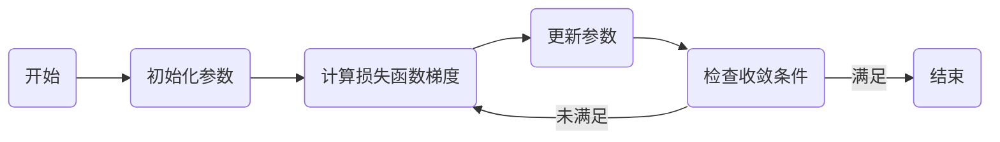

# Gradient Descent原理与代码实例讲解

## 1. 背景介绍

在机器学习和深度学习的世界中，梯度下降（Gradient Descent）算法是最基础也是最关键的优化技术之一。它的核心思想是利用函数的梯度信息来寻找函数的最小值。在实际应用中，这通常对应着最小化损失函数，以此来提升模型的性能。本文将深入探讨梯度下降的原理，并通过代码实例来加深理解。

## 2. 核心概念与联系

### 2.1 梯度（Gradient）的定义
梯度是多变量函数在某一点处沿着各个自变量增加最快的方向。数学上，梯度是函数的一阶偏导数形成的向量。

### 2.2 下降（Descent）的含义
下降指的是沿着梯度的反方向，即函数值减小的方向，逐步更新参数以达到最小化函数值的目的。

### 2.3 学习率（Learning Rate）
学习率是一个超参数，它决定了在梯度下降过程中参数更新的步长大小。

### 2.4 损失函数（Loss Function）
损失函数是衡量模型预测值与真实值差异的函数，梯度下降的目标是最小化这个函数。

### 2.5 优化问题（Optimization Problem）
优化问题是指在给定约束条件下，寻找某个函数的最小值或最大值的问题。在机器学习中，通常是指最小化损失函数。

## 3. 核心算法原理具体操作步骤



1. **初始化参数**：选择一个初始点作为参数的起始值。
2. **计算损失函数梯度**：在当前参数下，计算损失函数关于每个参数的梯度。
3. **更新参数**：根据梯度和学习率调整参数值。
4. **检查收敛条件**：判断算法是否满足停止条件，如梯度趋近于零或达到预设的迭代次数。
5. **重复步骤2-4**：直到满足收敛条件。

## 4. 数学模型和公式详细讲解举例说明

考虑一个函数 $f(\mathbf{x})$，其中 $\mathbf{x} = (x_1, x_2, ..., x_n)$ 是参数向量。梯度下降的更新规则可以表示为：

$$
\mathbf{x}_{t+1} = \mathbf{x}_t - \eta \cdot \nabla f(\mathbf{x}_t)
$$

其中，$\mathbf{x}_t$ 是第 $t$ 次迭代的参数，$\eta$ 是学习率，$\nabla f(\mathbf{x}_t)$ 是函数在 $\mathbf{x}_t$ 处的梯度。

### 4.1 梯度计算

对于函数 $f(\mathbf{x}) = x_1^2 + x_2^2$，梯度为：

$$
\nabla f(\mathbf{x}) = \left( \frac{\partial f}{\partial x_1}, \frac{\partial f}{\partial x_2} \right) = (2x_1, 2x_2)
$$

### 4.2 参数更新

假设学习率 $\eta = 0.1$，初始参数 $\mathbf{x}_0 = (1, 1)$，则第一次迭代后的参数为：

$$
\mathbf{x}_1 = \mathbf{x}_0 - 0.1 \cdot (2, 2) = (0.8, 0.8)
$$

## 5. 项目实践：代码实例和详细解释说明

以下是一个简单的梯度下降算法的Python代码实例：

```python
import numpy as np

# 损失函数
def loss_function(x):
    return x[0]**2 + x[1]**2

# 梯度计算
def gradient(x):
    return np.array([2*x[0], 2*x[1]])

# 梯度下降函数
def gradient_descent(initial_x, learning_rate, num_iterations):
    x = initial_x
    for i in range(num_iterations):
        grad = gradient(x)
        x = x - learning_rate * grad
        print(f"Iteration {i+1}: x = {x}, loss = {loss_function(x)}")
    return x

# 参数初始化
initial_x = np.array([1, 1])
learning_rate = 0.1
num_iterations = 10

# 执行梯度下降
final_x = gradient_descent(initial_x, learning_rate, num_iterations)
```

## 6. 实际应用场景

梯度下降算法广泛应用于机器学习和深度学习领域，如线性回归、逻辑回归、神经网络等模型的训练过程。

## 7. 工具和资源推荐

- **NumPy**：进行高效的数值计算。
- **TensorFlow**和**PyTorch**：提供自动梯度计算和优化器。
- **Scikit-learn**：提供简单的机器学习算法实现。

## 8. 总结：未来发展趋势与挑战

梯度下降算法虽然简单有效，但在面对大规模数据和复杂模型时，存在收敛速度慢、容易陷入局部最小值等问题。未来的发展趋势包括自适应学习率算法、二阶优化方法等。

## 9. 附录：常见问题与解答

- **Q1**: 梯度下降是否总能找到全局最小值？
- **A1**: 不一定，它可能找到局部最小值或鞍点，特别是在非凸函数中。

- **Q2**: 学习率应该如何设置？
- **A2**: 学习率的设置需要根据具体问题进行调整，通常通过交叉验证来选择。

- **Q3**: 如何判断梯度下降是否收敛？
- **A3**: 可以通过设置阈值判断梯度的大小，或者监控损失函数的变化。

作者：禅与计算机程序设计艺术 / Zen and the Art of Computer Programming