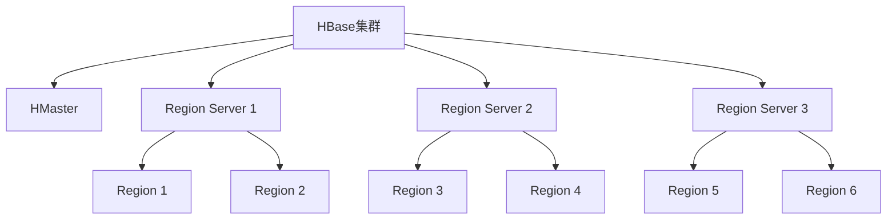
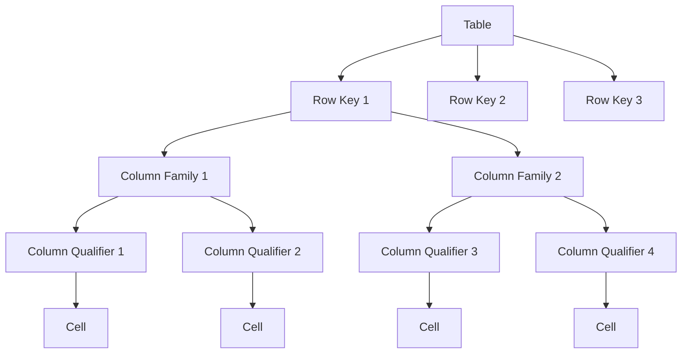
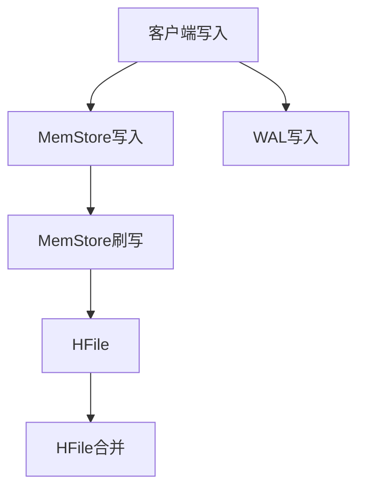
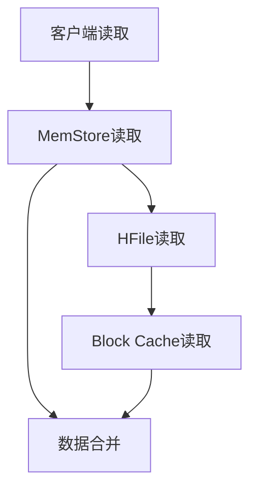
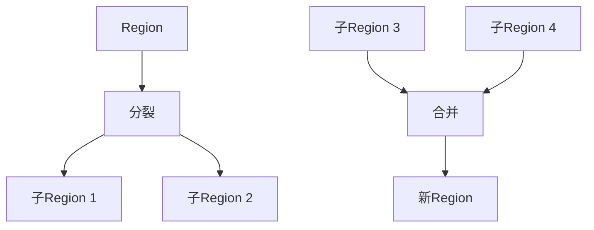

# HBase原理与代码实例讲解

## 1.背景介绍

HBase是一个分布式、可伸缩的大数据存储系统,它建立在Hadoop文件系统之上,为大数据提供随机、实时的读写访问支持。HBase继承了Hadoop的容错和高可用性,并且提供了类似于Google BigTable的数据模型。

HBase的设计目标是用于存储非常大的稀疏数据集(Sparse Data Set),这些数据集可能会随着时间的推移而不断增长。HBase可以有效地对PB级别的数据进行随机实时读写访问。

### 1.1 应用场景

HBase适用于以下几种应用场景:

- **大数据存储**: HBase可以存储结构化和半结构化的大数据集,例如网页内容、系统日志、物联网数据等。
- **实时查询**: HBase支持低延迟的随机读写操作,适合实时查询和数据分析应用。
- **内容存储**: HBase可以用于存储大型网站或社交网络的用户内容,如网页、图片、视频等。
- **计数器存储**: HBase支持原子计数器操作,可以用于存储网站点击计数、社交网络分享计数等。

### 1.2 架构优势

HBase的架构设计具有以下优势:

- **水平可扩展**: HBase可以通过简单地添加更多节点来线性扩展存储和处理能力。
- **高可用性**: HBase支持数据自动故障转移和自动重新复制,确保数据的高可用性。
- **一致性**: HBase提供行级别的原子性和一致性读写操作。
- **高性能**: HBase在大数据量下仍能保持低延迟和高吞吐量。

## 2.核心概念与联系

### 2.1 核心概念

理解HBase的核心概念对于掌握HBase的工作原理至关重要。下面是HBase的一些核心概念:

1. **Table(表)**: HBase中的数据存储在表中,类似于关系数据库中的表概念。
2. **Row Key(行键)**: 每个表中的每一行数据都由一个行键(Row Key)来唯一标识。行键是字节序列,按字典序排序。
3. **Column Family(列族)**: 列族(Column Family)是列的逻辑分组,一个表可以有多个列族。列族在表创建时就需要定义好。
4. **Column Qualifier(列限定符)**: 列限定符(Column Qualifier)是列的名称,它与列族共同构成一个完整的列。
5. **Cell(单元)**: 由行键、列族、列限定符和版本号唯一确定的单元格,存储实际的数据值。
6. **Region(区域)**: HBase自动将表按行键范围水平划分为多个区域(Region),每个区域由一个Region Server负责管理。
7. **Region Server**: 负责存储和管理一个或多个Region的服务器节点。
8. **HMaster**: 负责监控Region Server,协调Region的分配和迁移。



### 2.2 数据模型

HBase的数据模型类似于Google的BigTable数据模型,可以被视为一个多维的稀疏、分布式和持久化的映射表。

在HBase中,数据以键值对的形式存储,键由行键、列族、列限定符和时间戳组成,值则是无模式的字节数组。HBase会自动为每个插入的值分配一个时间戳,用于版本控制。



## 3.核心算法原理具体操作步骤

### 3.1 写数据流程

当客户端向HBase写入数据时,数据会经过以下步骤:

1. **客户端写入**: 客户端将写请求发送给Region Server。
2. **MemStore写入**: Region Server首先将数据写入内存中的MemStore。
3. **WAL写入**: 同时,数据也会被写入预写日志(Write Ahead Log,WAL)中,用于故障恢复。
4. **MemStore刷写**: 当MemStore达到一定大小时,会将数据刷写到HFile中。
5. **HFile合并**: 定期执行HFile的合并操作,将小的HFile合并成大的HFile,减少文件数量。



### 3.2 读数据流程

当客户端从HBase读取数据时,数据会经过以下步骤:

1. **客户端读取**: 客户端向Region Server发送读请求。
2. **MemStore读取**: Region Server首先从内存中的MemStore中查找数据。
3. **HFile读取**: 如果MemStore中没有找到,则从HFile中查找。
4. **Block Cache读取**: HFile中的数据会先缓存在Block Cache中,可以直接从Block Cache读取。
5. **数据合并**: 最后将MemStore和HFile中的数据合并返回给客户端。



### 3.3 Region分裂与合并

随着数据的不断写入,Region会不断增大,当Region达到一定阈值时,就需要进行分裂(Split)操作。分裂后,Region Server会管理两个子Region。反之,当Region变得太小时,也可以执行合并(Merge)操作。



## 4.数学模型和公式详细讲解举例说明

### 4.1 Region分配策略

HBase采用了一种基于负载均衡的Region分配策略,旨在将Region均匀地分布到各个Region Server上。这个策略可以用一个代价函数(Cost Function)来表示:

$$
\text{Cost}(r_i, s_j) = \sum_{r \in R_j} \text{size}(r) + \text{size}(r_i)
$$

其中:

- $r_i$是要分配的Region
- $s_j$是Region Server
- $R_j$是Region Server $s_j$上已有的Region集合
- $\text{size}(r)$表示Region $r$的大小

目标是找到一个Region Server $s_j$,使得$\text{Cost}(r_i, s_j)$最小,从而实现负载均衡。

### 4.2 Bloom Filter

HBase在读取数据时,会先检查Bloom Filter来判断目标数据是否存在,从而避免不必要的磁盘IO操作。Bloom Filter是一种空间高效的概率数据结构,用于测试一个元素是否属于一个集合。

假设有一个大小为$m$位的Bloom Filter,使用$k$个哈希函数$h_1, h_2, \dots, h_k$,对于每个元素$x$,计算$h_1(x), h_2(x), \dots, h_k(x)$,并将对应的位置置为1。查询时,如果对应的$k$个位置都为1,则认为元素可能存在;如果任何一个位置为0,则元素一定不存在。

Bloom Filter的误报率可以用下式计算:

$$
P = (1 - e^{-kn/m})^k \approx (1 - e^{-k})^{kn/m}
$$

其中$n$是插入的元素个数。可以看出,当$k = \ln 2 \cdot (m/n)$时,误报率最小,约为$0.6185^{m/n}$。

## 5.项目实践:代码实例和详细解释说明

下面是一个使用Java编写的HBase客户端示例代码,演示了如何创建表、插入数据、查询数据和扫描表的操作。

```java
import org.apache.hadoop.conf.Configuration;
import org.apache.hadoop.hbase.*;
import org.apache.hadoop.hbase.client.*;
import org.apache.hadoop.hbase.util.Bytes;

public class HBaseExample {
    private static Configuration conf = HBaseConfiguration.create();
    private static Connection connection = ConnectionFactory.createConnection(conf);
    private static Admin admin = connection.getAdmin();

    public static void createTable(String tableName, String... columnFamilies) throws Exception {
        TableName table = TableName.valueOf(tableName);
        if (admin.tableExists(table)) {
            System.out.println("Table already exists");
            return;
        }

        TableDescriptorBuilder builder = TableDescriptorBuilder.newBuilder(table);
        for (String columnFamily : columnFamilies) {
            builder.setColumnFamily(ColumnFamilyDescriptorBuilder.newBuilder(Bytes.toBytes(columnFamily)).build());
        }
        admin.createTable(builder.build());
        System.out.println("Table created");
    }

    public static void putData(String tableName, String rowKey, String columnFamily, String columnQualifier, String value) throws Exception {
        Table table = connection.getTable(TableName.valueOf(tableName));
        Put put = new Put(Bytes.toBytes(rowKey));
        put.addColumn(Bytes.toBytes(columnFamily), Bytes.toBytes(columnQualifier), Bytes.toBytes(value));
        table.put(put);
        table.close();
        System.out.println("Data inserted");
    }

    public static void getData(String tableName, String rowKey, String columnFamily, String columnQualifier) throws Exception {
        Table table = connection.getTable(TableName.valueOf(tableName));
        Get get = new Get(Bytes.toBytes(rowKey));
        get.addColumn(Bytes.toBytes(columnFamily), Bytes.toBytes(columnQualifier));
        Result result = table.get(get);
        String value = Bytes.toString(result.getValue(Bytes.toBytes(columnFamily), Bytes.toBytes(columnQualifier)));
        System.out.println("Value: " + value);
        table.close();
    }

    public static void scanTable(String tableName) throws Exception {
        Table table = connection.getTable(TableName.valueOf(tableName));
        Scan scan = new Scan();
        ResultScanner scanner = table.getScanner(scan);
        for (Result result : scanner) {
            System.out.println("Row: " + Bytes.toString(result.getRow()));
            for (Cell cell : result.rawCells()) {
                System.out.println("Column Family: " + Bytes.toString(CellUtil.cloneFamily(cell)));
                System.out.println("Column Qualifier: " + Bytes.toString(CellUtil.cloneQualifier(cell)));
                System.out.println("Value: " + Bytes.toString(CellUtil.cloneValue(cell)));
            }
        }
        scanner.close();
        table.close();
    }

    public static void main(String[] args) throws Exception {
        String tableName = "my_table";
        String[] columnFamilies = {"cf1", "cf2"};
        createTable(tableName, columnFamilies);

        String rowKey = "row1";
        putData(tableName, rowKey, "cf1", "q1", "value1");
        putData(tableName, rowKey, "cf2", "q2", "value2");

        getData(tableName, rowKey, "cf1", "q1");
        getData(tableName, rowKey, "cf2", "q2");

        scanTable(tableName);

        admin.disableTable(TableName.valueOf(tableName));
        admin.deleteTable(TableName.valueOf(tableName));
        System.out.println("Table deleted");
    }
}
```

代码解释:

1. 首先创建HBase连接和管理员实例。
2. `createTable`方法用于创建一个新表,可以指定列族。
3. `putData`方法用于向表中插入数据,需要指定行键、列族、列限定符和值。
4. `getData`方法用于从表中读取数据,需要指定行键、列族和列限定符。
5. `scanTable`方法用于扫描整个表,打印出每一行的数据。
6. 在`main`方法中,首先创建一个名为`my_table`的表,包含两个列族`cf1`和`cf2`。
7. 然后向表中插入两条数据,分别属于不同的列族。
8. 读取刚插入的两条数据。
9. 扫描整个表,打印出所有数据。
10. 最后禁用并删除表。

通过这个示例,你可以了解到如何使用Java客户端与HBase进行交互,包括创建表、插入数据、查询数据和扫描表等基本操作。

## 6.实际应用场景

HBase在许多领域都有广泛的应用,下面列举了一些典型的应用场景