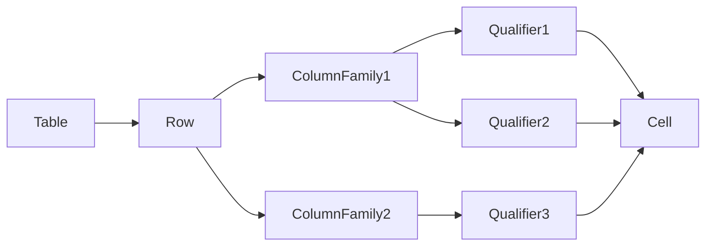

# HBase原理与代码实例讲解

## 1. 背景介绍
### 1.1 大数据时代的存储挑战
随着互联网的迅猛发展,数据呈现爆炸式增长。传统的关系型数据库已经无法满足海量数据的存储和处理需求。在这种背景下,非关系型数据库(NoSQL)应运而生,其中HBase作为一款高可靠、高性能、面向列、可伸缩的分布式存储系统,在大数据领域得到了广泛应用。

### 1.2 HBase的诞生与发展
HBase起源于Google发表的BigTable论文,由Powerset公司实现,后来成为Apache顶级开源项目。HBase构建在Hadoop之上,利用HDFS作为其文件存储系统,支持MapReduce进行并行计算,为海量结构化数据提供了随机、实时的读写访问。

### 1.3 HBase在大数据生态中的地位
HBase与Hadoop、Hive、Spark等共同组成了大数据技术栈的核心。它作为一款NoSQL数据库,弥补了HDFS对结构化数据存储和随机访问的不足,同时可以与MapReduce、Hive等上层计算框架无缝集成,在大数据存储和分析领域发挥着重要作用。

## 2. 核心概念与联系
### 2.1 表(Table)
HBase采用类似于关系型数据库的表格存储模型,但与关系型数据库不同,HBase的表可以有数百万列。表按行键(Row Key)分区,每个表可以有多个列族。

### 2.2 行键(Row Key)
Row Key是用来检索记录的主键。访问HBase table中的行只有三种方式：
1. 通过单个Row Key访问
2. 通过Row Key的range
3. 全表扫描

Row Key可以是任意字符串,最大长度64KB,实际应用中一般为10~100bytes。

### 2.3 列族(Column Family)
HBase表中的每个列都归属于某个列族。列族是表的schema的一部分,必须在使用表之前定义。列族的所有列都以列族名作为前缀,例如courses:history、courses:math都属于courses列族。

### 2.4 列限定符(Column Qualifier)
列限定符被添加到列族中,以提供给定数据段的索引。列族下的列限定符可以动态增加,无需预先定义。

### 2.5 时间戳(Timestamp)
每个cell存储单元对同一份数据有多个版本,根据唯一的时间戳来区分。时间戳的类型是64位整型,默认由RegionServer自动分配,也可以由客户显式指定。

### 2.6 cell
由{row key, column(=family+qualifier), timestamp}唯一确定的单元。cell中的数据是没有类型的,全部是字节码形式存储。

### 2.7 概念关系图
下图展示了HBase中表、行、列族、列限定符、cell等概念之间的关系:



## 3. 核心算法原理与操作步骤
### 3.1 存储模型
HBase采用了BigTable的存储模型Log Structured Merge Tree(LSM Tree),将数据存储在内存和磁盘两个不同的介质中,以提高读写性能。

#### 3.1.1 MemStore
数据在更新时首先写入MemStore,即写缓存。每个Column Family都有一个MemStore。当MemStore的大小达到一定阈值,整个MemStore被刷写到磁盘,生成一个HFile。

#### 3.1.2 HFile
HFile是HBase中KeyValue数据的存储格式,位于磁盘上,为了加快检索速度,HFile中有索引。

### 3.2 读写流程
#### 3.2.1 写流程
1. Client向HRegionServer发送写请求
2. HRegionServer将数据写入MemStore
3. 当MemStore达到阈值,将数据flush到HFile
4. 若HFile数量达到阈值,触发Compact合并操作

#### 3.2.2 读流程  
1. Client向HRegionServer发送读请求
2. HRegionServer先检查Block Cache,若命中则直接返回
3. 否则,先在MemStore中查找,接着定位到HFile并在Block Cache中查找
4. 若Block Cache中没有,则从HFile中读取并将数据块缓存到Block Cache
5. 将查到的数据返回给Client

### 3.3 Region
Region是HBase中分布式存储和负载均衡的最小单元。一个Region由多个Store组成,每个Store对应一个Column Family。当一个Region增长到一定阈值,会触发split操作,将Region一分为二。

### 3.4 Compaction  
HFile会不断产生,导致小文件问题。为此,HBase需要在一定时机将众多小HFile合并成一个大HFile,这个过程叫做Compaction。分为两种:
1. Minor Compaction:将多个小HFile合并成一个大HFile
2. Major Compaction:将一个Store下的所有HFile合并成一个HFile,同时清理过期和删除的数据

## 4. 数学模型和公式详解
### 4.1 Bloom Filter
HBase使用Bloom Filter来加速查找,快速判断一个Key是否在某个HFile中。Bloom Filter本质是一个长度为m的bit数组,有k个Hash函数。

插入元素时,通过k个Hash函数计算出k个位置,将对应的bit置为1。

查询元素时,同样计算出k个位置,若所有位置都为1,则元素可能存在;若有任一位为0,则元素一定不存在。

Bloom Filter的误判率可通过如下公式计算:

$$ P = (1 - e^{-kn/m})^k $$

其中:
- P:误判率
- m:bit数组长度
- n:插入元素个数
- k:Hash函数个数

### 4.2 LSM Tree写放大
LSM Tree通过将随机写转化为顺序写,来提高写性能。但每次Compaction会带来额外的I/O操作,造成写放大问题。

写放大可用如下公式估算:

$$ Write Amplification = \frac{LevelSize}{MemStoreSize} $$

其中:
- LevelSize:Compaction涉及的Level总大小
- MemStoreSize:MemStore的大小

## 5. 项目实践:代码实例和详解
下面通过一个具体的Java代码示例,演示如何使用HBase API进行表操作。

### 5.1 创建连接
```java
Configuration conf = HBaseConfiguration.create();
Connection conn = ConnectionFactory.createConnection(conf);
```

### 5.2 创建表
```java
// 创建表描述符
TableName tableName = TableName.valueOf("test_table");
TableDescriptorBuilder tableDescBuilder = TableDescriptorBuilder.newBuilder(tableName);

// 添加列族
ColumnFamilyDescriptor familyDesc = ColumnFamilyDescriptorBuilder.newBuilder(Bytes.toBytes("cf")).build();
tableDescBuilder.setColumnFamily(familyDesc);

// 创建表
Admin admin = conn.getAdmin();
admin.createTable(tableDescBuilder.build());
```

### 5.3 插入数据
```java
// 获取表
Table table = conn.getTable(tableName);

// 创建Put
Put put = new Put(Bytes.toBytes("row1"));
put.addColumn(Bytes.toBytes("cf"), Bytes.toBytes("name"), Bytes.toBytes("Tom"));
put.addColumn(Bytes.toBytes("cf"), Bytes.toBytes("age"), Bytes.toBytes("18"));

// 执行Put
table.put(put);
```

### 5.4 读取数据
```java
// 创建Get
Get get = new Get(Bytes.toBytes("row1"));

// 执行Get
Result result = table.get(get);

// 解析结果
byte[] name = result.getValue(Bytes.toBytes("cf"), Bytes.toBytes("name"));
byte[] age = result.getValue(Bytes.toBytes("cf"), Bytes.toBytes("age"));
System.out.println("name:" + Bytes.toString(name));  
System.out.println("age:" + Bytes.toString(age));
```

### 5.5 删除表
```java
admin.disableTable(tableName);
admin.deleteTable(tableName);
```

## 6. 实际应用场景
HBase在很多领域都有广泛应用,下面列举几个典型场景:

### 6.1 交通轨迹数据存储
出租车、货车的轨迹数据量巨大,传统关系型数据库难以支撑。将轨迹数据存入HBase,可以快速存储和检索,支持轨迹回放、路径规划等业务。

### 6.2 金融风控
金融交易记录数据量大,更新频繁。HBase可以存储交易明细,支持实时更新和查询,为反洗钱、实时风控等提供数据支撑。

### 6.3 广告推荐
用户画像、广告点击等数据可存储在HBase,利用其检索和统计能力,实现用户特征提取和广告精准投放。

### 6.4 物联网数据管理
各类传感器实时产生的海量数据,可以存入HBase。基于时间序列和主键的检索,可以对设备状态进行实时监控和分析。

## 7. 工具和资源推荐
### 7.1 HBase常用工具
- hbase shell:HBase命令行工具,可执行DDL和DML操作
- HBase REST:通过REST API访问HBase,支持XML、JSON等格式
- HBase Thrift:通过Thrift RPC访问HBase,支持多种语言
- Hue:可视化数据分析平台,提供了友好的HBase数据浏览和查询界面

### 7.2 学习资源推荐
- 官方文档:http://hbase.apache.org/book.html
- HBase权威指南:讲解HBase原理和使用的经典书籍
- HBase in Action:包含丰富的实践案例
- HBase官方JIRA:可以了解HBase最新特性和问题修复情况

## 8. 总结:未来发展趋势与挑战
HBase作为一款成熟的NoSQL数据库,已在众多领域得到应用。未来HBase的发展趋势和面临的挑战主要有:

### 8.1 与云计算的结合
云计算的发展为HBase提供了便捷的部署和使用方式。未来HBase将更多地与各种云服务集成,如阿里云的表格存储、AWS的EMR等,以实现存储和计算分离。

### 8.2 更智能的数据分布
目前HBase主要通过Row Key预分区和动态Region Split来实现数据分布。未来可以引入机器学习算法,根据数据特征和访问模式,自动调整数据分布,提高集群的负载均衡能力。

### 8.3 与AI平台的融合
人工智能的发展对数据存储提出了更高要求。HBase需要在支持海量数据存储的同时,提供更快的随机读写和数据处理能力,以满足AI平台的需求。

### 8.4 多模融合
除了结构化数据,HBase还需要支持非结构化数据的存储,如图片、视频等。同时,还要提供SQL、图、文档等多种数据模型的支持,实现多模融合。

### 8.5 Secondary Index
目前HBase只支持Row Key的查询,而对其他列的查询效率较低。引入Secondary Index可以极大提升数据检索的灵活性和效率。

## 9. 附录:常见问题与解答
### 9.1 HBase与Hive的区别是什么?
HBase是一个NoSQL数据库,适合实时随机读写;Hive是一个数据仓库工具,适合离线批处理和分析。两者可以结合使用,Hive可以将HBase作为其存储引擎。

### 9.2 如何设计Row Key?
Row Key是HBase表的主键,需要根据业务特点进行设计,以获得最佳性能。以下是一些设计原则:
- 避免单调递增的Row Key,防止热点问题
- 将经常一起读取的行放到一起,利用局部性原理
- 控制Row Key的长度在10~100 bytes
- 将Row Key经常作为查询条件的字段放在前面

### 9.3 HBase如何实现数据备份?
HBase依赖HDFS实现数据的可靠存储。可以通过以下方式进一步保障数据安全:
- 配置HDFS的副本数,默认为3
- 使用HBase自带的Snapshot功能对表数据进行备份
- 利用Copycat或distcp工具将数据复制到其他集群

### 9.4 HBase的性能调优有哪些手段?
HBase的性能调优主要从以下几个方面入手:
- JVM参数调优,如堆大小、GC算法等
- 表结构优化,如Row Key设计、Column Family划分等
- 参数配置,如MemStore、BlockCache大小等
- 基础架构优化,如网络带宽、磁盘I/O等
- 代码层面优化,如批量读写、Scan缓存