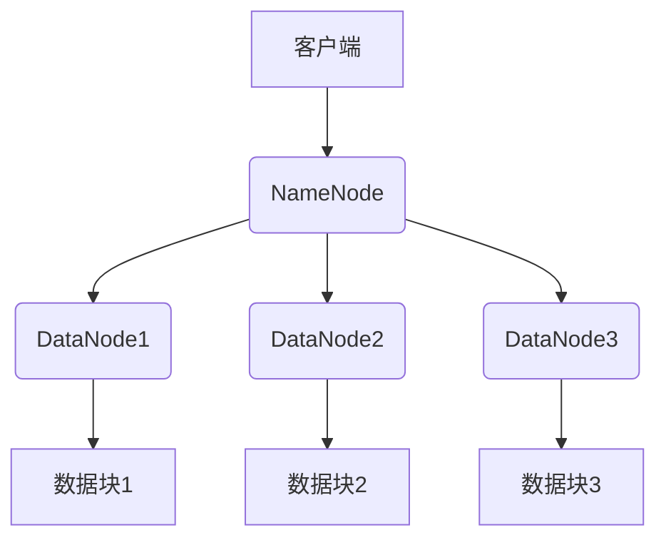
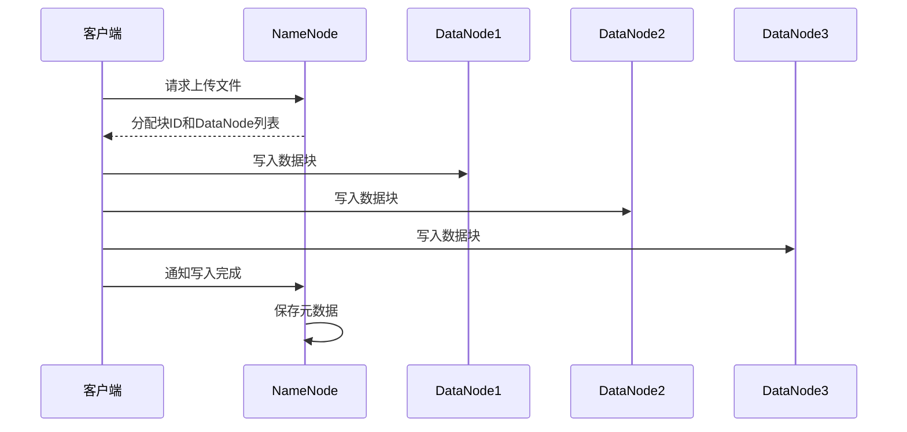
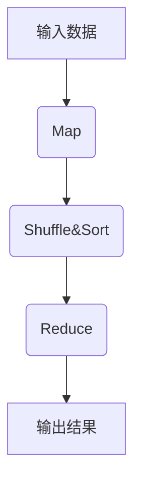

# Hadoop商业化与商业模式探讨

## 1.背景介绍

### 1.1 大数据时代的到来

随着互联网、移动互联网、物联网等新兴技术的迅猛发展,数据呈现出爆炸式增长。根据IDC(国际数据公司)的预测,到2025年全球数据总量将达到175ZB(1ZB=1万亿TB)。传统的数据处理方式已经无法满足如此庞大数据量的存储和计算需求。大数据时代的到来,对企业的数据处理能力提出了更高的要求,迫切需要一种全新的大数据处理架构和平台。

### 1.2 Hadoop的诞生

为了解决大数据带来的挑战,Apache基金会在2006年创建了Hadoop项目,该项目源于Google的三篇论文:《The Google File System》、《MapReduce:Simplified Data Processing on Large Clusters》和《Bigtable:A Distributed Storage System for Structured Data》。Hadoop是一个开源的分布式系统基础架构,主要由HDFS(Hadoop分布式文件系统)和MapReduce(分布式计算框架)两个核心组件组成。

Hadoop的出现为大数据的存储和计算提供了可靠、高效、可扩展的解决方案,迅速成为大数据处理的事实标准。

## 2.核心概念与联系

### 2.1 HDFS(Hadoop分布式文件系统)

HDFS是一个高度容错的分布式文件系统,设计用于在廉价的机器上运行,具有高吞吐量的数据访问能力。它具有以下核心概念:

1. **NameNode(名称节点)**: 管理文件系统的命名空间和客户端对文件的访问。
2. **DataNode(数据节点)**: 在集群中实际存储数据块的节点。
3. **块(Block)**: HDFS中文件被分割为一个或多个块,这些块分散存储在集群中的DataNode上。

HDFS通过数据冗余和故障转移机制来提供高可靠性和高容错性。



### 2.2 MapReduce

MapReduce是一种分布式数据处理模型,用于在大型集群上并行处理大规模数据集。它将计算过程分为两个阶段:Map(映射)和Reduce(归约)。

1. **Map阶段**: 输入数据被分割成多个数据块,并行处理这些数据块,生成中间结果。
2. **Reduce阶段**: 对Map阶段产生的中间结果进行合并和汇总,生成最终结果。


MapReduce框架自动处理数据分区、任务调度、监控和重新执行失败任务等细节,简化了大规模数据处理的复杂性。

## 3.核心算法原理具体操作步骤

### 3.1 HDFS写数据流程

1. 客户端向NameNode请求上传文件,NameNode检查目标文件是否已存在。
2. NameNode为文件在HDFS上分配一个新的块ID,并确定存储该块的DataNode节点列表。
3. 客户端按顺序向DataNode节点写入数据块,每个DataNode在本地临时存储块数据。
4. 客户端完成向最后一个DataNode写入数据块后,通知NameNode文件写入已完成。
5. NameNode将数据块信息永久保存到内存中,并在磁盘上记录编辑日志。



### 3.2 MapReduce执行流程

1. **输入阶段**: 输入数据被分割成多个数据块,并分发给Map任务。
2. **Map阶段**: 每个Map任务并行处理一个数据块,生成键值对形式的中间结果。
3. **Shuffle阶段**: 重新分区和排序Map输出的中间结果,为Reduce阶段做准备。
4. **Reduce阶段**: 每个Reduce任务并行处理一个分区的中间结果,生成最终输出结果。
5. **输出阶段**: 将Reduce任务的输出结果写入HDFS或其他存储系统。



## 4.数学模型和公式详细讲解举例说明

在MapReduce中,任务调度和负载均衡是非常重要的问题。为了实现高效的任务调度,Hadoop采用了一种基于局部性的调度策略,即尽量将任务分配到存储输入数据的节点上运行,以减少数据传输开销。

假设集群中有$N$个节点,每个节点的计算能力为$C_i(1 \leq i \leq N)$,输入数据被分割成$M$个块,第$j$个数据块的大小为$D_j(1 \leq j \leq M)$。我们需要找到一种任务分配方案,使得总的计算时间最小化。

我们可以将这个问题建模为一个整数线性规划问题:

$$
\begin{aligned}
\min & \quad T \\
\text{s.t.} & \quad \sum_{j=1}^M x_{ij} D_j \leq C_i T, \quad \forall i \in \{1, \ldots, N\} \\
& \quad \sum_{i=1}^N x_{ij} = 1, \quad \forall j \in \{1, \ldots, M\} \\
& \quad x_{ij} \in \{0, 1\}, \quad \forall i \in \{1, \ldots, N\}, j \in \{1, \ldots, M\}
\end{aligned}
$$

其中,$x_{ij}$是一个二值变量,表示数据块$j$是否被分配到节点$i$上执行。$T$表示总的计算时间。

第一个约束条件保证每个节点的计算时间不超过$T$。第二个约束条件保证每个数据块只被分配到一个节点上执行。第三个约束条件表示$x_{ij}$是一个二值变量。

通过求解这个整数线性规划问题,我们可以得到最优的任务分配方案,从而最小化总的计算时间。

## 5.项目实践:代码实例和详细解释说明

下面是一个使用Hadoop MapReduce进行单词计数的示例代码:

```java
import java.io.IOException;
import org.apache.hadoop.conf.Configuration;
import org.apache.hadoop.fs.Path;
import org.apache.hadoop.io.IntWritable;
import org.apache.hadoop.io.Text;
import org.apache.hadoop.mapreduce.Job;
import org.apache.hadoop.mapreduce.Mapper;
import org.apache.hadoop.mapreduce.Reducer;
import org.apache.hadoop.mapreduce.lib.input.FileInputFormat;
import org.apache.hadoop.mapreduce.lib.output.FileOutputFormat;

public class WordCount {

    public static class TokenizerMapper
            extends Mapper<Object, Text, Text, IntWritable> {

        private final static IntWritable one = new IntWritable(1);
        private Text word = new Text();

        public void map(Object key, Text value, Context context) throws IOException, InterruptedException {
            StringTokenizer itr = new StringTokenizer(value.toString());
            while (itr.hasMoreTokens()) {
                word.set(itr.nextToken());
                context.write(word, one);
            }
        }
    }

    public static class IntSumReducer
            extends Reducer<Text, IntWritable, Text, IntWritable> {
        private IntWritable result = new IntWritable();

        public void reduce(Text key, Iterable<IntWritable> values, Context context) throws IOException, InterruptedException {
            int sum = 0;
            for (IntWritable val : values) {
                sum += val.get();
            }
            result.set(sum);
            context.write(key, result);
        }
    }

    public static void main(String[] args) throws Exception {
        Configuration conf = new Configuration();
        Job job = Job.getInstance(conf, "word count");
        job.setJarByClass(WordCount.class);
        job.setMapperClass(TokenizerMapper.class);
        job.setCombinerClass(IntSumReducer.class);
        job.setReducerClass(IntSumReducer.class);
        job.setOutputKeyClass(Text.class);
        job.setOutputValueClass(IntWritable.class);
        FileInputFormat.addInputPath(job, new Path(args[0]));
        FileOutputFormat.setOutputPath(job, new Path(args[1]));
        System.exit(job.waitForCompletion(true) ? 0 : 1);
    }
}
```

1. **Mapper类**:
   - `TokenizerMapper`继承自`Mapper`类,实现了`map`方法。
   - `map`方法将输入的文本数据按空格分割成单词,每个单词作为`key`,值为常量`1`。
   - `context.write(word, one)`将`<单词, 1>`作为中间结果输出。

2. **Reducer类**:
   - `IntSumReducer`继承自`Reducer`类,实现了`reduce`方法。
   - `reduce`方法接收`<单词, [1, 1, ...]>`形式的中间结果。
   - 对于每个单词,将值列表中的`1`累加求和,得到该单词的总计数。
   - `context.write(key, result)`将`<单词, 计数>`作为最终输出结果。

3. **主函数**:
   - 创建一个`Configuration`对象,用于配置MapReduce作业。
   - 创建一个`Job`对象,设置作业名称、Mapper、Combiner、Reducer类,以及输入/输出格式。
   - 设置输入路径和输出路径。
   - 提交作业并等待完成。

通过这个示例,我们可以看到如何使用Hadoop MapReduce进行简单的数据处理任务。MapReduce框架负责了任务调度、数据分区、结果合并等繁琐的细节,使得开发人员可以专注于业务逻辑的实现。

## 6.实际应用场景

Hadoop凭借其强大的数据处理能力,在多个领域得到了广泛应用:

1. **网络日志分析**: 分析网站访问日志,了解用户行为和网站性能。
2. **推荐系统**: 基于用户行为数据,为用户推荐感兴趣的商品或内容。
3. **广告投放**: 根据用户特征,精准投放个性化广告。
4. **金融风险分析**: 分析金融交易数据,识别潜在的风险和欺诈行为。
5. **基因组学研究**: 处理大规模基因组数据,发现基因模式和关联。
6. **气象预报**: 处理海量气象数据,建立精确的天气预报模型。

除了上述应用场景外,Hadoop还被广泛应用于社交网络分析、网络安全、物联网数据处理等多个领域。

## 7.工具和资源推荐

对于想要学习和使用Hadoop的开发者,以下工具和资源可能会有所帮助:

1. **Apache Hadoop官网**: https://hadoop.apache.org/
   - 提供Hadoop的下载、文档、教程和社区支持。

2. **Cloudera**: https://www.cloudera.com/
   - 提供商业化的Hadoop发行版和相关产品。

3. **Hortonworks**: https://hortonworks.com/
   - 另一家提供商业化Hadoop发行版的公司。

4. **Hadoop: The Definitive Guide** (书籍)
   - 由Hadoop创始人之一撰写,全面介绍Hadoop的架构、设计和使用方法。

5. **Hadoop实战** (书籍)
   - 通过实例讲解Hadoop的核心概念和实践技巧。

6. **Coursera和edX** (在线课程平台)
   - 提供多门Hadoop和大数据相关的在线课程。

7. **Stack Overflow** (问答社区)
   - 可以在这里寻求Hadoop相关问题的解答和建议。

通过利用这些工具和资源,开发者可以更好地掌握Hadoop的使用,提高大数据处理能力。

## 8.总结:未来发展趋势与挑战

### 8.1 Hadoop的商业化发展

作为开源项目,Hadoop最初主要在学术界和互联网公司中得到应用。随着大数据需求的不断增长,越来越多的传统企业开始采用Hadoop进行数据处理和分析。这为Hadoop的商业化