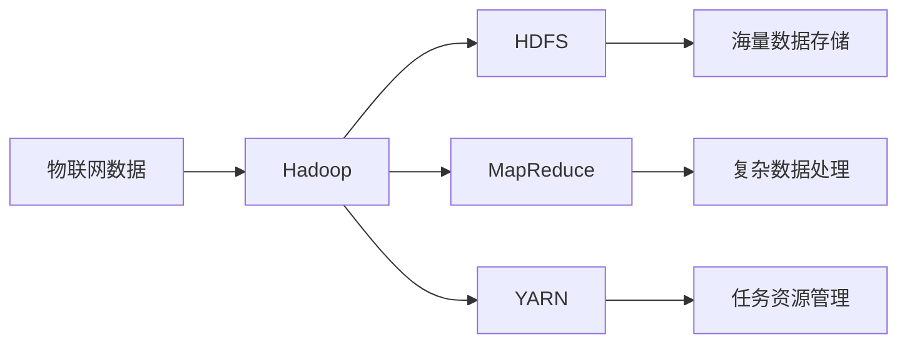

# Hadoop技术与物联网融合

## 1.背景介绍
### 1.1 物联网的发展现状
#### 1.1.1 物联网设备数量快速增长
#### 1.1.2 物联网应用领域不断扩大
#### 1.1.3 物联网数据呈现爆发式增长

### 1.2 大数据处理面临的挑战  
#### 1.2.1 数据量巨大,难以存储和管理
#### 1.2.2 数据种类繁多,结构化和非结构化数据并存
#### 1.2.3 数据处理实时性要求高

### 1.3 Hadoop在大数据处理中的优势
#### 1.3.1 分布式存储和计算能力
#### 1.3.2 高容错性和可扩展性
#### 1.3.3 支持多种数据处理模型

## 2.核心概念与联系
### 2.1 Hadoop生态系统概述
#### 2.1.1 Hadoop分布式文件系统HDFS
#### 2.1.2 分布式计算框架MapReduce
#### 2.1.3 资源管理框架YARN

### 2.2 物联网数据特点  
#### 2.2.1 数据量大
#### 2.2.2 数据多样性
#### 2.2.3 数据时效性

### 2.3 Hadoop与物联网数据处理的契合点
#### 2.3.1 HDFS适合存储物联网海量数据
#### 2.3.2 MapReduce适合处理物联网复杂数据
#### 2.3.3 YARN适合管理物联网数据处理任务



## 3.核心算法原理具体操作步骤
### 3.1 物联网数据采集与预处理
#### 3.1.1 物联网数据采集方式
#### 3.1.2 数据清洗和转换
#### 3.1.3 数据压缩和存储到HDFS

### 3.2 基于MapReduce的物联网数据处理
#### 3.2.1 MapReduce编程模型
#### 3.2.2 数据映射Map阶段
#### 3.2.3 数据归约Reduce阶段

### 3.3 YARN资源管理与任务调度
#### 3.3.1 YARN架构
#### 3.3.2 资源管理器ResourceManager
#### 3.3.3 节点管理器NodeManager

## 4.数学模型和公式详细讲解举例说明
### 4.1 物联网数据统计分析模型
#### 4.1.1 数据分布模型
假设物联网数据服从正态分布 $X \sim N(\mu,\sigma^2)$,其中 $\mu$ 为均值, $\sigma$ 为标准差,则概率密度函数为:

$$f(x)=\frac{1}{\sqrt{2\pi}\sigma}\exp\left(-\frac{(x-\mu)^2}{2\sigma^2}\right)$$

#### 4.1.2 假设检验模型
对于物联网数据的假设检验,常用的是 t 检验。假设总体服从正态分布,样本容量为 $n$,样本均值为 $\bar{X}$,总体均值为 $\mu_0$,显著性水平为 $\alpha$,则检验统计量为:

$$t=\frac{\bar{X}-\mu_0}{S/\sqrt{n}} \sim t(n-1)$$

其中 $S$ 为样本标准差。

### 4.2 物联网数据挖掘模型
#### 4.2.1 关联规则挖掘
设 $I=\{i_1,i_2,...,i_m\}$ 为一个项集合, $D=\{T_1,T_2,...,T_n\}$ 为事务数据库,关联规则定义为 $X \Rightarrow Y$,其中 $X,Y \subseteq I$ 且 $X \cap Y = \emptyset$。关联规则的支持度和置信度分别定义为:

$$\mathrm{Support}(X \Rightarrow Y) = \frac{|X \cup Y|}{|D|}$$

$$\mathrm{Confidence}(X \Rightarrow Y) = \frac{|X \cup Y|}{|X|}$$

#### 4.2.2 聚类分析
k-means 是常用的聚类算法之一。假设聚类数为 $k$,样本集合为 $\{x_1,x_2,...,x_n\}$,聚类中心为 $\{c_1,c_2,...,c_k\}$,目标函数定义为样本到其所属类别中心的距离平方和:

$$J = \sum_{i=1}^k \sum_{x \in C_i} ||x-c_i||^2$$

其中 $C_i$ 表示第 $i$ 个聚类。

## 5.项目实践：代码实例和详细解释说明
### 5.1 物联网数据采集与存储
#### 5.1.1 Flume配置实例
下面是一个Flume配置文件示例,用于采集物联网传感器数据并存储到HDFS:

```properties
# 定义Agent a1
a1.sources = s1
a1.sinks = k1  
a1.channels = c1

# 配置Source
a1.sources.s1.type = netcat
a1.sources.s1.bind = localhost
a1.sources.s1.port = 9999

# 配置Sink
a1.sinks.k1.type = hdfs
a1.sinks.k1.hdfs.path = /iot_data/%Y-%m-%d/%H
a1.sinks.k1.hdfs.fileType = DataStream

# 配置Channel
a1.channels.c1.type = memory
a1.channels.c1.capacity = 1000

# 连接组件
a1.sources.s1.channels = c1
a1.sinks.k1.channel = c1
```

该配置定义了一个名为a1的Agent,包含一个Source、一个Sink和一个Channel。Source从指定端口接收数据,Sink将数据写入HDFS,Channel在两者间传递数据。

#### 5.1.2 Kafka生产消费示例
下面是使用Kafka生产和消费物联网数据的Java代码示例:

```java
// 生产者
public class IoTDataProducer {
    public static void main(String[] args) {
        Properties props = new Properties();
        props.put("bootstrap.servers", "localhost:9092");
        props.put("key.serializer", "org.apache.kafka.common.serialization.StringSerializer");
        props.put("value.serializer", "org.apache.kafka.common.serialization.StringSerializer");
        
        Producer<String, String> producer = new KafkaProducer<>(props);
        
        for (int i = 0; i < 100; i++) {
            String data = String.format("{\"device_id\":%d,\"temperature\":%.2f}", i, Math.random() * 50);
            producer.send(new ProducerRecord<>("iot_data", data));
        }
        
        producer.close();
    }
}

// 消费者
public class IoTDataConsumer {
    public static void main(String[] args) {
        Properties props = new Properties();
        props.put("bootstrap.servers", "localhost:9092");
        props.put("group.id", "iot_group");
        props.put("key.deserializer", "org.apache.kafka.common.serialization.StringDeserializer");
        props.put("value.deserializer", "org.apache.kafka.common.serialization.StringDeserializer");
        
        Consumer<String, String> consumer = new KafkaConsumer<>(props);
        consumer.subscribe(Arrays.asList("iot_data"));
        
        while (true) {
            ConsumerRecords<String, String> records = consumer.poll(100);
            for (ConsumerRecord<String, String> record : records) {
                System.out.println("Received data: " + record.value());
            }
        }
    }
}
```

生产者从for循环中生成模拟的物联网JSON数据,并发送到名为"iot_data"的Topic。消费者订阅该Topic,持续拉取并打印接收到的数据。

### 5.2 基于MapReduce的物联网数据分析
#### 5.2.1 数据去重示例
下面是一个MapReduce去重的示例代码,用于对物联网设备数据按设备ID进行去重:

```java
public class DeduplicationMapper extends Mapper<LongWritable, Text, Text, NullWritable> {
    @Override
    protected void map(LongWritable key, Text value, Context context) throws IOException, InterruptedException {
        String line = value.toString();
        String[] fields = line.split(",");
        String deviceId = fields[0];
        context.write(new Text(deviceId), NullWritable.get());
    }
}

public class DeduplicationReducer extends Reducer<Text, NullWritable, Text, NullWritable> {
    @Override
    protected void reduce(Text key, Iterable<NullWritable> values, Context context) throws IOException, InterruptedException {
        context.write(key, NullWritable.get());
    }
}

public class DeduplicationDriver {
    public static void main(String[] args) throws Exception {
        Configuration conf = new Configuration();
        Job job = Job.getInstance(conf, "IoT Data Deduplication");
        
        job.setJarByClass(DeduplicationDriver.class);
        job.setMapperClass(DeduplicationMapper.class);
        job.setCombinerClass(DeduplicationReducer.class);
        job.setReducerClass(DeduplicationReducer.class);
        
        job.setOutputKeyClass(Text.class);
        job.setOutputValueClass(NullWritable.class);
        
        FileInputFormat.addInputPath(job, new Path(args[0]));
        FileOutputFormat.setOutputPath(job, new Path(args[1]));
        
        System.exit(job.waitForCompletion(true) ? 0 : 1);
    }
}
```

Mapper从输入的每行数据中解析出设备ID,并以<设备ID,null>的形式输出。Reducer收到同一设备ID的多个<key,null>对,但只输出一个,从而实现去重。Driver为程序的主入口,设置作业的各项参数。

#### 5.2.2 数据聚合示例
下面是一个MapReduce聚合的示例代码,用于按天统计每个设备的数据量:

```java
public class DataAggregationMapper extends Mapper<LongWritable, Text, Text, IntWritable> {
    @Override
    protected void map(LongWritable key, Text value, Context context) throws IOException, InterruptedException {
        String line = value.toString();
        String[] fields = line.split(",");
        String deviceId = fields[0];
        String date = fields[1].split(" ")[0];
        context.write(new Text(deviceId + "_" + date), new IntWritable(1));
    }
}

public class DataAggregationReducer extends Reducer<Text, IntWritable, Text, IntWritable> {
    @Override
    protected void reduce(Text key, Iterable<IntWritable> values, Context context) throws IOException, InterruptedException {
        int sum = 0;
        for (IntWritable value : values) {
            sum += value.get();
        }
        context.write(key, new IntWritable(sum));
    }
}

public class DataAggregationDriver {
    public static void main(String[] args) throws Exception {
        Configuration conf = new Configuration();
        Job job = Job.getInstance(conf, "IoT Data Aggregation");
        
        job.setJarByClass(DataAggregationDriver.class);
        job.setMapperClass(DataAggregationMapper.class);
        job.setCombinerClass(DataAggregationReducer.class);
        job.setReducerClass(DataAggregationReducer.class);
        
        job.setOutputKeyClass(Text.class);
        job.setOutputValueClass(IntWritable.class);
        
        FileInputFormat.addInputPath(job, new Path(args[0]));
        FileOutputFormat.setOutputPath(job, new Path(args[1]));
        
        System.exit(job.waitForCompletion(true) ? 0 : 1);
    }
}
```

Mapper从输入的每行数据中解析出设备ID和日期,并以<设备ID_日期,1>的形式输出。Reducer收到同一<设备ID_日期>的多个计数,将它们累加得到该设备当天的数据总量。

## 6.实际应用场景
### 6.1 智慧农业
#### 6.1.1 农田环境监测
利用温湿度、光照、二氧化碳等传感器实时采集农田环境数据,通过Hadoop进行存储和分析,优化农作物生长条件。

#### 6.1.2 精准灌溉控制
分析土壤湿度传感器数据,结合天气预报,利用机器学习算法预测作物需水量,实现精准智能灌溉。

### 6.2 工业制造  
#### 6.2.1 设备故障预测
收集工业设备的振动、温度、电流等传感器数据,通过Hadoop平台建立预测模型,及早发现设备异常,减少非计划停机时间。

#### 6.2.2 产品质量分析
利用生产线上的机器视觉等检测设备数据,通过大数据分析找出影响产品质量的关键因素,持续优化生产工艺。

### 6.3 智慧城市
#### 6.3.1 交通流量预测
通过道路监控、车辆GPS等数据,利用Hadoop分析道路交通流量规律,优化交通信号灯时间,缓解城市拥堵。

#### 6.3.2 城市环境监测
利用分布在城市各处的环境传感器数据,分析空气质量、噪声污染等问题,并对污染源进行溯源和管控。