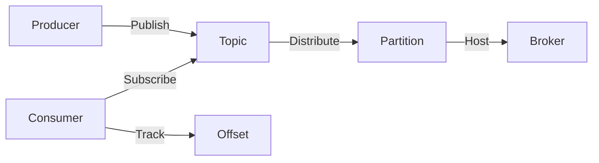

# Kafka原理与代码实例讲解

## 1. 背景介绍
在现代数据密集型应用中，数据流的高效处理变得至关重要。Apache Kafka是一个分布式流处理平台，它被设计用来高效地处理大量数据，并支持实时数据管道和流式应用程序。Kafka最初由LinkedIn开发，并于2011年成为Apache项目的一部分。它现在是许多企业数据架构的核心组件，支持高吞吐量、可扩展性和持久性。

## 2. 核心概念与联系
Kafka的架构包括几个关键概念：**Producer**、**Consumer**、**Broker**、**Topic**、**Partition**和**Offset**。

- **Producer**：负责发布消息到Kafka Topic。
- **Consumer**：从Topic订阅并处理消息。
- **Broker**：Kafka集群中的服务器，负责存储数据并处理客户端请求。
- **Topic**：消息的分类，Producer发布消息到特定的Topic，Consumer从Topic读取消息。
- **Partition**：Topic的物理分割，每个Partition可以在不同的Broker上。
- **Offset**：Partition中消息的唯一标识，Consumer通过Offset追踪已经读取的消息。



## 3. 核心算法原理具体操作步骤
Kafka的核心算法包括消息存储、分布式数据同步和消费者偏移管理。

- **消息存储**：Kafka使用顺序写入的方式来存储消息到磁盘，这种方式对于读写性能都非常高效。
- **分布式数据同步**：Kafka使用Zookeeper来同步集群状态，保证数据的一致性。
- **消费者偏移管理**：Kafka通过在内部Topic（__consumer_offsets）中存储每个Consumer的Offset来管理消费者的状态。

操作步骤如下：

1. Producer将消息发送到指定的Topic。
2. Kafka Broker接收消息，并将其追加到Partition的日志文件中。
3. Consumer订阅Topic，并从Broker读取消息。
4. Consumer在读取每条消息后更新其Offset。

## 4. 数学模型和公式详细讲解举例说明
Kafka的性能可以通过以下数学模型来描述：

$$
吞吐量(T) = \frac{消息数量(N)}{时间(T)}
$$

其中，$吞吐量(T)$ 是指在单位时间内处理的消息数量，$消息数量(N)$ 是指成功发送和接收的消息总数，$时间(T)$ 是指完成操作所需的时间。

例如，如果一个Producer在10秒内发送了1000条消息，那么吞吐量为：

$$
T = \frac{1000}{10} = 100 \text{ 消息/秒}
$$

## 5. 项目实践：代码实例和详细解释说明
以下是一个简单的Kafka Producer和Consumer的代码示例。

### Kafka Producer 示例
```java
import org.apache.kafka.clients.producer.*;

import java.util.Properties;

public class SimpleProducer {
    public static void main(String[] args) {
        Properties props = new Properties();
        props.put("bootstrap.servers", "localhost:9092");
        props.put("key.serializer", "org.apache.kafka.common.serialization.StringSerializer");
        props.put("value.serializer", "org.apache.kafka.common.serialization.StringSerializer");

        Producer<String, String> producer = new KafkaProducer<>(props);
        for(int i = 0; i < 10; i++) {
            producer.send(new ProducerRecord<String, String>("test", Integer.toString(i), "message-" + i));
        }
        producer.close();
    }
}
```

### Kafka Consumer 示例
```java
import org.apache.kafka.clients.consumer.*;
import org.apache.kafka.common.serialization.StringDeserializer;

import java.util.Collections;
import java.util.Properties;

public class SimpleConsumer {
    public static void main(String[] args) {
        Properties props = new Properties();
        props.put("bootstrap.servers", "localhost:9092");
        props.put("group.id", "test-group");
        props.put("key.deserializer", StringDeserializer.class.getName());
        props.put("value.deserializer", StringDeserializer.class.getName());

        Consumer<String, String> consumer = new KafkaConsumer<>(props);
        consumer.subscribe(Collections.singletonList("test"));

        while (true) {
            ConsumerRecords<String, String> records = consumer.poll(100);
            for (ConsumerRecord<String, String> record : records) {
                System.out.printf("offset = %d, key = %s, value = %s%n", record.offset(), record.key(), record.value());
            }
        }
    }
}
```

在这个例子中，Producer发送了10条消息到"test" Topic，而Consumer订阅了这个Topic并持续消费消息。

## 6. 实际应用场景
Kafka广泛应用于日志聚合、消息系统、流处理和实时分析等场景。例如，一个电商平台可能使用Kafka来处理用户的点击流数据，以实时更新推荐系统和监控用户行为。

## 7. 工具和资源推荐
- **Apache Kafka官方文档**：提供了详细的Kafka使用指南和API文档。
- **Confluent Platform**：提供了Kafka的商业支持和额外的工具，如Kafka Connect和Kafka Streams。
- **Kafka Tool**：一个图形界面的Kafka客户端，用于管理和测试Kafka集群。

## 8. 总结：未来发展趋势与挑战
Kafka正朝着更加云原生和Kubernetes友好的方向发展。随着流处理的普及，Kafka的生态系统也在不断扩展，包括Kafka Streams和KSQL等工具。挑战包括如何进一步提高性能、保证数据安全以及简化运维。

## 9. 附录：常见问题与解答
- **Q**: Kafka如何保证消息的顺序？
- **A**: Kafka通过Partition来保证同一个Partition内的消息顺序。

- **Q**: Kafka和传统消息队列有什么区别？
- **A**: Kafka是为流处理设计的，支持高吞吐量和持久化，而传统消息队列更侧重于消息的可靠传递。

- **Q**: 如何扩展Kafka集群？
- **A**: 可以通过增加Broker和Partition来扩展Kafka集群。

作者：禅与计算机程序设计艺术 / Zen and the Art of Computer Programming