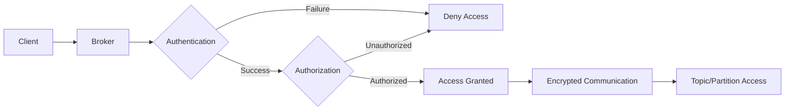

# Kafka的安全性与访问控制

## 1. 背景介绍
### 1.1 Kafka的兴起与发展
#### 1.1.1 Kafka的起源
#### 1.1.2 Kafka的发展历程
#### 1.1.3 Kafka在大数据领域的地位
### 1.2 Kafka面临的安全挑战
#### 1.2.1 数据泄露风险
#### 1.2.2 未授权访问风险
#### 1.2.3 数据篡改风险
### 1.3 Kafka安全性的重要性
#### 1.3.1 保护敏感数据
#### 1.3.2 确保数据完整性
#### 1.3.3 满足合规性要求

## 2. 核心概念与联系
### 2.1 Kafka的核心组件
#### 2.1.1 Broker
#### 2.1.2 Topic
#### 2.1.3 Partition
#### 2.1.4 Producer
#### 2.1.5 Consumer
### 2.2 Kafka的安全模型
#### 2.2.1 认证（Authentication）
#### 2.2.2 授权（Authorization）
#### 2.2.3 数据加密（Encryption）
### 2.3 Kafka安全组件之间的关系
#### 2.3.1 认证与授权的关系
#### 2.3.2 数据加密与认证授权的关系
#### 2.3.3 安全组件与Kafka核心组件的交互



## 3. 核心算法原理具体操作步骤
### 3.1 Kafka认证机制
#### 3.1.1 SSL/TLS认证
##### 3.1.1.1 SSL/TLS原理
##### 3.1.1.2 在Kafka中配置SSL/TLS认证
##### 3.1.1.3 客户端连接过程
#### 3.1.2 SASL认证
##### 3.1.2.1 SASL原理
##### 3.1.2.2 SASL认证机制（PLAIN, SCRAM, GSSAPI）
##### 3.1.2.3 在Kafka中配置SASL认证
### 3.2 Kafka授权机制  
#### 3.2.1 ACL（Access Control List）
##### 3.2.1.1 ACL原理
##### 3.2.1.2 Kafka ACL的资源类型
##### 3.2.1.3 在Kafka中配置ACL
#### 3.2.2 RBAC（Role-Based Access Control）
##### 3.2.2.1 RBAC原理
##### 3.2.2.2 在Kafka中实现RBAC
### 3.3 Kafka数据加密
#### 3.3.1 传输中加密
##### 3.3.1.1 使用SSL/TLS实现传输中加密
#### 3.3.2 存储中加密
##### 3.3.2.1 磁盘加密方案
##### 3.3.2.2 应用层加密方案

## 4. 数学模型和公式详细讲解举例说明
### 4.1 Kafka认证中的数学原理
#### 4.1.1 SSL/TLS中的加密算法
##### 4.1.1.1 对称加密算法（如AES）
$$
C = E_K(P)
$$
$$
P = D_K(C)
$$
其中，$P$为明文，$C$为密文，$K$为密钥，$E$为加密函数，$D$为解密函数。
##### 4.1.1.2 非对称加密算法（如RSA）
$$
C = E_{PK}(P)
$$
$$
P = D_{SK}(C)
$$
其中，$PK$为公钥，$SK$为私钥。
#### 4.1.2 SASL中的哈希算法（如SHA-256）
$$
H = hash(M)
$$
其中，$M$为消息，$H$为哈希值。
### 4.2 Kafka授权中的数学模型
#### 4.2.1 ACL的数学表示
$$
ACL = \{(s, o, p) | s \in S, o \in O, p \in P\}
$$
其中，$S$为主体集合，$O$为客体集合，$P$为权限集合。
#### 4.2.2 RBAC的数学表示
$$
UA \subseteq U \times R
$$
$$
PA \subseteq P \times R
$$
其中，$U$为用户集合，$R$为角色集合，$P$为权限集合，$UA$为用户-角色分配关系，$PA$为权限-角色分配关系。

## 5. 项目实践：代码实例和详细解释说明
### 5.1 使用SSL/TLS配置Kafka认证
#### 5.1.1 生成SSL/TLS证书
```bash
keytool -genkey -alias localhost -keyalg RSA -keystore kafka.server.keystore.jks -validity 365 -keysize 2048
```
#### 5.1.2 配置Kafka Broker
```properties
listeners=SSL://localhost:9093
ssl.keystore.location=/path/to/server.keystore.jks
ssl.keystore.password=password
ssl.key.password=password
ssl.truststore.location=/path/to/server.truststore.jks  
ssl.truststore.password=password
```
#### 5.1.3 配置Kafka客户端
```properties
security.protocol=SSL
ssl.truststore.location=/path/to/client.truststore.jks
ssl.truststore.password=password
```
### 5.2 使用ACL配置Kafka授权
#### 5.2.1 启用ACL
```properties
authorizer.class.name=kafka.security.authorizer.AclAuthorizer
allow.everyone.if.no.acl.found=false
super.users=User:admin
```
#### 5.2.2 添加ACL规则
```bash
bin/kafka-acls.sh --authorizer-properties zookeeper.connect=localhost:2181 --add --allow-principal User:alice --operation Read --topic test
```

## 6. 实际应用场景
### 6.1 金融领域
#### 6.1.1 股票交易系统
#### 6.1.2 银行交易系统
### 6.2 医疗领域
#### 6.2.1 医疗数据传输
#### 6.2.2 医疗设备监控
### 6.3 物联网领域 
#### 6.3.1 智能家居数据收集
#### 6.3.2 工业设备数据传输

## 7. 工具和资源推荐
### 7.1 Kafka安全配置工具
#### 7.1.1 Kafka Security Manager
#### 7.1.2 Cruise Control
### 7.2 Kafka安全监控工具
#### 7.2.1 Confluent Control Center
#### 7.2.2 Kafka Eagle
### 7.3 Kafka安全最佳实践资源
#### 7.3.1 Confluent官方文档
#### 7.3.2 Kafka Summit会议视频

## 8. 总结：未来发展趋势与挑战
### 8.1 Kafka安全性的发展趋势
#### 8.1.1 零信任安全模型
#### 8.1.2 数据治理与合规性
#### 8.1.3 人工智能与机器学习在安全中的应用
### 8.2 Kafka安全性面临的挑战
#### 8.2.1 复杂的安全配置
#### 8.2.2 性能与安全的平衡
#### 8.2.3 不断演进的安全威胁

## 9. 附录：常见问题与解答
### 9.1 如何选择合适的认证机制？
### 9.2 如何设计Kafka的ACL策略？
### 9.3 如何监控Kafka的安全状态？
### 9.4 如何应对Kafka的安全漏洞？

作者：禅与计算机程序设计艺术 / Zen and the Art of Computer Programming

Kafka作为一个广泛应用于大数据领域的分布式流处理平台，其安全性与访问控制至关重要。本文深入探讨了Kafka在认证、授权和数据加密方面的核心原理、具体实现步骤以及实际应用场景。

通过对Kafka安全模型中的认证、授权和数据加密三大核心概念的剖析，我们了解了它们之间的关系以及与Kafka核心组件的交互方式。SSL/TLS和SASL认证机制以及ACL和RBAC授权机制的原理和配置步骤，为我们在实践中保障Kafka的安全访问提供了指导。此外，数据在传输和存储过程中的加密方案，进一步增强了Kafka的安全性。

在实际应用场景中，无论是金融、医疗还是物联网领域，Kafka都发挥着至关重要的作用。通过恰当地配置安全策略，我们可以确保敏感数据的保护和合规性要求的满足。同时，一些实用的安全配置和监控工具以及最佳实践资源，为我们提供了有力的支持。

展望未来，Kafka的安全性发展趋势将与零信任安全模型、数据治理与合规性以及人工智能与机器学习技术紧密相关。同时，我们也需要应对复杂的安全配置、性能与安全的平衡以及不断演进的安全威胁等挑战。

总之，Kafka的安全性与访问控制是一个复杂而又重要的课题，需要开发者和运维人员的共同努力。通过不断学习和实践，我们可以构建更加安全可靠的Kafka集群，为大数据应用提供坚实的基础。