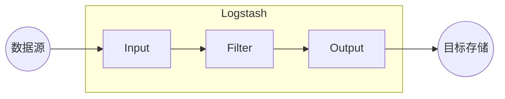

# Logstash原理与代码实例讲解

## 1.背景介绍

在当今数据驱动的世界中,日志数据是一种非常重要的数据源。它包含了系统、应用程序和用户活动的宝贵信息,对于故障排查、安全监控、用户行为分析等场景都具有重要意义。然而,由于日志数据通常是非结构化的、分散的,并且数据量巨大,因此很难对其进行高效的收集、传输、处理和分析。

Logstash就是一款强大的开源数据收集引擎,旨在帮助用户从各种异构数据源无缝地收集数据,并对数据进行转换、过滤和传输,为后续的数据分析和可视化奠定基础。它是Elastic Stack(前身为ELK Stack)的核心组件之一,与Elasticsearch、Kibana等工具协同工作,构建了一个完整的日志管理和数据分析平台。

## 2.核心概念与联系

### 2.1 Logstash架构

Logstash的核心架构由三个主要部分组成:输入(Input)、过滤器(Filter)和输出(Output)。



- **输入(Input)**: 从各种数据源(如文件、syslog、Redis等)收集数据,支持多种输入源。
- **过滤器(Filter)**: 对收集的数据进行转换、过滤和丰富,支持多种过滤器插件。
- **输出(Output)**: 将处理后的数据发送到指定的目标存储(如Elasticsearch、文件等)。

### 2.2 Logstash事件

Logstash使用事件(Event)作为数据的载体,事件由一个或多个数据字段组成。每个事件都有一个唯一的ID,以及一些元数据字段(如@timestamp、@version等)。事件在Logstash内部以JSON格式表示和传递。

### 2.3 Codec

Codec用于在输入和输出阶段对数据进行编码和解码。Logstash支持多种Codec插件,如JSON、Plain等,可以根据数据源和目标存储的格式进行适当的选择。

### 2.4 Grok

Grok是Logstash中一种强大的过滤器插件,用于从非结构化的日志数据中提取结构化的信息。它使用预定义的正则表达式模式来匹配和解析日志数据,并将提取的字段作为结构化数据输出。

## 3.核心算法原理具体操作步骤

Logstash的核心算法原理可以概括为以下几个步骤:

1. **输入(Input)阶段**:
   - 根据配置的输入源类型和参数,启动相应的输入插件。
   - 输入插件从数据源读取数据,并将数据封装成Logstash事件。

2. **过滤(Filter)阶段**:
   - 对输入阶段生成的事件进行处理,应用配置的过滤器插件。
   - 过滤器插件可以对事件进行转换、丰富、修改或删除操作。
   - 常用的过滤器插件包括Grok、Mutate、Date等。

3. **输出(Output)阶段**:
   - 将经过过滤器处理后的事件发送到配置的目标存储。
   - 根据目标存储的类型和参数,启动相应的输出插件。
   - 输出插件将事件数据写入目标存储,如Elasticsearch、文件等。

4. **持久化和恢复**:
   - Logstash会将处理过程中的事件持久化到磁盘上的队列文件中,以防止数据丢失。
   - 在Logstash重启或发生故障时,可以从队列文件中恢复未完成的事件,继续处理。

5. **并发处理**:
   - Logstash使用多线程和管道模型,可以同时处理多个事件,提高吞吐量。
   - 输入、过滤和输出阶段都可以配置多个实例,实现并行处理。

6. **插件扩展性**:
   - Logstash提供了丰富的插件生态系统,用户可以根据需求选择或开发自定义插件。
   - 插件可以扩展Logstash的功能,支持更多的数据源、过滤器和目标存储。

## 4.数学模型和公式详细讲解举例说明

在Logstash中,一些常用的数学模型和公式主要应用于以下几个方面:

1. **正则表达式匹配**:
   - Grok过滤器使用正则表达式来匹配和解析非结构化的日志数据。
   - 正则表达式可以描述为一种形式语言,用于描述字符串的模式。
   - 常用的正则表达式操作符包括字符匹配(`.`、`\d`、`\w`等)、量词(`*`、`+`、`?`、`{m,n}`等)、分组(`()`、`(?:)`等)、锚点(`^`、`$`等)等。

2. **时间戳解析**:
   - Date过滤器用于解析和转换日志中的时间戳字段。
   - 时间戳可以使用各种格式表示,如Unix时间戳、ISO 8601格式等。
   - 常用的时间戳转换公式包括:`strftime`、`sprintf`等。

3. **数据聚合和统计**:
   - Metrics过滤器可以对数据进行聚合和统计,例如计算平均值、最大值、最小值等。
   - 常用的统计函数包括`sum`、`max`、`min`、`avg`等。

4. **数据采样**:
   - Sample过滤器可以对数据进行采样,用于降低数据量或进行数据抽样分析。
   - 常用的采样方法包括固定比例采样、随机采样等。

5. **数据编码和压缩**:
   - 在输入和输出阶段,Logstash可以使用不同的编码和压缩算法,如Base64编码、GZIP压缩等。
   - 这些算法通常基于一些数学模型和公式,如霍夫曼编码、LZW压缩等。

以下是一个正则表达式匹配和时间戳解析的示例:

```ruby
filter {
  grok {
    match => { "message" => "%{COMBINEDAPACHELOG}" }
  }
  date {
    match => [ "timestamp" , "dd/MMM/yyyy:HH:mm:ss Z" ]
  }
}
```

在这个示例中:

- `%{COMBINEDAPACHELOG}`是一个预定义的Grok模式,用于匹配Apache Combined日志格式。
- `match => { "message" => "%{COMBINEDAPACHELOG}" }`表示使用`COMBINEDAPACHELOG`模式来匹配`message`字段。
- `date`过滤器用于解析`timestamp`字段,使用`dd/MMM/yyyy:HH:mm:ss Z`格式。

## 5.项目实践:代码实例和详细解释说明

下面是一个简单的Logstash配置文件示例,用于从文件中读取日志数据,并将处理后的数据输出到Elasticsearch:

```ruby
# 输入插件,从文件读取日志数据
input {
  file {
    path => "/var/log/apache/access.log"
    start_position => "beginning"
  }
}

# 过滤器插件,使用Grok解析Apache日志格式
filter {
  grok {
    match => { "message" => "%{COMBINEDAPACHELOG}" }
  }
  date {
    match => [ "timestamp" , "dd/MMM/yyyy:HH:mm:ss Z" ]
  }
}

# 输出插件,将处理后的数据输出到Elasticsearch
output {
  elasticsearch {
    hosts => ["http://localhost:9200"]
    index => "logstash-%{+YYYY.MM.dd}"
  }
}
```

以下是对该配置文件的详细解释:

1. **输入(Input)部分**:
   - `input { file { ... } }`定义了一个文件输入插件。
   - `path => "/var/log/apache/access.log"`指定了要读取的Apache访问日志文件路径。
   - `start_position => "beginning"`表示从文件开头开始读取数据。

2. **过滤器(Filter)部分**:
   - `filter { grok { ... } }`定义了一个Grok过滤器插件。
   - `match => { "message" => "%{COMBINEDAPACHELOG}" }`使用`COMBINEDAPACHELOG`模式来解析`message`字段,提取出Apache Combined日志格式中的各个字段。
   - `filter { date { ... } }`定义了一个Date过滤器插件。
   - `match => [ "timestamp" , "dd/MMM/yyyy:HH:mm:ss Z" ]`将`timestamp`字段按照指定的格式进行解析。

3. **输出(Output)部分**:
   - `output { elasticsearch { ... } }`定义了一个Elasticsearch输出插件。
   - `hosts => ["http://localhost:9200"]`指定了Elasticsearch的主机地址和端口。
   - `index => "logstash-%{+YYYY.MM.dd}"`设置了输出到Elasticsearch的索引名称,使用日期作为索引名的一部分,便于按日期进行数据管理和查询。

运行该配置文件后,Logstash将从指定的Apache访问日志文件中读取数据,使用Grok过滤器解析日志格式,提取出各个字段,并将处理后的数据输出到Elasticsearch中。

## 6.实际应用场景

Logstash作为一款强大的数据收集和处理引擎,在许多实际应用场景中发挥着重要作用,例如:

1. **日志管理和分析**:
   - 收集和处理来自各种系统和应用程序的日志数据,如Web服务器日志、应用程序日志、系统日志等。
   - 将处理后的日志数据存储到Elasticsearch中,并使用Kibana进行可视化分析和监控。

2. **安全监控和威胁检测**:
   - 收集和分析网络流量日志、防火墙日志、安全设备日志等,用于检测潜在的安全威胁和入侵行为。
   - 与安全信息和事件管理(SIEM)系统集成,提供实时的安全监控和报警。

3. **物联网(IoT)数据收集**:
   - 从各种物联网设备和传感器收集数据,如温度、湿度、压力等。
   - 对收集的数据进行预处理和转换,为后续的数据分析和可视化做准备。

4. **业务智能(BI)和大数据分析**:
   - 从各种业务系统和数据源收集数据,如交易记录、客户数据、社交媒体数据等。
   - 对收集的数据进行清洗、转换和丰富,为数据仓库和大数据分析平台提供数据输入。

5. **DevOps和应用程序监控**:
   - 收集和处理应用程序日志、系统指标等数据,用于应用程序性能监控和故障排查。
   - 与持续集成/持续交付(CI/CD)流程集成,实现自动化的日志收集和监控。

6. **云环境日志管理**:
   - 在云环境中收集和处理来自虚拟机、容器、Kubernetes等组件的日志数据。
   - 与云监控和日志管理服务集成,实现集中式的日志管理和分析。

## 7.工具和资源推荐

在使用Logstash进行日志管理和数据处理时,以下工具和资源可能会很有帮助:

1. **Elastic Stack**:
   - Elastic Stack是一个开源的数据分析和可视化平台,包括Elasticsearch、Logstash、Kibana等组件。
   - Elasticsearch用于存储和搜索数据,Kibana用于数据可视化和探索。
   - Elastic Stack提供了完整的日志管理和数据分析解决方案。

2. **Filebeat**:
   - Filebeat是Elastic Stack中的一个轻量级日志传输代理,用于从服务器上收集日志数据并发送到Logstash或Elasticsearch。
   - Filebeat可以有效减轻Logstash的负载,提高日志收集的效率和可靠性。

3. **Grok Debugger**:
   - Grok Debugger是一个在线工具,用于测试和调试Grok正则表达式模式。
   -它可以帮助您快速验证和优化Grok模式,以更好地解析日志数据。

4. **Logstash插件库**:
   - Logstash提供了丰富的插件生态系统,包括各种输入、过滤器和输出插件。
   -您可以在官方插件库中查找和安装所需的插件,或者自行开发自定义插件。

5. **Logstash配置文件示例**:
   - Elastic提供了许多Logstash配置文件示例,涵盖了常见的日志格式和数据源。
   -这些示例可以作为起点,帮助您快速上手并了解配置文件的结构和语法。

6. **