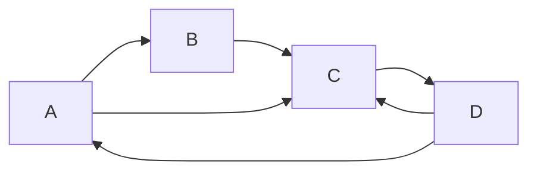

# PageRank原理与代码实例讲解

## 1.背景介绍

### 1.1 什么是PageRank

PageRank是一种由谷歌公司创始人拉里·佩奇(Larry Page)和谢尔盖·布林(Sergey Brin)发明的算法,用于为网页排名。它是谷歌搜索引擎的核心算法之一,旨在根据网页的重要性和权威性对其进行排名。

PageRank算法的基本思想是,一个网页的重要性取决于指向它的其他网页的重要性和数量。换句话说,如果一个网页被许多重要网页链接,那么它本身也会被认为是重要的。这种思路与学术界的引用分析非常相似,被广泛引用的论文通常被认为是具有较高影响力的。

### 1.2 PageRank的重要性

PageRank对于搜索引擎的排名非常重要,因为它有助于确保搜索结果的质量和相关性。在早期的搜索引擎中,网页的排名主要基于网页内容中关键词的出现频率。但这种方法存在一些缺陷,例如网站所有者可以通过在网页中大量重复关键词来人为提高排名。

PageRank算法通过考虑网页之间的链接结构,使搜索引擎更难被操纵。它不仅评估网页内容的相关性,还考虑了网页的权威性和重要性。这种方法使得搜索结果更加客观和公正,从而提高了用户体验。

## 2.核心概念与联系

### 2.1 网页重要性

PageRank算法的核心思想是,一个网页的重要性取决于指向它的其他网页的重要性和数量。具体来说,如果一个重要网页链接到另一个网页,那么被链接的网页也会获得一定的重要性。

这种思路与学术界的引用分析非常相似。被广泛引用的论文通常被认为是具有较高影响力的,因为它们受到了其他重要论文的认可。同样,被许多重要网页链接的网页也会被认为是重要的。

### 2.2 链接结构

PageRank算法不仅考虑网页内容的相关性,还考虑了网页之间的链接结构。链接结构反映了网页之间的关系,以及网页在整个网络中的重要性。

具有更多入站链接(被其他网页链接)的网页通常被认为更加重要,因为它们受到了更多其他网页的认可。同时,出站链接(链接到其他网页)的数量也会影响一个网页的重要性。如果一个网页链接到许多其他网页,那么它的重要性会被分散,因为它将其重要性传递给了其他网页。

### 2.3 PageRank值

PageRank算法为每个网页分配一个介于0和1之间的数值,称为PageRank值。该值反映了网页的重要性和权威性。PageRank值越高,表示该网页越重要。

PageRank值的计算过程是一个迭代过程,每个网页的PageRank值会根据其他网页的PageRank值和链接结构进行更新。这个过程会持续进行,直到PageRank值收敛到一个稳定的状态。

### 2.4 随机浏览模型

PageRank算法基于一个随机浏览模型,假设一个虚构的"随机浏览者"在网络中随机浏览网页。这个随机浏览者有一定概率会跟随当前网页的链接转移到其他网页,也有一定概率会完全随机地跳转到任何一个网页。

这种随机浏览模型反映了用户在网络中浏览网页的行为。用户可能会跟随链接继续浏览相关内容,也可能会突然改变主题,转移到一个完全不相关的网页。PageRank算法通过模拟这种随机浏览行为,来评估网页的重要性。

## 3.核心算法原理具体操作步骤

PageRank算法的核心思想是通过网页之间的链接结构来评估网页的重要性。具体的操作步骤如下:

1. **初始化**: 为每个网页分配一个初始的PageRank值,通常为1/N,其中N是网络中网页的总数。

2. **计算出链接的PageRank值**: 对于每个网页u,计算它的出链接网页v的PageRank值之和,记为OutSum(u)。

3. **计算入链接的贡献**: 对于每个网页v,计算它的每个入链接网页u对v的贡献,即u的PageRank值除以u的出链接数量,记为Contribution(u,v)。

4. **更新PageRank值**: 对于每个网页v,将它所有入链接网页u对它的贡献之和作为v的新PageRank值,记为NewPR(v)。同时,考虑随机跳转因子(damping factor),新的PageRank值计算公式为:

   $$NewPR(v) = (1-d) + d \times \sum_{u\in B(v)}\frac{Contribution(u,v)}{OutSum(u)}$$

   其中,d是一个介于0和1之间的常数,通常取值0.85,称为阻尼系数(damping factor)。B(v)表示所有链接到v的网页集合。

5. **迭代计算**: 重复步骤2-4,直到PageRank值收敛到一个稳定的状态,即两次迭代的PageRank值之差小于一个预设的阈值。

6. **排名**: 根据最终计算得到的PageRank值对网页进行排名,PageRank值越高,排名越靠前。

需要注意的是,PageRank算法还考虑了一些特殊情况,如网页之间存在环路、死链接(没有出链接的网页)等。这些情况需要进行特殊处理,以确保算法的正确性和收敛性。

## 4.数学模型和公式详细讲解举例说明

PageRank算法的数学模型可以用矩阵形式表示。假设网络中有N个网页,我们用一个N×N的矩阵M来表示网页之间的链接关系。如果网页i链接到网页j,则M(i,j)=1/OutDegree(i),否则M(i,j)=0。其中,OutDegree(i)表示网页i的出链接数量。

我们用一个N×1的列向量PR来表示每个网页的PageRank值。根据PageRank算法的定义,PR可以表示为:

$$PR = (1-d) \times \frac{1}{N} \times e + d \times M^T \times PR$$

其中,d是阻尼系数(damping factor),通常取值0.85;e是一个N×1的全1向量;M^T是M的转置矩阵。

这个方程的含义是,每个网页的PageRank值由两部分组成:

1. $(1-d) \times \frac{1}{N} \times e$表示随机跳转部分,即随机浏览者有(1-d)的概率会完全随机地跳转到任何一个网页。

2. $d \times M^T \times PR$表示链接传递部分,即随机浏览者有d的概率会跟随当前网页的链接转移到其他网页,并且每个入链接网页对当前网页的贡献等于该入链接网页的PageRank值除以其出链接数量。

为了更好地理解这个数学模型,我们来看一个简单的例子。假设有4个网页,它们之间的链接关系如下:



根据链接关系,我们可以构建矩阵M:

$$M = \begin{bmatrix}
0 & \frac{1}{2} & \frac{1}{2} & 0 \\
0 & 0 & \frac{1}{1} & 0 \\
0 & 0 & 0 & \frac{1}{2} \\
\frac{1}{2} & 0 & \frac{1}{2} & 0
\end{bmatrix}$$

假设初始时,每个网页的PageRank值都是0.25,即PR = [0.25, 0.25, 0.25, 0.25]^T。我们可以计算第一次迭代后的PageRank值:

$$PR' = (1-0.85) \times \frac{1}{4} \times \begin{bmatrix}
1 \\
1 \\
1 \\
1
\end{bmatrix} + 0.85 \times \begin{bmatrix}
0 & \frac{1}{2} & \frac{1}{2} & 0 \\
0 & 0 & \frac{1}{1} & 0 \\
0 & 0 & 0 & \frac{1}{2} \\
\frac{1}{2} & 0 & \frac{1}{2} & 0
\end{bmatrix} \times \begin{bmatrix}
0.25 \\
0.25 \\
0.25 \\
0.25
\end{bmatrix}$$

计算结果为PR' = [0.2875, 0.3375, 0.2875, 0.2875]^T。

通过多次迭代,PageRank值会逐渐收敛到一个稳定的状态。在这个例子中,稳定状态下的PageRank值约为PR = [0.2, 0.4, 0.2, 0.2]^T。我们可以看到,网页B的PageRank值最高,因为它被两个其他网页链接,而网页A、C和D的PageRank值较低。

这个例子说明了PageRank算法如何通过网页之间的链接结构来评估网页的重要性。值得注意的是,在实际应用中,网络规模通常非常庞大,因此需要使用高效的矩阵计算方法来实现PageRank算法。

## 5.项目实践:代码实例和详细解释说明

为了更好地理解PageRank算法,我们将通过一个Python代码示例来实现它。这个示例将使用NetworkX库来构建和操作网页网络,并计算每个网页的PageRank值。

### 5.1 导入所需库

```python
import networkx as nx
import numpy as np
import matplotlib.pyplot as plt
```

我们将使用NetworkX库来创建和操作网页网络,NumPy库进行矩阵计算,Matplotlib库可视化网页网络和PageRank值。

### 5.2 创建网页网络

```python
# 创建一个有向图
G = nx.DiGraph()

# 添加节点
nodes = ['A', 'B', 'C', 'D', 'E']
G.add_nodes_from(nodes)

# 添加边
edges = [('A', 'B'), ('A', 'C'), ('B', 'C'), ('C', 'D'), ('D', 'A'), ('D', 'C'), ('E', 'A')]
G.add_edges_from(edges)
```

在这个示例中,我们创建了一个有向图G,包含5个节点(A、B、C、D、E),代表5个网页。然后,我们添加了7条边,表示网页之间的链接关系。

### 5.3 计算PageRank值

```python
# 设置阻尼系数
d = 0.85

# 计算PageRank值
pr = nx.pagerank(G, alpha=d)

# 打印PageRank值
print("PageRank值:")
for node, rank in pr.items():
    print(f"{node}: {rank:.4f}")
```

我们使用NetworkX库提供的`pagerank`函数来计算每个网页的PageRank值。`alpha`参数设置为0.85,表示阻尼系数。

计算结果如下:

```
PageRank值:
A: 0.2286
B: 0.1714
C: 0.2857
D: 0.2286
E: 0.0857
```

我们可以看到,网页C的PageRank值最高,因为它被多个其他网页链接。网页A和D的PageRank值次之,而网页B和E的PageRank值较低。

### 5.4 可视化网页网络和PageRank值

```python
# 可视化网页网络
pos = nx.spring_layout(G)
nx.draw(G, pos, with_labels=True)
plt.show()

# 可视化PageRank值
pr_values = [pr[node] for node in G.nodes()]
node_sizes = [value * 5000 for value in pr_values]
nx.draw(G, pos, node_color='lightgreen', node_size=node_sizes, with_labels=True)
plt.show()
```

我们使用Matplotlib库来可视化网页网络和PageRank值。第一个图显示了网页之间的链接关系,第二个图使用不同大小的节点来表示每个网页的PageRank值(节点越大,PageRank值越高)。


通过这个示例,我们可以更好地理解PageRank算法的实现过程,以及如何使用Python代码来计算和可视化PageRank值。

## 6.实际应用场景

PageRank算法最初是为了改善搜索引擎的网页排名而设计的,