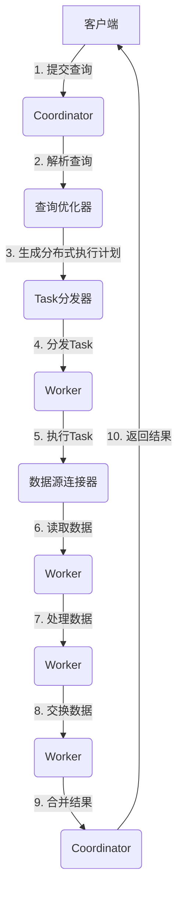

# Presto-Hive实时数据处理与分析

## 1.背景介绍

在当今的数据时代,数据已经成为企业的核心资产之一。随着数据量的快速增长,传统的数据处理和分析方式已经无法满足企业对实时性和高效率的需求。Apache Hive作为基于Hadoop的数据仓库工具,虽然能够处理大量数据,但在查询响应时间和并发处理能力方面存在一些限制。为了解决这些问题,Facebook开源了Presto,一种快速、高效的分布式SQL查询引擎,专门设计用于交互式分析和ad-hoc查询。

Presto与Hive的结合,为企业提供了一种高效、灵活的解决方案,实现了对海量数据的实时处理和分析。本文将深入探讨Presto-Hive架构,核心概念和算法原理,并通过实际案例和代码示例,帮助读者掌握Presto-Hive在实时数据处理和分析中的应用。

## 2.核心概念与联系

### 2.1 Presto概述

Presto是一个开源的分布式SQL查询引擎,由Facebook开发并开源。它旨在提供低延迟的交互式分析,支持跨多个数据源(如Hive、Kafka、Alluxio等)进行联合查询。Presto的核心特点包括:

- 高性能:通过有效利用内存和CPU资源,Presto能够快速处理大量数据。
- 标准SQL:支持ANSI SQL标准,易于使用和集成。
- 容错性:具有良好的容错能力,能够处理节点故障。
- 可扩展性:支持水平扩展,可以动态添加或删除工作节点。

### 2.2 Hive概述

Apache Hive是一个建立在Hadoop之上的数据仓库工具,它为结构化的数据文件提供了类SQL的查询接口。Hive的主要特点包括:

- 支持大数据:能够存储和查询大规模的数据集。
- SQL接口:提供类似SQL的查询语言HiveQL,易于使用。
- schema on read:支持schema on read模式,可以在读取数据时动态推断数据结构。
- 批处理:适合离线批处理场景,但对于交互式查询响应时间较长。

### 2.3 Presto与Hive的联系

Presto和Hive可以结合使用,充分发挥各自的优势。Presto可以直接查询Hive中的数据,利用Hive强大的数据存储和管理能力,同时提供更快的查询速度和更好的交互体验。这种结合使用的方式具有以下优点:

- 无需数据迁移:Presto可以直接查询Hive中存储的数据,无需进行数据迁移。
- 查询加速:Presto可以显著加快对Hive数据的查询速度。
- 资源共享:Presto和Hive可以共享底层的Hadoop集群资源。
- 生态系统整合:Presto可以与Hive生态系统中的其他工具(如Spark、Impala等)协同工作。

## 3.核心算法原理具体操作步骤

### 3.1 Presto查询执行流程

Presto采用分布式架构,查询执行过程涉及多个组件协同工作。下面是Presto查询执行的基本流程:



1. 客户端向Coordinator提交SQL查询。
2. Coordinator解析SQL查询,构建查询计划树。
3. 查询优化器对查询计划树进行优化,生成分布式执行计划。
4. Task分发器根据执行计划,将Task分发到Worker节点上。
5. Worker节点执行Task,从数据源读取数据。
6. 数据源连接器负责与底层数据源(如Hive)交互,读取数据。
7. Worker节点对读取的数据进行处理(如过滤、聚合等)。
8. Worker节点之间进行数据交换,实现分布式处理。
9. Worker节点将处理结果发送给Coordinator,由Coordinator进行合并。
10. Coordinator将最终结果返回给客户端。

### 3.2 Presto查询优化

为了提高查询性能,Presto采用了多种查询优化策略,包括:

1. **代价模型优化**:Presto使用基于代价的优化模型,根据数据统计信息和硬件资源情况,选择最优的执行计划。
2. **谓词下推**:将谓词(如过滤条件)下推到数据源连接器,尽早过滤掉不需要的数据,减少数据传输量。
3. **列裁剪**:只读取查询所需的列,避免读取不必要的列,减少I/O开销。
4. **并行执行**:充分利用集群资源,将查询任务并行执行,提高处理效率。
5. **动态分区裁剪**:根据查询条件动态裁剪不需要访问的分区,减少I/O开销。
6. **自适应查询重写**:根据查询执行过程中收集的统计信息,动态重写查询计划,提高查询效率。

### 3.3 Presto与Hive集成

Presto通过Hive连接器与Hive集成,可以直接查询Hive中的数据。Presto与Hive集成的主要步骤如下:

1. 配置Hive元数据服务(Metastore)地址,使Presto能够访问Hive的元数据。
2. 在Presto中创建Hive连接器实例,指定Hive元数据服务地址和其他配置参数。
3. 通过Presto的SQL接口查询Hive中的表和视图,Presto会自动将查询转换为Hive的查询计划,并通过Hive连接器执行查询。
4. Presto可以利用Hive的分区和存储格式优化查询性能,如谓词下推、列裁剪等。
5. Presto还支持对Hive表进行CTAS(Create Table As Select)操作,将查询结果直接存储到Hive表中。

## 4.数学模型和公式详细讲解举例说明

在Presto的查询优化过程中,涉及到一些数学模型和公式,用于估计查询代价和选择最优执行计划。下面将详细介绍其中的一些核心公式。

### 4.1 代价模型

Presto使用基于代价的优化模型,通过估计不同执行计划的代价,选择代价最小的执行计划。代价模型主要考虑以下几个因素:

- CPU代价:执行查询所需的CPU时间。
- 内存代价:执行查询所需的内存空间。
- 网络代价:执行查询过程中的数据传输量。
- I/O代价:执行查询所需的磁盘I/O操作。

总代价可以用下面的公式表示:

$$总代价 = \alpha * CPU代价 + \beta * 内存代价 + \gamma * 网络代价 + \delta * I/O代价$$

其中$\alpha$、$\beta$、$\gamma$、$\delta$是权重系数,用于调整不同代价因素的重要性。

### 4.2 JOIN代价估计

JOIN操作是查询优化中的一个关键环节,JOIN代价的估计对整个查询执行计划的选择至关重要。Presto使用基于卡路里乘积的方法估计JOIN代价。

假设JOIN的两个输入表分别为$R$和$S$,它们的基数(行数)分别为$|R|$和$|S|$,选择率分别为$f_R$和$f_S$,则JOIN后的结果表$T$的基数可以估计为:

$$|T| = |R| \times |S| \times f_R \times f_S$$

其中,选择率$f_R$和$f_S$可以通过统计信息或者采样估计得到。

基于结果表的基数估计,可以进一步估计JOIN操作的CPU代价、内存代价和网络代价等。

### 4.3 数据统计信息

准确的数据统计信息对于代价模型的精确性至关重要。Presto会持续收集和更新数据统计信息,包括:

- 表和列的基数(distinct value count)
- 数据分布直方图(data distribution histogram)
- 最大值和最小值(max/min values)
- NULL值比例(NULL fraction)
- 数据大小(data size)

这些统计信息可以用于估计选择率、JOIN代价、数据传输量等,从而指导查询优化器选择最优执行计划。

## 5.项目实践:代码实例和详细解释说明

下面通过一个实际案例,演示如何使用Presto查询Hive中的数据,并展示相关的代码示例。

### 5.1 案例背景

假设我们有一个电商网站的用户行为数据存储在Hive中,包括以下三张表:

- `users`表:存储用户基本信息,如用户ID、姓名、年龄等。
- `orders`表:存储订单信息,如订单ID、用户ID、订单金额等。
- `products`表:存储产品信息,如产品ID、产品名称、类别等。

我们需要分析用户购买行为,找出每个年龄段中最受欢迎的产品类别。

### 5.2 Presto查询

首先,在Presto中创建一个Hive连接器实例:

```sql
CREATE SCHEMA hive.web_data
WITH (
  location = 'thrift://hive-metastore-host:9083'
);
```

然后,可以直接查询Hive中的表:

```sql
USE hive.web_data;

SELECT
  u.age_group,
  p.category,
  COUNT(*) AS order_count
FROM
  users u
  JOIN orders o ON u.user_id = o.user_id
  JOIN products p ON o.product_id = p.product_id
GROUP BY
  u.age_group,
  p.category
ORDER BY
  u.age_group,
  order_count DESC;
```

这个查询执行以下操作:

1. 从`users`表中获取用户年龄信息,将用户划分为不同的年龄段。
2. 从`orders`表中获取订单信息,并与`users`表JOIN获取用户ID。
3. 从`products`表中获取产品类别信息,并与`orders`表JOIN获取产品ID。
4. 按照年龄段和产品类别进行分组,统计每个组合的订单数量。
5. 按照年龄段和订单数量降序排序,找出每个年龄段中最受欢迎的产品类别。

### 5.3 查询计划和执行过程

我们可以使用`EXPLAIN`语句查看Presto为该查询生成的执行计划:

```
EXPLAIN SELECT
  u.age_group,
  p.category,
  COUNT(*) AS order_count
FROM
  users u
  JOIN orders o ON u.user_id = o.user_id
  JOIN products p ON o.product_id = p.product_id
GROUP BY
  u.age_group,
  p.category
ORDER BY
  u.age_group,
  order_count DESC;
```

Presto将输出详细的执行计划,包括各个阶段的操作、数据流向、分区信息等。通过分析执行计划,我们可以了解Presto是如何优化和执行该查询的。

此外,Presto还提供了丰富的监控和调试工具,如Web UI、查询日志、性能指标等,帮助我们深入了解查询的执行过程,并进行性能调优和故障排查。

## 6.实际应用场景

Presto-Hive结合使用的优势使其在多个领域得到了广泛应用,包括但不限于:

1. **交互式数据分析**:Presto可以提供低延迟的交互式查询,支持ad-hoc分析和数据探索,适用于商业智能(BI)、数据可视化等场景。

2. **实时数据处理**:通过与流式数据源(如Kafka)集成,Presto可以实现对实时数据的查询和处理,满足实时数据分析和监控的需求。

3. **ETL和数据集成**:Presto可以高效地从多个异构数据源读取数据,并将处理结果写入目标数据源,适用于ETL和数据集成场景。

4. **报表和仪表盘**:Presto可以为报表和仪表盘系统提供高性能的数据查询支持,实现实时数据更新和交互式探索。

5. **机器学习和数据科学**:Presto可以用