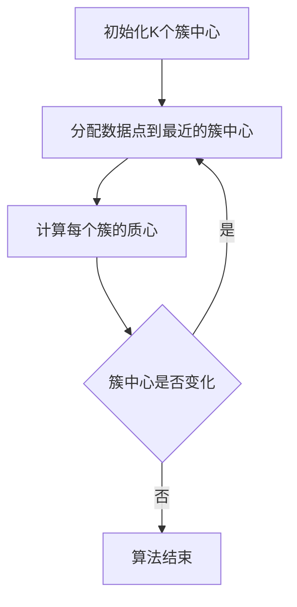

# Python机器学习实战：K均值聚类算法及其在Python中的实战

## 1.背景介绍

在数据科学和机器学习领域，聚类算法是一种重要的无监督学习方法。聚类算法的目标是将数据集中的样本划分为若干个簇，使得同一簇内的样本相似度较高，而不同簇之间的样本相似度较低。K均值聚类（K-means Clustering）是其中最经典和常用的一种算法。本文将深入探讨K均值聚类算法的原理、数学模型、实际应用，并通过Python代码实例进行详细解释。

## 2.核心概念与联系

### 2.1 聚类的定义

聚类是将数据集分成若干个子集的过程，使得每个子集（簇）中的数据点在某种意义上是相似的，而不同簇中的数据点则是不同的。聚类算法在图像处理、市场分析、社交网络分析等领域有广泛应用。

### 2.2 K均值聚类的基本概念

K均值聚类是一种迭代优化算法，其目标是将数据集划分为K个簇，使得每个簇内的数据点到簇中心的距离之和最小。K均值聚类的核心思想是通过不断调整簇中心的位置，逐步优化簇的划分。

### 2.3 K均值聚类与其他聚类算法的联系

K均值聚类与其他聚类算法（如层次聚类、DBSCAN等）有着不同的适用场景和优缺点。K均值聚类适用于数据点分布较为均匀、簇形状较为规则的情况，而层次聚类和DBSCAN则在处理噪声和不规则簇形状时表现更好。

## 3.核心算法原理具体操作步骤

K均值聚类算法的具体操作步骤如下：

1. **初始化**：随机选择K个初始簇中心。
2. **分配数据点**：将每个数据点分配到最近的簇中心。
3. **更新簇中心**：计算每个簇的质心（即簇内所有数据点的平均值），并将质心作为新的簇中心。
4. **迭代**：重复步骤2和3，直到簇中心不再发生变化或达到预定的迭代次数。

以下是K均值聚类算法的Mermaid流程图：



## 4.数学模型和公式详细讲解举例说明

### 4.1 数学模型

K均值聚类的目标是最小化以下目标函数：

$$
J = \sum_{i=1}^{K} \sum_{x \in C_i} \| x - \mu_i \|^2
$$

其中，$K$ 是簇的数量，$C_i$ 是第 $i$ 个簇，$\mu_i$ 是第 $i$ 个簇的质心，$x$ 是数据点，$\| \cdot \|$ 表示欧几里得距离。

### 4.2 公式推导

1. **初始化**：随机选择K个初始簇中心 $\mu_1, \mu_2, \ldots, \mu_K$。
2. **分配数据点**：对于每个数据点 $x_j$，计算其到每个簇中心的距离，并将其分配到最近的簇中心：

$$
c_j = \arg \min_{i} \| x_j - \mu_i \|
$$

3. **更新簇中心**：计算每个簇的质心，并将质心作为新的簇中心：

$$
\mu_i = \frac{1}{|C_i|} \sum_{x_j \in C_i} x_j
$$

4. **迭代**：重复步骤2和3，直到簇中心不再发生变化或达到预定的迭代次数。

### 4.3 举例说明

假设有一个二维数据集，包含以下数据点：

$$
\{(1, 2), (2, 3), (3, 4), (8, 7), (9, 8), (10, 9)\}
$$

我们选择K=2，随机初始化两个簇中心为 $(1, 2)$ 和 $(8, 7)$。然后按照上述步骤进行迭代，最终得到两个簇及其中心。

## 5.项目实践：代码实例和详细解释说明

### 5.1 数据准备

首先，我们需要准备一个数据集。这里我们使用Python的`numpy`库生成一个简单的二维数据集。

```python
import numpy as np

# 生成数据集
data = np.array([
    [1, 2], [2, 3], [3, 4],
    [8, 7], [9, 8], [10, 9]
])
```

### 5.2 实现K均值聚类算法

接下来，我们实现K均值聚类算法。

```python
import numpy as np

def kmeans(data, k, max_iters=100):
    # 随机初始化簇中心
    centroids = data[np.random.choice(data.shape[0], k, replace=False)]
    
    for _ in range(max_iters):
        # 分配数据点到最近的簇中心
        distances = np.linalg.norm(data[:, np.newaxis] - centroids, axis=2)
        labels = np.argmin(distances, axis=1)
        
        # 计算新的簇中心
        new_centroids = np.array([data[labels == i].mean(axis=0) for i in range(k)])
        
        # 检查簇中心是否变化
        if np.all(centroids == new_centroids):
            break
        
        centroids = new_centroids
    
    return centroids, labels

# 运行K均值聚类算法
centroids, labels = kmeans(data, k=2)
print("簇中心:", centroids)
print("标签:", labels)
```

### 5.3 结果分析

运行上述代码后，我们可以得到两个簇中心及每个数据点的标签。通过可视化工具（如`matplotlib`），我们可以直观地观察聚类结果。

```python
import matplotlib.pyplot as plt

# 可视化聚类结果
plt.scatter(data[:, 0], data[:, 1], c=labels, cmap='viridis')
plt.scatter(centroids[:, 0], centroids[:, 1], s=300, c='red')
plt.show()
```

## 6.实际应用场景

K均值聚类算法在实际中有广泛的应用，以下是几个典型的应用场景：

### 6.1 图像压缩

通过K均值聚类算法，可以将图像中的像素点聚类为若干个颜色簇，从而实现图像压缩。具体做法是将每个像素点替换为其所属簇的中心颜色。

### 6.2 客户细分

在市场营销中，可以使用K均值聚类算法对客户进行细分，根据客户的购买行为、消费习惯等特征，将客户分为不同的群体，从而制定有针对性的营销策略。

### 6.3 文本聚类

在自然语言处理领域，可以使用K均值聚类算法对文本进行聚类，将相似的文本归为一类，从而实现文档分类、主题识别等任务。

## 7.工具和资源推荐

### 7.1 Python库

- **scikit-learn**：一个强大的机器学习库，提供了K均值聚类算法的实现。
- **numpy**：一个高性能的科学计算库，用于处理多维数组和矩阵运算。
- **matplotlib**：一个数据可视化库，用于绘制图表和图形。

### 7.2 在线资源

- **Kaggle**：一个数据科学竞赛平台，提供了丰富的数据集和机器学习教程。
- **Coursera**：一个在线学习平台，提供了许多关于机器学习和数据科学的课程。

## 8.总结：未来发展趋势与挑战

K均值聚类算法作为一种经典的聚类算法，具有计算简单、易于实现等优点。然而，它也存在一些局限性，如对初始簇中心敏感、难以处理非凸形状的簇等。未来，随着数据规模的不断增长和计算能力的提升，聚类算法将面临更多的挑战和机遇。研究人员将继续探索更高效、更鲁棒的聚类算法，以应对复杂的数据分析任务。

## 9.附录：常见问题与解答

### 9.1 如何选择K值？

选择合适的K值是K均值聚类算法中的一个重要问题。常用的方法包括肘部法（Elbow Method）和轮廓系数（Silhouette Coefficient）。肘部法通过绘制目标函数值随K值变化的曲线，选择曲线拐点处的K值；轮廓系数则通过评估聚类结果的紧密度和分离度，选择最佳的K值。

### 9.2 如何处理初始簇中心的随机性？

初始簇中心的选择对K均值聚类算法的结果有较大影响。为减少随机性带来的影响，可以多次运行K均值聚类算法，并选择目标函数值最小的结果。此外，K均值++（K-means++）算法通过一种启发式方法选择初始簇中心，能够显著提高聚类结果的稳定性。

### 9.3 如何处理大规模数据集？

对于大规模数据集，K均值聚类算法的计算复杂度较高。可以采用以下几种方法提高算法的效率：
- 使用Mini-Batch K-means算法，通过随机抽样的小批量数据进行迭代更新。
- 使用分布式计算框架（如Apache Spark）进行并行计算。
- 采用降维技术（如PCA）对数据进行预处理，减少数据维度。

---

作者：禅与计算机程序设计艺术 / Zen and the Art of Computer Programming