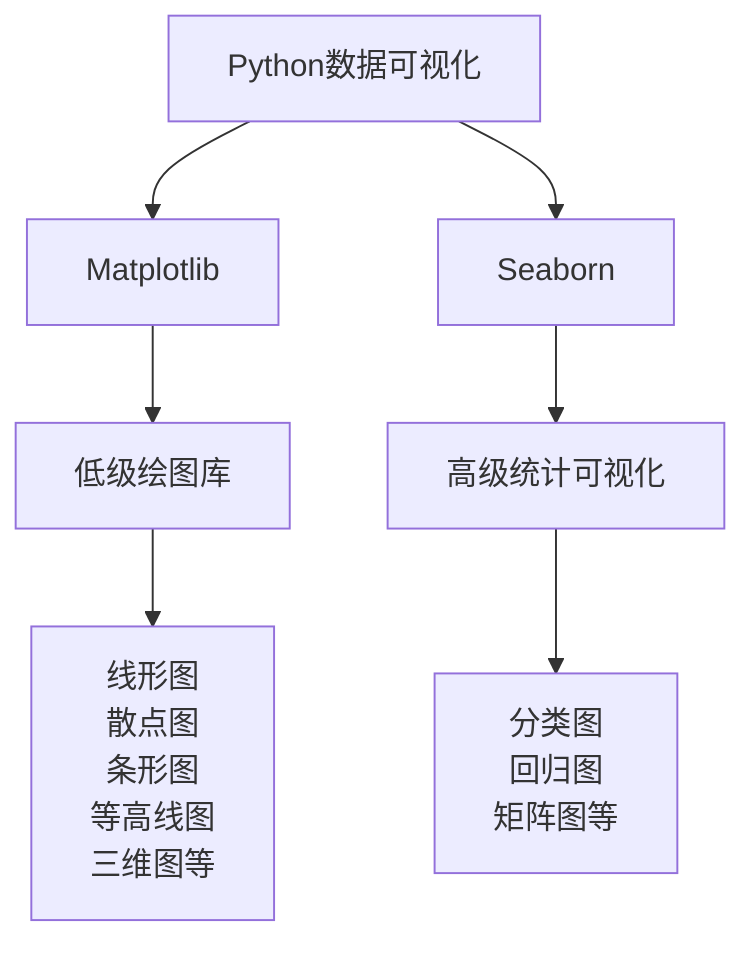
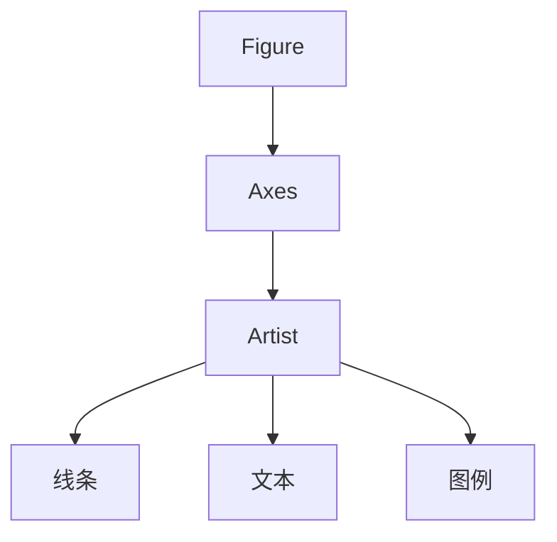
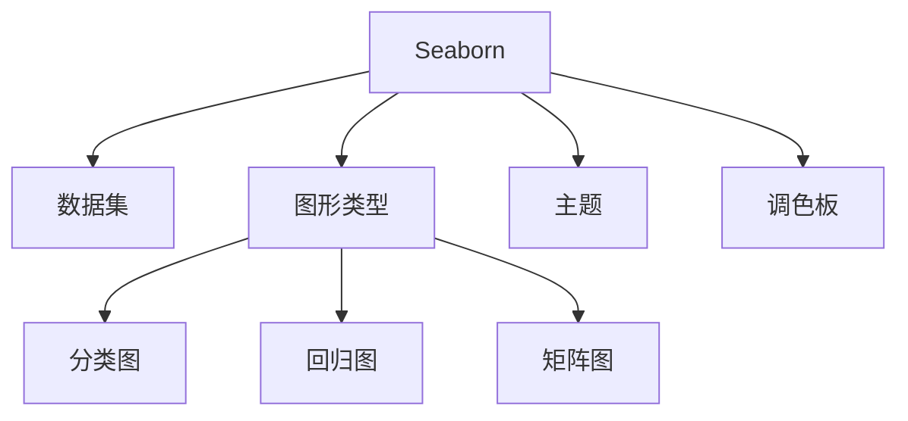

# Python机器学习实战：数据可视化的艺术 - Matplotlib & Seaborn 应用

## 1.背景介绍

在当今数据时代，数据可视化已经成为一种必不可少的技能。无论是在商业智能、科学研究还是机器学习领域,有效地呈现数据对于发现隐藏的模式、传达洞见和做出明智决策都至关重要。Python作为一种流行的编程语言,拥有强大的数据可视化库,其中最著名的是Matplotlib和Seaborn。

Matplotlib是Python中一个低级别的绘图库,提供了广泛的绘图功能,可用于创建各种静态、动画和交互式可视化。它高度可定制,支持多种绘图类型,如线形图、散点图、条形图、等高线图、三维图等,并且可以轻松嵌入GUI应用程序。

Seaborn则是一个基于Matplotlib构建的高级数据可视化库,旨在使数据可视化变得更加简单和直观。它提供了一组吸引人的默认主题和调色板,以及一系列独特的统计图形类型,如分类图、回归图、矩阵图等,非常适合探索性数据分析。

通过掌握Matplotlib和Seaborn,数据科学家和机器学习工程师能够创建出色的数据可视化效果,从而更好地理解数据、交流发现并做出数据驱动的决策。本文将深入探讨这两个强大的Python数据可视化库,揭示它们的核心概念、算法原理、实际应用场景以及未来发展趋势。



## 2.核心概念与联系

### 2.1 Matplotlib核心概念

Matplotlib的核心概念包括Figure、Axes、Artist等。

**Figure**表示整个图形画布,可以包含一个或多个Axes。

**Axes**是Figure中的单个绘图区域,用于绘制特定类型的图形,如线形图、散点图等。每个Axes都有自己的X轴和Y轴。

**Artist**是Matplotlib中所有可视元素的基类,如线条、文本、图例等。用户可以通过设置Artist的属性来自定义图形的外观。



### 2.2 Seaborn核心概念

Seaborn的核心概念包括数据集、图形类型、主题和调色板。

**数据集**是Seaborn绘图的基础,可以是Pandas DataFrame、NumPy数组或Python列表。

**图形类型**包括分类图、回归图、矩阵图等,用于探索数据集中的不同模式和关系。

**主题**控制图形的整体外观,如网格线、标签大小、颜色等。

**调色板**定义了用于绘制图形的颜色集合,可以是预定义的或自定义的。



Matplotlib和Seaborn密切相关,Seaborn实际上是基于Matplotlib构建的。Seaborn利用Matplotlib的底层功能来绘制图形,但提供了更高级别的接口和默认设置,使得创建精美的统计图形变得更加简单。数据科学家可以根据需求选择使用Matplotlib进行底层控制,或使用Seaborn快速创建吸引人的可视化效果。

## 3.核心算法原理具体操作步骤

### 3.1 Matplotlib绘图流程

Matplotlib的绘图流程通常包括以下步骤:

1. **创建Figure和Axes对象**

```python
import matplotlib.pyplot as plt

# 创建Figure对象
fig = plt.figure()

# 在Figure中创建Axes对象
ax = fig.add_subplot(111)
```

2. **在Axes上绘制数据**

```python
# 示例数据
x = [1, 2, 3, 4, 5]
y = [2, 4, 6, 8, 10]

# 在Axes上绘制线形图
ax.plot(x, y)
```

3. **设置图形属性**

```python
# 设置标题和坐标轴标签
ax.set_title('Line Plot')
ax.set_xlabel('X')
ax.set_ylabel('Y')
```

4. **显示或保存图形**

```python
# 显示图形
plt.show()

# 或保存图形到文件
plt.savefig('line_plot.png')
```

### 3.2 Seaborn绘图流程

Seaborn的绘图流程通常包括以下步骤:

1. **导入数据集**

```python
import seaborn as sns
import pandas as pd

# 加载示例数据集
tips = sns.load_dataset('tips')
```

2. **选择适当的图形类型**

```python
# 绘制分类图
sns.catplot(x='day', y='total_bill', data=tips)
```

3. **设置图形属性**

```python
# 设置主题和调色板
sns.set_style('darkgrid')
sns.set_palette('Blues')
```

4. **显示或保存图形**

```python
# 显示图形
plt.show()

# 或保存图形到文件
plt.savefig('categorical_plot.png')
```

无论是使用Matplotlib还是Seaborn,绘图流程都遵循类似的模式:创建绘图对象、绘制数据、设置属性和显示或保存图形。Seaborn提供了更高级的接口,使得绘制统计图形变得更加简单和直观。

## 4.数学模型和公式详细讲解举例说明

在数据可视化中,有许多数学模型和公式用于处理和转换数据,以便更好地呈现。以下是一些常见的数学模型和公式:

### 4.1 数据规范化

数据规范化是将数据转换到共同的尺度或范围的过程,以便更好地比较和可视化。常见的规范化方法包括最小-最大规范化和Z-Score规范化。

**最小-最大规范化**

$$x_{norm} = \frac{x - x_{min}}{x_{max} - x_{min}}$$

其中$x$是原始数据点,$x_{min}$和$x_{max}$分别是数据集中的最小值和最大值,$x_{norm}$是规范化后的数据点,范围在$[0, 1]$之间。

**Z-Score规范化**

$$x_{norm} = \frac{x - \mu}{\sigma}$$

其中$x$是原始数据点,$\mu$是数据集的均值,$\sigma$是数据集的标准差,$x_{norm}$是规范化后的数据点,具有零均值和单位标准差。

规范化数据可以确保不同尺度的特征在可视化时具有相似的重要性,并且有助于发现异常值。

### 4.2 核密度估计

核密度估计(KDE)是一种非参数密度估计方法,用于估计数据的概率密度函数。它在数据可视化中常用于绘制平滑的分布曲线。

KDE的公式如下:

$$\hat{f}(x) = \frac{1}{nh}\sum_{i=1}^{n}K\left(\frac{x - x_i}{h}\right)$$

其中$\hat{f}(x)$是估计的概率密度函数,$n$是样本数量,$x_i$是第$i$个样本点,$K$是核函数(如高斯核),而$h$是带宽参数,控制估计的平滑程度。

在Seaborn中,可以使用`sns.kdeplot()`函数绘制核密度估计曲线,如下所示:

```python
import seaborn as sns
import numpy as np

# 生成示例数据
data = np.random.normal(0, 1, 1000)

# 绘制核密度估计曲线
sns.kdeplot(data)
```

核密度估计在可视化连续数据的分布时非常有用,可以揭示数据中的模式和异常情况。

### 4.3 线性回归

线性回归是一种常见的监督学习算法,用于建立自变量和因变量之间的线性关系模型。在数据可视化中,线性回归常用于绘制回归线,以显示变量之间的趋势。

线性回归模型的公式如下:

$$y = \beta_0 + \beta_1x + \epsilon$$

其中$y$是因变量,$x$是自变量,$\beta_0$是截距,$\beta_1$是斜率,而$\epsilon$是误差项。

通过最小二乘法,可以估计出$\beta_0$和$\beta_1$的值,从而获得最佳拟合直线。

在Seaborn中,可以使用`sns.regplot()`函数绘制回归图,如下所示:

```python
import seaborn as sns

# 加载示例数据集
tips = sns.load_dataset('tips')

# 绘制回归图
sns.regplot(x='total_bill', y='tip', data=tips)
```

线性回归在探索数据集中变量之间的线性关系时非常有用,并且可以帮助识别异常值和outlier。

这些数学模型和公式只是数据可视化中使用的一小部分示例。根据具体的数据和可视化需求,还有许多其他模型和公式可供选择,如聚类算法、降维技术、插值方法等。掌握这些数学工具可以帮助数据科学家更好地理解和呈现数据。

## 5.项目实践:代码实例和详细解释说明

在本节中,我们将通过一个实际项目来演示如何使用Matplotlib和Seaborn进行数据可视化。我们将使用著名的"鸢尾花数据集"(Iris Dataset),这是一个经典的机器学习数据集,包含了三种不同种类鸢尾花的测量值。

### 5.1 导入所需库和数据集

```python
import matplotlib.pyplot as plt
import seaborn as sns
import pandas as pd

# 加载鸢尾花数据集
iris = sns.load_dataset('iris')
```

### 5.2 使用Matplotlib绘制散点图矩阵

散点图矩阵是一种常见的可视化技术,用于探索数据集中多个变量之间的关系。我们将使用Matplotlib绘制鸢尾花数据集的散点图矩阵。

```python
# 提取数值特征
cols = iris.columns[:-1]

# 创建散点图矩阵
fig, axes = plt.subplots(nrows=2, ncols=2, figsize=(10, 10))

for i, x in enumerate(cols):
    for j, y in enumerate(cols):
        ax = axes[i, j]
        ax.scatter(iris[x], iris[y], alpha=0.5)
        ax.set_xlabel(x)
        ax.set_ylabel(y)

plt.tight_layout()
plt.show()
```

这段代码将创建一个2x2的子图网格,每个子图显示两个特征之间的散点图。通过观察这些散点图,我们可以初步了解特征之间的关系和数据分布情况。

### 5.3 使用Seaborn绘制成对关系图

Seaborn提供了`pairplot()`函数,可以方便地绘制成对关系图,显示数据集中所有变量之间的关系。我们将使用这个函数来可视化鸢尾花数据集。

```python
# 绘制成对关系图
sns.set_style('darkgrid')
sns.pairplot(iris, hue='species', palette='husl')
plt.show()
```

这段代码将绘制一个成对关系图,每个对角线上的子图显示单个特征的分布,而其他子图显示两个特征之间的关系。通过设置`hue`参数,我们可以根据鸢尾花种类对数据点进行着色,从而更好地区分不同类别。

成对关系图提供了一种全面的方式来可视化数据集中所有变量之间的关系,有助于发现隐藏的模式和异常情况。

### 5.4 使用Seaborn绘制violin图

violin图是一种显示数据分布的有趣方式,它类似于箱线图,但使用核密度估计来绘制数据分布的形状。我们将使用Seaborn绘制鸢尾花数据集的violin图。

```python
# 设置绘图样式
sns.set_style('whitegrid')

# 绘制violin图
fig, axes = plt.subplots(nrows=1, ncols=2, figsize=(12, 5))

sns.violinplot(x='species', y='sepal_length', data=iris, ax=axes[0])
axes[0].set_title('Sepal Length Distribution')

sns.violinplot(x='species', y='petal_