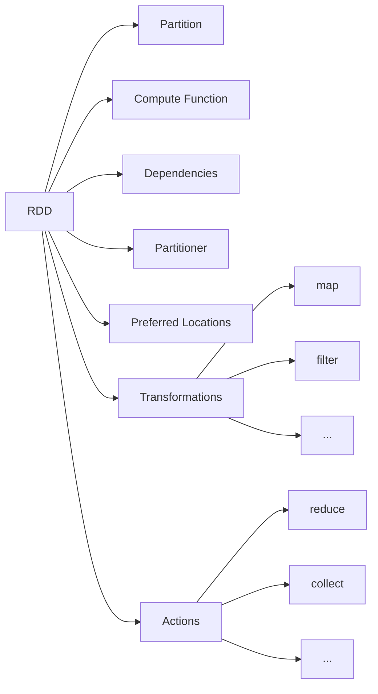

# RDD原理与代码实例讲解

## 1.背景介绍
### 1.1 大数据处理的挑战
在当今大数据时代,我们面临着海量数据处理的巨大挑战。传统的数据处理方式已经无法满足实时性、高吞吐量的需求。为了应对这一挑战,Apache Spark应运而生,其中的核心概念就是弹性分布式数据集(Resilient Distributed Dataset,简称RDD)。

### 1.2 Apache Spark 与 RDD 
Apache Spark是一个快速、通用的大规模数据处理引擎,专为大规模数据处理而设计。它扩展了广泛使用的MapReduce计算模型,高效地支持更多计算模式,包括交互式查询和流处理。

Spark的核心是RDD,它是一个不可变、可分区、里面元素可并行计算的集合。RDD允许用户显式地将数据存储在内存中,并可控地对数据进行分区。同时,RDD还提供了一组丰富的操作来处理这些数据。

## 2.核心概念与联系
### 2.1 RDD的特性
- Immutable:一旦创建,RDD中的数据就不能被修改。这可以使得Spark在不同节点之间高效地共享RDD。 
- Partitioned:RDD中的数据被分成若干个分区,这些分区可以在集群中的不同节点上进行处理。
- Resilient:RDD可以自动从节点故障中恢复。
- In-Memory:RDD支持数据的内存存储,这可以使迭代式算法和交互式数据探索变得高效。

### 2.2 RDD的五大属性
RDD主要由五个属性来定义:
1. 一组分区(Partition),即数据集的基本组成单位。
2. 一个计算每个分区的函数。
3. RDD之间的依赖关系。
4. 一个Partitioner,即RDD的分片函数。
5. 一个列表,存储存取每个Partition的优先位置(preferred location)。

### 2.3 RDD 操作
RDD支持两种类型的操作:transformations和actions。
- Transformations:这些操作会生成一个新的RDD,如map、filter等。
- Actions:这些操作会返回一个结果给Driver程序或写入外部存储系统,如reduce、collect等。

下图展示了RDD的核心概念以及操作之间的关系:



## 3.核心算法原理具体操作步骤
### 3.1 RDD的创建
可以通过两种方式创建RDD:
1. 读取外部数据集。可以从HDFS、Cassandra、HBase等外部存储中读取数据创建RDD。
2. 在Driver程序里分发集合(parallelizing)来创建。

下面是一个在Spark中创建RDD的例子:

```python
data = [1, 2, 3, 4, 5]
rdd = sc.parallelize(data)
```

### 3.2 RDD的转换(Transformations)
常见的转换操作包括:
- map(func):返回一个新的RDD,该RDD由每一个输入元素经过func函数转换后组成。
- filter(func):返回一个新的RDD,该RDD由经过func函数计算后返回值为true的输入元素组成。
- flatMap(func):与map类似,但是每一个输入元素可以被映射为0或多个输出元素。
- union(otherDataset):返回一个新的RDD,该RDD包含源RDD和参数RDD中的所有元素。

下面是一个使用map和filter转换的例子:

```python
rdd = sc.parallelize([1, 2, 3, 4, 5])
squared_rdd = rdd.map(lambda x: x**2)  # [1, 4, 9, 16, 25]
filtered_rdd = rdd.filter(lambda x: x % 2 == 0)  # [2, 4]
```

### 3.3 RDD的行动(Actions) 
常见的行动操作包括:
- reduce(func):通过func函数聚集RDD中的所有元素,这个功能必须是可交换且可并联的。
- collect():在驱动程序中,以数组的形式返回数据集的所有元素。
- count():返回RDD的元素个数。
- first():返回RDD的第一个元素。

下面是一个使用reduce和collect的例子:

```python
rdd = sc.parallelize([1, 2, 3, 4, 5])
total = rdd.reduce(lambda x, y: x + y)  # 15
data = rdd.collect()  # [1, 2, 3, 4, 5]
```

## 4.数学模型和公式详细讲解举例说明
### 4.1 RDD的数学模型
RDD可以用数学模型来表示。设D是一个数据集,D可以表示为一个RDD,记为RDD[D]。如果我们对D应用一个转换函数f,就会生成一个新的RDD,记为f(RDD[D])。

例如,如果我们有一个数据集D = {1, 2, 3, 4, 5},我们可以创建一个RDD:

$RDD[D] = \{1, 2, 3, 4, 5\}$

如果我们对这个RDD应用一个平方转换:

$f(x) = x^2$

那么我们会得到一个新的RDD:

$f(RDD[D]) = \{1, 4, 9, 16, 25\}$

### 4.2 RDD的依赖关系
RDD之间存在依赖关系。如果RDD B是由RDD A转换而来,那么称B依赖于A。这种依赖可以表示为:

$B = f(A)$

其中f是转换函数。

RDD之间的依赖可以分为两种:
1. 窄依赖(Narrow Dependency):每一个父RDD的Partition最多被子RDD的一个Partition使用。
2. 宽依赖(Wide Dependency):多个子RDD的Partition会依赖同一个父RDD的Partition。

窄依赖和宽依赖的区别在于,窄依赖更有利于容错和并行计算。因为如果一个节点失败,只需重新计算对应的父Partition即可,而宽依赖可能需要重新计算多个父Partition。

## 5.项目实践:代码实例和详细解释说明
下面我们通过一个实际的项目来演示RDD的使用。这个项目的目标是从一个文本文件中统计每个单词出现的次数。

### 5.1 创建SparkContext
首先,我们需要创建一个SparkContext。这是Spark的主要入口点。

```python
from pyspark import SparkContext

sc = SparkContext("local", "Word Count")
```

### 5.2 读取文件创建RDD
接下来,我们从文本文件创建一个RDD。每一行文本将是RDD的一个元素。

```python
lines = sc.textFile("data.txt")
```

### 5.3 转换操作
我们对lines RDD进行一系列的转换操作:
1. 将每一行拆分成单词。
2. 将每个单词转换为(word, 1)的形式。
3. 使用reduceByKey将相同的单词进行聚合。

```python
words = lines.flatMap(lambda line: line.split(" "))
pairs = words.map(lambda word: (word, 1))
word_counts = pairs.reduceByKey(lambda x, y: x + y)
```

### 5.4 行动操作
最后,我们使用collect行动操作将结果收集到Driver程序中并打印出来。

```python
output = word_counts.collect()
for (word, count) in output:
    print("%s: %i" % (word, count))
```

这个例子展示了如何使用RDD进行数据处理。我们从文件创建RDD,然后使用map、flatMap等转换操作对数据进行处理,最后使用reduce等行动操作得到结果。

## 6.实际应用场景
RDD在许多实际场景中都有应用,下面列举几个典型的例子:
1. 日志处理:可以使用RDD来处理大规模的日志文件,例如从Web服务器日志中提取有用的信息。
2. 机器学习:许多机器学习算法都可以使用RDD来实现,例如K-Means聚类、逻辑回归等。
3. 图计算:RDD可以用来表示图结构,进而实现PageRank等图算法。
4. 数据挖掘:RDD可以用于频繁项集挖掘、关联规则挖掘等数据挖掘任务。

## 7.工具和资源推荐
要深入学习RDD,以下是一些有用的工具和资源:
1. Apache Spark官方文档:这是学习Spark和RDD的权威资源。
2. Spark Programming Guide:Spark官方的编程指南,包含了大量的示例代码。
3. Spark源码:阅读Spark源码可以加深对RDD的理解。
4. Spark Summit:Spark的年度大会,包含许多关于Spark和RDD的演讲。

## 8.总结:未来发展趋势与挑战
RDD是Spark的核心,它为Spark提供了高效、容错的分布式数据处理能力。随着大数据的不断发展,RDD也面临着新的挑战和机遇:
1. 更大规模的数据:如何在PB级别的数据上高效地使用RDD,是一个重要的研究方向。
2. 更复杂的计算:RDD需要支持更加复杂、多样化的计算模式,如图计算、流计算等。
3. 更高的性能要求:如何进一步优化RDD的性能,例如减少数据Shuffle、提高内存利用率等,都是未来的研究热点。

尽管面临挑战,但RDD仍然是大数据处理的重要基石。未来,RDD将与其他技术一起,为大数据的存储、计算、分析提供更加强大的支持。

## 9.附录:常见问题与解答
1. Q:RDD可以修改吗?
   A:不可以,RDD是不可变的。一旦创建,就不能修改。如果需要修改,只能通过转换操作生成新的RDD。

2. Q:RDD可以持久化吗?
   A:可以,RDD可以使用persist或cache方法将数据持久化在内存或磁盘上。这可以加速后续的计算。

3. Q:RDD的依赖关系有什么用?
   A:RDD的依赖关系可以用于容错。如果一个RDD的部分分区丢失,可以通过重新计算它的父RDD来恢复。

4. Q:RDD的分区数如何确定?
   A:RDD的分区数可以在创建时指定,也可以使用repartition或coalesce方法进行调整。合适的分区数取决于集群的规模和数据的大小。

作者:禅与计算机程序设计艺术 / Zen and the Art of Computer Programming